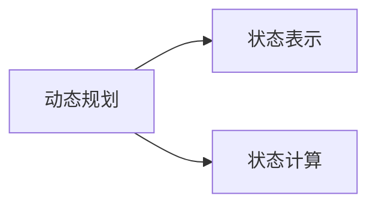

# 一、基本步骤

```mermaid
flowchart LR
动态规划 --> 状态表示
动态规划 --> 状态计算
```
一、[背包问题](背包问题.md)
二、[线性DP](线性DP.md)
三、[区间DP](区间DP.md)
四、[计数类DP](计数类DP.md)
五、[数位统计DP](数位统计DP.md)
六、[状态压缩DP](状态压缩DP.md)
- 通用思维：化零为整，化整为零

