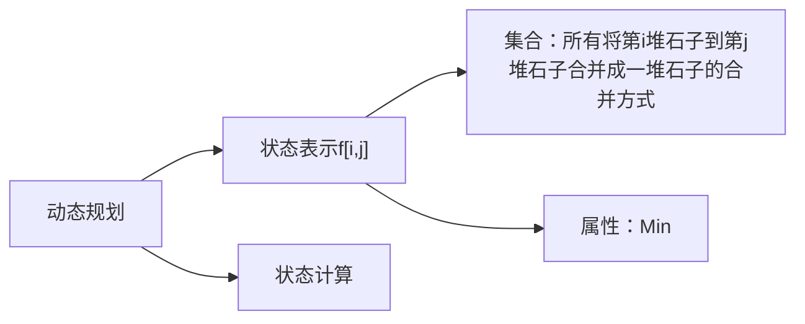

### 典型例题：
#### 石子合并
##### 题目描述
设有 *N* 堆石子排成一排，其编号为1，2，3，...， N。
每堆石子有一定的质量，可以用一个整数来描述，现在要将这 N 堆石子合并成为一堆。

每次只能合并相邻的两堆，合并的代价为这两堆石子的质量之和，合并后与这两堆石子相邻的石子将和新堆相邻，合并时由于选择的顺序不同，合并的总代价也不相同。
例如有 4 堆石子分别为 1，3， 5， 2， 我们可以先合并第 1、 2 堆，代价为 4，得到 4 ，5 ，2， 又合并第 1、 2 堆，代价为 9， 得到 9， 2 ，再合并得到 11，总代价为 4 + 9 +11 = 24

如果第二步是先合并第 2、 3堆，则代价为 7，得到 4 ，7，最后一次合并代价为 11，总代价为 4 + 7 + 11 = 22

问题是：找出一种合理的方法，使总的代价最小，输出最小代价。
##### 输入格式
第一行一个数 N 表示石子的堆数
第二行 N 个数，表示每堆石子的质量(均不超过 1000）
##### 输出格式
输出一个整数，表示**最小代价**。
##### 数据范围
1≤N≤300
##### 样例
###### 输入1
```
4
1 3 5 2
```
###### 输出1
```
22
```
##### 题解
###### 思路

###### 代码
```c++
// 区间DP
#include <iostream>
#include <algorithm>

using namespace std;

const int N = 1010;
int f[N][N];
int s[N];
int n;

int main()
{
    cin >> n;

    for (int i = 1; i <= n; i ++)   cin >> s[i];

    for (int i = 1; i <= n; i ++)   s[i] += s[i - 1];

    for (int len = 2; len <= n; len ++) // 区间长度
        for (int i = 1; i + len - 1 <= n; i ++) // 区间头和区间尾
        {
            int l = i, r = i + len - 1;
            f[l][r] = 1e8; // 因为要取最小，所以不能用默认0
            for (int k = l; k < r; k ++)
                f[l][r] = min(f[l][r],f[l][k] + f[k + 1][r] + s[r] - s[l - 1]);
        }
        
    cout << f[1][n];

    return 0;
}
```