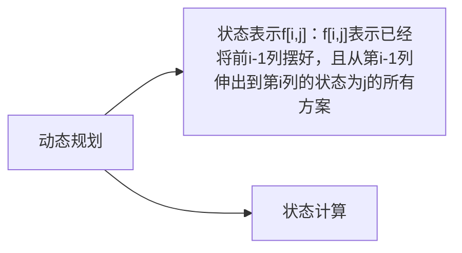

- 数据范围非常小
## 典型例题
### 蒙德里安的梦想
#### 题目描述
求把 N×M 的棋盘分割成若干个 1×2 的长方形，有多少种方案。

例如当 N=2，M=4 时，共有 5 种方案。当 N=2，M=3 时，共有 3 种方案。
如下图所示：

#### 输入格式
输入包含多组测试用例。

每组测试用例占一行，包含两个整数 N 和 M。

当输入用例 N=0，M=0 时，表示输入终止，且该用例无需处理。
#### 输出格式
每个测试用例输出一个结果，每个结果占一行。
#### 数据范围
1≤ N,M ≤11
#### 输入样例
```
1 2
1 3
1 4
2 2
2 3
2 4
2 11
4 11
0 0
```
#### 输出样例
```
1
0
1
2
3
5
144
51205
```
### 题解
#### 思路

- 通用思维：化零为整，化整为零
- ==**核心：先放横着的，再放竖着的**==。
- 总方案数：等于只放横着的小方块的合法方案数
- 如何判断方案是否合法：所有剩余位置能否填充满竖着的小方块，可以按列来看，==**每一列内部的所有连续的空着的小方块，需要是偶数个**==
- 从第 i - 1 列伸到第 i 列(方块摆在第i-1和第i列)，有两种选择：伸或不伸，所有总共有$2^n$种组合
#### 代码
```
//状态压缩DP
#include <iostream>
#include <algorithm>
#include <cstring>
#include <vector>

using namespace std;

const int N = 12, M = 1 << N; // M -------- 二进制表示；如 第1、 3、 4 行摆放，则表示为 (10110)B
int n,m;
long long f[N][M]; // 方案数可能很大
// f[i][j] : 表示已经将前i-1列摆好，且从第i-1列伸出到第i列的状态为j的所有方案
vector<int> state[M];
bool st[M];

int main()
{
    while(cin >> n >> m, n || m)
    {
        memset(f, 0, sizeof f);

        // 先放横着的方块，再放竖着的，如果横着的放完了，那么竖着的小方块只能嵌进去，而这就要求剩余空位中，从上到下 存在偶数个连续 0
        // 预处理
        for (int i = 0; i < 1 << n; i ++) // 遍历所有行的组合，例如：第一行和第三行的组合：(10100)B
        {
            bool is_value = true;
            int cnt = 0; // 计数：对于组合类别 i，从上到下遍历，计数其中连续 0 的个数(即：未拜访方块的位置个数)
            for (int j = 0; j < n; j ++) //从上到下遍历
            {
                if (i >> j & 1) // 如果第 j + 1 行是 1 的话(放了小方块),如：(1001)B,当j = 0 时，i >> j & 1 == 1
                {
                    if (cnt & 1) // 判断是否有偶数个连续 0 ----------- 如果cnt & 1 == 1，那么说明 cnt 是奇数 ---------- 二进制的最后一位是1 ---- 2^0 == 1
                    {
                        is_value = false;
                        break;
                    }
                    cnt = 0; // 如果有偶数个连续 0，则将 cnt 清空，并继续累计连续 0 的个数
                }
                else cnt ++;
            }
            if (cnt & 1) // 如果最后一个 1 不是结尾，那么继续累计，从上到下遍历完后再看是否有偶数个连续 0
                is_value = false;
            st[i] = is_value;
        }
        
        // 预处理
        for (int i = 0; i < 1 << n; i ++) // 枚举所有合法状态，并存入state数组中
        {
            state[i].clear();
            // 遍历所有行的组合，i 和 j 都是行的组合
            for (int j = 0; j < 1 << n; j ++) 
                if ((i & j) == 0 && st[i | j]) 
// 如果 i 和 j 的组合方案没有 行 重叠，并且第 i - 1 列的连续 0 有偶数个(i - 2 -> i - 1；i - 1 -> i    共同列是第 i - 1 列， 所以要看第 i - 1 列是否有偶数个连续 0)
                    state[i].push_back(j); 
// 第 i 种行组合的合法方案是组合 j (即：如果存在第 k - 2 列伸到第 k - 1 列的小方块，且组合状态为 i，为那么第 k - 1 列要伸到第 k 列时，就可以用该合法方案组合 j )
        }
        
        memset(f, 0, sizeof f);

        f[0][0] = 1; // 因为f[0] 应该是从 f[-1] 伸过来的，但是f[-1]会下标越界，所以对f[0][0]赋值为1，解决下标越界问题

        for (int i = 1; i <= m; i ++) // 列
            for (int j = 0; j < 1 << n; j ++) // 枚举所有方案数
                for (auto k : state[j])
                    f[i][j] += f[i - 1][k]; // 所有合法方案数的和

        cout << f[m][0] << endl; // 因为数组 f 的下标是从 0 开始的，即：0,1,2，...，m - 1 共 m 列，所以无法从第 m - 1 列伸到第 m 列

    }

    return 0;

}
```