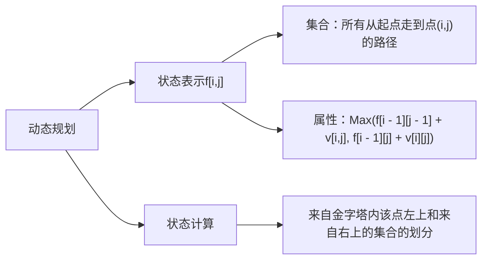
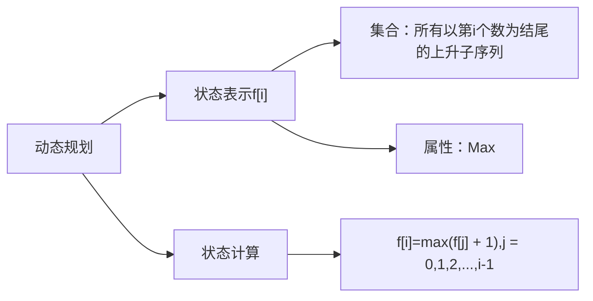
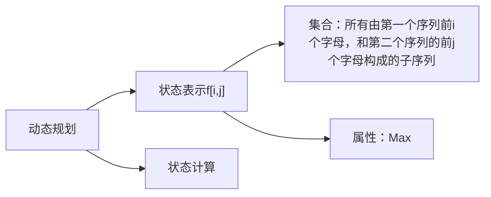

- 定义：dp的递推方程是线性关系
### 典型例题：
#### （1）数字三角形
- 原题：[P1216 [USACO1.5] [IOI1994]数字三角形 Number Triangles](https://www.luogu.com.cn/problem/P1216)
##### 题目描述
观察下面的数字金字塔。

写一个程序来查找从最高点到底部任意处结束的路径，使路径经过数字的和最大。每一步可以走到左下方的点也可以到达右下方的点。

在上面的样例中，从 7→3→8→7→57→3→8→7→5 的路径产生了最大权值。
##### 输入格式
第一个行一个正整数 𝑟r ,表示行的数目。

后面每行为这个数字金字塔特定行包含的整数。
##### 输出格式
单独的一行,包含那个可能得到的最大的和。

##### 样例
###### 输入1
```
5
7
3 8
8 1 0
2 7 4 4
4 5 2 6 5
```
###### 输出1
```
30
```
##### 题解
###### 思路

###### 代码
```
// 原题：洛谷p1216,数字三角形

#include <iostream>
#include <algorithm>

using namespace std;
  
const int N = 1010, INF = -1e9;

int n;
int f[N][N];
int a[N][N];

int main()
{
    cin >> n;
    for (int i = 1; i <= n; i ++)
        for (int j = 1; j <= i; j ++)
            cin >> a[i][j];

    for (int i = 0; i <= n; i ++)
        for (int j = 0; j <= i + 1; j ++)
            f[i][j] = INF; //未用到的置值无穷小
   
   f[1][1] = a[1][1];

   for (int i = 2; i <= n; i ++)
        for (int j = 1; j <= i; j ++)
            f[i][j] = max(f[i - 1][j - 1] + a[i][j], f[i - 1][j] + a[i][j]);
            
    int res = INF;

    for (int i = 1; i <= n; i ++)
        res = max(res, f[n][i]); // 遍历最后一行，判断最大值

    cout << res;

    return 0;
}
```
- [[时间复杂度]]
#### （2）最长上升子序列
- 原题：[B3637 最长上升子序列](https://www.luogu.com.cn/problem/B3637)
##### 题目描述
这是一个简单的动规板子题。

给出一个由 𝑛(𝑛≤5000) 个不超过 $10^6$ 的正整数组成的序列。请输出这个序列的**最长上升子序列**的长度。

最长上升子序列是指，从原序列中**按顺序**取出一些数字排在一起，这些数字是**逐渐增大**的。

##### 输入格式
第一行，一个整数 𝑛，表示序列长度。

第二行有 𝑛 个整数，表示这个序列。
##### 输出格式
一个整数表示答案。

##### 样例
###### 输入1
```
6
1 2 4 1 3 4
```
###### 输出1
```
4

提示：分别取出 1,2,3,4 即可
```
##### 题解
###### 思路

###### 代码
```
// 原题：洛谷B3637
#include <iostream>
#include <algorithm>

using namespace std;
  
const int N = 5010;
int n;
int a[N],f[N]; // f[i] ------ 以第 i 个数结尾的最长上升序列

int main()
{
    cin >> n;
    for (int i = 1; i <= n; i ++) cin >> a[i];
    
    for (int i = 1; i <= n; i ++)
    {
        f[i] = 1; // 以 i 结尾的集合，初始时只有第 i 个数本身
        for (int j = 1; j < i; j ++)
            if (a[j] < a[i]) // 如果出现上升序列
                f[i] = max(f[i],f[j] + 1); // 取最大的上升序列
    }

    int res = 0;

    for (int i = 1; i <= n; i ++)
        res = max(res, f[i]);

    cout << res;

    return 0;
}
```
###### 时间复杂度
公式：*状态数 × 转移方程计算量*
最长上升子序列中，状态数为 n，而计算每个状态需要从 0 ~ i - 1，所以也是 n，时间复杂度为O($n^2$)
#### （3）最长上升子序列II
- 优化版，数据量在100000(十万)
##### 代码
```
// 数据量变为 1e5，数据范围在 -2e9 ~ 2e9 之间，所以之前的 O(n^2) 的朴素做法不可行，需要优化
#include <iostream>
#include <algorithm>
#include <cstring>

using namespace std;

const int N = 2e5 + 10;
int a[N], q[N];
  
int main()
{
    int n;
    cin >> n;

    for (int i = 0; i < n; i ++)    cin >> a[i];

    int len = 0; // 最长上升子序列的长度
    q[0] = -2e9; // 处理边界问题

    for (int i = 0; i < n; i ++)
    {
        int l = 0, r = len;

        while(l < r)
        {
            int mid = l + r + 1 >> 1;
            
            // 找到已知最长上升子序列中比 a[i] 小的、 最大的值
            if (q[mid] < a[i])
                l = mid;
            else r = mid - 1;
        }
        len = max(len, r + 1); 
        // 把 a[i] 加到 q[r] 后边，二分查找后，若存在 q[r + 1]，必定比 a[i] 大，所以可以替换，而如果所有值都比 a[i] 小，那么就会将 a[i] 加到新的一位

        // 因为找上升子序列时：小的数肯定比大的数更好找上升序列，例如：1 3 4 比 1 3 6 更好找到接下来的上升序列

        q[r + 1] = a[i]; // 如果有，就替代，没有就添加

    }
    
    cout << len << endl;

    return 0;
}
```

#### （4）最长[[公共子序列]]1
- 原题：[P1439 【模板】最长公共子序列](https://www.luogu.com.cn/problem/P1439)
##### 题目描述
给出 1, 2, …, n 的两个排列​ $P_1$ 和 $P_2$​ ，求它们的最长公共子序列。

##### 输入格式
第一行是一个数 𝑛。

接下来两行，每行为 𝑛 个数，为自然数 1,2,…,𝑛 的一个排列。
##### 输出格式
一个数，即最长公共子序列的长度。

##### 样例
###### 输入1
```
5 
3 2 1 4 5
1 2 3 4 5
```
###### 输出1
```
3
```
###### 数据范围
- 对于 50% 的数据， 𝑛≤$10^3$；
- 对于 100% 的数据， 𝑛≤$10^5$。
##### 题解
###### 思路
- 参考最长上升子序列的优化和离散化，发现将第一行数字离散化后，再在第二行中找到离散化后的最长上升子序列，即为所求答案，并且时间复杂度为：$O(nlog_2n)$
###### 代码
```
// 思路参考最长上升子序列的 nlogn 优化，结合离散化思路

#include <iostream>

#include <algorithm>

#include <cstring>

  

using namespace std;

const int N = 2e5 + 10;

int n;

int a[N], b[N], q[N]; // q 数组存离散化后的 b 数组的最长上升子序列的值

int alls[N]; // alls[i]:存储值 i 在第一行中的位置

  

int main()

{

    cin >> n;

    for (int i = 0; i < n; i ++)

    {

        cin >> a[i];

        alls[a[i]] = i;

    }

    for (int i = 0; i < n; i ++)

        cin >> b[i];

  

    int len = 0; // 最长上升子序列的长度

  

    for (int i = 0; i < n; i ++) // 遍历第二行(数组b)的所有值

    {

        int l = 0, r = len;

        while(l < r)

        {

            int mid = l + r + 1 >> 1;

            if (q[mid] < alls[b[i]]) // 找到数组 q 中的小于 alls[b[i]] 的最大下标值

                l = mid;

            else r = mid - 1;

        }

        len = max(len, r + 1);

  

        q[r + 1] = alls[b[i]];

    }

    cout << len << endl;

    return 0;

}
```
#### （5）最长[[公共子序列]]2
##### 题目描述
给出两个长度分别为 n 和 m 的字符串 A 和 B，求既是 A 的子序列又是 B 的子序列的字符串长度**最长**是多少

##### 输入格式
第一行包含两个整数 n, m。

第二行包含一个长度为 n 的字符串 A
第三行包含一个长度为 m 的字符串 B
字符串均有小写字母构成
##### 输出格式
一个数，即最长公共子序列的长度。

##### 样例
###### 输入1
```
4 5
acbd
abedc
```
###### 输出1
```
3

提示：最长公共子序列为：abd
```
###### 数据范围
- 1 ≤ n ≤ 1000
##### 题解
###### 思路

###### 代码
```
// 字符串型
#include <iostream>
#include <cstring>
#include <algorithm>

using namespace std;

const int N = 1010;

int f[N][N];

char a[N], b[N];
int n,m;

int main()
{
    cin >> n >> m;
    scanf("%s%s", a + 1, b + 1);

    for (int i = 1; i <= n; i ++)
        for (int j = 1; j <= m; j ++)
        {
            f[i][j] = max(f[i - 1][j], f[i][j - 1]); // 因为 f[i - 1][j] 和 f[i][j - 1] 都包含了状态 f[i - 1][j - 1]，所以就不需要再进行比较
            if (a[i] == b[j]) f[i][j] = max(f[i][j], f[i - 1][j - 1] + 1);
        }

    cout << f[n][m];

    return 0;
}
```