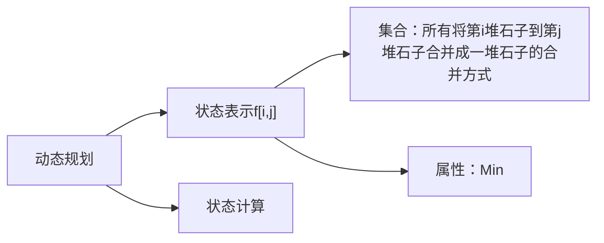

### 典型例题：
#### 石子（？）
##### 题目描述

##### 输入格式

##### 输出格式

##### 数据范围

##### 样例
###### 输入1

###### 输出1

##### 题解
###### 思路

```mermaid
flowchart LR
A[动态规划] --> B["状态表示f[i,j]"]
A[动态规划] --> C[状态计算]
B["状态表示f[i,j]"] --> D["集合：所有将第i堆石子到第j堆石子合并成一堆石子的合并方式"]
B["状态表示f[i,j]"] --> E["属性：Min"]


```
###### 代码
```

```