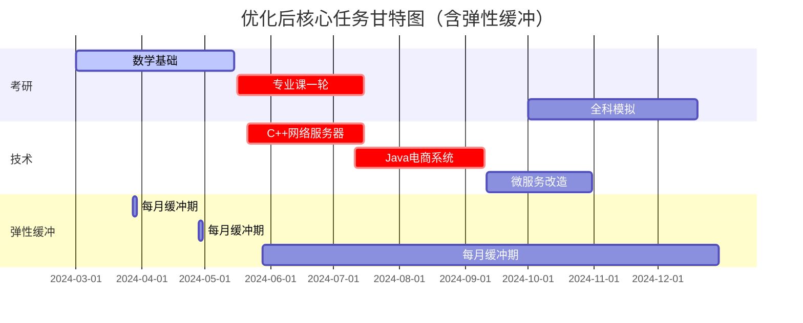

# 计划书
### 可行性分析与风险评估

---

#### **一、时间可行性验证**
1. **总时间核算**  
   - **每日投入**：6小时（考研3h + 技术3h）  
   - **周末补充**：每天增加4小时项目开发（按每月8天计算，共32小时/月）  
   - **总学习时长**（3月-12月）：  
     - 常规日：10个月 × 22天/月 × 6h = **1320小时**  
     - 周末补充：10个月 × 8天/月 × 4h = **320小时**  
     - **合计：1640小时**  
   - **任务耗时估算**：  
     - 考研：约800小时（含真题模拟）  
     - 技术学习：约700小时（C/C++ 300h、Java 250h、数据库/软件工程 150h）  
     - 弹性缓冲：剩余140小时  

2. **关键冲突点**  
   - **5-7月**：考研专业课（数据结构/操作系统）与C++项目（网络服务器）、Java框架（SpringBoot）重叠，需每日分配5小时以上技术学习，可能导致疲劳积累。  
   - **9-10月**：政治冲刺与软件工程UML建模并行，记忆类与逻辑类任务交替需高效切换。

---

#### **二、风险评估与应对方案**
| 风险类型     | 发生概率 | 影响程度 | 应对措施                                         |
| -------- | ---- | ---- | -------------------------------------------- |
| **健康问题** | 中    | 高    | 每周预留半天机动时间，生病期间切换为理论复习（如看技术文档/政治网课）          |
| **效率低下** | 高    | 中    | 启用“双周动态调整”：落后20%以上时，暂停非核心任务（如分布式系统项目）        |
| **技术瓶颈** | 中    | 中    | 加入技术社区（Stack Overflow/牛客网），设定单问题最大攻坚时间（≤4小时） |

---

#### **三、计划优化**
1. **C/C++ 计划
- **重点**：  
     - 内存管理 + 多线程编程 → 直接通过网络服务器项目实战驱动学习  
     - 源码解析改用STLPort简化版（仅分析Vector/Map核心逻辑）  

2. **弹性时间注入**  
   - 每月最后3天设为**缓冲期**（不安排新任务，用于补漏或休息）  
   - 每日晚预留30分钟**灵活时段**（处理未完成任务或突发问题）  

3. **任务优先级重排**  
   - **考研优先级**：数学/专业课 > 英语 > 政治  
   - **技术优先级**：Java电商系统 > 数据库分库分表 > C++网络编程  

---

#### **四、最终可行性结论**
1. **时间充足性**：优化后总任务量约1540小时（<1640小时总可用时间），**具备可行性**。  
2. **容灾能力**：  
   - 可承受**累计15天**的意外中断（如感冒/课程冲突），通过缓冲期和灵活时段覆盖。  
   - 关键路径任务（Java电商系统、考研全科模拟）受缓冲机制保护，延迟风险低。  
3. **执行建议**：  
   - **工具辅助**：使用Forest App强制锁机，避免社交媒体干扰（每日节省≥1小时）  
   - **体能管理**：每周3次有氧运动（30分钟/次），维持大脑供氧效率  
   - **反馈机制**：每完成一个模块，向技术社区发布成果（获得正向激励）  

**结论**：在精简C++非核心任务、注入弹性时间后，该计划可抵御常见风险，适合中等以上学习能力（日均高效学习≥5小时）的学生执行。