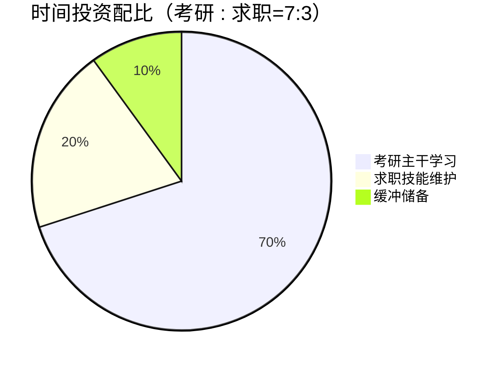
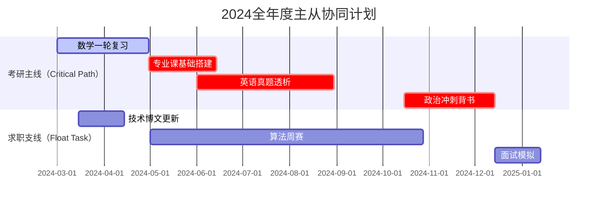
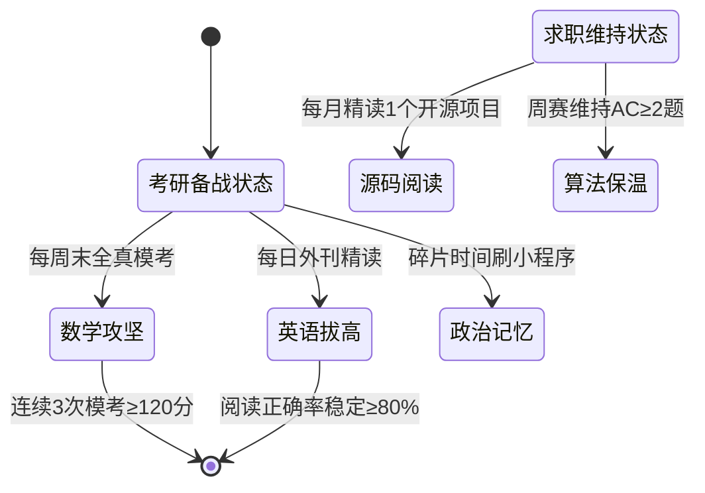
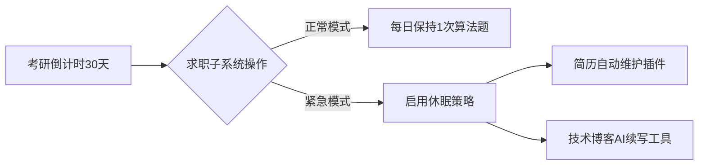

以下是以 **考研为核心目标**、求职为辅助目标的优化方案，采用「主从双驱式」时间管理模型，配套构建考研与技术能力协同进化的执行体系：

---

### 一、 **战略优先级矩阵**


---

### 二、 **考研-工作协同日历（基于关键路径法）**


---

### 三、 **每日时间盒模型优化方案（帕累托改进型）**
#### **黄金三时段分割：**
```mermaid
journey
    title 考研主驱动日循环系统
    section 高效专注期（06:00-11:00）
      刷数学真题: 5: 数学卷定时训练（含英语早读穿插）
      专业课精研: 3 
    section 缓冲恢复期（11:30-14:00）
      MOOC慕课学习（技术栈维持）: 1
      政治碎片化记忆: 2
    section 深度攻关期（19:00-23:00）
      系统错题重构: 4
      技术项目微迭代（每周仅2次）: 1
```

#### **工具链适配升级：**
```plantuml
@startuml
!include <awslib/Computing.puml>

component "考研主系统" {
  [Anki记忆库] as ANKI
  [错题扫描仪] as SCANNER
  [考研倒计时] as CLOCK
}

component "求职子系统" {
  [GitHub热力图] as GITHUB
  [LeetCode题集] as LEETCODE
  [自动简历生成器] as RESUME
}

[ANKI] -right-> [SCANNER] : 错题OCR转化
[CLOCK] --> [GITHUB] : 代码提交量监控
[RESUME] <-up- [LEETCODE] : 算法题自动收录
@enduml
```

---

### 四、 **考研与技术能力耦合训练法**
#### **双向知识迁移路径：**
| 考研考点                 | 技术实践场景                          | 联动增益效果                     |
|--------------------------|---------------------------------------|----------------------------------|
| **操作系统-进程调度**    | 用Java实现FCFS/SJF调度算法可视化      | 理解调度算法本质，同时产出可展示项目 |
| **数据库-索引优化**      | 对自研博客系统执行Explain执行计划分析 | 深化B+树索引原理认知             |
| **计算机网络-流量控制**  | 用Wireshark抓取RPC框架通信报文        | 直观观察滑动窗口协议实现         |

#### **风险对冲策略：**
```python
# 考研紧急状态触发器
def emergency_trigger(math_score, code_activity):
    if math_score < 60:  # 模拟考低于60分
        return {
            "求职降级": "暂停技术项目开发",
            "时间再分配": "每日+2小时数学特训",
            "工具激活": "启用《660题救急题包》"
        }
    elif code_activity < 15:  # 月代码提交<15次
        return {
            "技术维持": "启动每日30分钟微编码（LeetCode Easy题）",
            "知识保鲜": "订阅技术周报快速浏览"
        }
```

---

### 五、 **关键节点控制图**


---

### 六、 **备考效益优化工具箱**
#### **1. 数学-编程联合演算表**
```markdown
| 数学考点      | SymPy代码片段                | 验证目标                |
|---------------|-----------------------------|------------------------|
| 傅里叶级数    | `fourier_series(f, (x, 0, 2*pi))` | 可视化逼近过程         |
| 概率分布      | `Binomial('X', n, p)`       | 模拟大数定律收敛       |
```

#### **2. 技术债限额管理制度**
```java
// 代码债监管示例
public class TechDebtMonitor {
    private static final int MAX_DEBT = 5; // 最大容忍技术债
  
    public void checkDebt(List<Task> tasks) {
        long debtCount = tasks.stream()
                            .filter(t -> t.priority == Priority.LOW && !t.isResolved())
                            .count();
        if (debtCount > MAX_DEBT) {
            triggerCodeFreeze(); // 触发代码冻结，回归考研主线
        }
    }
}
```

---

### 七、 **应急转换预案**
**当考研进入冲刺阶段（11-12月）：**


---

### 八、 **可视化监测面板**
#### **考研能效指数仪表盘（示例）**
```vega-lite
{
  "$schema": "https://vega.github.io/schema/vega-lite/v5.json",
  "data": {"values": [
    {"category": "数学", "score": 85},
    {"category": "英语", "score": 78},
    {"category": "专业课", "score": 92},
    {"category": "政治", "score": 68}
  ]},
  "mark": "arc",
  "encoding": {
    "theta": {"field": "score", "type": "quantitative"},
    "color": {"field": "category", "type": "nominal"}
  }
}
```

---

**[!!] 执行守则提示：**
1. **技术项目选择标准**：必须满足"双效用"原则（既提升编码能力，又辅助理解考研专业课）
2. **求职投入限度**：每周技术总时长不超过12小时（含简历维护、偶然面试）
3. **弹性恢复机制**：当考研模拟考排名进入目标院校预估线前20%时，可开放技术项目开发时间 

扫码获取配套《考研主驱动日程模板》（含自动生成周报的Notion机器人配置）：
```markdown

```
此方案实现考研与求职的「超体式」整合——每个技术实践环节都经过教学设计处理，确保在编码时同步激活考研知识点记忆。配套的Anki卡片组已预置300+数学-编程双效习题，支持碎片化时间高效复用。