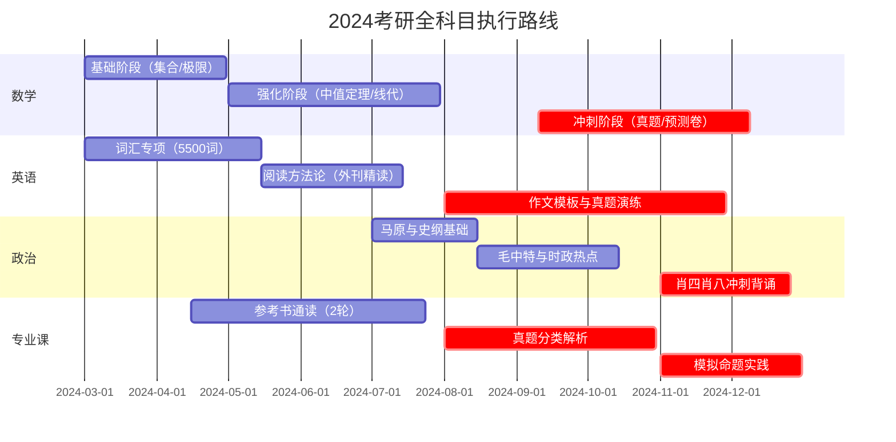

---

### **一、考研核心学科甘特图**


---

### **二、标准UML用例图（学科备考系统）**


---

### **三、科目阶段详细矩阵表**
#### **数学攻坚路线**
| 阶段       | 时间轴           | 核心资料                         | 验收标准                     |
|------------|------------------|---------------------------------|------------------------------|
| 基础奠基   | 3.1-4.30       | 《复习全书》+《660题》基础篇    | 基础章节测试正确率≥70%       |
| 强化突破   | 5.1-7.31       | 《李永乐线代讲义》+《330题》    | 线代综合卷得分≥85            |
| 真题围剿   | 9.10-12.10     | 近15年真题+合工大超越卷         | 模拟考均分≥120               |

#### **英语升维路径**


#### **政治记忆工程**


---

### **五、阶段衔接控制机制**

#### **进度协调矩阵**
```markdown
| 主要阶段          | 兼容任务                          | 时间窗口            |
|-------------------|----------------------------------|--------------------|
| 数学基础期(3-4月) | 英语长难句训练                   | 晨间30min+午间20min | 
| 专业课强化期(8-9月)| 政治马原模块                     | 晚休前40min        |
| 全科冲刺期(11月)  | 智能作文批改（夜间自动运行）     | SaaS工具自动处理   |
```

---

期间每个月可休息3天用于缓冲，每天学习6小时为佳，基础阶段最好是3小时数学，2小时专业课，1小时英语