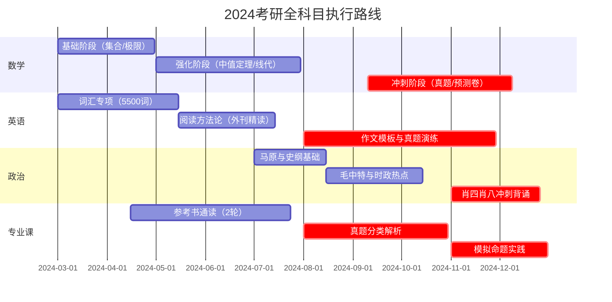

---

### **一、考研核心学科甘特图**


---

### **二、标准UML用例图（学科备考系统）**


---

### **三、科目阶段详细矩阵表**
#### **数学攻坚路线**
| 阶段       | 时间轴           | 核心资料                         | 验收标准                     |
|------------|------------------|---------------------------------|------------------------------|
| 基础奠基   | 3.1-4.30       | 《复习全书》+《660题》基础篇    | 基础章节测试正确率≥70%       |
| 强化突破   | 5.1-7.31       | 《李永乐线代讲义》+《330题》    | 线代综合卷得分≥85            |
| 真题围剿   | 9.10-12.10     | 近15年真题+合工大超越卷         | 模拟考均分≥120               |

#### **英语升维路径**


#### **政治记忆工程**


---

### **五、阶段衔接控制机制**

#### **进度协调矩阵**
```markdown
| 主要阶段          | 兼容任务                          | 时间窗口            |
|-------------------|----------------------------------|--------------------|
| 数学基础期(3-4月) | 英语长难句训练                   | 晨间30min+午间20min | 
| 专业课强化期(8-9月)| 政治马原模块                     | 晚休前40min        |
| 全科冲刺期(11月)  | 智能作文批改（夜间自动运行）     | SaaS工具自动处理   |
```

---

期间每个月可休息3天用于缓冲，每天学习6小时为佳，基础阶段最好是3小时数学，2小时专业课，1小时英语

### **六、图谱架构**

---

#### **标准UML用例图（备考系统）**


**核心用例说明**：
1. **制定复习计划**：关联阶段时间轴（甘特图）与验收标准。
2. **执行学习任务**：调用真题、模拟卷等核心资料。
3. **闭环反馈**：评测报告反向驱动策略调整（如低正确率章节加练）。

---

#### **科目阶段详细矩阵表**
| 学科     | 阶段    | 目标            | 核心资料         | 验收标准            |
| ------ | ----- | ------------- | ------------ | --------------- |
| **数学** | 基础奠基  | 极限/导数/积分      | 《复习全书》+ 660题 | 章节测试正确率 ≥70%    |
|        | 强化突破  | 中值定理/线代专题     | 李永乐讲义 + 330题 | 综合卷得分 ≥85       |
| **英语** | 单词基建  | 5500词覆盖率 ≥90% | 墨墨背单词        | 每日新词100 + 复习200 |
|        | 阅读方法论 | 精读外刊30篇       | 《经济学人》精析     | 阅读正确率 ≥80%      |

---

#### **闭环体系架构图（数据流）**
```plantuml
(计划层: 甘特图阶段划分) --> (执行层: 每日任务打卡)
(执行层) --> (监控层: 正确率/用时统计)
(监控层) --> (优化层: AI推荐薄弱点)
(优化层) --> (计划层: 动态调整优先级)
```
**闭环逻辑**：
1. **计划层**：基于甘特图生成时间轴；
2. **执行层**：绑定学习记录（如Anki/SaaS工具）；
3. **优化层**：通过数据反馈动态修正（如政治时政热点比重提升）。

---

#### **阶段衔接控制机制示例**
**进度协调矩阵（适配多线程任务）**
```markdown
| 主阶段           | 并行任务                    | 时间窗口       | 工具依赖          |
|------------------|----------------------------|----------------|--------------------|
| 数学基础期       | 英语长难句晨读              | 6:30-7:00 AM   | 每日英语APP        |
| 专业课强化期     | 政治马原音频课              | 20:00-20:40 PM | 喜马拉雅专题       |
| 全科冲刺期       | 智能作文批改（SaaS）        | 23:00自动运行  | Grammarly API      |
```

