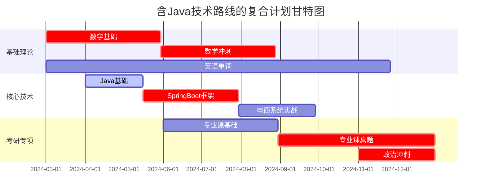
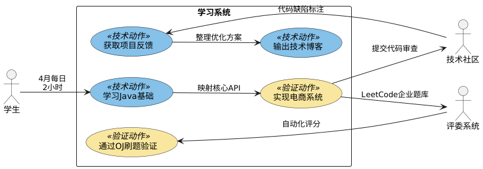
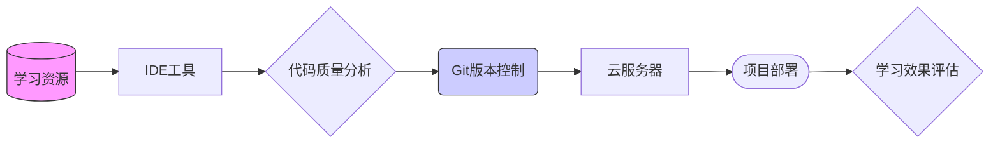
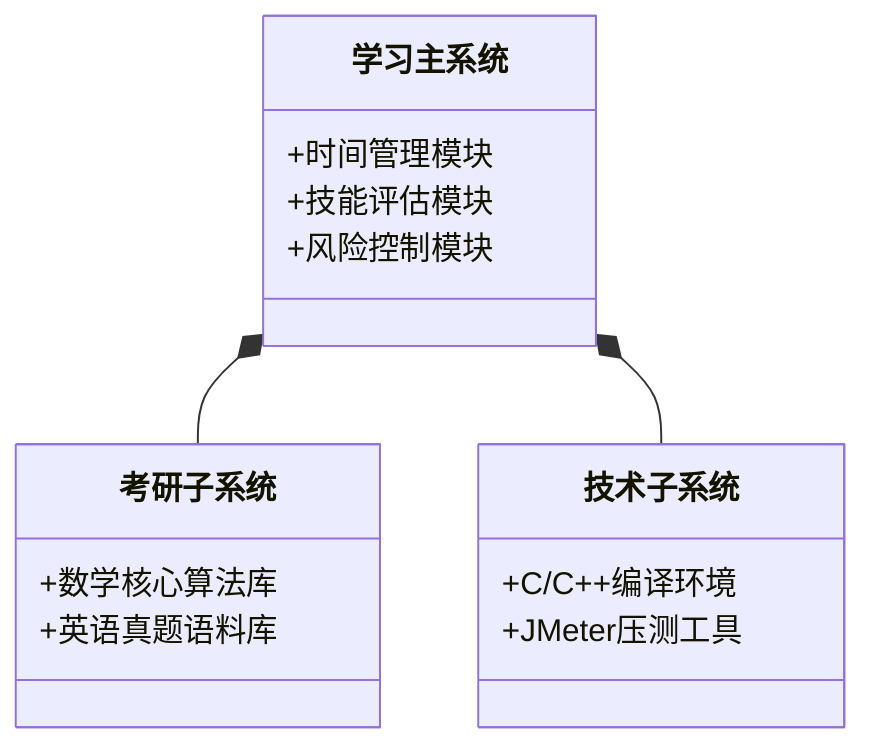

以下是从过程模型、方法实践、工具学用维度对计划书的改进方案及配套图形化表达： 

---

### **一、过程模型**
#### 1. 集成增量式开发模型
### **阶段整合甘特图**


---

### **UML用例图（技术维度）**

---

### **关键要素说明**

1. **Java技术线**
   - 基础阶段（4.1-5.15）: 包含集合框架/JVM内存模型
   - 框架阶段（5.16-7.31）: 覆盖Spring Boot自动配置原理
   - 项目阶段（8.1-9.30）: 电商系统高度耦合考研专业课中的设计模式应用

2. **阶段衔接设计**
   ```
   Java基础结束 → 专业课启动（1天重叠用于知识迁移）
   SpringBoot中期 → 数学冲刺（共享每日最后一小时交叉验证数学建模与RESTful API）
   ```

#### **用例图技术细节**
1. **验证机制设计**
   ```mermaid
   sequenceDiagram
       学生->>+OJ系统: 提交电商系统DAO层代码
       OJ系统-->>-学生: 返回并发压测结果(TP99: <20ms)
       学生->>+GitHub: Push优化版代码
       GitHub-->>-技术社区: 触发Code Review流程
       技术社区->>学生: 指出@Transactional误用
   ```

2. **能力转化路径** 
   ```
   学习Java类型系统 → 应用于考研专业课(OS进程调度算法)
   Spring IoC理解 → 改造数学建模工具类(单例模式验证)
   ```


---

### **二、方法实践升级**
#### 1. 用例建模（技能转化机制）


---

### **三、工具学用深化**
#### 1. 数据流图（DFD）辅助工具链设计


---

### **四、系统架构图（SC）**


---


