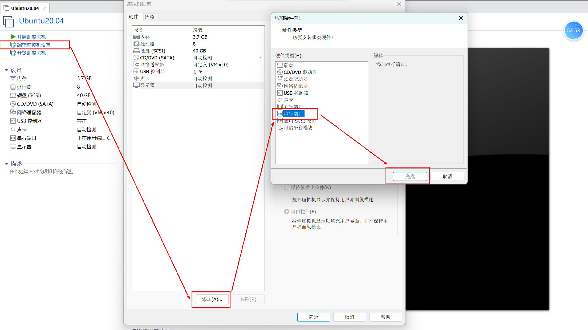
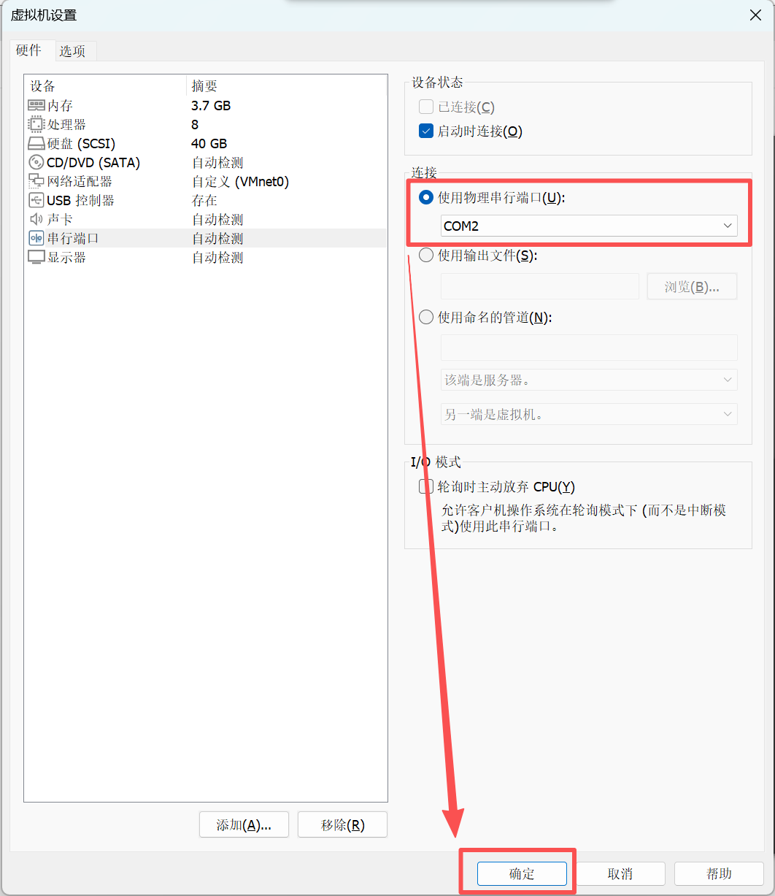

# 1、总体流程图


# 2、环境搭建

```
注意，linux可使用tab键自动补全
```

### 1、VWware虚拟机：软件，用来跑其他的操作系统

```c
1、编辑 -- 虚拟网络编辑器中  --（VMnet0、 VMnet1、 Vmnet8）
    VMnet0 -- 桥接  -- 以太网卡名（电脑配置好的话，就选"自动"）
    注意：
    	笔记本网线上网   --> 以太网卡名（windows设置 --- 网络属性 ---  描述）
    	笔记本无线上网	  --> 无线网卡名
    
2、虚拟机  -- 设置 -- 网络适配器  -- 自定义(VMnet0)
```





### 2、安装虚拟串口管理器：vspd.exe	:用来给Windows创建虚拟串口 COM1 和 COM2的

使用`vspd`将仿真软件SmartHome_boxed与Ubuntu连接
	因为该仿真软件仅支持windows
```c
1、虚拟串口添加后( add pair), 重启笔记本。
2、物理串口的有无，是无关紧要的，只要添加虚拟串口 COM1 和 COM2.
```

### 3、验证：

>如果使用校园网，大概率连不上，建议使用热点

```shell
1、网络验证：
	$ ifconfig					//查看Ubuntu的ip地址
	$ ping www.baidu.com		//ping百度，用来校验Ubuntu是否可以上网
	
2、COM2串口验证
	$ ls /dev/ttyS0			//查看COM2串行通信端口在Ubuntu中的设备文件名
```

### 4、vscode远程连接Ubuntu

```shell
0、Ubuntu中必须安装 openssh,并设置防火墙允许 ssh通过
	$ sudo apt install openssh-server
	$ sudo ufw allow ssh
1、vscode界面点击 扩展 工具
    
2、搜索,并安装插件：
	remote-ssh
    
3、打开vscode的远程资源管理器  SSH  --> 设置  --> c:/User/admin/.ssh/config，进入SSH配置文件
    
4、config配置文件中写入以下数据，并保存：
    Host lw						# 连接的名字,随意更改
    	HostName 192.168.2.51	# 连接的Ubuntu的IP地址
    	User hqyj				# 连接的用户名
    	
5、远程(隧道) (即：REMOTES(TUNNELS/SSH)) --> 刷新

6. 点击箭头，选择连接Linux
```
详情可参考如下教程：[vscode远程ssh连接Ubuntu教程](https://blog.csdn.net/zsyyugong/article/details/134438071)


### 5、Linux C代码的编译运行


```shell
# 将光标的路径切换到 Http目录
$ cd Http

# gcc为编译工具，将server.c这个代码文件进行编译；有错就报错，无错无任何输出，默认生成可执行文件 a.out
# -o :为编译选项，表示指定生成的可执行文件名  xxx
$ gcc server.c -o xxx

# 执行可执行程序
$ ./xxx
```


