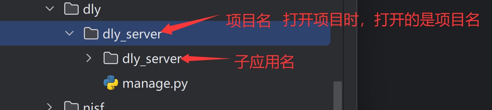
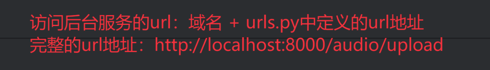
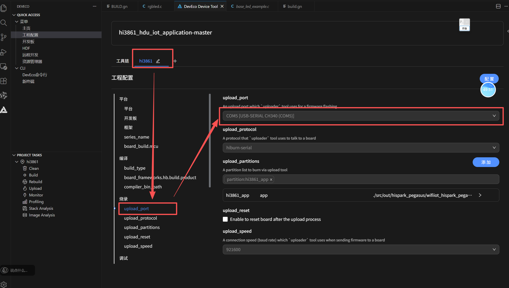

# AI智能小车

```
conda activate dly_env 这个命令经常用到，需要牢记（用于激活虚拟环境dly_env）
```

### 一、环境配置

自行配置，要求如下：[基本要求及介绍](Agent-鸿蒙小车环境配置及基础介绍.md)

#### 1. 创建虚拟环境

打开anaconda prompt

记得**先切换环境**：`conda activate dly_env`，切换到指定虚拟环境后，再安装django
若安装django超时，则可换用镜像下载：`pip install django-cors-headers -i  https://mirrors.huaweicloud.com/repository/pypi/simple`
下载django成功
	
接下来，安装基础依赖包：
```
pip install django-cors-headers
pip install requests
pip install "langchain[openai]"   // langchain是基础依赖包，openai是额外依赖包
```
#### 2、创建django项目

>创建django项目命令：django-admin startproject dly_server
	dly_server只能使用下划线，若使用横杠则会报错
	django-admin是命令，startproject是创建新项目，dly_server是项目名称

先打开anaconda prompt，然后激活先前创建的虚拟环境dly_env，输入切换目录命令`cd ......(目标文件夹)`（记住要先切换到目标磁盘号），随后输入创建django项目命令，创建完毕后，在指定文件夹可以看到创建结果。其中，dly_server文件夹是子应用（其中存放django框架的相关配置），manage.py是程序入口，这两部分都属于dly_server应用中的内容，即架构为：
```
dly_server
	-- dly_server
	-- manage.py
```


#### 3、 添加conda配置

使用PyCharm打开应用时，需要按以下架构来打开：
	
打开后进入setting，对该项目进行设置：
	
	我们选定conda解释器，并找到conda.bat文件（执行脚本，用于激活虚拟环境），随后单击“Load Environments”加载环境
	
	随后，我们选择使用已存在的虚拟环境（即我们先前创建的虚拟环境dly_env）
	
#### 3. 获取API

在[阿里云百炼](https://bailian.console.aliyun.com/?tab=globalset#/efm/api_key)创建API，并获取API key，以便于后续调用
随后在项目中创建env文件，以配置API
	
配置如下：
```
QWEN_API_KEY=你的api key 
QWEN_MODEL_NAME=qwen3-max 
QWEN_BASE_URL=https://dashscope.aliyuncs.com/compatible-mode/v1    // 大模型调用的URL地址 DASHSCOPE_BASE_HTTP_API_URL=https://dashscope.aliyuncs.com/api/v1 
QWEN_ASR_MODEL_NAME=qwen3-asr-flash   // 语音识别模型
QWEN_TTS_MODEL_NAME=cosyvoice-v3-flash    // 语音合成模型
DEVICE_BASE_URL=http://localhost:8088   // 调用的鸿蒙小车的域名
```

##### 封装.env文件

二次封装的好处：可以统一管理，也可避免信息泄露
	
	创建python package，随后创建python文件`env_util.py`用于进行二次封装
配置env_util：
```python
# 加载.env文件中的配置信息，将配置信息赋值给变量  
# 优点：方便统一管理，避免信息泄露  
  
import os  
  
from dotenv import load_dotenv  
  
# 读取.env文件中的配置项到环境变量中  
load_dotenv()  
  
# os.getenv(配置项名)：从环境变量读取配置项  
  
# 千问模型的api_key  
qwen_api_key = os.getenv('QWEN_API_KEY')  
# 千问模型的名称  
qwen_model_name = os.getenv('QWEN_MODEL_NAME')  
# 千问模型的API接口地址  
qwen_base_url = os.getenv('QWEN_BASE_URL')  
# 阿里云百炼的API接口地址，主要使用在语音识别和语音合成模型上  
dashscope_base_http_api_url = os.getenv('DASHSCOPE_BASE_HTTP_API_URL')  
# 阿里语音识别模型名称  
qwen_asr_model_name = os.getenv('QWEN_ASR_MODEL_NAME')  
# 阿里语音合成模型名称  
qwen_tts_model_name = os.getenv('QWEN_TTS_MODEL_NAME')  
# 鸿蒙小车系统提供的域名地址  
# 暂时使用模拟数据接口的地址，后期和鸿蒙系统对接时，需要修改这个url地址  
device_base_url = os.getenv('DEVICE_BASE_URL')
```

#### 创建Agent大模型

架构如下


##### 创建Agent工具

架构：
	
	device_tools用于存放Agent工具

我们在本次项目实现中，选用LangChain支持的Tool装饰器的函数来创建Tools


语音识别模型网址：[阿里云语音识别模型](https://help.aliyun.com/zh/model-studio/qwen-speech-recognition)

前端访问后端服务：


处理逻辑过程梳理：


打开串口必须使用sudo管理员命令


测试用数据 \_\_main\_\_部分的内容必须删除，否则搭建完成前后端环境后，在前端输入语音会导致后端无响应，从而使仿真软件也无反应

### 搭建鸿蒙环境（无硬件可不做）

IDE：devicetool
开发工具包：DEVTool
鸿蒙小车源码：Hi3861固件




