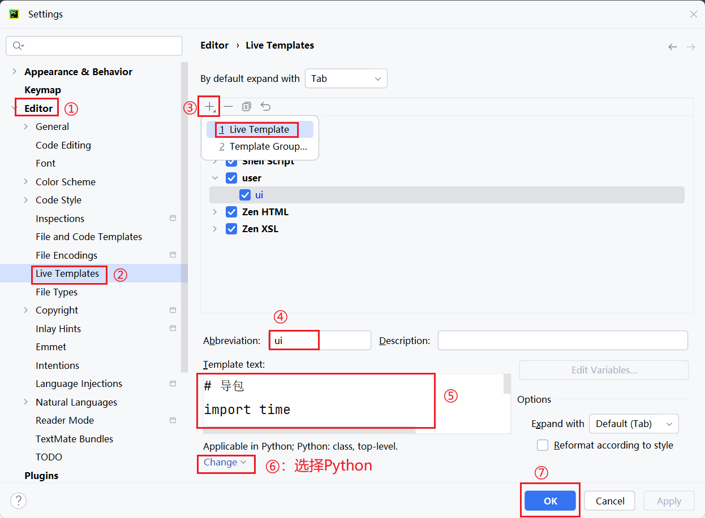

# 02_UI自动化
### 一、前置条件

- 项目需要UI自动化一般需要满足如下前置条件：
	1. 项目上线发布频率高，回归测试任务重
	2. 项目需要实现自动化的功能模块，需求变更不频繁
		- 一般只实现核心功能模块
	3. 项目周期长
		- 公司自研或者公司核心产品
- UI自动化测试时机：一般在手工测试结束后，版本或项目功能趋于稳定
### 二、优劣势

- 优势：
	1. 节省人力成本：回归测试工作由脚本代替人去执行
	2. 提高回归测试效率：脚本执行测试速度更快
	3. 提高测试质量：一旦自动化脚本库完善后测试执行过程更标准和准确
- 劣势
	1. 对测试人员要求高
	2. 前期投入成本大
	3. 对项目要求高
### 三、Web自动化工具  -->  selenium
#### 1. 为什么选择使用selenium？

- 选择使用有如下原因：
	1. 开源软件，免费
	2. 支持跨平台
	3. 支持多种浏览器
	4. 支持多语言
	5. 功能强大、成熟、稳定
#### 2. selenium核心组件

```
selenium是一套工具集，其中最核心的有三大组件
```
##### 1）Selenium-IDE

- 是一种浏览器插件，是录制脚本的工具。支持脚本回放和导出。可以导出Python和Java等类型的单元测试脚本。执行过程为：录制用户操作 --> 自动生成测试脚本  -->  回放执行
- 冗余代码太多，已不常用

##### 2）Selenium-Grid

- 分布式执行自动化测试工具，用于大批量测试用例的执行。
- 可以同时在多台机器（Windows/Mac/Linux）/浏览器上运行测试

##### 3）🌟🌟🌟Selenium-Webdriver

- 脚本编写核心工具，提供模拟手工操作的常用方法
###### a. 原理

- 原理图：
- WebDriver驱动程序一般都可以在Selenium官网下载，是操作浏览器的核心
###### b. 简单案例实现

```python
import time  
  
from selenium import webdriver  
from selenium.webdriver.firefox.service import Service  
  
# 使浏览器打开速度提升 -->  直接指定驱动程序路径  
# path = Service(executable_path=r"驱动程序路径")  # 直接指定浏览器驱动程序的路径  
# 其中 r 的作用是告诉 Python 不要对路径中的字符进行转义，比如 \s
# driver = webdriver.Firefox(service=ser)  # 使用指定的Service对象创建 Firefox 浏览器实例
  
driver = webdriver.Firefox()  
  
driver.get("https://itheima.com/")  
  
  
time.sleep(2)  
  
driver.quit()
```
#### 3. Selenium入门

> 后续介绍中所有的 driver 指的都是webdriver实例对象，即：driver = webdriver.Firefox()  
```
Selenium操作的是标签页，自动化操作打开标签页后，不论发生页面跳转，还是发生模块变更，只要还是同一个标签页，就可以继续操作。
```
- Selenium操作步骤：
	1. 导包
	2. 创建浏览器驱动对象
	3. 访问Web页面（打开网页之后，可以执行浏览器窗口最大化操作：`driver.maxmize_window()`）
	4. 执行页面操作（常见操作有：输入、点击等）
	5. 暂停几秒钟
	6. 浏览器驱动对象退出
##### 1）元素定位工具
###### a.HTML介绍

- Web前端三大技术：
	1. HTML：负责网页的架构（标签语言）
	2. JavaScript：负责网页的行为(一般是`<script>`标签里的`function xxx`内容)
	3. CSS：负责网页的样式、美化（一般是`<script>`标签里的`.xxx`内容）
- HTML语法：<标签名 属性="属性名">文本内容</标签名>
###### b.HTMl标签

- 常见的有：单标签`<br/>`，双标签`<body>内容</body>`
- 标签属性：属性名 = "属性值"。如：`<a href="http://www.jd.com">京东</a>`
- 容易踩坑：若标签为：`<标签名 class="element result">`代表该标签有两个类名，分别是element和result
##### 2）元素定位方式

- 一图流：
- 通用语法：`浏览器对象.find_element(by=By.定位方式, value="属性值")`
- 获取元素文本：`element.text`
```python
# 例子
# 1. 导包  
import time  
from selenium import webdriver  
from selenium.webdriver.support import expected_conditions as EC  
from selenium.webdriver.common.by import By  
from selenium.webdriver.support.wait import WebDriverWait  
  
# 2. 创建浏览器对象  
driver = webdriver.Firefox()  
  
# 3. 打开Web页面  
driver.get("https://hmshop-test.itheima.net/Home/user/login.html/")  
# 4. 页面操作  
# 输入操作  
el = driver.find_element(by=By.ID, value="username")   # id 定位
el.send_keys("13800000001")  
  
driver.find_element(by=By.NAME, value="password").send_keys("123456") # name定位
# 点击操作  
driver.find_element(by=By.CLASS_NAME, value="J-login-submit").click() # class_name定位
# 5. 等待几秒  
time.sleep(2)  
# 后续可以继续对登录成功后的商城界面进行操作
# 6. 浏览器驱动对象退出  
driver.quit()
```
###### a.🌟CSS定位

> Cascading Style Sheets（CSS）：层叠样式表，一种用来描述文档在网页上如何呈现样式的语言。
> - 如果使用CSS的时候，class属性值有多个，`value=".第一个属性值.第二个属性值"`
> - 如果使用CSS的时候，有复杂层级关系，value值使用例子（>不是大于，而是表示前者是后者的上级）：`标签名#标签的ID属性值 > 下级标签名 > 下级标签名.class属性值`
- 如果无法确定使用哪种，可以直接定位到浏览器元素后，在F12选中对应元素，右键-->复制-->复制CSS选择器/Selector，即可获取到CSS选择器的Value值
- **语法**：`浏览器对象.find_element(by=By.CSS_SELECTOR,value="CSS表达式")`
- **CSS选择器定位分类**：
    - ID选择器
		- 标签元素有ID属性
        - 写法：`value="#id属性值"`
    - 类选择器
        - 标签元素有class属性
        - 写法：`value=".class属性值"`
    - 元素选择器（不常用）
        - 写法：`value="标签名"`
    - 属性选择器
        - 写法：`value="[属性名='属性值']"`
        - 当只使用一个属性会导致定位错误时，也可以使用多个属性的组合来锚定唯一：`value="[属性名1='属性值1'][属性名2='属性值2']"`
    - 案例：tpshop前台登录
```python
# 1.导包
import time
from selenium import webdriver
from selenium.webdriver.chrome.service import Service
from selenium.webdriver.common.by import By

# 2.打开浏览器（创建浏览器驱动对象）
path = r"C:\Program Files\Python311\chromedriver.exe"# 定义驱动路径，该项选择自己电脑的浏览器驱动路径
ser = Service(executable_path=path)  # 实例化Chrome浏览器服务驱动
driver = webdriver.Chrome(service=ser)  # 打开Chrome浏览器
# driver = webdriver.Edge()
# 3.输入网址
driver.get("https://hmshop-test.itheima.net/Home/User/login.html")
# 4.页面操作
# 输入用户名、密码、验证码
# 通过CSS选择器定位，按照元素的class\ID属性值定位 、其他属性名和属性值定位
driver.find_element(by=By.CSS_SELECTOR, value=".text_cmu").send_keys("13800001001")
driver.find_element(by=By.CSS_SELECTOR, value="#password").send_keys("123456")
driver.find_element(by=By.CSS_SELECTOR, value="[name='verify_code']").send_keys("8888")
# 点击登录
driver.find_element(by=By.CSS_SELECTOR, value=".J-login-submit").click()
# 获取登录结果：手机号
time.sleep(2)
# 获取元素的文本信息：元素.text
result = driver.find_element(by=By.CSS_SELECTOR, value=".red.userinfo").text
assert result == "13800001001"
# 5.等待2秒
time.sleep(2)
# 6.退出浏览器
driver.quit()

```

- 【扩展】层级选择器
	- 根据元素的父子关系来选择元素
	- 写法：`元素1>元素2`
	- 根据元素的上下级来选择元素
	- 写法：`元素1 元素2`
- 【扩展】其他选择器
	- 利用局部属性值定位元素
	- 写法：`标签名[属性名*='局部属性值']`
```python
# 导包
import time
from selenium import webdriver
from selenium.webdriver.common.by import By

# 创建浏览器驱动
driver = webdriver.Chrome()
# 获取访问页面
driver.get("http://121.43.169.97:8848/pageA.html")
# 放大浏览器
driver.maximize_window()
time.sleep(1)
# 模拟用户操作
# 获取用户名：
driver.find_element(By.CSS_SELECTOR,"p>input").send_keys("admin")  # 父子关系
driver.find_element(By.CSS_SELECTOR,"form input").send_keys("test")  # 上下级关系
driver.find_element(By.CSS_SELECTOR,"input[id*='pass']").send_keys("123456")  # 元素和属性模糊匹配扩展
# 等待3秒
time.sleep(3)
# 退出浏览器
driver.quit()
```
###### b.🌟XPath定位

```
XPath练习地址：https://www.lddgo.net/string/xml-xpath
```
- **语法**：`浏览器对象.find_element(by=By.XPATH,value="xpath表达式")`
- **xpath定位分类**：
    - **绝对路径(不建议)：**
        - 从最外层元素到指定元素之间所有经过的元素层级的路径 （层级关系依赖强，不建议使用）
        - 写法：/html根节点开始，使用/来分隔元素层级（存在多个相同标签时，从下标1开始计数）。例如：`/html/body/div/fieldset/form/p[1]/input`
    - **相对路径：**
        - 从目标定位元素的任意层级的上级元素开始到目标元素所经过的层级的路径
        - 写法：以 // 开始，后续每个层级都使用 / 来分隔。例如：`//p[3]/input`
    - **路径+属性定位**
        - 利用元素的属性来定位
        - 写法：`//标签名[@属性名="属性值"]` 或者 `//*[@属性名="属性值"]`
        - `//*[@属性名1="属性值" and @属性名2=属性值]`
        - 注意事项：可以使用 * 来代替任意标签名
    - 案例：TPSHOP后台登录
```python
# 1.导包
import time
from selenium import webdriver
from selenium.webdriver.chrome.service import Service
from selenium.webdriver.common.by import By
# 2.打开浏览器（创建浏览器驱动对象）
path = r"C:\Program Files\Python311\chromedriver.exe"  # 定义驱动路径
ser = Service(executable_path=path)  # 实例化Chrome浏览器服务驱动
driver = webdriver.Chrome(service=ser)  # 打开Chrome浏览器
# driver = webdriver.Edge()
# 3.输入网址
driver.get("https://hmshop-test.itheima.net/Admin/Admin/login")
# 4.页面操作
# 输入用户名、密码、验证码
driver.find_element(By.XPATH, '//*[@name="username"]').send_keys("admin")
driver.find_element(By.XPATH, '//*[@id="theForm"]/div/div[1]/div[2]/div[2]/input').send_keys("HM_2025_test")
driver.find_element(By.XPATH, '//*[@id="vertify"]').send_keys("8888")
driver.find_element(By.XPATH, '//*[@id="theForm"]/div/div[1]/div[2]/div[5]/span/input').click()
# 获取登录的文本信息
time.sleep(2)
result = driver.find_element(By.XPATH, '/html/body/div[1]/div[4]/div[2]/span').text
assert result == "admin"
# 5.等待2秒
time.sleep(2)
# 6.退出浏览器
driver.quit()
```
	
- **路径+文本定位**
	- 写法：`//*[text()="完整文本"]`
	- 例如：`<span>"添加商品"</span>`，使用XPATH定位：`//*[text()="添加商品"]`
- 【扩展】属性和逻辑结合
	- 利用元素的多个属性来进行定位
	- 写法：`//*[@属性名="属性值" and @属性名="属性值"]`
- 【扩展】层级和属性结合
	- 先定位到其父级元素，然后再找到该元素
	- 写法：`//标签名[@属性名="属性值"]/标签名[@属性名="属性值"]`
- 【扩展】利用局部属性值定位
	- 写法：`//*[contains(@属性名,"局部属性值")]`
```python
# 导包
import time
from selenium import webdriver
from selenium.webdriver.common.by import By

# 创建浏览器驱动
driver = webdriver.Chrome()
# 获取访问页面
driver.get("http://121.43.169.97:8848/pageA.html")
# 放大浏览器
driver.maximize_window()
time.sleep(1)
# 模拟用户操作
# 获取用户名：包含部分属性值
driver.find_element(By.XPATH, "//*[contains(@placeholder,'用户名')]").send_keys("admin")
time.sleep(3)
# 点击百度超链接：文本形式
driver.find_element(By.XPATH, "//*[text()='百度']").click()
# 等待3秒
time.sleep(3)
# 退出浏览器
driver.quit()
```
##### 3）selenium模板的设置与使用 

- 模板设置：
- 第4步对模板进行命名，第5步处输入模板内容，第6步选择python，则在`.py`文件中可以使用该模板
	- 例如：
#### 4. frame框架切换处理

- frame是HTML页面中的一种框架，主要作用是在当前页面中的指定区域显示另一页面的元素（可以理解为：一个页面内嵌在另一个页面区域中）
```
当使用元素定位方式无法获取到元素时，就要考虑该功能是否是使用frame框架设计的。具体查看步骤：打开F12，查看对应功能的源码所在位置，自下而上查看其上级标签，如果发现有<iframe><html> </html></iframe>，则说明确实使用了frame框架，需要用其他方法打开该功能
```
- 如何使用Selenium对frame框架中的功能模块进行操作呢？
- 使用Frame切换：`driver.switch_to.frame(frame_reference)`
	- `frame_reference`：iframe 标签元素对象
```python
# 1.导包
import time
from selenium import webdriver
from selenium.webdriver.chrome.service import Service
from selenium.webdriver.common.by import By

# 2.打开浏览器（创建浏览器驱动对象）
path = r"C:\Program Files\Python311\chromedriver.exe"
ser = Service(executable_path=path)  # Chrome浏览器驱动服务对象
driver = webdriver.Chrome(service=ser)  # 打开Chrome浏览器
# 3.输入网址
driver.get("http://192.168.17.136/admin")
driver.maximize_window()  # 浏览器最大化
# 4.页面操作
# 4.1 登录
driver.find_element(By.NAME,"username").send_keys("admin")
driver.find_element(By.NAME,"password").send_keys("123456")
driver.find_element(By.ID,"vertify").send_keys("8888")
driver.find_element(By.NAME,"submit").click()
# 4.2 点击商城
time.sleep(1)
driver.find_element(By.LINK_TEXT,"商城").click()
# 4.3 点击添加商品
time.sleep(1)

# driver.switch_to.default_content()   # 从frame回到主页面

# 切换frame
# 先找到指定frame标签的指定元素（其他frame没有的），这是为了能够切换到正确的frame中
fr = driver.find_element(By.ID,"workspace")  
# 例如该frame标签就是：<iframe src="xxxx" id="workspace" name="workspace" xxxxxxxx>内容</iframe>
driver.switch_to.frame(fr) # 切入框架

# frame中的功能：点击添加商品
driver.find_element(By.XPATH,"//*[text()='添加商品']").click()


# 5.等待2秒
time.sleep(2)
# 6.退出浏览器
driver.quit()
```
```python
# 如果切换到frame框架中时想要使用显示等待，那就不能调用 EC.visibility_of_element_located()方法，因为frame不可见，只能使用 EC.presence_of_element_located()方法，该方法只要元素存在（不论显式/隐式），元素一出现就能定位到
```
#### 5. 下拉框处理

- 常见下拉框场景与代码：
- 使用步骤：
	1. 导包(选择Selenium下的包)：`from selenium.webdriver.support.select import Select`
	2. 创建select对象：`select = Select(element)`
		- 例如：`select1 = Select(driver.find_element(By.ID,"cat_id"))`，找到 ID 为 "cat_id" 的下拉框标签
	3. 选择选项：
		1. 根据标签的value属性值定位：`select.select_by_value(value)`  
			- 括号内填的 value 是属性值，必须是str类型。例如：`select.select_by_value("7")`，定位到的元素为：鞋、箱包、珠宝、手表
		2. 根据选项文本内容定位：`select.select_by_visible_text("text")`
			- 括号内填的 value 是文本内容。例如：`select.select_by_visible_text("鞋、箱包、珠宝、手表")`
		3. 按照下标选择：`select.select_by_index(index)`
			- 括号内填的 value 是文本内容。例如：“鞋、箱包、珠宝、手表”就是下标为 1 的下拉框元素
```python
# 1.导包
import time
from selenium import webdriver
from selenium.webdriver.chrome.service import Service
from selenium.webdriver.common.by import By
from selenium.webdriver.support.select import Select
from selenium.webdriver.support.wait import WebDriverWait
from selenium.webdriver.support import expected_conditions as EC


# 2.打开浏览器（创建浏览器驱动对象）
path = r"C:\Program Files\Python311\chromedriver.exe"
ser = Service(executable_path=path)  # Chrome浏览器驱动服务对象
driver = webdriver.Chrome(service=ser)  # 打开Chrome浏览器
# 3.输入网址
driver.get("http://192.168.17.136/admin")

driver.maximize_window()  # 浏览器最大化
# 4.页面操作
# 4.1 登录
driver.find_element(By.NAME,"username").send_keys("admin")
driver.find_element(By.NAME,"password").send_keys("123456")
driver.find_element(By.ID,"vertify").send_keys("8888")
driver.find_element(By.NAME,"submit").click()
# 4.2 点击商城
time.sleep(1)
driver.find_element(By.LINK_TEXT,"商城").click()
# 4.3 点击添加商品
time.sleep(1)

# 切换frame
fr = driver.find_element(By.ID,"workspace")
driver.switch_to.frame(fr)
# 点击添加商品
driver.find_element(By.XPATH,"//*[text()='添加商品']").click()

# # 返回原来页面（从frame中出来）
# driver.switch_to.default_content()

# 填写商品信息
# 商品名称
driver.find_element(By.NAME,"goods_name").send_keys("测试商品test04")
# 选择种类
select1 = Select(driver.find_element(By.ID,"cat_id")) # 找到指定下拉框标签
select1.select_by_value("31")  # value属性值，选值

select2 = Select(driver.find_element(By.ID,"cat_id_2"))# 找到指定下拉框标签
select2.select_by_visible_text("运营商")  # 文本

select3 = Select(driver.find_element(By.ID,"cat_id_3")) # 找到指定下拉框标签
select3.select_by_index(1)  # 下标
# 填写商品价格
time.sleep(1)
driver.find_element(By.NAME,"shop_price").send_keys("99")
driver.find_element(By.NAME,"market_price").send_keys("99")
# 是否包邮
time.sleep(1)
driver.find_element(By.ID,"is_free_shipping_label_1").click()
# 确认提交
time.sleep(1)
driver.find_element(By.ID,"submit").click()

# 5.等待2秒
time.sleep(2)
# 6.退出浏览器
driver.quit()
```
#### 6. 🌟等待机制
##### 1）固定等待 --> time.sleep(second)

- 使用步骤：
	1. 导包：`import time`
	2. 在某步操作后执行：`time.sleep(2)`即可固定等待两秒后，再执行后续代码操作
##### 2）智能等待
###### a.显式等待

- 特点：**只对指定元素生效**  -->  指定元素出来后就结束等待
- 实现步骤/方法：
	1. 导包：`from selenium.webdriver.support.wait import WebDriverWait`
	2. 创建显示等待类对象：`WebDriverWait(driver, timeout, poll_frequency=0.5)`
		- driver：浏览器驱动对象
		- timeout：最大匹配时长（单位：秒）
		- poll_frequency：匹配间隔时长（单位：秒），默认为0.5秒
	3. 调用utils方法：`until(method)` -->  直到定位指定元素时（括号内参数必须是函数）
```python
# 使用方法
# 等待的元素对象 = WebDriverWait(浏览器驱动对象, 等待的秒数).until(EC.visibility_of_element_located((By.ID, "xx"))) 
```
> 注意：此处使用的EC，其导入模块为：`from selenium.webdriver.support import expected_conditions as EC`
###### b.隐式等待(默认)

- 特点：只需要设置一次，对全局生效
- 方法：`driver.implicity_wait(最大等待秒数)`
- 适用场景：一般在刚打开浏览器时使用 -->  所有浏览器元素都出现后才结束等待
- 原理：
	- 定位到元素时，如果能定位到元素则直接返回该元素，不触发等待
	- 如果不能定位到该元素，则间隔一段时间后再去定位元素（固定0.5秒轮询匹配一次）
	- 如果在达到最大时长后还没有找到指定元素，则抛出元素不存在的异常`NoSuchElementException`
###### c. 实战案例

- TPShop的后台管理端添加商品业务流程自动化测试：
```python
# 1.导包
import time
from selenium import webdriver
from selenium.webdriver.chrome.service import Service
from selenium.webdriver.common.by import By
from selenium.webdriver.support.select import Select
from selenium.webdriver.support.wait import WebDriverWait
from selenium.webdriver.support import expected_conditions as EC


# 2.打开浏览器（创建浏览器驱动对象）
path = r"C:\Program Files\Python311\chromedriver.exe"
ser = Service(executable_path=path)  # Chrome浏览器驱动服务对象
driver = webdriver.Chrome(service=ser)  # 打开Chrome浏览器
# 3.输入网址
driver.get("http://192.168.17.136/admin")
# 全局的等待：隐式等待
driver.implicitly_wait(10)
driver.maximize_window()  # 浏览器最大化
# 4.页面操作
# 4.1 登录
driver.find_element(By.NAME,"username").send_keys("admin")
driver.find_element(By.NAME,"password").send_keys("123456")
driver.find_element(By.ID,"vertify").send_keys("8888")
driver.find_element(By.NAME,"submit").click()
# 4.2 点击商城
# time.sleep(1)
# driver.find_element(By.LINK_TEXT,"商城").click()
ele = WebDriverWait(driver,10).until(EC.visibility_of_element_located((By.LINK_TEXT,"商城")))
ele.click()
# 4.3 点击添加商品
# time.sleep(1)
# 切换frame
# EC.visibility_of_element_located(xx:tuple)
fr = WebDriverWait(driver,10).until(EC.visibility_of_element_located((By.ID,"workspace")))
# fr = driver.find_element(By.ID,"workspace")
driver.switch_to.frame(fr)
# 点击添加商品
driver.find_element(By.XPATH,"//*[text()='添加商品']").click()
# # 返回原来页面（从frame中出来）
# driver.switch_to.default_content()
# 填写商品信息
# 商品名称
driver.find_element(By.NAME,"goods_name").send_keys("测试商品test04")
# 选择种类
select1 = Select(driver.find_element(By.ID,"cat_id")) # 找到指定下拉框标签
select1.select_by_value("31")  # value属性值，选值

select2 = Select(driver.find_element(By.ID,"cat_id_2"))# 找到指定下拉框标签
select2.select_by_visible_text("运营商")  # 文本

select3 = Select(driver.find_element(By.ID,"cat_id_3")) # 找到指定下拉框标签
select3.select_by_index(1)  # 下标
# 填写商品价格
time.sleep(1)
driver.find_element(By.NAME,"shop_price").send_keys("99")
driver.find_element(By.NAME,"market_price").send_keys("99")
# 是否包邮
time.sleep(1)
driver.find_element(By.ID,"is_free_shipping_label_1").click()
# 确认提交
time.sleep(1)
driver.find_element(By.ID,"submit").click()

# 5.等待2秒
time.sleep(2)
# 6.退出浏览器
driver.quit()
```
#### 7. 鼠标悬停模拟

- 使用步骤：
	1. 导包：`from selenium.webdriver import ActionChains`
	2. 实例化鼠标对象：`action = ActionChains(driver)` 
	3. 调用鼠标方法：`action.move_to_element(element) # 括号内应传入实际需要定位的元素`
	4. 执行鼠标操作：`action.perform()`    -->  调用鼠标方法不会执行鼠标操作，<font color="#ff0000">必须调用perform方法才会执行</font>
#### 8. 弹窗和滚动条
##### 1）弹窗问题

```
弹窗分为两种情况：自定义弹窗和JS弹出窗。自定义弹窗可以通过浏览器开发者工具直接看到具体的元素信息，该类弹窗直接使用元素定位即可，而JS弹出窗则看不到元素信息，无法通过元素定位，是通过JS函数实现的。常见的JS弹出窗有：alert(警告框)、confirm(确认框)、prompt(提示框)
alert：只有一个"确定"按钮，无输入框；
confirm：有"确定"和"取消"两个按钮，无输入框；
prompt：包含一个文本输入框，以及"确定"/"取消"按钮（可使用.send_keys()输入数据）
```
- 获取弹出窗对象（对三种弹出窗都适用）：`alert = driver.switch_to.alert`
	- 获取弹出窗文本：`alert.text`
- 弹出窗处理方法：
	- 接受弹出窗：`alert.accept()`
	- 取消弹出窗：`alert.dismiss()`
		- 若确认框没有取消按钮，但该取消方法一样能够生效

##### 2）滚动条问题

- 适用场景：需要操作的元素不在当前展示页，需要滑动滚动条才能找到
- 在浏览器中，以左上角为零点，以右方向为横轴X轴，以下方向为纵轴Y轴，页面元素坐标为(x, y)
- 步骤：
	1.  定义js字符串：`js = "window.scrollTo(0, 1000)"`（滚动条以上侧为坐标点）
		- 意思是：横轴移动0像素点，纵轴移动1000像素点(px)
	2. 执行js字符串：`driver.execute_script(js)`
#### 9. 新窗口的切换

```
先前的所有Selenium操作都是基于同一个标签页的变化、跳转，这类操作不需要切换到新窗口也能继续执行后续代码。接下来会介绍在一个标签页内操作打开新窗口链接后，如何在新窗口内继续执行后续操作，这类操作只多了一步：根据句柄切换到指定窗口的步骤
```
- Selenium需要通过窗口的<font color="#ff0000">句柄</font>来实现窗口的切换
	- 句柄(handle)：窗口的唯一识别码
- 步骤：
	1. 获取**所有**窗口句柄：`handles = driver.window_handles`
	2. 切换指定窗口：`driver.switch_to.window(handles[n])`
		- 窗口句柄从0开始记录索引
		- Selenium获取到的句柄是：Selenium自动化操作的窗口以及所有在Selenium操作下新打开的窗口。只有这些窗口的句柄会被获取到，其余原先已经存在的窗口句柄不会被获取到
#### 10. Selenium截图工具 

- 适用场景：UI自动化测试统一运行时无人值守
- 特点
	- 错误信息不是很明显（可以配合日志，或根据开发编写的错误提示弹窗进行理解）
	- 有截图结合错误信息方便快速分析错误
- 步骤：
	- 在断言中使用`driver.get_screenshot_as_file(imgpath)`保存错误提示截图
		- imgpath：图片保存路径（如果不指定路径，只填写应保存的图片名，则会默认保存在Selenium自动化程序所在的文件夹下）
#### 11. 验证码问题

```
在自动化测试中，不断变化的验证码实在是个难对付的拦路虎，为了解决验证问题，以下介绍三种常用方法
```
- 应对方法
	1. 去掉验证码/使用万能验证码（例如：在 测试阶段，让开发人员把验证码始终固定为同一个值，这就是万能验证码）（最常用）
	2. 验证码识别技术（OCR技术）
	3. 记录cookie（如果）
##### cookie介绍

- 基本流程图解
- cookie概念：cookie是由Web服务器生成的，并且保存在用户浏览器上的小文本文件中，它可以包含用户相关信息
- cookie数据格式：键值对组成（python中的字典）
- cookie产生过程：客户端请求服务器，如果服务器需要记录该用户状态，就向客户端浏览器颁发一个cookie数据
- cookie使用：当浏览器再次请求该网站时，浏览器把请求的数据和cookie数据一同提交给服务器，服务器检查该cookie，以此来辨认用户状态
#### 12. 浏览器操作

1. 浏览器刷新（常用）：`driver.refresh()`
2. 浏览器回退：`driver.back()`
3. 浏览器前进：`driver.forward()`
### 四、PO模式  --> POM框架
#### 1. PO模式简介

- PO：即：Page Object（页面对象模式），它是自动化测试领域中一项被广泛应用的设计模式
- 核心思想：把**每个网页**或者**网页中的特定区域**抽象成一个对象（有对应的类），即：页面对象（在此之前需要先创建一个页面的类）
	1. 封装页面的元素定位和操作方法【页面元素和逻辑的分离】
	2. 测试只需要调用封装的操作方法【隐藏细节方便使用】
- 优势：
	1. 提高用例<font color="#ff0000">可维护性</font>  -->  页面元素变化，只修改页面对象，不修改用例
	2. 提高用例<font color="#ff0000">可复用性</font>  -->  页面对象中的方法可以在多个测试用例中重复使用
	3. 提高用例<font color="#ff0000">可读性</font>  -->  测试代码更加简洁易懂，易于理解
#### 2. 面向过程与封装

- 面向过程：不使用任何设计模式和单元测试框架，做一步写一步
	- 缺点：存在大量代码冗余，不方便进行代码管理和运行，不能自动生成测试报告
	- 为了解决面向过程的这些缺点，我们引入封装的概念
##### 1）封装

- 封装：将一些有共性的或多次被使用的代码提取到一个方法中，供其他地方使用
	- 核心目的：用最少的代码实现最多的功能
	- 作用：
		- 减少部分代码冗余
		- 方便维护
		- 隐藏代码的实现细节
###### a.公共工具封装  -->  使用类属性与类方法封装

```
类属性与类方法的值为所有对象共享，可使用类名直接调用。而实例属性和实例方法仅属于每个实例，不可共享。因此公共工具选用类属性和类方法进行封装
```
- 将浏览器驱动对象进行封装，因为该对象在整个UI自动化测试过程中会被多次调用
- 在测试过程中必须保证所有操作都在同一个浏览器上运行
```python
# 该内容处于tools.py文件中
class DriverTools:
  driver = None
  # 获取浏览器驱动对象
  @classmethod
  def get_driver(cls):
    if cls.driver is None:
      cls.driver = webdriver.Chrome()  # 会打开一个没有地址的Chrome空网页
      cls.driver.maximize_window() # 最大化网页
      cls.driver.implicitly_wait(30) # 隐式等待
    return cls.driver # 返回创建的浏览器驱动对象，以便后续操作的进行
  # 退出浏览器驱动对象
  @classmethod
  def quit_driver(cls):
    if cls.driver is not None:
      cls.driver.quit()
      cls.driver=None
```

###### b.POM应用（页面对象）（PO一次封装）


- 图例介绍：
- 编写步骤：
	1. 定义页面元素实例属性：根据测试用例场景定义好所要用到的元素的实例属性
	2. 定义页面业务实例方法：一个页面可能存在多个业务方法，如登录页面：登录、找回密码、立即注册等
	3. 抽取定位信息到实例属性中：将元素定位信息抽离到实例属性中进行统一管理，方便维护
```python
# POM模式使用示例：安享智慧理财项目登录页面的抽象，将登录页面的登录功能区域抽象成一个对象（先创建对应的类，再创建该类的对象）
from selenium.webdriver.common.by import By  
import tools  # 导入同一项目目录下的tools.py文件，用于获取webdriver对象
  
class PageLogin:  
    """登录页面的类"""  
  
    def __init__(self):  
        self.driver = tools.Tools.get_driver()  # 实例化webdriver对象
        self.username = (By.ID, "keywords")  # 将定位元素信息抽离，存储到实例属性中
        self.password = (By.ID, "password")  
        self.login_btn = (By.ID, "login-btn")  
    def get_url(self, url):  
        """打开网页"""  
        self.driver.get(url)  
    def login(self, usr, pwd):  
        """输入登录数据"""  
        self.driver.find_element(*self.username).send_keys(usr) # * 代表将元组拆包，将元组内的元素一一展开
        self.driver.find_element(*self.password).send_keys(pwd)  
        self.driver.find_element(*self.login_btn).click()  

if __name__ == '__main__':  
    pagelogin = PageLogin()  
    pagelogin.get_url("http://121.43.169.97:8081/common/member/login")  
    pagelogin.driver.implicitly_wait(10)  
    pagelogin.login("15384512088", "A123456")
```
- 以上示例代码存在问题，可优化封装：
	1. PO页面元素定位受隐式等待影响
		- 缺点：运行效率低，隐式等待依赖于页面的加载
		- 解决方案：给所有元素定位操作加上显示等待
	2. 模拟输入可能受输入框默认值影响输入的测试数据
		- 缺点：影响测试结果，输入数据就会变成：默认值+输入数据
		- 解决方案/方法：每个模拟输入之前加上清除动作
```python
# 优化后的代码
from selenium.webdriver.common.by import By  
from selenium.webdriver.support.wait import WebDriverWait  
import tools  
from selenium.webdriver.support import expected_conditions as EC  
  
class PageLogin:  
    """登录页面的类"""  
  
    def __init__(self):  
        self.driver = tools.Tools.get_driver()  
        self.username = (By.ID, "keywords")  
        self.password = (By.ID, "password")  
        self.login_btn = (By.ID, "login-btn")  
    def get_url(self, url):  
        """打开网页"""  
        self.driver.get(url)  
    def login(self, usr, pwd):  
        """输入登录数据"""  
        # 显式等待
        ele1 = WebDriverWait(self.driver, 10).until(EC.visibility_of_element_located(self.username)) # 不需要拆包，因为本身就需要元组类型的输入  
        ele1.clear() # 清空默认值  
        ele1.send_keys(usr)  
        ele2 = WebDriverWait(self.driver, 10).until(EC.visibility_of_element_located(self.password))  
        ele2.clear()  
        ele2.send_keys(pwd)  
        WebDriverWait(self.driver, 10).until(EC.visibility_of_element_located(self.login_btn)).click()  
  
if __name__ == '__main__':  
    pagelogin = PageLogin()  
    pagelogin.get_url("http://121.43.169.97:8081/common/member/login")  
    pagelogin.driver.implicitly_wait(10)  
    pagelogin.login("15384512088", "A123456")
```

###### c. POM二次封装

```
我们发现，在一次封装后的代码中，仍存在大量显式等待定位代码，仍有冗余，编写麻烦，可以再将其封装到工具文件中，与tools.py同级
```
- 二次封装：对工具原有提供的方法或函数添加个性化设置的代码，保障原有作用的情况下加上了个性化功能的封装
	- 顾名思义，就是将Python原先提供的长代码方法再次封装成短代码方法，使用起来就不用再敲长段代码调用方法了
```python
from selenium.webdriver.support.wait import WebDriverWait  
from selenium.webdriver.support import expected_conditions as EC  
import tools  
  
  
class BasePage(object):  
  
    def __init__(self, driver, timeout=10):  
        # 获取浏览器对象  
        self.driver = driver  # 相当于：self.driver = DriverTools.get_driver()  
        self.default_timeout = timeout  # 默认等待时间，初始值为10秒
  
    def fd_element(self, loc):   # loc是tuple类型的变量，一般是元素定位方式及信息
        """  
        元素定位的公共方法  
        :param loc: 元素定位方式及属性值  
        :return: 定位到的元素  
        """        try:  
            # element = WebDriverWait(self.driver, self.default_timeout).until(lambda x: x.find_element(*loc))  
            # 推荐写法  
            element = WebDriverWait(self.driver, self.default_timeout).until(EC.visibility_of_element_located(loc))  
            return element  
        except Exception as e:  
            # GetLog.get_log().error(f"元素定位超时，定位信息：{loc}，错误详情：{e}")  
            raise   # 重新抛出异常供上层处理，默认抛出的异常就是上面捕获到的 e 
```
- 同时，为避免每次使用该方法都要创建该类的对象再调用方法，我们可以使用<font color="#ff0000">继承</font>来避免这些繁琐操作
```python
# 二次封装优化后的代码
from selenium.webdriver.common.by import By  
from selenium.webdriver.support.wait import WebDriverWait  
import tools  
from selenium.webdriver.support import expected_conditions as EC  
  
from page_base import BasePage  
  
  
class PageLogin(BasePage):  # 继承父类
    """登录页面的类"""  
  
    def __init__(self):  
        super().__init__(tools.Tools.get_driver()) # 扩展父类的__init__方法，该语句的作用相当于：self.driver = tools.Tools.get_driver()  
        self.username = (By.ID, "keywords")  
        self.password = (By.ID, "password")  
        self.login_btn = (By.ID, "login-btn")  
    def get_url(self, url):  
        """打开网页"""  
        self.driver.get(url)  
    def login(self, usr, pwd):  
        """输入登录数据"""  
        ele1 = self.fd_element(self.username) # 不需要拆包，因为本身就需要元组类型的输入  
        ele1.clear() # 清空默认值  
        ele1.send_keys(usr)  
        ele2 = self.fd_element(self.password)  # 使用父类方法
        ele2.clear()  
        ele2.send_keys(pwd)  
        self.fd_element(self.login_btn).click()  
  
if __name__ == '__main__':  
    pagelogin = PageLogin()  
    pagelogin.get_url("http://121.43.169.97:8081/common/member/login")  
    pagelogin.driver.implicitly_wait(10)  
    pagelogin.login("15384512088", "A123456")
```
###### d. base层基础封装

- 进一步简化代码，还可以将定位元素、清空默认值、输入测试数据这三步再次封装。同样的，也可以将定位元素click事件也进行封装
```python
# 二次封装的基础类
import os  
  
from selenium.webdriver.support.wait import WebDriverWait  
from selenium.webdriver.support import expected_conditions as EC  
import tools  
from config import PATH  
  
class BasePage(object):  
  
    def __init__(self, driver, timeout=10):  
        # 获取浏览器对象  
        self.driver = driver  # 相当于：self.driver = DriverTools.get_driver()  
        self.default_timeout = timeout  # 默认等待时间  
  
    def fd_element(self, loc):  
        """  
        元素定位的公共方法  
        :param loc: 元素定位方式及属性值  
        :return: 定位到的元素  
        """        
        try:  
            # element = WebDriverWait(self.driver, self.default_timeout).until(lambda x: x.find_element(*loc))  
            # 推荐写法  
            element = WebDriverWait(self.driver, self.default_timeout).until(EC.visibility_of_element_located(loc))  
            return element  
        except Exception as e:  
            # GetLog.get_log().error(f"元素定位超时，定位信息：{loc}，错误详情：{e}")  
            raise  # 重新抛出异常供上层处理  
  
    def base_input(self, loc, text):  
        """  
        输入框输入公共方法  
        :param loc: 元素定位方式及属性值  
        :param text: 输入内容  
        :return: 无  
        """        
        # 定位元素  
        ele = self.fd_element(loc)  
        # 清空输入框  
        ele.clear()  
        # 输入内容  
        ele.send_keys(text)  
  
    def base_click(self, loc):  
        """  
        点击公共方法  
        :param loc: 元素定位方式及属性值  
        :return: 无  
        """        
        self.fd_element(loc).click()  
  
    def get_shot(self, file_name): # file_name是自定义的截图图片名  
        """  
        截图  
        :param file_name: 截图文件名  
        :return:无  
        """        
        # self.driver.get_screenshot_as_file(PATH + r"\img\pwd_error.png")        
        # self.driver.get_screenshot_as_file(PATH + '/img/' + file_name)        
        # 推荐  
        file_path = os.path.join(PATH, 'img', file_name) # 该PATH路径是config.py中设定的PATH路径，这是在将截图存储到config文件所在目录下的img文件夹  
        self.driver.get_screenshot_as_file(file_path)  
  
    def base_switch_handle(self, loc): # 返回第二个窗口的元素（新窗口）  
        """  
        切换多窗口并获取指定元素  
        :param loc: 定位的元素信息  
        :return: 第二个窗口的页面元素  
        """        
        # 等待页面加载  
        # WebDriverWait(self.driver, self.default_timeout).until(EC.new_window_is_opened(self.driver.window_handles))  
        WebDriverWait(self.driver, self.default_timeout).until(lambda x: len(x.window_handles) > 1)  
        handles = self.driver.window_handles  
        self.driver.switch_to.window(handles[1])  
        # 切换到新窗口进行定位  
        element = self.fd_element(loc)  
        return element  
  
    def base_switch_frame(self, loc): # 切换frame（loc是frame的元素定位信息）  
        """  
        切换frame  
        :param loc: frame的定位信息  
        :return: 无  
        """        
        frame_ele = self.fd_element(loc)  
        self.driver.switch_to.frame(frame_ele)  
  
    def base_default_frame(self):  
        """  
        切换到默认frame  
        :return: 无  
        """        
        self.driver.switch_to.default_content()
```
登录操作：
```python
from selenium.webdriver.common.by import By  
from selenium.webdriver.support.wait import WebDriverWait  
import tools  
from selenium.webdriver.support import expected_conditions as EC  
  
from page_base import BasePage  
  
  
class PageLogin(BasePage):  
    """登录页面的类"""  
  
    def __init__(self):  
        super().__init__(tools.Tools.get_driver()) # 扩展父类的__init__方法，该语句的作用相当于：self.driver = tools.Tools.get_driver()  
        self.username = (By.ID, "keywords")  
        self.password = (By.ID, "password")  
        self.login_btn = (By.ID, "login-btn")  
    def get_url(self, url):  
        """打开网页"""  
        self.driver.get(url)  
    def login(self, usr, pwd):  
        """输入登录数据"""  
        self.base_input(self.username, usr)  
        self.base_input(self.password, pwd)  
        self.base_click(self.login_btn)  
if __name__ == '__main__':  
    pagelogin = PageLogin()  
    pagelogin.get_url("http://121.43.169.97:8081/common/member/login")  
    pagelogin.driver.implicitly_wait(10)  
    pagelogin.login("15384512088", "A123456")
```
#### 3. 现有框架说明

- 框架技术：python+Selenium+PO+pytest
	- PO：一种将页面封装成对象的思想
		- 好处：页面业务管理方便，没有冗余操作
	- pytest：用例管理和执行框架
	- Selenium：web自动化操作api库
- 框架结构：
	- base（Python Package）：存放所有页面公共操作方法
	- 🌟page（Python Package）：存储所有页面对象
	- data（directory）：存放测试数据
	- log（directory）：脚本日志
	- report（directory）：测试报告
	- 🌟script（Python Package）：测试脚本
	- config.py：项目配置文件（一般会在page层被用到）
	- pytest.ini：pytest配置文件
	- tool.py：工具类
- 架构关系：Base中的方法常被page中的页面对象调用，script中的脚本用以测试page中的页面对象
- 详情可见：[文件](https://pan.baidu.com/s/134JcxOdLCWZAg8pG_Z2seA?pwd=dcs5)


##### FAKER工具介绍

- Faker是一个第三方工具，可以自动伪装生成测试数据（例如手机号、身份证等）
```python
# 例如：使用Faker工具创建个人信息
fk = Faker(locale="zh_CN")  # 如果不使用locale参数指定为简体中文，则生成的测试数据默认为英文格式
NAME = fk.name() # 生成姓名
PHONE = fk.phone_number() # 生成手机号
CARD = fk.ssn() # 生成身份证号
```

##### 数据驱动（参数化）技术

- 适用场景：单功能/单页面批量数据反复执行（有正向数据和逆向数据）
- 实现步骤
	1. 构造数据（json）（一般就存储在 data 文件夹中）
	   ```python
	   # 构造 json 文件
	   # 1.创建普通文件.json
	   # 2.先写 [ ]，在里面通过 { } 键值对，找出输入数据和预期结果中变化的数据进行构造（每个键值对代表一条测试用例的数据）
	   # 3.如果是多组数据，通过多个键值对包裹，{ } 之间通过逗号分隔
	   ```
	2. 读取数据（因为第3步参数化调用时需要用到的数据是tuple类型，所以需要将 json 中 键 对应的所有值都转换为元组）
	   ```python
	   # 实现步骤
	   # 定义公共函数，该公共函数的内部实现如下：
	   # 1.打开文件，转换为列表数据
	   # 2.遍历取出列表的字典元素，并取出字典中 键 对应的所有值，转换为元组
	   # 3.将元素数据追加到空列表，构造成 [( ), ( ), ( ), ...]
	   # 4.返回列表数据
	   ```
	3. 参数化调用
	   ```python
	   # 参数化实现
	   # 1.测试方法上方使用parametrize()装饰器
	   # 2.参数1：读取的 json 内容的字符串参数名
	   # 3.参数2：列表元组类型的值
	   # 4.方法内部通过形参替换实参
	   arg_names = "参数名1, 参数名2, ......"
	   @pytest.mark.parametrize(arg_names, read_json("文件名.json")) # pytest的该方法会自动循环执行，直到将json中的所有数据都执行完毕 
	   def test_xxx(self, 参数名1, 参数名2):  # 此处的参数名就是 arg_names 中的参数名
		   pass
	   ```

- 示例：将登录页面的功能参数化
	1. 构造数据
	2. 读取数据
	3. 参数化调用
		- 实现了成功登录功能的参数化调用