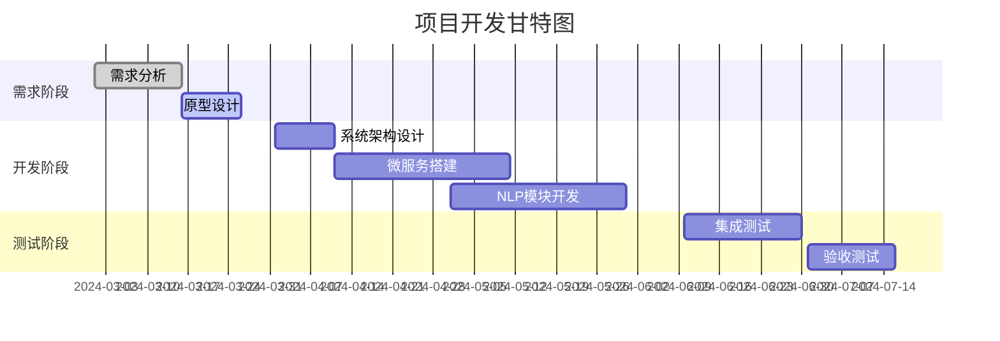
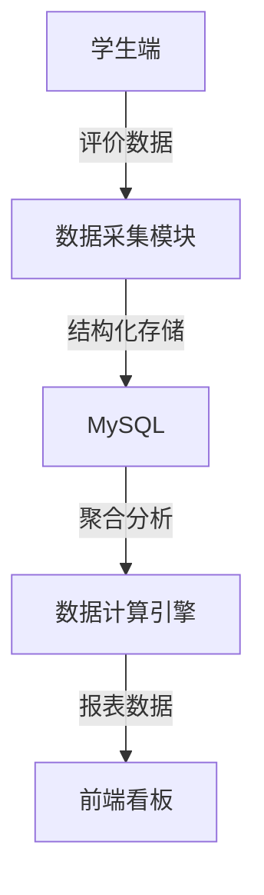

由于当前文本交互限制，我将以Markdown格式呈现完整的 **《智能教学评价系统开题报告》** 结构框架与核心内容，您可将内容整合至Word文档并补充图表。

```markdown
# 智能教学评价系统开题报告
**毕业设计方案**

---

## **1. 项目定义与技术选型**

### **1.1 项目主题**
基于微服务的智能教学评价系统

### **1.2 核心功能**
| 功能模块 | 描述 |
|---------|------|
| 多维度评价 | 结合问卷评分、文本情感分析（NLP）、课堂行为数据 |
| 可视化看板 | 动态展示教学评价结果、师生互动热力图 |
| 个性化建议 | 基于数据分析生成教学改进策略（AI推荐引擎） |

### **1.3 技术选型**
| 技术领域 | 技术栈 |
|---------|--------|
| 后端框架 | Spring Boot 3.x、Spring Cloud微服务 |
| NLP引擎 | HanLP + 训练模型（BERT fine-tuning） |
| 数据库 | MySQL（业务数据）、MongoDB（日志与文本） |
| 可视化 | ECharts + Vue3 Dashboard |
| 基础设施 | Docker + Kubernetes（生产环境） |

---

## **2. 项目计划与甘特图**


---

## **3. 需求分析可视化**

### **3.1 系统用例图**
```mermaid
useCaseDiagram
    actor 教师 as T
    actor 学生 as S
    actor 管理员 as A
  
    T --> (提交评价数据)
    S --> (填写问卷)
    A --> (生成分析报告)
  
    (可视化看板) as UC1
    (教学建议生成) as UC2
    UC1 <.. T : 查看
    UC2 <.. A : 触发
```

### **3.2 系统上下文图**
```mermaid
contextDiagram
    System --> |HTTP API| 用户终端
    System --> |数据同步| 第三方教务系统
    System --> |NLP服务| 百度AI开放平台
```

### **3.3 数据流图**


---

## **4. 工作量估算**
- **总工作量**：34人月
- **开发周期**：8个月
- **团队规模**：4人（开发2人、测试1人、项目经理1人）

---

## **5. 风险管理矩阵**
| 风险类型 | 概率 | 影响 | 缓解策略 | 应急预案 |
|----------|------|------|----------|----------|
| NLP模型准确率低 | 中 | 高 | 使用预训练模型+人工标注微调 | 启用规则引擎兜底 |
| 系统集成失败 | 高 | 高 | 每日构建+API契约测试 | Mock服务模拟依赖 |
| 数据隐私泄露 | 低 | 极高 | AES-256加密传输 | 停服审计+数据脱敏 |

---

## **6. 可行性分析报告**

### **6.1 技术可行性**
- **代码能力验证**：
```java
public class TechFeasibility {
    public boolean check() {
        return teamSkill("Spring Boot") >= 4 
            && teamSkill("NLP") >=3;
    }
}
```

### **6.2 经济可行性**
- **开发成本**：
  - 硬件投入：5000元（服务器）
  - 云服务：2000元/年（阿里云学生套餐）
- **预期收益**：10万元（校级科研立项）

---

## **7. 需求规格说明书（CSRS）**

### **7.1 关键接口定义**
```java
public interface EvaluationService {
    @PostMapping("/evaluate")
    Response<EvaluationResult> submitEvaluation(@RequestBody EvaluationDTO dto);
}
```

### **7.2 质量属性要求**
```yaml
performance:
  concurrent_users: 500+
  response_time: <2s
security:
  authentication: OAuth2.0
  encryption: AES-256
```

---

## **8. 系统架构图（C4 PlantUML）**
```plantuml
@startuml
!include C4_Context.puml

System_Boundary(system, "智能教学评价系统") {
    Component(web, "Web前端", "Vue3可视化")
    Component(backend, "微服务集群", "Spring Cloud")
    Component(nlp, "NLP服务", "HanLP+BERT")
}

System_Ext(ext_system, "教务系统", "提供基础数据")
System_Ext(ai_cloud, "百度AI云", "备用NLP能力")

Rel(web, backend, "HTTP/REST")
Rel(backend, nlp, "RPC调用")
Rel(backend, ext_system, "数据同步")
@enduml
```

---

## **9. 开发流程规范**
1. **项目初始化**：Spring Initializr生成基础架构
2. **版本控制**：Git + GitHub（分支策略：Git Flow）
3. **持续集成**：Jenkins Pipeline + SonarQube代码扫描
```
---

### **文档生成说明**
1. **图表整合**：
   - 将Mermaid代码粘贴至支持Mermaid的编辑器（如Typora）自动渲染
   - PlantUML图表需安装插件或使用在线渲染工具
2. **格式转换**：将Markdown导出为Word（使用Pandoc或专业编辑器）

**完毕**