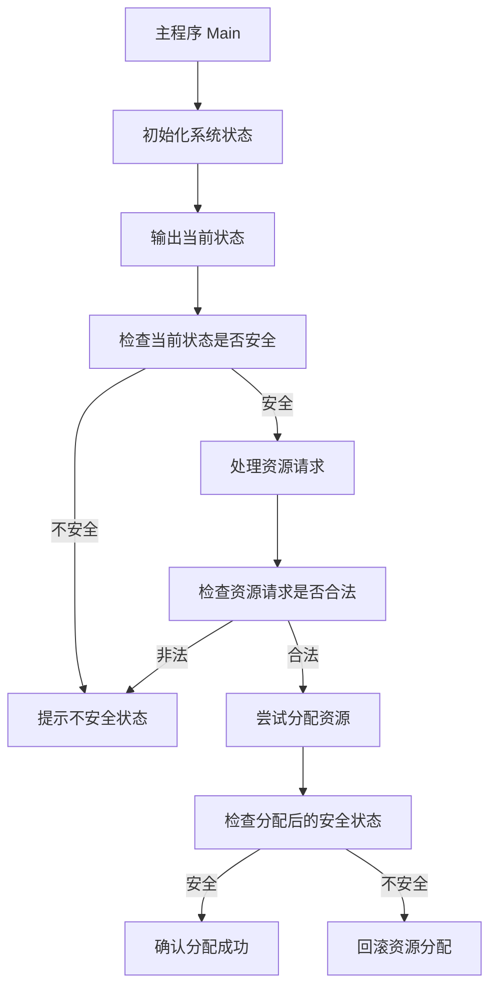
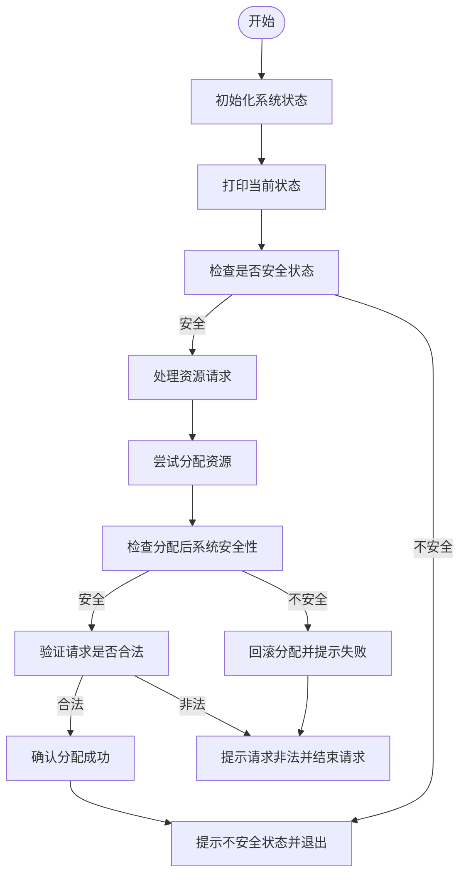

### 详细描述

该程序实现了银行家算法，用于分配有限资源，同时确保系统不会进入不安全状态。其核心功能包括：

1. **系统初始化**：设置资源的分配矩阵 (`Allocation`)、需求矩阵 (`Need`) 和可用资源向量 (`Available`)。
2. **安全性检查**：通过 `isSafeState` 函数判断当前状态是否安全。
3. **资源请求处理**：通过 `requestResource` 函数尝试满足某进程的资源请求，并在不安全时回滚分配。
4. **打印状态**：通过 `printState` 函数输出当前系统状态。

---

### 数据结构与变量定义

#### 全局变量

1. **`NUM_PROCESSES`**：进程数量。
2. **`NUM_RESOURCES`**：资源种类数量。
3. **`Allocation`**：二维数组，记录每个进程当前占用的资源数量。
4. **`Need`**：二维数组，记录每个进程剩余的资源需求。
5. **`Available`**：一维数组，记录系统当前可用的资源数量。

#### 函数说明

1. **`printState()`**：
    
    - 功能：输出 `Available`、`Allocation` 和 `Need` 的当前状态。
    - 参数：无。
    - 返回值：无。
2. **`isSafeState(bool showDetails = true)`**：
    
    - 功能：检查系统当前状态是否安全。
    - 参数：
        - `showDetails`：是否输出检查过程的详细信息。
    - 返回值：
        - `true`：安全状态。
        - `false`：不安全状态。
3. **`requestResource(int process, int request[])`**：
    
    - 功能：尝试为指定进程分配资源，并检查分配后的系统安全性。
    - 参数：
        - `process`：进程编号。
        - `request[]`：请求资源数组。
    - 返回值：
        - `true`：分配成功且系统安全。
        - `false`：分配失败或系统不安全。

---

### 程序功能结构图



---

### 流程图的 Mermaid 代码



---

### 示例代码的解析与扩展

#### 示例变量与状态初始化：

当前状态为：

```plaintext
Available: 1 6 2 2
Allocation:
P0: 0 0 3 2
P1: 1 0 0 0
P2: 1 3 5 4
P3: 0 3 3 2
P4: 0 0 1 4
Need:
P0: 0 0 1 2
P1: 1 7 5 0
P2: 2 3 5 6
P3: 0 6 5 2
P4: 0 6 5 6
```

#### 示例请求：

进程 `P2` 请求资源 `[1,2,2,2]`。请求合法性验证：

1. **是否超出需求矩阵 `Need[2][*]`**：通过。
2. **是否超出可用资源 `Available[*]`**：通过。
3. **检查分配后的系统安全性**：最终安全状态为 **安全**。

输出：

```plaintext
资源分配成功，系统状态安全。
```

可以通过修改初始化数据，测试其他安全和不安全情况。