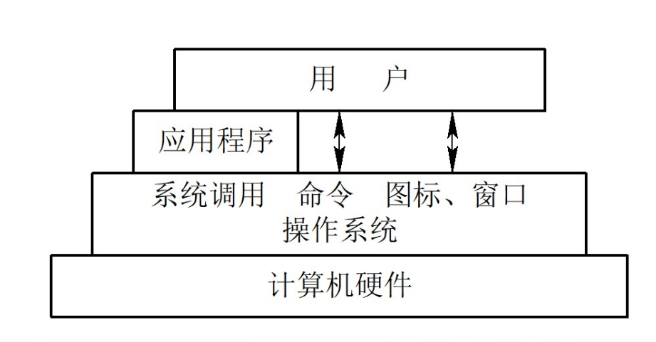

---
tags:
  - 学校课程/操作系统
  - 学校课程/OS
---

---

# 操作系统概论
## 一、目的与作用
### （一）目标

#### 1. 有效性

1. 提高系统资源利用率
2. 提高系统吞吐量
	- 解释：计算机**单位时间内能处理的信息（吞吐量）** 越多越好
#### 2. 方便性

1. 配置OS后可以使计算机更容易使用
	- 如：智能家居等，这些智能设备通过APP集成在一起，可以通过终端进行管理
#### 3. 可扩充性

1. 计算机硬件与体系结构随**VLSI技术（超大规模计算机集成技术）** 与计算机技术的发展而得到迅速发展，同时，他们也对OS提出了更高的功能与性能要求
	- 如：初代计算机集成了1.88万个晶体管，其只能完成加减乘除操作，而随着技术的发展，现今的计算机集成的晶体管以亿为单位，其功能也更加完备，性能也更优秀
#### 4. 开放性

1. 开放性是指能遵循世界标准规范，特别是遵循**开放系统互联（OSI）** 国际标准
	- 不互联的代表：如充电器等，每个品牌的功率都不同，手机快充功能也是相应手机厂商自家充电器独有，换用其他厂商的充电器就无法实现快充功能了
### （二）作用
#### 1. OS作为用户与计算机硬件系统之间的接口

- 应用程序都是通过操作系统间接地使用硬件
- 用户也可直接调用操作系统中的系统命令、系统函数等
- 图示：
#### 2. OS作为计算机系统资源的管理者

- 资源分类：[^1]
>[!tip] 重点
>1. 处理器-------**处理机管理**：用于分配与控制处理机
>2. 存储器-------**存储器管理**：负责内存的分配与回收

	
    3. I/O设备------I/O设备管理：负责I/O设备的分配与操纵
	3. 信息（即：数据和程序）-------文件管理：负责文件的存储、共享与保护
#### 3. OS实现了对计算机资源的抽象

1. 每一款CPU的指令总数都是确定的，因为在设计CPU时其指令集就已经确定了
2. 用户通过I/O软件使用 I/O 操作命令对硬件进行操作，I/O软件就与物理接口、硬件等构成了一个虚拟机，这就是OS对计算机资源的抽象实现
3. 图示：
### （三）推动OS发展的主要动力

1. 不断提高计算机资源的利用率
2. 方便用户
3. 器件的不断更新迭代
	- 如：高集成度的硬件，多内核CPU的出现
4. 计算机体系结构的不断发展
5. 不断提出的新的应用需求
	- 计算机与各行各业结合：智能驾驶（计算机+新能源汽车）、大疆（计算机+无人机）等
	- **特别是与新兴行业结合，形成新产业，迎合新需求**
	- ***行业前景：计算机行业赋能传统行业***
## 二、发展过程
### （一）无操作系统的计算机系统

#### 1. 人工操作方式

##### （1）如何操作

- 由程序员将事先已穿孔(对应于程序和数据)的纸带(或卡片)装入纸带输入机(或卡片输入机)，再启动它们将程序和数据输入计算机，然后启动计算机运行。当程序运行完毕并取走计算结果之后，才让下一个用户上机。
##### （2）缺点

1. 用户独占全机。此时，计算机及其全部资源只能由上机用户独占。
2. CPU等待人工操作。当用户进行装带(卡)、卸带(卡)等人工操作时，CPU及内存等资源是空闲的。**CPU利用率低**。
#### 2. 脱机输入/输出方式

- 设备：
	1. 主机：计算机； 
	2. 外围机：负责将数据输入给CPU的机器，且价格比主机便宜得多
		- 输入方式：通过外围机，将纸带（卡片）上的程序（数据）输入到磁带上，当CPU需要这些数据时就从磁带上高速读取并调入内存，**是否需要执行磁带上的程序由人工决定**
		- 相较于人工操作方式，提高了输入输出效率，及CPU的工作效率、利用效率
- 图示：
### （二）单道批处理系统

#### 1. 处理过程

- **主机里一次只能放一个程序**，但可以使用一个**监督程序**，在监督程序的控制下，将磁盘中的程序**依次自动化**地放入到主机中进行处理
- 图示：
#### 2. 特征

1. 自动性：在顺利情况下，在磁带上的一批作业能自动地逐个地依次运行，而无需人工干预。
2. 顺序性：磁带上的各道作业是顺序地进入内存，各道作业的完成顺序与它们进入内存的顺序，在正常情况下应完全相同，亦即先调入内存的作业先完成。
3. 单道性：内存中仅有一道程序运行，即监督程序每次从磁带上只调入一道程序进入内存运行，当该程序完成或发生异常情况时，才换入其后继程序进入内存运行。
4. 资源利用不充分
	- 如：内存利用不充分，每次运行程序只能从磁盘中依次读入程序，并不能完全利用主机内存
	- 充分利用主机内存的例子：程序均存在于主机内存中，且读取速度比从磁盘读取快得多
### （三）多道批处理系统

```
目前的计算机仍是多道批处理模式
```
#### 1. 处理方式

- 用户提交的作业都先存放在外存上，并排成一个队列，称为“后备队列”；然后由作业调度程序按一定算法来从后备队列中选择若干个作业调入内容；使它们共享CPU与系统中的各种资源。
- 图示：
- 单道与多道的区别：单道批处理-------串行，即：一个一个来； 多道批处理：在一个程序不需要CPU进行计算时，另一个程序可以用CPU进行计算，提高了CPU的利用率
- 程序的运行流程：…………-->计算-->输入输出-->…………[^4]
	- 计算占比多的称为计算型程序
	- 输入输出占比多的称为I/O型程序（即：输入输出型程序）
#### 2. 好处

1. 提高CPU的利用率
2. 可提高内存和I/0设备利用率
3. 增加系统吞吐量。
#### 3. 优缺点

```
虽然早在20世纪60年代就已出现了多道批处理系统，但至今它仍是三大基本操作系统类型之一。
```
##### （1）优点

1. 资源利用率高。由于在内存中驻留了多道程序，它们共享资源，可保持资源处于忙碌状态，从而使各种资源得以充分利用。
2. 系统吞吐量大。
	- 系统吞吐量是指系统在单位时间内所完成的总工作量。
	- 能提高系统吞吐量的主要原因可归结为:
		1. CPU和其它资源保持“忙碌”状态;
		2. 仅当作业完成时或运行不下去时才进行切换，系统开销小。
##### （2）缺点

1. 平均周转时间长。在批处理系统中，由于作业要排队，依次进行处理，因而作业的周转时间较长，通常需几个小时，甚至几天。
	- 作业的周转时间是指从作业进入系统开始，直至其完成并退出系统为止所经历的时间。
2. 无交互能力。用户一旦把作业提交给系统后，直至作业完成，用户都不能与自己的作业进行交互，这对修改和调试程序是极不方便的。
#### 4. 需要解决的问题

1. 处理机管理问题。在多道程序之间，应如何分配被它们共享的处理机，使CPU既能满足各程序运行的需要，又能提高处理机的利用率，以及一旦把处理机分配给某程序后又应在何时收回等一系列问题，属于处理机管理问题。
2. 内存管理问题。应如何为每道程序分配必要的内存空间，使它们“各得其所”且不致因相互重叠而丢失信息，以及应如何防止因某道程序出现异常情况而破坏其它程序等问题，就是内存管理问题。
	- 即：处理好每个程序占用的内存空间及内存空间编号，知道哪些内存空间还没被占用，避免两道程序的内存空间相互重叠
3. I/O设备管理问题。系统中可能具有多种类型的IO设备供多道程序所共享，应如何分配这些IO设备，如何做到既方便用户对设备的使用，又能提高设备的利用率，这就是IO设备管理问题。
	- 操作系统中大部分代码是用于解决I/O设备的管理问题，解决了操作系统对I/O设备的适配问题，但绝大多数I/O设备及其系统程序适配管理用不到，可能有很大的内存冗余占用
4. 文件管理问题。在现代计算机系统中，通常都存放着大量的程序和数据(以文件形式存在)，应如何组织这些程序和数据，才能使它们既便于用户使用，又能保证数据的安全性和一致性，这些属于文件管理问题。
	- 文件的打开，关闭，占用内存问题
5. 作业管理问题。对于系统中的各种应用程序，其中有的属于计算型，即以计算为主的程序;有的属于IO型即以IO为主的程序;又有些作业既重要又紧迫;而有的作业则要求系统能及时响应，这时应如何组织这些作业，这便是作业管理问题。
6. 用户与系统的接口问题。
	- 例如：Mac系统与Windows系统的差异化
### （四）分时系统

```
现在的操作系统既有分时系统的特征，又有多道批处理系统的特征
```
- 能将一台计算机提供给多个用户使用，提高计算机的利用率。它经常被应用于查询系统中（例如订票查询等），满足许多查询用户的需要。
	- 用户需求表现如下：
		1. 人-机交互
		2. 共享主机
#### 1. 实现分时系统的关键问题

1. 及时接收
2. 及时处理
#### 2. 特征

1. 多路性。允许在一台主机上同时联接多台联机终端，系统按分时原则为每个用户服务。宏观上， 是多个用户同时工作， 共享系统资源； 而微观上， 则是每个用户作业轮流运行一个时00间片。
2. 独立性。每个用户各占一个终端， 彼此独立操作，互不干扰。因此， 用户所感觉到的， 就像是他一人独占主机。
3. 及时性。用户的请求能在很短的时间内获得响应。此时间间隔是以人们所能接受的等待时间来确定的， 通常仅为1~3秒钟。
4. 交互性。用户可通过终端与系统进行广泛的人机对话。其广泛性表现在： 用户可以请求系统提供多方面的服务，如文件编辑、数据处理和资源共享等。

### （五）实时系统

>[!tip] tip
>实时系统中，时间是关键参数；通常把用于实时控制的系统称为实时系统。
#### 1. 实时系统分类

1. 工业（武器）控制系统
2. 信息查询系统
3. 多媒体系统
4. 嵌入式系统
#### 2. 实时任务分类

1. 周期性实时任务和非周期性实时任务
2. 硬实时任务和软实时任务
#### 3. 特征（与分时系统比较）

1. 多路性。**实时信息处理系统**也按分时原则为多个终端用户服务。**实时控制系统**的多路性则主要表现在系统周期性地对多路现场信息进行采集，以及对多个对象或多个执行机构进行控制。而分时系统中的多路性则与用户情况有关时多时少。
2. 独立性。实时信息处理系统中的每个终端用户在向实时系统提出服务请求时，是彼此独立地操作，互不干扰:而实时控制系统中，对信息的采集和对对象的控制也都是彼此互不干扰。
3. 及时性。实时信息处理系统对实时性的要求与分时系统类似，都是以人所能接受的等待时间来确定的;而实时控制系统的及时性，则是以控制对象所要求的开始截止时间或完成截止时间来确定的，一般为秒级到毫秒级，甚至有的要低于100微秒。
4. 交互性。实时信息处理系统虽然也具有交互性，但这里人与系统的交互仅限于访问系统中某些特定的专用服务程序它不像分时系统那样能向终端用户提供数据处理和资源共享等服务。
5. 可靠性。分时系统虽然也要求系统可靠，但相比之下，实时系统则要求系统具有**高度的可靠性**。因为任何差错都可能带来巨大的经济损失，甚至是无法预料的灾难性后果所以在实时系统中，往往都采取了多级容错措施来保障系统的安全性及数据的安全性。

#### 4. 分时系统实现的关键问题

1. 实时控制
2. 实时信息处理
### （六）微机(PC)操作系统的发展
#### 1. 单用户单任务操作系统

- 只允许一个用户上机，且同一时间内只允许一个用户程序运行，即：不能同时执行听歌和写代码这两个操作
##### （1）代表

1. CP/M
2. MS-DOS：MS-DOS(MS：微软；Disk Operating System：磁盘操作系统)
	- 从80年代到90年代初，由于**MS-DOS**性能优越受到当使用户的广泛欢迎，称为**事实上的16位单用户单任务操作系统标准**
#### 2. 单用户多任务操作系统

- 2001年微软发布了Windows XP，并在此后相当长的一段时间内，成为使用最广泛的个人操作系统之一。
	- 此时同时存在32位和64位的XP操作系统，但**32位操作系统的用户更多**
#### 3. 多用户多任务操作系统

- 在32位微机上，最有代表性的是**UNIX OS**-------美国电报电话公司的Bell实验室在1969~1970年期间开发
	- 在此基础上开发出了AIX系统------IBM的UNIX系统
- 在1980年前后，人们将UNIX第7版移植到Motorola公司的MC 680xx微机上，后来又将UNIX V7.0版本简化后移植到Intel 8080上，将其称为**Xenix**。
	- 现在最优影响的两个能在微机上运行的UNIX操作系统变形是**Solaris OS**和**Linux OS**
		- Solaris OS：最初是SUN公司于1982年推出SUN OS 1.0，运行在MOTOROLA 680X0平台上的UNIX OS，在1988年宣布的SUN OS 4.0将运行平台从早期的MOTOROLA平台迁移到SPARC平台（SUN公司开发的RISC架构）
		- Linux OS
			- 目前安卓机的底层OS就是Linux
## 三、基本特性
### (一) *并发*（最重要的特性）[^2]

>[! tip] tips
>并发在单任务中用不到，但在多任务中很重要
#### 1. 并发与并行的区别[^3]
##### （1）并行

- 多个程序在多个CPU上运行
- 例如：A程序在1号CPU上运行，B程序在2号CPU上运行，互不干扰
##### （2）并发

- 多个程序在一个CPU上运行
- 在一段时间内多个程序在同时运行，在宏观上：这些程序在同时运行；但在微观上：每一时刻仅能有一个程序在执行，所以微观上这些程序只能是分时地交替执行（轮转调度法）
### （二）引入进程

- 定义：所谓**进程**，是指在系统中能独立运行并作为资源分配的基本单位，它是由一组机器指令、数据和堆栈等组成的，是一个能独立运行的活动实体
- 作用：若对内存中的多个程序都分别建立一个**进程**，它们就可以并发执行，这样就能极大地提高系统资源的利用率，增加系统的吞吐量
### （三）引入线程

- 通常在一个进程中可以包含若干个线程，它们可以利用进程所拥有的资源。在引入线程的OS中，通常都是把进程作为分配资源的基本单位，而把线程作为独立运行和独立调度的基本单位。由于线程比进程更小，基本上不拥有系统资源，故对它的调度所付出的开销就会小得多，能更高效地提高系统内多个程序间并发执行的程度。因而近年来推出的通9用操作系统都引入了线程，以便进一步提高系统的并发性，并把它视作现代操作系统的一个重要标致。
### （四）共享
#### 1. 互斥共享

- 定义：一段时间内，只允许一个进程访问该资源
#### 2.同时访问方式-----非互斥共享

- 定义：允许在同一时间内由多个进程“**同时**”对它们进行访问；这里的同时是**宏观**意义上的，在**微观意义上，这些进程对该资源的访问是交替进行的**。
### （五）虚拟（Virtual）
#### 1. 时分复用技术

#### 2. 空分复用技术

### （六）异步（Asynchronism）


## 四、主要功能

## 五、OS结构设计


[^1]: 考察重点1：处理机管理与存储器管理
[^2]: 操作系统最重要的特性
[^3]: 重点区分并行和并发，不要搞混了
[^4]: 所有程序的基本流程