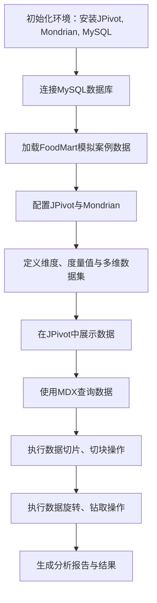

好的，下面是根据你提供的内容，实验原理和技术路线图的描述，包含使用Mermaid语法的流程图。

### 实验原理

本实验的目标是使用**JPivot**与**Mondrian**，结合**MySQL**数据库，基于FoodMart模拟案例实现以下操作：

1. **创建多维数据集**：
   - 使用JPivot和Mondrian搭建OLAP模型。
   - 基于FoodMart案例，完成数据库中的维度（例如：时间、站点、用户IP等）、度量值（如：访问量）以及多维数据集的创建。

2. **数据查询与分析**：
   - 使用**MDX（多维表达式）**语言对数据进行查询。
   - 实现**切片**、**切块**、**旋转**、**钻取**等操作，以对多维数据进行深入分析。

### 技术路线图

以下是实验流程的技术路线图，展示从创建多维数据集到数据查询与分析的步骤。

### 解释

1. **初始化环境**：首先在本地环境中安装JPivot、Mondrian和MySQL数据库。
2. **连接MySQL数据库**：通过JDBC连接MySQL，并加载FoodMart模拟案例数据库。
3. **配置JPivot与Mondrian**：设置Mondrian的OLAP引擎配置，使JPivot能够正确访问和查询OLAP数据。
4. **定义多维数据集**：在Mondrian中定义多维数据模型，包括维度（时间、站点、用户IP等）和度量值（访问量）。
5. **在JPivot中展示数据**：在JPivot中使用配置好的多维数据集展示数据。
6. **使用MDX查询**：使用MDX查询语言对数据进行查询操作，提取具体的数据视图。
7. **执行数据切片、切块**：通过切片和切块操作，查看特定维度或度量的部分数据。
8. **执行旋转与钻取操作**：利用JPivot对数据进行旋转（转换维度）和钻取（查看更详细层次数据）操作。
9. **生成分析报告**：对实验结果进行总结和分析，完成实验报告。

这个技术路线图为实验的执行提供了一个清晰的框架，帮助你理解各个操作步骤之间的关系。