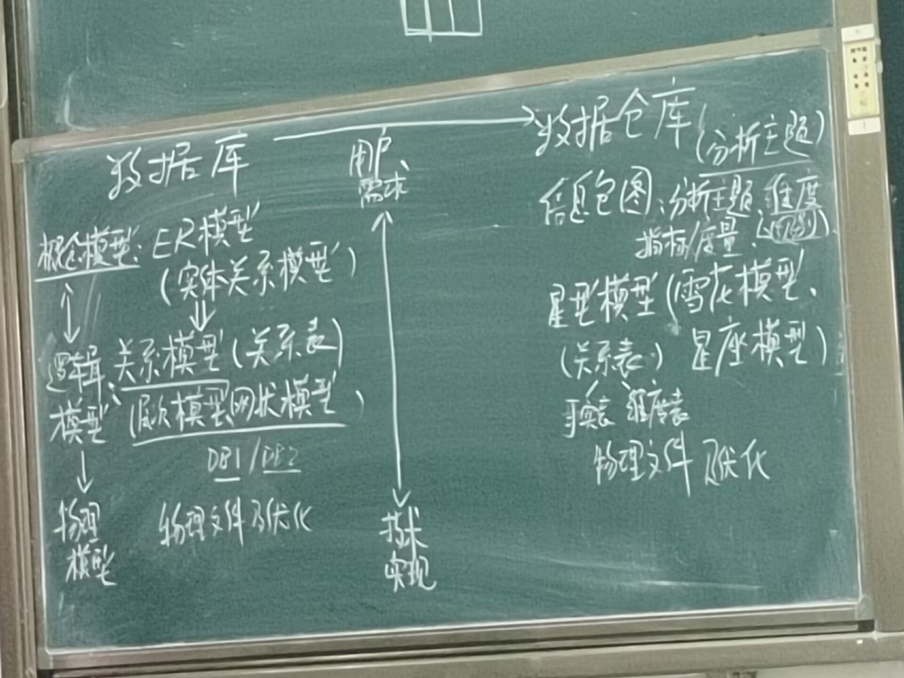
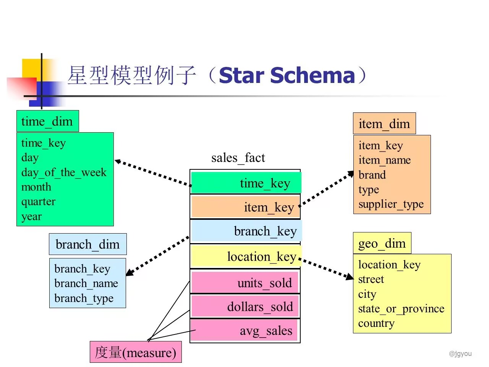

# 元数据

---

## 一、定义

- 元数据：是关于**数据**的**数据**
	- 第一个数据指的是**实际的数据**
	- 第二个数据指的是**对该实际数据的描述性数据（含义、定义等）**
- 数据仓库的所有数据都要通过元数据来管理和控制。元数据描述关于源数据的说明，包括源数据的来源、源数据的名称、源数据.的定义、源数据的创建时间等对源数据进行管理所需要的信息。
- 源数据的来源说明源数据是从哪个系统、哪个历史数据、哪个办公数据、哪个Web页、哪个外部系统抽取而来。源数据说明源数据在数据仓库的作用、用途、数据类型和长度等。
## 二、分类

1. 技术元数据
2. 业务元数据

- 数据血缘关系：由原数据推导至最终数据的过程中产生的所有数据，都称为与最终数据存在血缘关系
	- 数据血缘也称为数据血统或谱系，是来描述数据的来源和派生关系。数据来源是数据科学的关键，也是被公认为数据信任的核心的部分。说白了就是这个数据是怎么来的，经过了哪些过程或阶段，从哪些表，哪些字段计算得来的。

- 数据仓库与数据库在用户需求和技术实现方面的区别：
- 星型模型：