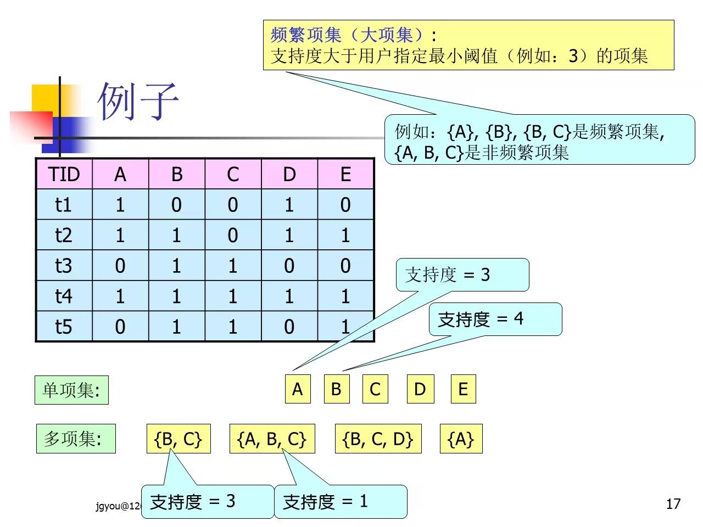
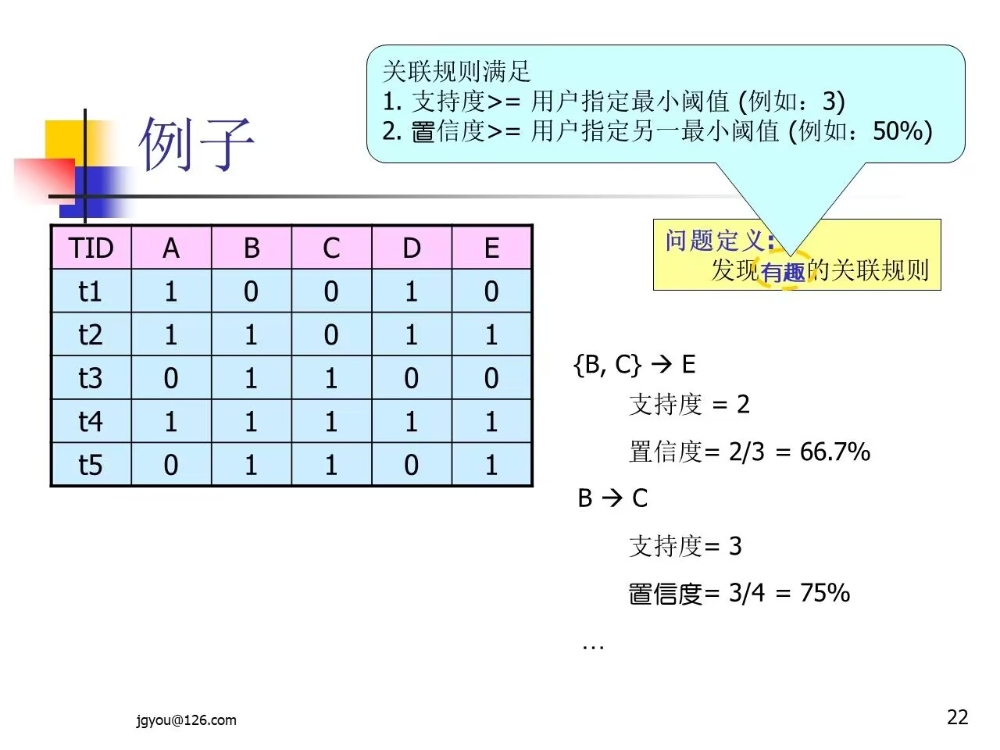

# 关联规则挖掘

---

### 一、简介

#### 应用领域

1. 超市购物篮分析
2. Web挖掘
3. 生物信息网络
4. 社交网络分析
5. ...

#### 经典范例

- 购物篮（Market Basket）分析。通过发现顾客放入购物篮中商品之间的同线关系来分析顾客的购买习惯，从而实现商品的交叉销售和推荐
### 二、定义
#### 定义1

- 项的集合称为项集（Itemset），包含`k`个项的项集称之为`k-项集`
#### 定义2

- 关联规则是形如 $A\rightarrow B$ 的蕴含式，这里 $A\subset I$，$B\subset I$，并且 $A\cap B = \phi$
#### 定义3：规则的支持度

- 规则 $A\rightarrow B$ 在`数据库D`中具有`支持度S`，表示`S`是`D`中事务同时包含`AB`的百分比，它是概率`P(AB)`，即：$$S(A\rightarrow B)=P(AB)=\frac{|AB|}{|D|}$$
	- 其中`|D|`表示`事务数据库D`的事务总个数，表示`A、B`两个项集同时发生的事务个数
	- 即：`前置项A`和`后置项B`的并集所出现的次数在`总事务记录数D`中的占比
#### 定义4：规则的置信度

- 规则 $A\rightarrow B$ 也有置信度`C`，表示`C`是包含`项集A`的同时也包含`项集B`，相对于包含`A项集`的百分比，这是条件概率`P(B|A)`，即：$$C(A\rightarrow B)=P(B|A)=\frac{|AB|}{|A|}$$
	- `前置项A`和`前置项B`的并集所出现的次数在`前置项A`所出现次数中的占比
	- 其中`|A|`表示数据库中包含`项集A`的事务个数
#### 定义5：阈值

- 在事务数据库中找出有用的关联规则，需要由用户确定两个阈值：最小支持度（min_sup）和最小置信度（min_conf）
#### 定义6

- 如果项集满足最小支持度，则它称之为**频繁项集**（Frequent Itemset）
#### 定义7：强关联规则

- 同时满足最小支持度（min_sup）和最小置信度（min_conf）的规则称之为强关联规则，即：$$S(A\rightarrow B)>min\_sup且C(A\rightarrow B)>min\_conf$$
- 成立时，规则称之为**强关联规则**

#### 例子说明：

1. 
2. 
3. 
