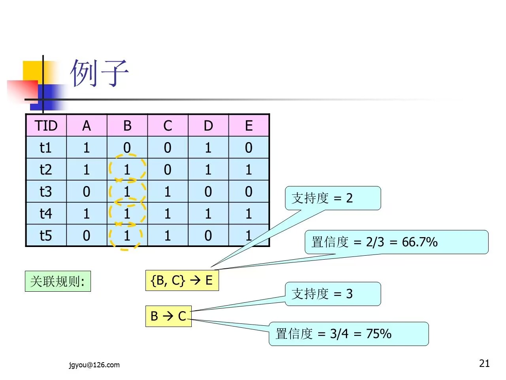

# 关联规则挖掘

---

### 一、简介

- 若两个或多个数据项的取值之间重复出现并且概率很高时，它就存在某种关联，可以建立起这些数据项的关联规则
- 关联规则反映一个事物和其他事物之间的相互依存性和关联性。如果两个或者多个事物之间存在一定的关联关系，那么，其中一个事物发生就能够预测与它相关联的其他事物的发生
#### 应用领域

1. 超市购物篮分析
2. Web挖掘
3. 生物信息网络
4. 社交网络分析
5. ...

#### 经典范例

- 购物篮（Market Basket）分析。通过发现顾客放入购物篮中商品之间的同线关系来分析顾客的购买习惯，从而实现商品的交叉销售和推荐
### 二、定义
#### 定义1

- 项的集合称为项集（Itemset），包含`k`个项的项集称之为`k-项集`
#### 定义2

- 关联规则是形如 $A\rightarrow B$ 的蕴含式，这里 $A\subset I$，$B\subset I$，并且 $A\cap B = \phi$
#### 定义3：规则的支持度

- 规则 $A\rightarrow B$ 在`数据库D`中具有`支持度S`，表示`S`是`D`中事务同时包含`AB`的百分比，它是概率`P(AB)`，即：$S(A\rightarrow B)=P(AB)=\frac{|AB|}{|D|}$
	- 其中`|D|`表示`事务数据库D`的事务总个数，表示`A、B`两个项集同时发生的事务个数
	- 即：`前置项A`和`后置项B`的并集所出现的次数在`总事务记录数D`中的占比
#### 定义4：规则的置信度

- 规则 $A\rightarrow B$ 也有置信度`C`，表示`C`是包含`项集A`的同时也包含`项集B`，相对于包含`A项集`的百分比，这是条件概率`P(B|A)`，即：$C(A\rightarrow B)=P(B|A)=\frac{|AB|}{|A|}$
	- `前置项A`和`前置项B`的并集所出现的次数在`前置项A`所出现次数中的占比
	- 其中`|A|`表示数据库中包含`项集A`的事务个数
#### 定义5：阈值

- 在事务数据库中找出有用的关联规则，需要由用户确定两个阈值：最小支持度（min_sup）和最小置信度（min_conf）
#### 定义6

- 如果项集满足最小支持度（$支持度\geq min_sup$），则它称之为**频繁项集**（Frequent Itemset）
#### 定义7：强关联规则

- 同时满足最小支持度（min_sup）和最小置信度（min_conf）的规则称之为强关联规则，即：$S(A\rightarrow B)\geq min\_sup且C(A\rightarrow B)\geq min\_conf$
- 成立时，规则称之为**强关联规则**

#### 例子说明：

1. 
	- 纠错：支持度大于等于支持度最小阈值（min_sup）的才是**频繁项集**
1. 
2. 

### 三、Apriori算法

```
地位：十大经典数据挖掘算法之一
```
#### 特点：先验性质

1. 频繁项集的**子集**一定是频繁项集
2. 非频繁项集的**超集**一定是非频繁项集
	- 超集：以该集合为子集的集合
		- 如：现有`集合{A，B}`，其子集为：`{A}`，`{B}`，超集为：`{A，B，C，...}`
#### 应用例子：


- 找`频繁K+1项集`：将`频繁K-项集`两两连接（有相同项才能连接）后再剪枝
#### 算法过程：更优算法

- Apriori使用一种称作逐层搜索的迭代方法，`K-项集`用于探索`K+1-项集`
1. 首先，找出`频繁1-项集`的集合。该集合记作 $L_1$。$L_1$ 用于找`频繁2-项集`的集合 $L_2$，而 $L_2$ 用于找 $L_3$ 
2. 如此下去，直到不能找到`K-项集`。找每个 $L_K$ 都需要一次数据库扫描
#### 具体实践：

- 查找过程：$C_1\stackrel{counting}{\longrightarrow} L_1\stackrel{先连接再剪枝，边匹配边剪枝}{\longrightarrow} C_2\stackrel{counting}{\longrightarrow} L_2\rightarrow ...$
- 
	- 如：$L_2\rightarrow C_3$ 过程中，先用`2项集{A，C}和{B，C}`进行连接，连接结果为：`{A，B，C}`，其支持度（sup）为`1`，小于最小支持度（min_sup），所以将该 $C_3$ 剪枝，其他步骤以此类推