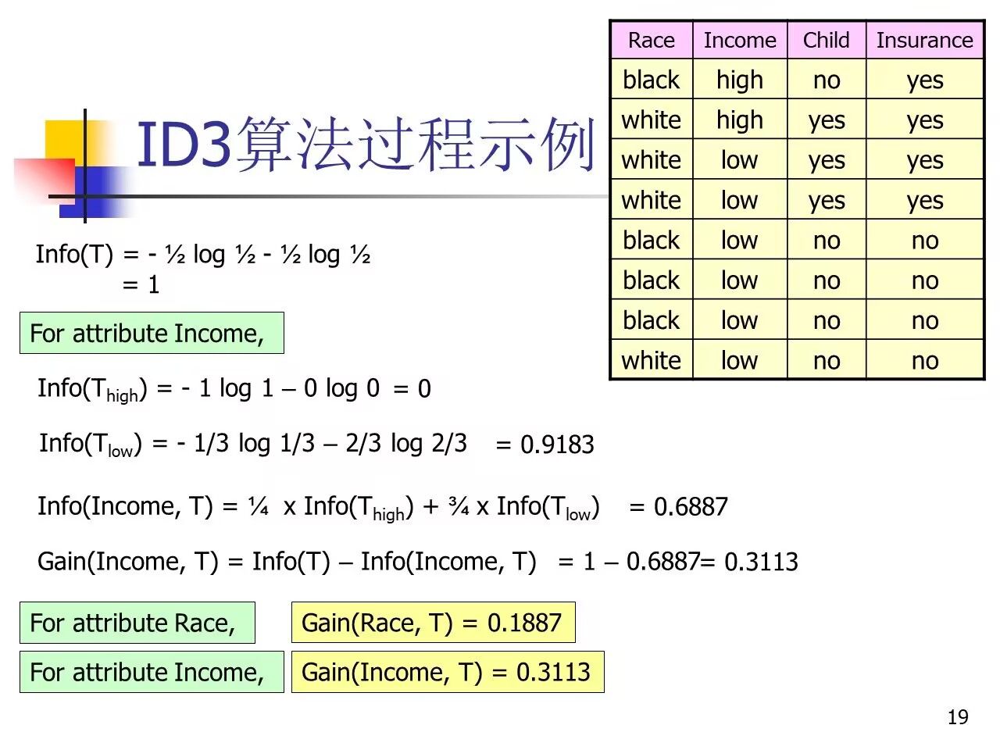

# 分类

---

### 一、决策树分类
### 数据挖掘的原理

数据挖掘的核心是从数据中提取隐藏的模式和信息，其基本原理包括以下几点：

1. **统计学原理**：基于概率分布、假设检验等方法进行推断和预测。
2. **机器学习原理**：通过数据训练模型，包括监督学习（分类、回归）和无监督学习（聚类、降维）。
3. **搜索与优化**：在搜索空间中寻找最优模式，例如在关联规则挖掘中寻找支持度和置信度最高的规则。
4. **数据库技术**：利用SQL查询、OLAP等工具高效处理和存储数据。

以下是针对决策树、关联挖掘和聚类分析三种方法的具体分析。

---

### 决策树算法的原理

决策树是一种基于树状结构的分类或回归方法，其原理包括以下核心步骤：

1. **特征选择**：
    
    - 目标是选择最优特征分裂数据，使得每次分裂后节点的纯度最大。
    - 常用评价指标：
        - **信息增益**（ID3）：衡量通过特征分裂后，信息不确定性减少的程度。 $\text{信息增益} = H(D) - \sum_{i=1}^k \frac{|D_i|}{|D|} H(D_i)$
        - **信息增益比**（C4.5）：修正信息增益的偏向问题，避免过多选择取值多的特征。 $\text{信息增益比} = \frac{\text{信息增益}}{\text{特征熵}}$
        - **基尼指数**（CART）：评估节点纯度，基尼指数越小，节点越纯。$\text{基尼指数} = 1 - \sum_{i=1}^C p_i^2$
2. **树的构建**：
    
    - 递归分裂数据，生成内部节点和叶子节点。
    - 停止条件：
        - 节点中样本数量低于设定阈值。
        - 当前节点的样本纯度达到要求。
        - 预设树的最大深度。
3. **剪枝（Pruning）**：
    
    - 防止决策树过拟合，通过限制深度或合并叶子节点优化泛化能力。
    - **预剪枝**：在构建过程中提前停止分裂。
    - **后剪枝**：先构建完整树，再通过评估去除无效分枝。

---

### 关联挖掘的原理

关联挖掘的目标是从数据集中发现频繁模式和关联规则。其原理基于支持度和置信度的计算，以及频繁项集的挖掘：

1. **支持度与置信度**：
    
    - **支持度**（Support）：某项集在数据集中出现的频率，用于衡量模式的普遍性。 $\text{支持度} = \frac{\text{项集出现次数}}{\text{交易总数}}$
    - **置信度**（Confidence）：在包含条件项的交易中，同时包含结果项的比例，衡量规则的可靠性。$\text{置信度} = \frac{\text{条件项和结果项同时出现次数}}{\text{条件项出现次数}}$
2. **频繁项集挖掘**：
    
    - 利用支持度筛选频繁项集：
        - **Apriori算法**：基于“频繁项集的所有子集也是频繁项集”这一性质，逐层生成候选项集。
        - **FP-Growth算法**：通过构建频繁模式树避免候选项集生成，提高效率。
3. **规则生成**：
    
    - 从频繁项集中生成关联规则，计算置信度并筛选符合要求的规则。

---

### 聚类分析的原理

聚类分析是一种无监督学习方法，基于数据点之间的相似性进行分组。其原理包括以下步骤：

1. **距离度量**：
    
    - 使用距离或相似性衡量样本之间的关系：
        - 欧氏距离：适用于连续型数据。 $d(x,y)=∑i=1n(xi−yi)2d(x, y) = \sqrt{\sum_{i=1}^n (x_i - y_i)^2}$
        - 曼哈顿距离、余弦相似度等。
2. **聚类算法**：
    
    - **K均值**：
        - 随机初始化K个质心。
        - 分配每个样本到最近的质心。
        - 更新质心为簇内样本的均值，重复直到收敛。
    - **层次聚类**：
        - 自底向上：每次合并最近的两个簇。
        - 自顶向下：每次拆分最不相似的簇。
    - **密度聚类（DBSCAN）**：
        - 核心思想是找到高密度区域，并将低密度点归为噪声。
        - 参数包括`ε`（邻域半径）和`MinPts`（最小邻域点数）。
3. **评价指标**：
    
    - **组内平方和（WSS）**：度量样本到簇质心的距离。
    - **轮廓系数**：结合组内紧密性和组间分离性，取值范围为[-1, 1]。

---

### 总结

- **决策树**基于特征选择进行数据分裂，适用于分类和回归任务。
- **关联挖掘**利用频繁项集挖掘和规则生成，发现数据项之间的关联关系。
- **聚类分析**通过相似性度量对无标签数据进行分组，寻找数据的内在结构。

### 二、信息熵
#### 🌟计算公式

$H(X)=-\sum_{i=1}^{n} p(x_i)log_{p(x_i)}$
- $lim_{p\rightarrow\infty}plog_p=0$
- 范围是 $0\leq H(x)\leq logn$

信息熵越大，训练样品集越“不纯”，反之，信息熵越小，训练样品集越“纯”

### 三、ID3算法

- 例如：计算`Income`的信息熵，Insurance是我们的评判标准，所以只看这两列
- 首先看`Income`中分为`high`和`low`两种情况：
	- `Income`为`low`时，看其对应的`Insurance`的分布情况，发现这六种情况中，`yes`占2个,`no`占4个，则其信息熵为：$-\frac{1}{3}log\frac{1}{3}-\frac{2}{3}log\frac{2}{3}$
- 信息增益为：Info（T）- Info（ Income）
	- 所以信息增益越大越好
	- Info（T）只看Insurance这一列
- 信息熵越低，纯度也就越高
- $\text{信息增益率}=\frac{信息增益}{分裂信息熵}$

### 四、C4.5算法
#### 适用/改进

1. 解决`ID3算法倾向于选择特征值多的特征属性`这一问题
	- 若：以记录的`id`值为特征属性，那么就会导致`ID3`算法倾向于使用`id`作为特征属性，会导致决策树出错
2. 解决`ID3算法不能处理连续特征属性` 

### 五、Gini

Gini算法通常指基尼指数（Gini Index）或基尼系数（Gini Coefficient），这是用于衡量分类或分布不平等性的重要指标。它在数据挖掘、决策树算法、社会学和经济学中有广泛应用。以下是两种典型语境下的Gini算法及其意义：

---

#### 1. **在决策树中的Gini指数**

在机器学习中，Gini指数用于评估数据集的纯度，是一种常见的分裂评估标准，尤其在CART（Classification and Regression Tree）决策树中。它用来选择最佳分裂特征或分裂点。

##### **计算公式**：

对于一个节点 tt 的 Gini 指数：

Gini(t)=1−∑i=1nPi2Gini(t) = 1 - \sum_{i=1}^n P_i^2

其中：

- nn 是类别的数量；
- PiP_i 是类别 ii 的样本比例。

##### **特点**：

- Gini指数的值范围为 [0,0.5][0, 0.5]。值越小，节点的纯度越高；
    - Gini=0Gini = 0：表示节点中的样本完全属于一个类别（纯）。
    - Gini=0.5Gini = 0.5：表示节点中的样本在两个类别间均匀分布（最不纯）。
- 决策树通过选择 Gini 指数最小的分裂点来划分数据集。

##### **优点**：

- 计算简单高效；
- 对偏向大类样本的敏感性较低。

---

#### 2. **在经济学中的基尼系数**

基尼系数是一种用来衡量收入或财富分配不平等程度的统计指标，常用于描述社会不平等性。

##### **计算公式**：

基尼系数的数学定义基于洛伦兹曲线（Lorenz Curve），可表示为：

G=AA+BG = \frac{\text{A}}{\text{A+B}}

其中：

- A\text{A} 是洛伦兹曲线与绝对平等线之间的面积；
- A+B\text{A+B} 是三角形的总面积。

##### **特点**：

- 值范围为 [0,1][0, 1]：
    - G=0G = 0：表示完全平等（所有人收入相同）。
    - G=1G = 1：表示完全不平等（只有一个人拥有所有收入）。
- 基尼系数通常用于国家或地区的收入分配研究。

##### **应用**：

- 衡量社会不平等；
- 制定和评估社会政策。

---

#### **总结**

- **Gini指数** 在决策树算法中用于评估数据集的纯度。
- **基尼系数** 在经济学中用于衡量收入分配的不平等程度。

两者的核心思想都是衡量分布的不均匀性，但在应用场景和数学形式上有所不同。