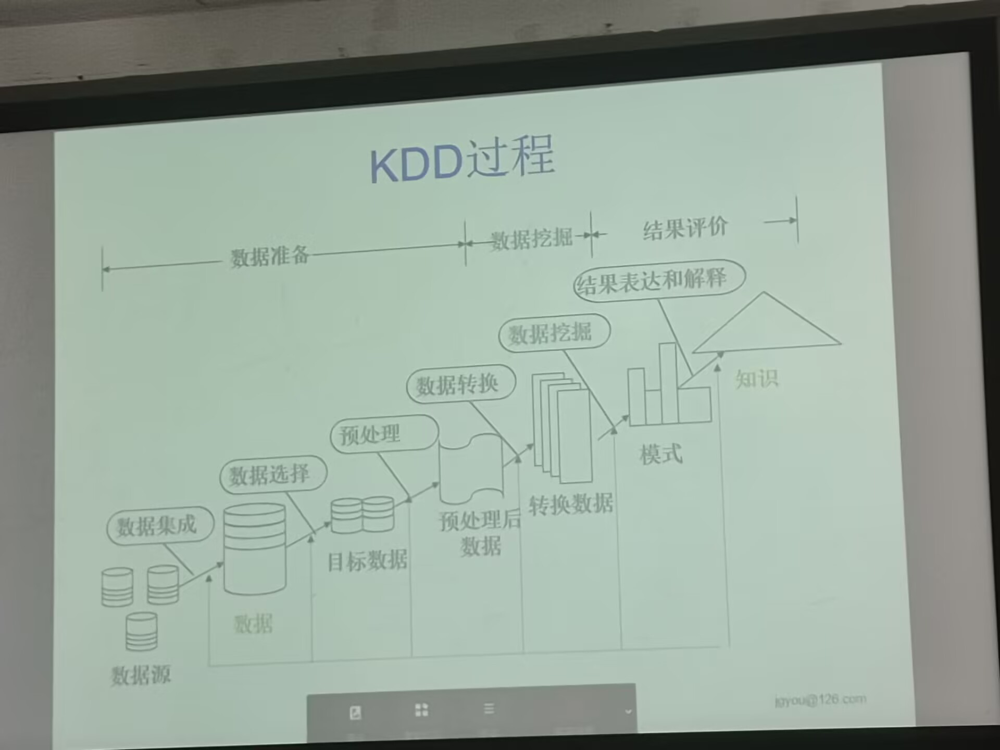

---
tags:
  - 学校课程/数据仓库
---

# 数据挖掘

----

### 一、定义

- 简单说，数据挖掘就是从**大量的、不完全的、有噪声的、模糊的、随机的**实际应用数据中，提取**隐含在其中的、人们事先不知道的**、但是又有**潜在有用**的信息和知识的过程
	- 数据挖掘是机器学习和数据库的**交叉**学科

### 二、知识发现（KDD）
#### 1. 过程定义

- 知识发现（KDD）：从数据中发现有用知识的整个过程
	- KDD： Knowledge Discovery （BI） from Databases
		- BI： Business Inteligence
- 知识挖掘（DM）：KDD过程中的一个特定步骤，它用专门算法从数据中抽取模式（patterns）
#### 2. 具体过程

- 数据 $\rightarrow$ 信息 $\rightarrow$ 知识 $\rightarrow$ 知识发现（KDD） 


#### 3. 数据挖掘常用技术（算法）

```
前三种算法是最常用的
```

1. 关联分析
2. 分类（主要是决策树分类）
3. 聚类
4. 人工神经网络
5. 遗传算法
6. 回归分析
7. 规则推导等

#### 4. 数据挖掘标准

- 过程标准：CRISP-DM（cross-industry standard process for data mining）, 即为跨行业数据挖掘标准流程）
- 语言标准：PMML（Predictive Model Markup Language） for SAS，SPSS，IBM and Oracle
	- DMX and OLE DB for Data Mining

#### 5. CRISP-DM

1. business understanding：即商业理解。在第一个阶段我们必须从商业的角度上面了解项目的要求和最终目的是什么，并将这些目的与数据挖掘的定义以及结果结合起来
2. data understanding：数据的理解以及收集，对可用的数据进行评估
3. data preperation：数据的准备,对可用的原始数据进行一系 列的组织以及清洗,使之达到建模需求
4. modeling: 即应用数据挖掘工具建立模型
5. evaluation:对建立的模型进行评估,重点具体考虑得出的结果是否符合第一步的商业目的
6. deployment: 部署即将其发现的结果以及过程组织成为可读文本形式(数据挖掘报告)