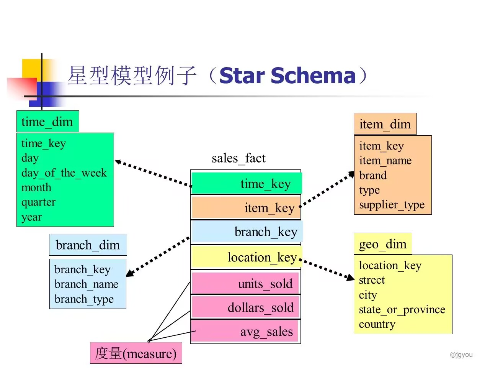

# 数据仓库与星型模型

---

##### 星型模型示例

- 可任意组合的维度表为星型模型提供多方面的信息，可以按照需求生成各种报表来完成任务及分析

### 粒度
#### 定义：

- 粒度是对数据仓库中的数据综合程度高低的一个度量，它既影响数据仓库中的数据量的多少，也影响数据仓库所能回答询问的种类
#### 特性

- 粒度越小，综合程度越低，回答查询的种类越多
- 粒度越高，综合程度越高，查询的效率也越高

- 粗粒度：模块功能集中，实现大的集成功能
- 细粒度：模块功能分散，将大功能细分为多个小的功能，以较多的子模块实现
#### 用处：

- 数据仓库：可将小粒度的数据存储在低速存储器上；大粒度的数据存储在高速存储器上

### 分割
#### 定义：

- 是指把数据分散到各自的物理单元中去，以便能分别独立处理，提高数据处理效率
#### 重要性

- 是粒度之后的第二个主要设计问题
#### 层次

- 两个层次的分割
	- 系统层：DBMS，一种定义
	- 应用层：开发者，**多种定义**
#### 标准

1. 日期：最常用的
2. 地理位置
3. 组织单位...
	例：
#### 分区种类

1. 范围分区
2. 哈希分区

### 分库分表

#### 分表的类别

1. 水平分表
2. 垂直分表