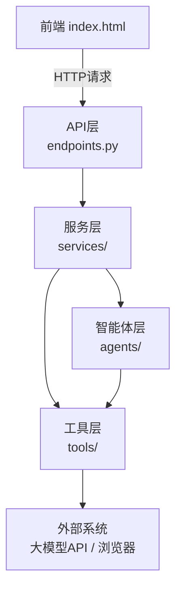

这是一份关于您的“多源Web表格自动填写系统”的详尽解析文档。它从修改一个按钮颜色开始，深入到每个函数的参数细节，最后彻底讲清了网页如何被操控、数据如何在整个系统中流转。

---

# 智能表单映射填充系统 - 完全解析手册

## 一、 快速定位：修改样式与配置

如果你想调整系统外观或某些行为参数，不需要读懂所有代码。这里列举了最常改动的几个位置。

### 1. 改颜色 / 改样式

所有的样式都写在一个地方：**`frontend/index.html`** 文件里的 `` 标签中。

| 你想改什么 | 去哪里改 | 说明 |
| :--- | :--- | :--- |
| **按钮背景色** | 找到 `button` 样式里的 `background: #2c7da0;` | 修改 `#2c7da0` 这个颜色值即可。 |
| **按钮悬停颜色** | 找到 `button:hover` 里的 `background: #1f5e7a;` | 同上。 |
| **“成功”提示框的背景色** | 找到 `.info-text` 样式 | 当前是浅蓝色 `#e7f1ff`。 |
| **“错误”提示框的背景色** | 找到 `.error-text` 样式 | 当前是浅红色 `#f8d7da`。 |
| **映射表格中“高置信度”行的颜色** | 找到 `.confidence-high` 样式 | 当前是浅绿色 `#d4edda`。 |
| **映射表格中“中置信度”行的颜色** | 找到 `.confidence-medium` 样式 | 当前是浅黄色 `#fff3cd`。 |
| **映射表格中“低置信度”行的颜色** | 找到 `.confidence-low` 样式 | 当前是浅红色 `#f8d7da`。 |
| **页面主体宽度** | 找到 `#app` 样式里的 `max-width: 1100px;` | 修改这个值可以改变主内容区的宽度。 |

---

### 2. 改功能 / 改参数

这些参数控制系统的核心行为，分散在后端的几个文件中。

| 你想改什么 | 去哪里改 | 说明 |
| :--- | :--- | :--- |
| **批量填充的最大条数** | `backend/agents/fill_agent.py` 的 `fill` 方法 | 找到 `if len(data_records) > 5:`，把数字 `5` 改成你想要的。 |
| **大模型的“温度”（创造性）** | `backend/agents/matching_agent.py` 的 `__init__` 方法 | 找到 `temperature=0.1`，值越低输出越稳定，越高越有创造性。 |
| **浏览器是否“无头”运行（不显示窗口）** | 1. `backend/tools/browser_filler_tool.py` 的 `__init__` 方法 2. `backend/tools/web_scraper_tool.py` 的 `__init__` 方法 | 找到 `self.headless = False`，改成 `True` 浏览器就在后台运行，不会弹出窗口。 |
| **解析网页的超时时间** | `backend/tools/web_scraper_tool.py` 的 `__init__` 方法 | 找到 `self.page_load_timeout = 15`，数字的单位是秒。 |
| **填充网页的超时时间** | `backend/tools/browser_filler_tool.py` 的 `__init__` 方法 | 找到 `self.page_load_timeout = 15`，数字的单位是秒。 |

---

## 二、 架构总览与核心函数详解

这一部分将为你梳理出清晰的“地图”和“使用手册”，帮助你理解系统的全貌和细节。

**系统架构分层示意图**：

下面我们按照这个分层结构，从上到下依次介绍每一层都有哪些文件，以及每个文件里的核心函数是干什么的、需要什么参数。

### 1. 前端 - `frontend/index.html`

前端是一个单文件应用，没有拆分。所有逻辑都在 `<script>` 标签里。

| 函数名 | 参数 | 作用 |
| :--- | :--- | :--- |
| `loadSourceData()` | 无 | 收集页面上选择的文件或URL，构建FormData，发送给后端`/api/source/preview`，然后把返回的源数据列名、前5行示例数据显示在页面上。 |
| `loadTargetForm()` | 无 | 拿到用户输入的目标网页URL，发送给后端`/api/target/preview`，然后把返回的目标表单字段列表（姓名、电话等）显示在页面上。 |
| `getRecommendation()` | 无 | 把源数据列信息和目标表单字段信息打包成一个JSON，发送给后端`/api/mapping/recommend`，拿到推荐的映射关系后，用表格展示出来，并根据置信度给每行上色。 |
| `confirmFill()` | 无 | 把用户确认（或修改）后的映射关系发给后端`/api/fill/execute`，触发真正的浏览器自动填充。 |
| `exportData(format)` | `format`: `"excel"` 或 `"csv"` | 向后端`/api/export`请求下载填充结果文件。 |
| `getConfidenceClass(conf)` | `conf`: 置信度数值 (0-1) | 根据置信度高低返回一个CSS类名(`confidence-high/medium/low`)。 |

---

### 2. API层 - `backend/api/endpoints.py`

这一层是整个系统的大门。前端只能通过这里的5个入口来“使唤”后端干活。

| 函数名 | 路径 | 参数 | 作用 |
| :--- | :--- | :--- | :--- |
| `preview_source_data` | POST `/api/source/preview` | `type`: 数据源类型 `file`: 上传的文件 `url`: 网页URL | 接收前端发来的源数据，调用`DataIngestionService`去读取和清洗，然后把源数据的列名、前5行示例、数据规模返回给前端。 |
| `preview_target_form` | GET `/api/target/preview` | `target_url`: 目标网页URL | 接收前端发来的目标网页地址，调用`DataIngestionService`去解析表单结构，然后把字段的标签、名字、类型等信息返回给前端。 |
| `recommend_mapping` | POST `/api/mapping/recommend` | `request`: 包含源列信息、目标字段信息的JSON | 接收前端发来的两个表单的“特征”，调用`FieldMatchingService`（里面藏着大模型Agent）去推荐映射关系，然后把推荐的映射、置信度返回给前端。 |
| `execute_fill` | POST `/api/fill/execute` | `request`: 包含最终映射、目标URL的JSON | 接收前端发来用户确认后的映射关系，调用`DataFillingService`去执行真正的浏览器自动填充，然后告诉前端填充成功了多少条。 |
| `export_result` | GET `/api/export` | `format`: `"excel"` 或 `"csv"` | 让`DataFillingService`把填充后的数据生成Excel或CSV文件，然后把文件下载链接给前端。 |

---

### 3. 服务层 - `backend/services/`

这一层是“大脑”和“指挥中心”。每个服务就是一个指挥官，负责协调它手下的工具们完成一件大事。

#### `data_ingestion.py` (数据接入指挥官)

| 函数名 | 参数 | 作用 |
| :--- | :--- | :--- |
| `load_source(source_input)` | `source_input`: 一个包含来源类型和数据的对象 | **总指挥**：根据类型（Excel/SQL/URL）决定派谁去读取数据，拿到数据后让`DataCleanerTool`负责清洗，最后把干净的`DataFrame`存起来。 |
| `_read_web_table(url)` | `url`: 网页地址 | 专门处理网页表格的小指挥，调用`WebScraperTool`去抓取网页上的表格。 |
| `parse_target_form(url)` | `url`: 目标网页地址 | 专门解析目标网页表单的小指挥，调用`WebScraperTool`去分析表单里有几个输入框、叫什么名字。 |

#### `field_matching.py` (字段匹配指挥官)

| 函数名 | 参数 | 作用 |
| :--- | :--- | :--- |
| `get_recommendation(...)` | `source_columns`: 源列名列表 `source_sample`: 源数据示例 `source_types`: 源数据类型 `target_columns`: 目标字段名列表 `target_labels`: 目标字段标签 `target_sample`: 目标表单示例 `target_types`: 目标字段类型 | **总指挥**：把源和目标的所有“特征”信息打包，交给`MatchingAgent`（大模型智能体），然后坐等它返回一个聪明的映射建议。 |

#### `data_filling.py` (数据填充指挥官)

| 函数名 | 参数 | 作用 |
| :--- | :--- | :--- |
| `fill_target_form(...)` | `source_df`: 源数据DataFrame `mapping`: 最终确认的映射 `target_url`: 目标URL | **总指挥**：按照映射关系把源数据“变形”，然后调遣`FillAgent`带着变形后的数据去浏览器里自动填表。 |
| `get_result_dataframe()` | 无 | 把填充后最终的数据拿出来，供导出功能使用。 |

---

### 4. 智能体层 - `backend/agents/`

这一层是“人工智能专家”。它封装了需要大模型参与的复杂决策逻辑。

#### `matching_agent.py` (字段匹配专家)

| 函数名 | 参数 | 作用 |
| :--- | :--- | :--- |
| `get_mapping_recommendation(...)` | (同上 `FieldMatchingService` 的参数) | 这是LangChain Agent的“大脑”，它会动用大模型，并自动调用下面的工具去获取数据细节，最终推理出映射建议。 |

#### `fill_agent.py` (填充执行专家)

| 函数名 | 参数 | 作用 |
| :--- | :--- | :--- |
| `fill(...)` | `target_url`: 目标URL `data_records`: 待填充的数据列表 `field_mapping`: 字段映射 `fields_info`: 目标字段信息 | 负责批量填充的流程控制，它会检查数量是否超过限制，然后逐条调用`BrowserFillerTool`去执行填充，并汇总结果。 |

---

### 5. 工具层 - `backend/tools/`

这一层是具体干活的“手”。每个工具文件都是一个身怀绝技的打工人，只专心做好一件事。

#### `field_matching_tools.py` (Agent 的专用工具)

| 函数名 | 参数 | 作用 |
| :--- | :--- | :--- |
| `analyze_source_columns(...)` | `source_columns`: 列名列表 `source_sample`: 示例数据 `source_types`: 数据类型 | **Agent的手**：把源数据特征格式化成一份详细的文字报告，方便大模型理解。 |
| `analyze_target_fields(...)` | `target_columns`: 字段名列表 `target_labels`: 字段标签 `target_types`: 字段类型 `target_sample`: 目标示例 | **Agent的另一只手**：做上面类似的事，不过是给目标表单生成文字报告。 |

#### `excel_tool.py` (Excel 读取器)

| 函数名 | 参数 | 作用 |
| :--- | :--- | :--- |
| `read_from_bytes(content, sheet_name)` | `content`: 文件的二进制数据 `sheet_name`: 工作表名或索引 | 把Excel文件的二进制内容变成一个`DataFrame`。 |

#### `sql_file_tool.py` (SQL 解析器)

| 函数名 | 参数 | 作用 |
| :--- | :--- | :--- |
| `parse_sql_file(sql_content)` | `sql_content`: SQL文件的文本内容 | 从`CREATE TABLE`里找出列名，从N条`INSERT INTO`里捞出所有数据行，最终生成一个`DataFrame`。 |

#### `web_scraper_tool.py` (网页爬虫)

| 函数名 | 参数 | 作用 |
| :--- | :--- | :--- |
| `extract_tables(url)` | `url`: 网页地址 | 从网页中抓取所有表格，返回`DataFrame`列表。 |
| `extract_form_structure(url)` | `url`: 网页地址 | 解析网页中的表单，返回每个输入框叫什么名、是什么类型、有哪些选项。 |

#### `browser_filler_tool.py` (浏览器填充器)

| 函数名 | 参数 | 作用 |
| :--- | :--- | :--- |
| `fill_single_record(target_url, data, fields_info)` | `target_url`: 目标URL `data`: 要填的键值对 `fields_info`: 字段信息 | 启动一个真实浏览器，打开网页，找到输入框，把数据填进去。 |

#### `option_matching_tool.py` (选项匹配器)

| 函数名 | 参数 | 作用 |
| :--- | :--- | :--- |
| `match_value_to_options(value, field_label, options, multi)` | `value`: 源数据值 `field_label`: 字段标签 `options`: 可选项列表 `multi`: 是否多选 | 调用大模型，判断源数据值（如“中等尺寸”）应该匹配到下拉框的哪个选项（如“medium”）。 |

---

## 三、 底层工作原理：你的浏览器到后端服务

要理解系统如何运作，首先要明白 **DOM (Document Object Model，文档对象模型)** 这个概念，以及系统如何获取文件/参数，还有数据如何在整个链路中传递。

### 1. 什么是 DOM？
**DOM** 不是一个图片或文件，它是浏览器在加载HTML页面时，在内存中构建的一个**树状结构**。
- 你的 HTML 文件就是建造这座“树”的图纸。
- 浏览器引擎（如Firefox）会解析HTML，把 `<html>`、`<body>`、`
`、`<input>` 等标签都变成一个个可以编程控制的**对象**。
- Selenium 和 BeautifulSoup 这些工具，就像是能读取和操控这棵“树”的机械臂。它们可以遍历父节点、子节点，查找特定属性，读取或修改文本内容。

### 2. 系统如何获取文件/参数？
当你在前端界面上传一个 Excel 文件并点击“加载源数据”时，整个过程是这样的：
1. **获取数据 (前端)**：前端的JavaScript通过`<input type="file">`获取了你选择的文件，通过`<input type="text">`获取了URL。
2. **打包上路 (前端)**：`loadSourceData`函数用`FormData`把这些文件、URL和类型参数打包，通过 `axios` 发送一个HTTP POST请求到 `http://localhost:8000/api/source/preview`。
3. **大门接收 (后端)**：后端的 `preview_source_data` 函数通过 `FastAPI` 框架接收到这个请求，并从请求体中解析出文件对象和URL字符串。
4. **分发任务 (后端)**：它把解析出的信息交给 `DataIngestionService.load_source()`，这个函数再根据类型，选择 `ExcelReadTool` 或 `SQLFileTool` 或 `WebScraperTool` 去干活。

### 3. 数据是如何流转的？
整个系统的数据流转像一条流水线，经历 **“接入” -> “匹配” -> “填充”** 三个阶段。

**数据"变形记"**：
1. **读取与清洗 (后端的工具层)**：`ExcelReadTool` 或 `SQLFileTool` 直接读取文件/请求URL，把原始数据变成计算机最擅长的 **DataFrame** 格式（就像一个超级表格）。接着，`DataCleanerTool` 开始工作，它会清理掉里面的空行和特殊字符，确保数据质量。
2. **智能匹配 (后端的Agent层与服务层)**：`FieldMatchingService` 指挥官会从源数据`DataFrame`中提取列名和几行示例值，同时也从`WebScraperTool`那里拿到目标表单的字段信息。它把这些“特征”统统交给 `MatchingAgent`（大模型智能体），由它推理出“源数据表的哪一列”应该对应“目标表单的哪一个输入框”。
3. **自动填充 (后端的工具层与服务层)**：`DataFillingService` 指挥官拿到最终的映射关系后，先把源数据`DataFrame`的列名改成目标表单要求的名字，然后把每一行数据转成一个字典。`FillAgent` 专家带着这些字典，调用 `BrowserFillerTool`，启动一个真实的Firefox浏览器。`BrowserFillerTool` 会打开网页，根据字段名定位到输入框，然后把对应的值填进去。对于复杂的下拉框或单选按钮，它还会请求`OptionMatchingTool` 这个外援，让它调用大模型判断“中等尺寸”应该选哪个选项。一切就绪后，`DataFillingService` 把最终填充好的`DataFrame`通过`/api/export`接口导出成Excel/CSV文件，传给前端下载。

### 4. 底层技术串联
- **前端**：通过`axios`库向后端发送HTTP请求，这是前后端交流的唯一通道。
- **后端**：用`FastAPI`框架定义了5个接口，负责接收和响应前端的请求，并调用下面的服务层。
- **数据处理**：所有表格数据的读取、清洗、转换，都靠`pandas`库。它是Python里处理数据的瑞士军刀。
- **浏览器控制**：`Selenium`库就像一个看不见的手，它能启动、操控真正的浏览器（Firefox），模拟人的点击和输入。
- **大模型调用**：我们用`LangChain`框架搭建了`MatchingAgent`（你论文的创新点），并调用`阿里云百炼`平台上的大模型API。`OptionMatchingTool`则直接调用模型API，让AI帮忙做“值到选项”的匹配。
- **数据格式**：系统内部统一使用`DataFrame`来承载所有表格数据。在不同服务间传递时，会用`to_dict('records')`方法把它转成JSON格式的列表，方便前端和Agent理解。

### 5. 关键技术点补充
- **跨域 (CORS)**：我们的前端（双击打开的文件）和后端（http://localhost:8000）不在同一个域名下。浏览器的安全策略会默认禁止这种请求。所以我们在后端 `main.py` 里通过 `CORSMiddleware` 配置，明确告诉浏览器“我允许这个文件访问我”。
- **异步 (async/await)**：你在代码里看到的大量 `async` 和 `await` 关键字，是 `FastAPI` 为了高并发和高效处理网络请求而采用的技术。简单说，它能让程序在等待一个耗时任务（如下载网页）时，不阻塞、不闲着，转头去处理别的任务。
- **数据校验 (Pydantic)**：`backend/models/schemas.py` 里定义的那些类（如`SourceInput`, `FillRequest`），是用来规范前后端之间传递的数据“长什么样”的。`FastAPI` 会在收到请求时自动用它来“验货”，如果格式不对，就会直接拒绝并返回错误，避免了脏数据进入系统。