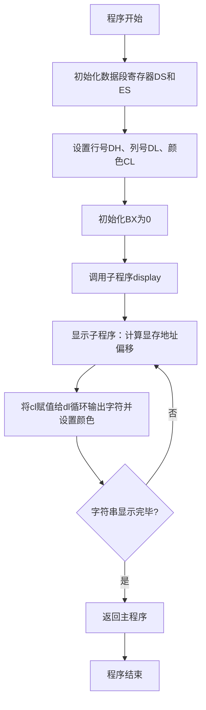
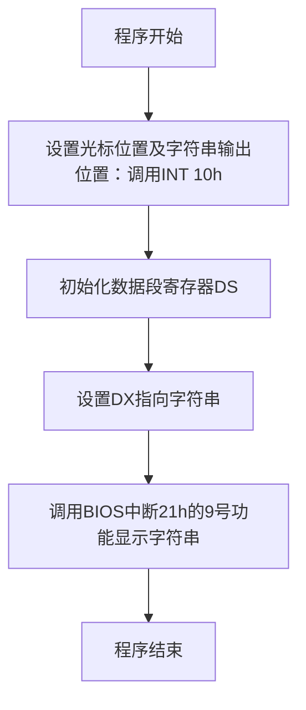

# 上机三
---

### 实验任务的流程图设计

以下是根据实验内容生成的两部分程序流程图，用 **Mermaid** 代码表示：

---

#### **任务一：使用子程序显示字符串**

---

#### **任务二：使用BIOS中断调用显示字符串**

---

### 实验结果和收获

#### **实验结果**

1. 任务一成功实现了通过自定义子程序，在屏幕指定位置以蓝底白字显示字符串 "Hello World!!!"。
    - 使用了显存操作技术，精确定位字符并设置颜色。
2. 任务二通过BIOS中断调用，在屏幕指定位置正确显示了字符串 "Hello World!!!"。
    - 充分利用BIOS功能，代码更加简洁。

#### **收获**

1. **子程序调用和寄存器操作的掌握**：通过任务一，进一步理解了如何通过子程序组织代码，提高代码的可读性和可复用性。
2. **BIOS中断的应用**：通过任务二，熟悉了INT 10h（光标定位）和INT 21h（字符串显示）中断功能的用法。
3. **汇编语言调试经验**：通过调试，理解了内存地址、偏移量计算的重要性，解决了显存段初始化和颜色配置问题。
4. **基础的汇编优化思路**：对比两种实现方式，了解到直接显存操作虽然复杂，但具有更高的灵活性；而BIOS中断调用则简化了开发流程。
