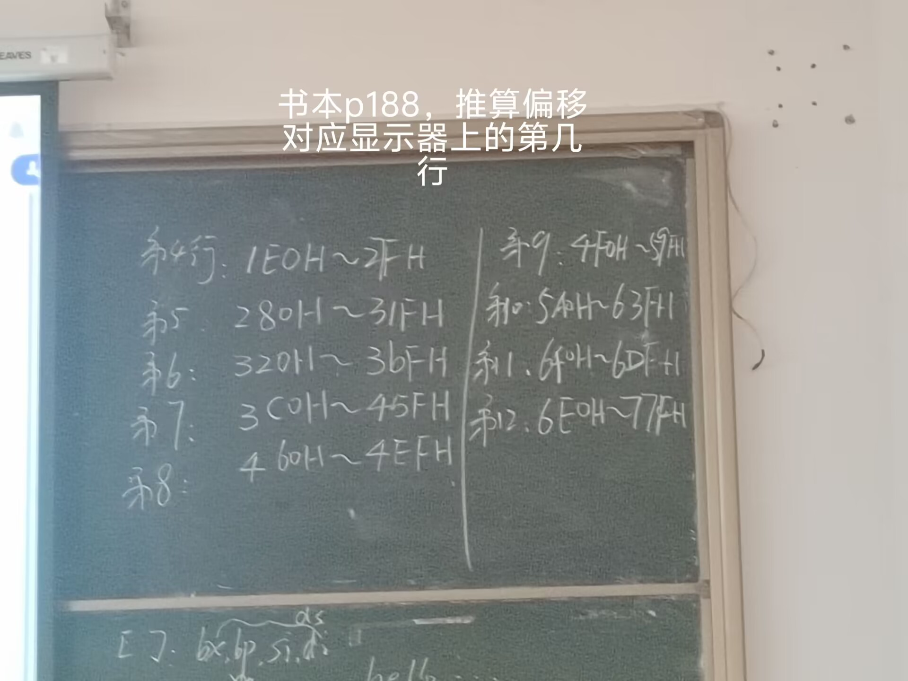

1. 汇编指令是机器指令的助记符，同机器指令一一对应
2. 每一种CPU都有自己的汇编指令集
3. CPU可以直接使用的信息在存储器中存放
4. 在存储器中指令与数据没有区别，都是二进制信息
5. 存储单元从零开始顺序加 1
6. 一个存储单元可以存储8个bit，即
7. CPU的引脚与总线项链，也可以说，这些引脚引出总线。
	1. 地址总线的宽度（地址总线的根数）决定了CPU的**寻址能力**
	2. 数据总线的宽度决定了CPU数据传输的速度（一次的数据传送量）
	3. 1
		-  地址总线对应的寻址能力以B为单位，数据总线与控制总线单位均为 bit

### 书本知识扩展

#### 显存偏移地址推算
