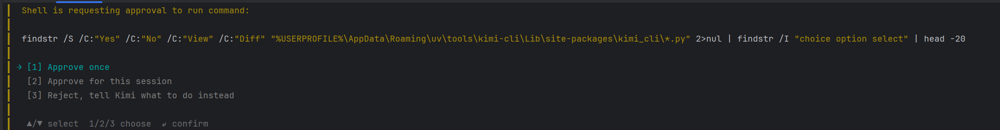

# 教程

> [详细步骤](https://www.kimi.com/code/docs/kimi-cli/guides/getting-started.html)
1. 在pycharm中安装uv和kimi-cli
	   
	1. 可使用命令验证uv是否下载完成：
		1. uv --version          # 应该显示 uv 版本
		2. kimi-cli --version  # 应该显示 kimi-cli 版本
	2. 若kimi下载失败，则换用如下命令`uv tool install --python 3.13 kimi-cli --native-tls`，若下载成功，则说明临时添加path成功，需要再在终端输入命令将path进行永久配置：`[Environment]::SetEnvironmentVariable("Path", "C:\Users\chen1\.local\bin;$([Environment]::GetEnvironmentVariable("Path", "User"))", "User")`
2. 下载完成后，在终端启动kimi：`kimi-cli login`，输入命令后会跳转至Kimi Code的API平台
	- 可使用`kimi-cli --help`查看所有命令
3. `cd Project`切换到指定项目位置后，可使用`kimi`打开Kimi Code模式，使用自然语言进行提问，并可以让Kimi直接生成文件和代码、帮忙进行debug等操作

#### Kimi Code操作过程中的问题

|              选项              | 作用                          | 适用场景                          |
| :--------------------------: | :-------------------------- | ----------------------------- |
|       [1] Approve once       | 仅批准当前这一个命令，下次执行仍需确认         | 不确定这个操作是否安全，想先看看结果            |
| [2] Approve for this session | 批准本次对话期间的所有命令，直到关闭 Kimi CLI | 信任当前任务，让 AI 连续执行多个操作（如批量修改文件） |
|          [3] Reject          | 拒绝执行，并让你输入替代指令              | 发现命令有风险，或想让 AI 用其他方式解决        |
