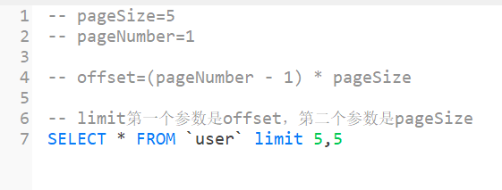

# Day03

---

### 前端实现
#### login.html

```html
<!DOCTYPE html>
<html>
	<head>
		<meta charset="utf-8">
		<title>用户登录</title>
		<!-- 先导入vue.js，再导入elementui的index.js,因为element需要依赖vue -->
		<script src="js/vue.js"></script>
		<script src="js/index.js"></script>
		<script src="js/axios.min.js"></script>
		<link href="css/index.css" rel="stylesheet"/>
	</head>
	<body>
		<!-- 所有标签都要放在div容器中,该容器会被vue检测加载，如果标签在该div之外，则vue不会加载 -->
		<div id="loginApp">
			
			<el-row>
				<el-col :span="8" :offset="8">
					
					<el-card>
						<h1>用户登录</h1> <!-- 标题-->
						<el-form>
							<el-form-item>
								<!-- v-model是vue的双向绑定指令，会绑定一个变量，一般用在form表单的输入框中 -->
								<el-input v-model="username" placeholder="请输入用户名"></el-input>
							</el-form-item>
							<el-form-item> 
								<!-- show-password---是否明文显示密码的开关，默认关闭 -->
								<el-input v-model="password" placeholder="请输入密码" show-password></el-input>
							</el-form-item>
							<el-form-item>
								<!-- @是事件触发指令，把click交给login方法 -->
								<el-button type="primary" @click="login">登录</el-button>
							</el-form-item>
						</el-form>
					</el-card>
					
					
				</el-col>
			</el-row>
			
			
			
		</div>
	</body>
	
	<script>
		// 初始化vue对象
		new Vue({
			// vue检测加载标签的范围
			el:"#loginApp",
			data(){
				return {
					username:'',
					password:''
				}
			},
			// 所有方法都在methods里面定义 
			methods:{
				login(){
					// 1. 封装输入框中的用户名和密码
					let param = {}; // 初始化一个空对象
					param.username = this.username;
					param.password = this.password;
					
					// 2. 通过axios向后台发送请求并处理返回结果
					axios.post("http://localhost:8088/user/login", param)
					.then(result=>{
						console.log(result); // 会在控制台将result打印出来
						 // 后台返回的结果存在result和data属性中
						 let data = result.data;
						 // 判断data中code是否为200，则表示登陆成功，否则表示登陆失败
						if (data.code == 200){
							
							// 把username保存到缓存中
							sessionStorage.setItem("username", this.username);
							
							// 页面跳转
							location.href="index.html";
						}else{
							this.$message.error(data.msg);
						}
					})
					
				}
			}
		})
	</script>
	
	<style>
		/* el在elementUI中是被当做类的，对类的CSS则需要在前边加个点 */
		.el-col {
			text-align: center;
			margin-top:25vh;
		}
		body{
			background-image:url(./img/back.jpg);
			background-size: cover;
		}
	</style>
	
</html>

```
#### index.html

```html
<!DOCTYPE html>
<html>
	<head>
		<meta charset="utf-8" />
		<title></title>
		<!-- 导入先后顺序：vue先导入，index后导入 -->
		<script src="js/vue.js"></script>
		<script src="js/index.js"></script>
		<script src="js/axios.min.js"></script>
		<!-- 导入css组件 -->
		<link href="css/index.css" rel="stylesheet">
	</head>
	<body>
		<div id="indexApp">
			<!-- 布局容器 -->
			<el-container>
				<!-- 头部容器 -->
				<el-header>
					<div id="header-container">
						<div><span><b>用户管理系统</b></span></div>
						<div>
							<!-- {{}}：插值表达式，用来绑定文本区域中的变量 -->
							<span>{{username}}</span>
							<el-button type="success" size="small" @click="logout">退出登录</el-button>
						</div>
					</div>
				</el-header>
				<el-container>
					<el-aside width="200px">
						<el-menu default-active="0" class="el-menu-vertical-demo">
							<el-submenu index="0">
								<template slot="title">
									<i class="el-icon-user-solid"></i> <!--图标标签-->
									<span>用户管理</span>
								</template>
								<el-menu-item @click="openUrl('userList.html')">  <!--openurl是要打开文件的路径-->
									用户列表
								</el-menu-item>
							</el-submenu>

							<el-submenu index="1">
								<template slot="title">
									<i class="el-icon-platform-eleme"></i>
									<span>订单管理</span>
								</template>
								<el-menu-item>
									订单列表
								</el-menu-item>
							</el-submenu>

						</el-menu>
					</el-aside>
					<el-main>
						<!-- v-bind:属性绑定指令，给属性绑定一个变量，简写：‘:’ -->
						<iframe :src="url" width="100%" height="99%" frameborder="0"></iframe>
					</el-main>
				</el-container>
			</el-container>

		</div>
	</body>

	<script>
		new Vue({
			el: "#indexApp",
			data(){
				return {
					username:sessionStorage.getItem('username'),
					url:''
				}
			},
			methods:{
				logout(){
					// 1. 清除缓存
					sessionStorage.clear();
					
					// 2. 跳转到login页面
					location.href='login.html';
				},	
				openUrl(currentUrl){
					this.url = currentUrl;
				}
			}
		})
	</script>

	<style>
		#header-container {
			display: flex;
			justify-content: space-between;
			line-height: 60px;
			color: white;
		}

		.el-header {
			background-color: lightseagreen;
		}

		html,
		body {
			height: 100%;
			margin: 0px;

			/* 
			 第二种方式
			 position:fixed;
			 height:100vh;
			 
			 */
		}

		#indexApp,
		.el-container {
			height: 100%;
		}

		.el-aside,
		.el-menu {
			height: 100%;
			background-color: whitesmoke;
		}
	</style>
</html>

```

#### userList.html

```html
<!DOCTYPE html>
<html>
	<head>
		<meta charset="utf-8">
		<title></title>
		<script src="js/vue.js"></script>
		<script src="js/index.js"></script>
		<script src="js/axios.min.js"></script>
		<link href="css/index.css" rel="stylesheet"/>
	</head>
	<body>
		<div id="userApp">
			<el-form :inline="true">
				<el-form-item>
					<el-input v-model="username" placeholder="用户名"></el-input>
				</el-form-item>
				<el-form-item>
					<el-button type="primary" @click="getUserList">查询</el-button>
				</el-form-item>
				<el-form-item>
					<el-button type="primary" @click="showAddUser">添加用户</el-button>
				</el-form-item>
			</el-form>
			
			
			<!-- 表格 -->
			<el-table :data="userList" border style="width: 100%">
				<el-table-column fixed prop="id" label="序号">
				</el-table-column>
				<el-table-column prop="username" label="用户名">
				</el-table-column>
				<el-table-column prop="email" label="邮箱">
				</el-table-column>
				<el-table-column prop="sex" label="性别">
				</el-table-column>
				<el-table-column prop="age" label="年龄">
				</el-table-column>
				<el-table-column prop="address" label="住址">
				</el-table-column>
				<el-table-column fixed="right" label="操作" width="100">
					<template slot-scope="scope">
						<el-button type="text" size="small">查看</el-button>
						<el-button type="text" size="small">编辑</el-button>
					</template>
				</el-table-column>
			</el-table>
			
			<!-- 分页 -->
			<!-- 
			 current-page：当前页，页码
			 page-size：每页显示的数据条数
			 total：总数据条数
			 
			 size-change：当pageSize变化时间，触发的事件
			 current-change：当页码发生变化时，触发的事件
			 -->
			<el-pagination @size-change="handleSizeChange" @current-change="handleCurrentChange"
				:current-page="pageNumber" :page-sizes="[5, 10, 20, 50]" :page-size="pageSize"
				layout="total, sizes, prev, pager, next, jumper" :total="total" style="text-align: right">
			</el-pagination>
			
			<!--添加用户对话框，用于添加用户时填写信息-->
			<!--
				visible.sync:控制对话框是否显示的开关，默认为false，如果为true表示打开对话框，如果为false，表示关闭对话框
			-->
			<el-dialog title="添加用户" :visible.sync="addUserVisible">
			  <el-form :model="addUser">
			    <el-form-item label="用户名" :label-width="formLabelWidth">
			      <el-input v-model="addUser.username" autocomplete="off"></el-input>
			    </el-form-item>
				<el-form-item label="密码" :label-width="formLabelWidth">
				  <el-input v-model="addUser.password" autocomplete="off" show-password></el-input>
				</el-form-item>
				<el-form-item label="邮箱" :label-width="formLabelWidth">
				  <el-input v-model="addUser.email" autocomplete="off"></el-input>
				</el-form-item>
				
			    <el-form-item label="性别" :label-width="formLabelWidth">
			      <el-select v-model="addUser.sex" placeholder="请选择">
			        <el-option label="男" value="男"></el-option> <!--label是能看到的值，最终能存入数据库的就是value中的值-->
			        <el-option label="女" value="女"></el-option>
			      </el-select>
			    </el-form-item>
				
				<el-form-item label="年龄" :label-width="formLabelWidth">
				  <el-input v-model="addUser.age" autocomplete="off"></el-input>
				</el-form-item>
				<el-form-item label="住址" :label-width="formLabelWidth">
				  <el-input v-model="addUser.address" autocomplete="off"></el-input>
				</el-form-item>
				
				
			  </el-form>
			  <div slot="footer" class="dialog-footer">
			    <el-button @click="cancelAddUser">取 消</el-button>
			    <el-button type="primary">确 定</el-button>
			  </div>
			</el-dialog>
			
		</div>
	</body>
	
	<script>
		new Vue({
			el:"#userApp",
			data(){
				return { // 设置默认值
					username:'',
					userList: [],
					pageNumber: 1,
					pageSize: 5,
					total: 0,
					addUserVisible: false,
					addUser:{}, // 初始化为空对象
					formLabelWidth: '80px'
				}
			},
			methods:{ 
				// 修改当前页面值，实现的功能就是点击前往下一页，并显示下一页的内容
				handleCurrentChange(val){ // val 就是目前的页码
					// 1. 把新页码赋值给pageNumber
					this.pageNumber = val;
					// 2. 根据新页码刷新链表
					this.getUserList();
					
				},
				// 修改每页显示最大数量
				handleSizeChange(val){ // 修改每页显示条数时，会将新的每页显示条数传给val
					this.pageSize = val;
					this.getUserList();
				},
				getUserList(){
					// 1. 封装参数
					let param = {};
					param.pageNumber = this.pageNumber;
					param.pageSize = this.pageSize;
					param.username = this.username;
					
					// 2. 发送请求，获取结果
					// axios的get请求传递参数是固定格式：{params:xxxx}  xxxx 是传递的参数
					axios.get("http://localhost:8088/user/page", {params: param})
					.then(result=>{
						let data = result.data; // 后台返回的数据存储在data中
						this.userList = data.rows;
						this.total = data.total;
					})
					
				},
				showAddUser(){
					// 打开添加用户对话框
					this.addUserVisible = true;
				},
				cancelAddUser(){
					// 先清空addUser对象
					this.addUser = {};
					
					
					// 关闭添加用户对话框
					this.addUserVisible = false;
				}
			},
			mounted(){ // 当页面加载完成后，自动触发的事件
				this.getUserList();
			}
		})
	</script>
	
	
</html>

```


### 就业指导

就业容易，考研考公形式严峻，几乎所有学生都只能考到双非院校


### 数据库与前端的联动

前端需要将pageNumber和pageSize参数传到后台，后台则使用这两个参数执行sql语句：`SELECT*FROM 'user' limit 5,5`
	$offset=(pageNumber - 1) * pageSize$
	limit 的第一个参数是pageNumber，第二个参数是pageSize
	
#### 后台执行

```
因为分页查询获取数据是用于查询结果的，所以使用Get
```
1. 从后台获取参数数据首先要在controller层进行处理
```Java
@GetMapping("/page") // 数据送往/user/page网址
    public JSONObject page(QueryUser queryUser){

        // 1. 将请求参数转发给service处理
        Page<User> result = userService.pageUser(queryUser);

        // 2. 获取处理结果，返回给前端
        // 如果获取值result为空，则返回给前端也没有影响，不会出现页面为空的情况
        JSONObject obj = new JSONObject();
        obj.put("code", 200);
        obj.put("rows", result.getRecords()); // Records存储的是查询到的数据链表；而getTotal()存储的是查询到的数据总数
        obj.put("total", result.getTotal()); 

        
        return obj;
    }
```
2. controller层将请求转发给service层处理，就需要在/service/UserService中进行方法声明，并在/service/impl/UserServiceImpl中对该方法进行实现，但在那之前，我们还需要一个存储数据的对象场景，即在dto（数据传输对象）下新建QueryUser.java文件，将数据存储在该对象中
	
```Java
import lombok.Data;   
  
@Data  // 充当getter和setter的作用
public class QueryUser {  
    // 必须的参数  
    private long pageNumber;  
    private long pageSize;  
  
    // 筛选条件，可选  
    private String username;  
}
```
3. 随后，在指定位置声明方法并实现：
	
```Java
// 方法声明：/service/UserService文件中
// 用户分页查询  
Page<User> pageUser(QueryUser queryUser);
// Page<T> 对象是mybatis-plus中的对象
```
```Java
// 方法实现：/service/impl/UserServiceImpl
@Override  
public Page<User> pageUser(QueryUser queryUser) {  
    // 1. 初始化分页对象Page，设置pageNumber和pageSize  
    // Page<T> 对象是mybatis-plus中的对象
    Page<User> p = new Page<>(queryUser.getPageNumber(), queryUser.getPageSize());  
  
    // 2. 判断筛选条件是否为空，不为空则给条件构造器，构造筛选条件  
    QueryWrapper<User> w = new QueryWrapper<>();  
    if(ObjectUtils.isEmpty(queryUser.getUsername())){  
        // 相当于sql: where username like '% ? %'  
        w.like("username", queryUser.getUsername());  
    }  
  
    // 3. 调用mybatis-plus提供的page方法进行分页查询，返回查询结果  
    Page<User> result = this.page(p, w);  
  
    return result;  
}
```
4. 设置完毕后启动后台，运行前段查看结果：
	
	点开用户列表后发现，所有七个用户的信息都展示出来了，但我们先前在前端设定的每页最大数量pageSize为5，pageNumber页码则是目前所在的页码值，但这里显示错误，我们前往后台查看终端显示
	发现后端生成的sql语句没有limit子语句，所以显示出现问题，所以我们就需要设置一个`分页拦截器`
5. 设置分页拦截器：在/config下新建PaginationConfig文件，用于存储实现分页拦截器的代码
	
6. 实现分页拦截器的功能：
```Java
@Configuration // 必须要加该注解，才能加载到IOC容器中，这样才能生效  
public class PaginationConfig {  
  
    /*  
    * PaginationInterceptor就是一个分页拦截器，会自动在sql语句后添加limit子语句  
    *    *    * */  
  
    @Bean // 表示这是SpringBoot的bean对象  
    public PaginationInterceptor paginationInterceptor(){  
        return new PaginationInterceptor();  
    }  
}
```
7. 完成后重新运行后台，并打开前端页面，可以看到前端显示正常
	
	后端实现的sql语句也正常执行，成功使用了limit子语句
	
