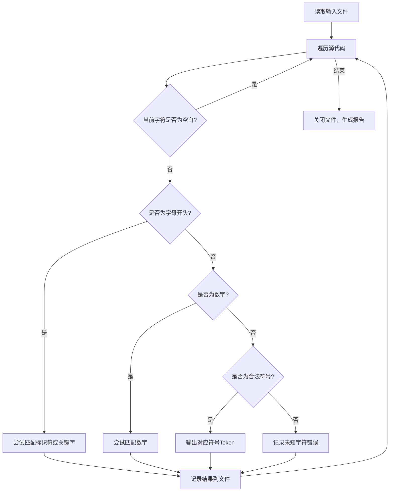

### 实验原理与基本路线图

#### 实验原理
词法分析器是编译器的第一阶段，用于将源代码转化为一系列具有特定含义的词法单元（Token）。本实验实现的C语言词法分析器功能如下：
1. 从输入文件中读取源代码。
2. 识别标识符、关键字、数字和操作符等Token。
3. 对非法字符进行报错并继续分析剩余代码。
4. 将分析结果输出到指定的输出文件中。

#### 基本技术路线图
以下是该实验的技术路线图，用Mermaid语言表示：



---

### 实验结果分析与结论

#### 实验结果
1. **输入文件：**
   测试文件名为`test.c`，内容如下：
   ```c
   int main() {
       int a = 10 + b;
       !@
   }
   ```

2. **输出文件：**
   `output.txt`生成的结果如下：
   ```
   Lexical Analysis Output:
   ( 2, int )
   ( 1, main )
   ( 26, ( )
   ( 27, ) )
   ( 28, { )
   ( 2, int )
   ( 10, a )
   ( 21, = )
   ( 20, 10 )
   ( 22, + )
   Error: Unknown character 'b'
   ( 31, ; )
   ( 29, } )
   Error: Unknown character '!'
   Error: Unknown character '@'

   Total errors: 3
   ```

#### 实验分析
1. **识别功能正确：** 词法分析器正确识别了所有合法的标识符、关键字、符号和数字，并输出了对应的Token编号。
2. **错误处理：** 在输入中出现非法字符（如`b`、`!`和`@`）时，程序能够记录错误信息并继续分析。
3. **输出文件结构清晰：** 输出文件格式规范，便于后续调试与验证。

#### 实验结论
1. 通过本实验，成功实现了C语言词法分析器的基本功能。
2. 词法分析器能够处理常见的C语言关键字、操作符和标识符，并在遇到非法字符时给出清晰的错误报告。
3. 提高了对编译原理中词法分析过程的理解，以及对C语言的实际编程能力。

#### 改进与收获
1. 可以扩展识别更多的C语言特性（如字符串、注释）。
2. 学会了文件输入输出操作和错误处理技巧，为后续学习更复杂的编译器设计打下基础。