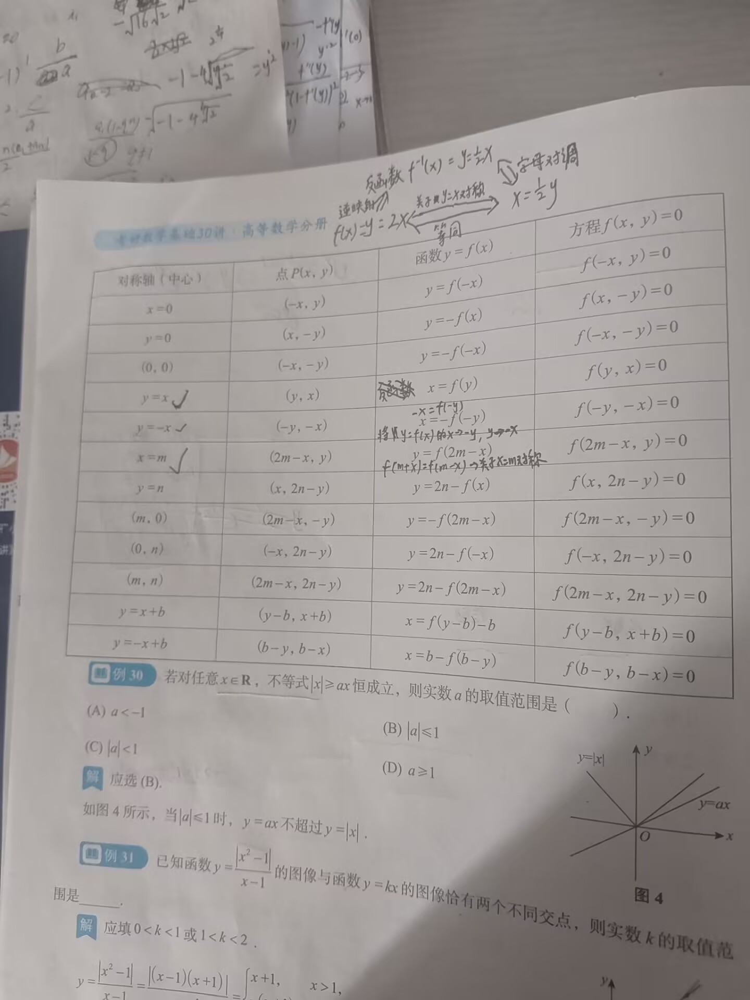
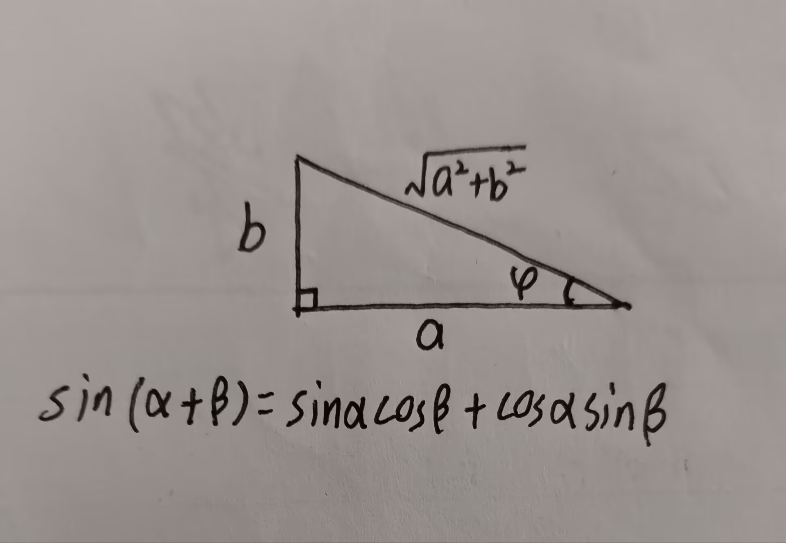
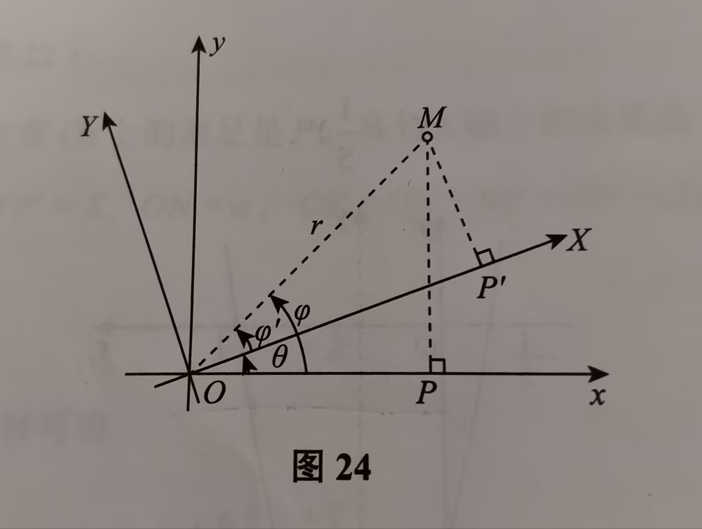
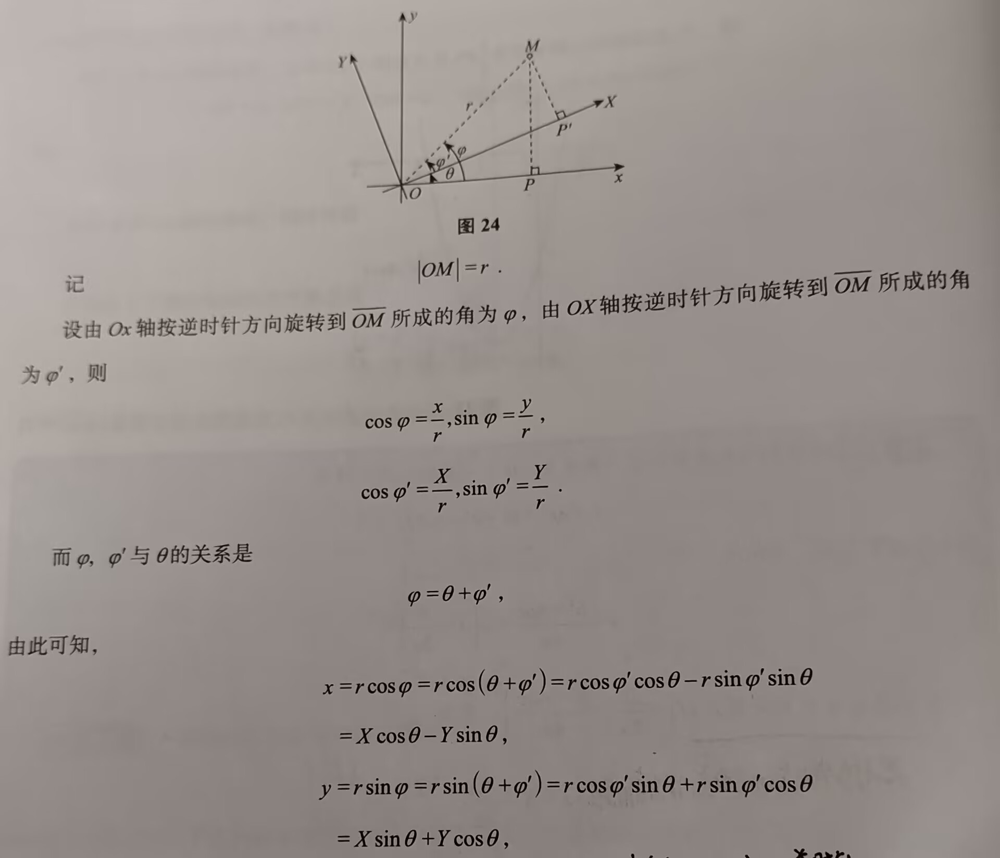

# 知识点汇总

---

### 一、基本逻辑

1. 如果 $A\Rightarrow B$，称`A`是`B`的充分条件，`B`是`A`的必要条件
2. 如果 $A\Leftrightarrow B$，称`A`是`B`的充要条件
3. 如果 $A\nLeftrightarrow B$ ，称`A`是`B`的既非充分也非必要条件，也称为无关条件
- $\overline{A}$  是 $A$ 的对立判断
- 公式
	1. 若 $A\Rightarrow B$，则 $\overline{B}\Rightarrow\overline{A}$；原命题成立，即可推出其逆否命题也成立
	2. $\overline{A\cup B}=\overline{A}\cap\overline{B}$  
	3. $\overline{A\cap B}=\overline{A}\cup\overline{B}$ 
		- 第二、三两点就是德·摩根律，也称为对偶律
### 二、解析式的定义/概念

  
- 单项式：数和字母的积组成的代数式，其中数叫系数，所有字母的指数和叫次数，如：$2a,3b^2,-ab,0$，则 $2a$ 中，`2`是系数，$2a$ 叫一个单项式；$-ab$ 中，-1是系数，$-ab$ 叫二次单项式；0中，0是系数，0叫零次单项式
- ⭐多项式：单项式的和叫多项式，所有单项式中的最高次数，叫多项式的次数，如：$2a+3b^2-ab$，其中，$2a,3b^2,-ab$ 叫多项式的项，$2a+3b^2-ab$ 是二次多项式（因为单项式的最高次数是2）
- 整式：单项式与多项式统称整式
- ⭐分式（注意区分系数为分数的单项式）：设$A,B$为整式，$B$中有字母，则$\frac{A}{B}$叫分式。若求分式的定义域，记得考虑$B\neq 0$ ；当$A$ 的次数小于 $B$ 的次数时，称为真分式，否则称为假分式
- 有理式：分式和整式统称有理式
- 无理式：含有字母的根式运算的代数式（字母在根号内），如：$\sqrt{2x}$ 是无理式，$\sqrt{2}x$是有理式
- 代数式：有理数和无理数的统称，即：由数与字母作有限次加、减、乘、除、开方、乘方等`初等代数运`算得到的式子
- 超越式：**含有字母**的`指数为无理数的指数运算`、`对数运算`、`三角运算`和`反三角运算`的解析式，以上运算也称为`初等超越运算`，以区分初等代数运算，如：$\ln(x^2+y^2),\arctan x,a^{\sqrt{2}}$ 等均为超越式  
- 解析式：代数式和超越式的统称
#### 运算

- 整式运算：使用系数竖式计算法，详情见`基础30讲P6`
- 分式运算：先进行因式分解，消去公因式（如果可以的话），再用多项式长除法，详情见`基础30讲P9` （同页底下注意看$(f(x),g(x))$的解释）

### 三、无理式运算

- $\sqrt[n]{a}$ 称为`a`的`n`次算数根，但要注意：求解与求算数根不同
- 性质：设 $a\geq 0,b\geq 0,m,n,k\text{为正整数}$ 
	1. $\sqrt[n]{a^m}=\sqrt[kn]{a^{km}}$ 
	2. $\sqrt[n]{ab}=\sqrt[n]{a}\cdot\sqrt[n]{b}$ 
	3. $\sqrt[n]{\frac{a}{b}}=\frac{\sqrt[n]{a}}{\sqrt[n]{b}}(b\neq 0)$  
	4. $(\sqrt[n]{a})^k=\sqrt[n]{a^k}$ 
	5. $\sqrt[k]{\sqrt[n]{a}}=\sqrt[kn]{a}$ 
- 重要结论：
	1. 🌟$\sqrt{a^2}=|a|$ （详情见基础30讲P10）
	2. 有理化
		- 无理式·无理式（与上一个无理式为共轭式）= 有理式，如：$(\sqrt{a}+\sqrt{b})(\sqrt{a}-\sqrt{b})=a-b$ 
			- 注意：无理式相乘不一定会得到有理式
		- 🌟重要公式（立方和差公式变化而来）：$(\sqrt[3]{a}\pm\sqrt[3]{b})(\sqrt[3]{a^2}\mp\sqrt[3]{ab}+\sqrt[3]{b^2})=a\pm b$    
		- 立方和差公式：$a^3\pm b^3=(a\pm b)(a^2\mp ab+b^2)$ 
### 四、一元 $n$ 次方程的根与系数关系
 
- 设$f(x)=a_nx^n+a_{n-1}x^{n-1}+\cdots + a_1x+a_0=0(a_n\neq 0)$的根为$x_1,x_2,x_3,\cdots,x_n$，则
	- $x_1+x_2+\cdots+x_n=-\frac{a_{n-1}}{a_n}$   // 任意1个根的组合之和
	- $x_1x_2+x_1x_3+\cdots+x_2x_3+x_2x_4+\cdots+x_{n-1}x_n=\frac{a_{n-2}}{a_n}$  // 任意2个根的组合之和
	- $\cdots\cdots$
	- $x_1x_2x_3x_4x_5\cdots x_n=(-1)^n\cdot\frac{a_0}{a_n}$ // 任意n个根的组合之和
- 当`n=2`时，有韦达定理：即：$f(x)=ax^2+bx+c(a\neq 0)$的两个根$x_1,x_2$的关系为：
	1. $x_1+x_2=-\frac{b}{a}$
	2. $x_1x_2=\frac{c}{a}$ 
### 五、不等式

1. 伯努利不等式（基本不等式，Ber-不等式）：$(1+x)^n\geq 1+nx\; ,\; x>-1$    
2. 均值不等式：$\frac{2}{\frac{1}{a}+\frac{1}{b}}\leq\sqrt{ab}\leq\frac{a+b}{2}\leq\sqrt{\frac{a^2+b^2}{2}}(a,b>0)$  （从左到右以此是：调和平均值，几何平均值，算数平均值，均方根） 
	- 不等式`等号成立`条件：当 $a=b$ 时等号成立
	- 若存在三元，即：$\sqrt[3]{abc}\leq\frac{a+b+c}{3}\leq\sqrt\frac{a^2+b^2+c^2}{3}$ 
3. 三角不等式：$||a|-|b||\leq |a\pm b|\leq |a|+|b|$ 
	- 若：$|a+b|\leq |a|+|b|$ ，则当$a\cdot b\geq 0$ 时等式成立，当$a\cdot b<0$ 时不等式成立
	- 若绝对值内为`减法式子`，则成立条件反过来
4. 🌟柯西不等式：$({a_1}^2+{a_2}^2+\cdots+{a_n}^2)({b_1}^2+{b_2}^2+\cdots+{b_n}^2)\geq (a_1b_1+a_2b_2+\cdots+a_nb_n)^2$  
	- 🌟要注重柯西不等式的证明，明白柯西不等式到底是怎么得出的，证明过程见基础30讲P14
	- 一般常考当`n=2`时的不等式，即：$({a_1}^2+{a_2}^2)({b_1}^2+{b_2}^2)\geq (a_1b_1+a_2b_2)^2$ 
	- 当且仅当：$\frac{a_1}{b_1}=\frac{a_2}{b_2}=\cdots\frac{a_n}{b_n}$时，等号成立
	- 不等式应用见基础30讲P19，例26
5. 🌟🌟🌟二次函数的不等问题：详情见`基础30讲P14`[^1]
6. **函数对称问题**见基础30讲P22处的图表[^2]
7. 函数图像变换问题：
	- $y=f(x)$
		- $\Rightarrow y=f(x)+y_0$ 向上移动$y_0$ (若$y_0<0$则向下移动)
		- $\Rightarrow y=f(x+x_0)$ 向左移动$x_0$
		- $\Rightarrow y=kf(x)$ 垂直伸长至 $k$ 倍（k>0）
		- $\Rightarrow y=f(kx)$ 水平伸长至 $\frac{1}{k}$ 倍 (k>0)
		- 
8. 三角函数变换：若遇到 $a\sin x+b\cos x$，则可先提取 $\sqrt{a^2+b^2}$ ，可将原式子化简为：$\sqrt{a^2+b^2}(\frac{a}{\sqrt{a^2+b^2}}\sin x+\frac{b}{\sqrt{a^2+b^2}}\cos x)=\sqrt{a^2+b^2}\sin (x+\phi)$ ，该思路是由三角函数图像性质得来，图像解释如下：   

### 六、数列

[处理数列的几种办法](处理数列的方法.md)
- 数列$\{x_n\}$ 可看作是自变量为正整数 $n$ 的函数：$x_n=f(n),n\in N_+$ ，当自变量 $n$ 依次取$1,2,3，\cdots$ 一切正整数时，对应的函数值就排列成数列$\{x_n\}$ 
	- 数列的项数是无穷多的，即为：无穷数列
- 🌟数列分类：
	1. 等差数列：
		1. 首项为$a_1$，公差为 $d(d\neq 0)$ 的数列称为等差数列
		2. 通项公式：$a_n=a_1+(n-1)d$
		3. 前n项的和$S_n=\frac{n}{2}[2a_1+(n-1)d]=\frac{n}{2}(a_1+a_n)$
			- ⭐若未给出$a_1\text{和}d$ ，则可尝试列举$a_1+a_2\text{与}a_2+a_3$ 两式子解出
	2. 等比数列：
		1. 首项为$a_1$，公比为 $q(q\neq0)$ 的数列称为等比数列
		2. 通项公式：$a_n=a_1q^{n-1}$
		3. 前n项的和
			- $S_n=na_1,\;\;\;q=1$
			- $S_n=\frac{a_1(1-q^n)}{1-q},\;\;\;q\neq1$ 
			- 常用：$1+q+q^2+\cdots+q^{n-1}=\frac{1-q^n}{1-q}$
### 七、坐标轴旋转

- 旋转图：
- 证明过程及结论：
- 🌟结论（矩阵计算）（好记）：
	1. 用新坐标（X，Y）来替代旧坐标（x，y）：$\begin{pmatrix}x\\y \end{pmatrix}=\begin{pmatrix}\cos\theta & -\sin\theta \\ \sin\theta & \cos\theta \end{pmatrix}\begin{pmatrix}X \\ Y\end{pmatrix}$
		- 即：$x=X\cos\theta-Y\sin\theta,y=X\sin\theta+Y\cos\theta$ 
		- 矩阵计算：（A）= (B)(C)
			- (B)的每一行与(C)的每一列运算，得到(A)的每一行结果(从上到下)
	2. 用旧坐标（x，y）来替代新坐标（X，Y）：$\begin{pmatrix}X\\Y \end{pmatrix}=\begin{pmatrix}\cos\theta & \sin\theta \\ -\sin\theta & \cos\theta \end{pmatrix}\begin{pmatrix}x \\ y\end{pmatrix}$
		-  该矩阵变换，相当于将(B)矩阵从第一点（用新坐标替换旧坐标）`1.`进行了正交变换，即：横变竖，竖变横
### 八、极坐标

- $\text{极角}\theta\text{与极径}r\text{的范围}：$$r>0,\;\;\;0\leq\theta<2\pi$   
- 正弦定理：$\frac{a}{\sin A}=\frac{b}{\sin B}=\frac{c}{\sin C}=2R\;\;(\text{R为外接圆半径})$ 
- 余弦定理：
	- $a^2=b^2+c^2-2bc\cos A$
	- $b^2=a^2+c^2-2ac\cos B$
	- $c^2=a^2+b^2-2ab\cos C$
#### 直角坐标与极坐标的关系

- $x=r\cos\theta,\;\;y=r\sin\theta$
- $r=\sqrt{x^2+y^2}$

[^1]: 重点：二次函数的不等问题
[^2]: 函数对称问题图表