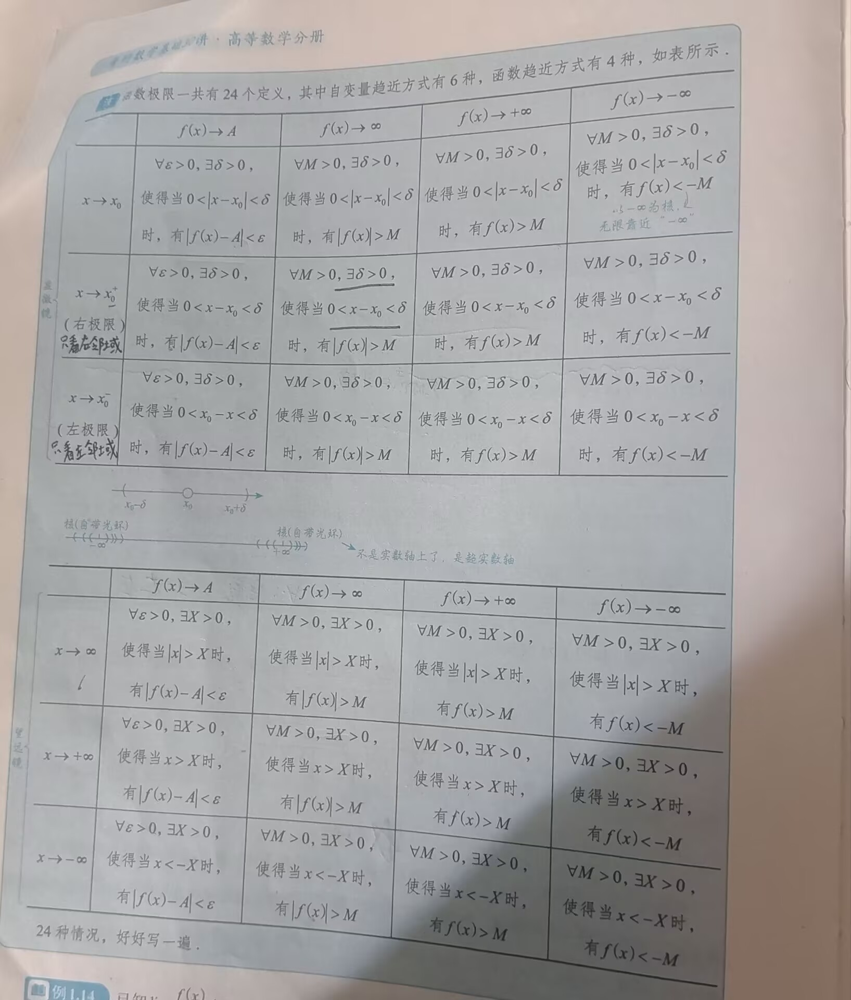

# 知识汇总

---

### 一、函数

- 定义：对于每一个$x\in D（D是定义域）$，有**一个**确定的y值与之对应，则称y为x的函数，记作$y=f(x)$
	- 我们这里所说的函数指的是**单值函数**
- 🌟🌟🌟判断单值函数/多值函数：铅直划线法
	- 画出函数图像后，作铅直线，若**任一**条铅直线与$f(x)$`至多`有一个交点，则$f(x)$为单值函数，否则为多值函数
#### 函数的四大性质
##### 1. 有界性（）

- 1
	- 证明有界性时，$x^2=|x|^2=|x^2|$ 很有用，可用于：$|x|=\sqrt{x^2}$ ，再使用基本不等式进行判断
##### 2. 单调性（）

- 注意区分严格单增与单调不减
##### 3. 奇偶性

 ```
🌟🌟🌟前提：定义域关于原点对称
```
- 基本类型：
	1. $f(x)+f(-x)$必定是偶函数
	2. $f(x)-f(-x)$必定是奇函数
		- 任意函数都可以写成一个奇函数和一个偶函数之和的形式：$f(x)=\frac{1}{2}[f(x)+f(-x)]+\frac{1}{2}[f(x)-f(-x)]=u(x)+v(x)$ ，$u(x)$是偶函数，$v(x)$是奇函数
	3. $f[\phi(x)]\text{(内偶则偶，内奇则外)}$  
	4. $f(x)奇\Rightarrow f\prime(x)偶\Rightarrow f\prime\prime(x)奇\Rightarrow \cdots .$
	5. $f(x)奇\Rightarrow \int_0^xf(t)dt偶$
	6. $f(x)偶\Rightarrow \int_0^xf(t)dt奇$ （仅适用于积分后**下限为0**的变限积分）
	7. 对于任意的$x,y$，都有$f(x+y)=f(x)+f(y)$，则$f(x)$是奇函数，证明可见基础30讲P60
	8. 相同类型函数之间的加减乘除结果不影响其奇偶性，奇函数与偶函数之间的乘除得到的结果会是奇函数，奇函数与偶函数的加减得到的是非奇非偶函数；0既是奇函数又是偶函数
##### 4. 周期性

- 设$f(x)$的定义域为$D$，如果存在一个正数$T$，使得对于任一$x\in D$ ，有$x\pm T\in D$，且$f(x+T)=f(x)$，则称$f(x)$为周期函数，`T`为$f(x)$周期，一般指**最小正周期**  
- 🌟🌟🌟重要结论：
	1. 若$f(x)$以$T$为周期，则$f(ax+b)$以$\frac{T}{|a|}$为周期（$f(kx)$是$f(x)$在水平方向上拉伸了$\frac{1}{k}$的结果）
	2. 若$g(x)$是周期函数，则复合函数$f(g(x))$也是周期函数，如$e^{\sin x},cos^2x$（基础30讲P61）
	3. 若$f(x)$是以$T$为周期的可导函数，则$f\prime (x)$也以$T$为周期，见例3.1(基础30讲)
	4. 若$f(x)$是以$T$为周期的连续函数，则只有在$\int_0^Tf(x)dx=0$时，$\int_0^xf(x)dx$也以$T$为周期，见例9.25(基础30讲)
		- 后两点可以在后面章节学完之后再回头看
#### 特殊函数值

- $a^0=1$，$e^0=1$

#### 三角函数与反三角函数[^8]

- 🌟🌟🌟重要结论：
	1. $1+\tan^2x=\sec^2x$
	2. $1+cot^2x=csc^2x$ 
	3. $\arctan x + arccot x = \frac{\pi}{2}$（x取值在负无穷到正无穷之间）
### 二、反函数

- 前提：满足铅直划线法，即：原函数（或称：直接函数）必须为单值函数
- 定义：若对于每一个$y\in R(R是值域)$，必定存在唯一的$x\in D$，使得$y=f(x)$成立，则由此得到了一个新的函数$x=\phi(y)$，这个函数称为函数$y=f(x)$的反函数，一般记作$x=f^{-1}(y)$ ，该反函数的定义域为R，值域为D
- 🌟🌟🌟判断一个函数是否有反函数：水平划线法
	- 在符合铅直划线法的条件下，作水平直线，若**任一**条水平直线与$f(x)$`至多`有一个交点，则$f(x)$有反函数
- 🌟🌟🌟重要关系：
	- $f[f^{-1}(x)]=x$ 
	- $f^{(-1)}[f(x)]=x$ 
		- 如：$e^{\ln 2^x}=2^x=e^{x\ln2}$ 
- 🌟🌟🌟🌟🌟重要函数（需要具体记忆图像与函数）：
	- 
	- 反双曲正弦函数的反函数表达式及定义域求法见基础30讲P53
	- 🌟🌟🌟🌟重要结论：
		1. 当$x\rightarrow 0$ 时，$\ln(x+\sqrt{x^2+1})\sim x$，即：当$x\rightarrow 0$ 时，反双曲正弦函数$\ln(x+\sqrt{x^2+1})$与$x$ 是等价无穷小
		2. $[\ln(x+\sqrt{x^2+1})]\prime=\frac{1}{\sqrt{x^2+1}}$，于是，$\int\frac{1}{\sqrt{x^2+1}}dx=\ln(x+\sqrt{x^2+1})+C$  
		3. 由于$y=\ln(x+\sqrt{x^2+1})$ 是奇函数，于是$\int_{-1}^{1}[\ln(x+\sqrt{x^2+1})+x^2]dx=\int_{-1}^{1}x^2dx=\frac{2}{3}$ 


### 极限

- 初步：在加减法运算中，不能使用等价无穷小替换
- 在求极限时，若lim f(x) 不为0，则可直接代入
	- 只要代入后不为**未定式**，即可代入
#### 定义：


#### 超实数

- 必须做完`实数运算`后才能进行`趋核运算`，**不能作了趋核运算后又去做实数运算**，详情例子说明见基础30讲P79[^1]

### P83往后（）

### 函数极限性质（）

1. 唯一性：
2. 局部有界性：
3. 局部保号性：

### 间断点（

### 等价无穷小

>[!tip] 等价无穷小代换条件
>已知$\sin x\sim x$，则当$狗\rightarrow 0，且趋近于0的过程中，狗\neq 0时，\sin 狗 \sim 狗$。如果遇到震荡函数，需要使用等价无穷小代换时要特别注意‘因为等价无穷小强调的是"等价"，如果`狗=0`，则说明狗是更高阶的无穷小，无法用等价无穷小代换，因为**0是最高阶的无穷小** 

- 注意等价无穷小广义化后的使用条件！！！

- 🌟🌟🌟🌟🌟当$x\rightarrow 0$ 时，常用的等价无穷小有：[^3]
	1. $\sin x\sim x$  
	2. $\tan x\sim x$
	3. $\arctan x\sim x$
	4. $\arcsin x\sim x$
	5. $\ln(1+x)\sim x$
	6. $e^x-1\sim x$
	7. $a^x-1\sim x\ln a$
		- 可由第六点等价无穷小推出：$当x\rightarrow 0时,x\ln a\rightarrow 0,a^x-1=e^{x\ln a}-1\sim x\ln a$ ，即：等价无穷小的广义化使用
	8. $1-\cos x\sim\frac{1}{2}x^2$ 
	9. $x-\ln(1+x)\sim\frac{1}{2}x^2(x\rightarrow 0)$
		- 该式子由$\ln(1+x)$泰勒展开得到
		- 同时可得：$x-\ln(1+x)\sim 1-\cos x$ 
	10. $(1+x)^a-1\sim ax$ 
	11. $\ln (x+\sqrt{1+x^2})\sim x$ 
	12. $1-(\cos x)^a\sim \frac{1}{2}ax^2$ 
	13. $(1+x)^\frac{1}{x}-e\sim -\frac{e}{2}x\;\;(x\rightarrow 0^+)$  
		- 过程可见基础30讲P102，同时要记住该页中有关$(1+x)^\frac{1}{x}$和$(1+\frac{1}{x})^x$在$x\rightarrow 0$时的图像

>[!tip] 注意条件
>若：$x\rightarrow 1$，则 $\sin\pi x\sim\pi (x-1)$，因为不仅需要 $\sin\pi x \rightarrow 0$，还要满足 $\pi x\rightarrow 0$ 

### 函数大小比较

- 当$x\rightarrow\infty$时，有：$\ln^\alpha x<<x^\beta<<a^x<<x^x$ ，其中$\alpha,\beta > 0,a > 1$ ，符号`<<`表示远远小于；[^2]
- 当$n\rightarrow\infty$时，有：$\ln^\alpha n<<n^\beta<<a^n<<n!<<n^n$，其中$\alpha,\beta > 0,a > 1$ 
 
### 泰勒公式

- 定义：设$f(x)$在点$x=0$处`n`阶可导，则存在$x=0$的一个邻域，对于该邻域内的任一点`x`，有：$f(x)=f(0)+f\prime(0)x+\frac{f\prime\prime(0)}{2!}x^2+\cdots+\frac{f^{(n)}(0)}{n!}x^n+o(x^n)$

- 🌟🌟🌟🌟🌟常用重要函数的泰勒公式：[^4]
	1. $\sin x=x-\frac{x^3}{3!}+o(x^3)$
	2. $\cos x=1-\frac{x^2}{2!}+\frac{x^4}{4!}+o(x^4)$
	3. $\arcsin x=x+\frac{x^3}{3!}+o(x^3)$
	4. $\tan x=x+\frac{x^3}{3}+o(x^3)$
	5. $\arctan x=x-\frac{x^3}{3}+o(x^3)$
	6. $\ln (1+x)=x-\frac{x^2}{2}+\frac{x^3}{3}+o(x^3)$
	7. $e^x=1+x+\frac{x^2}{2!}+\frac{x^3}{3!}+o(x^3)$
	8. $(1+x)^a=1+ax+\frac{a(a-1)}{2!}x^2+o(x^2)$
### 🌟🌟🌟🌟🌟两个重要极限

1. $\lim\limits_{x\rightarrow 0}\frac{\sin x}{x}=1$  
2. $\lim\limits_{x\rightarrow \infty}(1+\frac{1}{x})^x=e$ 

### 数列极限

```
一般提到的单调函数指的是单调不增/不减函数，而不是严格单调
```

- 数列${x_n}$ 可看做自变量为正整数 $n$的函数：$x_n=f(n),n\in N_+$ 
- 一些证明数列有界的方法：
	1. 找$M$，使得$|a_n|\leq M$
	2. 放缩法
	3. 找最值
	4. 基本不等式法
#### 一些常见数列前n项和

1. $\sum_{k=1}^nk=1+2+3+\cdots+n=\frac{n(n+1)}{2}$
2. 🌟🌟🌟$\sum_{k=1}^nk^2=1^2+2^2+3^2+\cdots+n^2=\frac{n(n+1)(2n+1)}{6}$ 

#### 一个重要数列的结论

1. 数列 $(1+\frac{1}{n})^n$[^5]
2. 该数列**递增**且**有上界**
3. $\lim\limits_{x\rightarrow\infty}(1+\frac{1}{n})^n=e$  
#### 数列极限的定义

>[!tip] 数列极限与函数极限的不同
>有界性：**函数极限**的有界性指的是`局部`有界性，而**数列极限**的有界性指的是`全局`有界性 
>保号性：函数极限强调的也是局部保号性，数列极限虽然没有强调局部保号性，但也要强调存在正整数N，当`n>N`时才有$a_n>0$(或<0)

- 设$\{x_n\}$为一数列，若存在常数 $a$，对于任意的$\varepsilon>0$ （不论它多么小），总存在正整数$N$，使得当$n>N$时，$|x_n-a|<\varepsilon$ 恒成立，则称常数$a$ 是数列$\{x_n\}$ 的极限，或者称数列$\{x_n\}$收敛于 $a$，记为：$\lim\limits_{n\rightarrow\infty}x_n=a$ 或 $x_n\rightarrow a(n\rightarrow\infty)$
	- 即 $\varepsilon - N语言$：$\forall\varepsilon>0,\exists N>0,使得n>N时，恒有|x_n-a|<\varepsilon$   
		- 当 $a=0$ 时，称 $x_n$ 为 $n\rightarrow\infty$ 时的无穷小量
- $\lim\limits_{n\rightarrow\infty}x_n=\infty\Leftrightarrow$ $\forall X>0,\exists N>0$，当$n>N$时，恒有$|x_n|>X$，此时称 $x_n$ 为 $n\rightarrow\infty$ 时的无穷大量
##### 数列收敛与其子列收敛的关系

- 数列收敛 $\Rightarrow$ 其子列一定收敛，并且收敛极限相同
- 🌟🌟子列收敛 $\nRightarrow$ 数列收敛/发散
- 子列发散 $\Rightarrow$ 数列发散
- 两个不同子列收敛于不同的极限值 $\Rightarrow$ 数列发散
##### 极限与绝对值的极限之间的关系

- 数列有：$\lim\limits_{n\rightarrow\infty}a_n=A$ $\Rightarrow$ $\lim\limits_{n\rightarrow\infty}|a_n|=|A|$ 
- 函数有：$\lim\limits_{x\rightarrow x_0}f(x)=A$ $\Rightarrow$ $\lim\limits_{x\rightarrow x_0}|f(x)|=|A|$ 
	- 若极限值 $A=0$，则两式子均可从右式推得左式，证明可见基础30讲P128

#### 收敛数列的性质

1. 唯一性：数列的极限若存在，则其极限必定唯一
2. 有界性：若数列极限存在，则该数列有界
3. [^6]保号性：设 $\lim\limits_{n\rightarrow\infty}x_n=a>b$，则存在$N>0$，当$n>N$时，有$x_n>b$ .若数列$\{x_n\}$ 从某项起有$x_n\geq b$，且 $\lim\limits_{n\rightarrow\infty}=a$，则 $a\geq b$ ，其中 $b$ 为任意实数，常考`b=0`的情形
	- 脱帽解法：
		- $\lim\limits_{n\rightarrow\infty}x_n>a\Rightarrow x_n>a$ （严格不等）
		- $\lim\limits_{n\rightarrow\infty}x_n<a\Rightarrow x_n<a$ （严格不等） 
#### 极限的四则运算

```
拆开后的极限也必须存在，才能使用极限的四则运算
```

#### 🌟🌟🌟🌟🌟海涅定理/归结原则

- 设$f(x)$在 $x_0$ 的**去心邻域**内有定义，则 $\lim\limits_{x\rightarrow x_0}f(x)=A$ 存在 $\Leftrightarrow$ 对`任何` $x_0$ 的去心邻域内，以 $x_0$ 为极限的数列 $\{x_n\}(x_n\neq x_0)$，极限 $\lim\limits_{n\rightarrow\infty}f(x_n)=A$ 存在

#### 放缩（常用于夹逼准则）

1. 简单的放缩：
	1. 针对**无穷项**相加：$n\cdot u_{min}\leq u_1+u_2+\cdots+u_n\leq n\cdot u_{max},(n\rightarrow\infty)$ 
	2. 针对**有限项**相加：当 $u_i\geq 0$ 时，$1\cdot u_{max}\leq u_1+u_2+\cdots+u_n\leq n\cdot u_{max}$ 
2. 利用重要不等式（待补充，基础30讲P133）[^7]
3. 设 $a\geq b \geq 0$ ，则：
	1. 当 $m>0$ 时，$a^m\geq b^m$
	2. 当 $m < 0$ 时，$a^m\leq b^m$ 
		- 即：指数相同时，若指数为正，则底数越大，值越大，否则反之
4. 若 $0<a<x<b,\;\; 0<c<y<d$ ，则 $\frac{c}{b}<\frac{y}{x}<\frac{d}{a}\Rightarrow c\frac{1}{b}<y\frac{1}{x}<d\frac{1}{a}$    
	- 具体例题可见基础30讲P133
5. 基本放缩方法：
	1. $\sin x <x<\tan x\;(0<x<\frac{\pi}{2})$
	2. $\sin x<x\;(x>0)$
		- 如：当$x_n>0$ 时，$x_{n+1}=\sin x_n<x_n$，故$\{x_n\}$ 单调减少
	3. $x<\tan x<\frac{4}{\pi}x\;\;(0<x<\frac{\pi}{4})$ 
		- 证明可见习题6.9
	4. $\sin x >\frac{2}{\pi}x\;\;(0<x<\frac{\pi}{2})$
	5. $\arctan x\leq x\leq\arcsin x\;\;(0\leq x \leq 1)$ 
		- 可考：当 $x_n>0$ 时，$x_{n+1}=\arctan x_n<x_n$ ，故$\{x_n\}$ 单调减少
	6. $e^x\geq x+1\;(任意x)$ 
		- 可考：当 $x_{n+1}=e^{x_n}-1$ 时，由 $e^{x_n}-1\geq x_n$ ，得 $x_{n+1}\geq x_n$，即：$\{x_n\}$ 单调不减 
	7. $x-1\geq\ln x\;\;(x>0)$ 
		- 可考：当 $x_n>0$ 时，若 $x_{n+1}=\ln x_n+1$ ，由 $\ln x_n+1\leq x_n$，得 $x_{n+1}\leq x_n$，即：$\{x_n\}$ 单调不增  
	8. $\frac{1}{1+x}<\ln(1+\frac{1}{x})<\frac{1}{x}\;\;(x>0)$ 或 $\frac{x}{1+x}<\ln(1+x)<x\;\;(x>0)$ 
		- 中值定理可证明

#### 需要记忆的极限结论

1. $a_i(i=1,2,\cdots,m)$ 都是非负数，则 $\lim\limits_{n\rightarrow\infty}\sqrt[n]{a_1^n+a_2^n+\cdots+a_m^n}=\max\{a_1,a_2,\cdots,a_m\}$      


[^1]: 易错点：极限运算顺序错误
[^2]: 重点记忆：函数比大小
[^3]: 重点记忆：等价无穷小
[^4]: 重点记忆：泰勒公式
[^5]: 记忆：数列重要极限
[^6]: 灵活运用：保号性，脱帽戴帽公式要牢记
[^7]: 待补充
[^8]: 牢记，可能会有意想不到的用处，如：arcsinx + arccosx = π/2