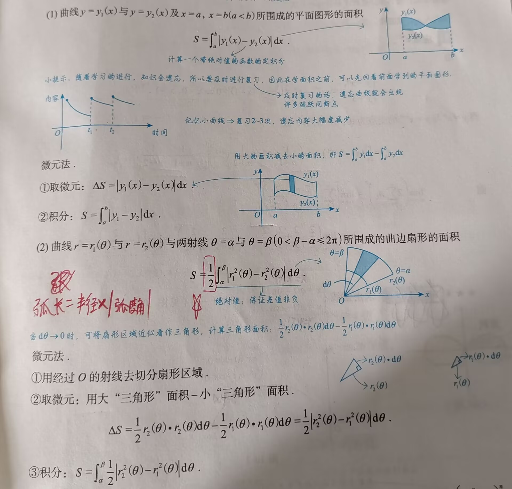

# 一元函数积分的几何应用

---

```
测度：长度、体积、面积
```

### 一、用定积分表达和计算**平面图形**的面积[^1]

```
定积分：推广 ---> 可能用到收敛情况下的反常积分
平面图形：
	三大体系下的图形：
		1. 直角坐标系下：直接算
		2. 参数方程下：直接算（情况较少）；换元法（大多数情况）
		3. 极坐标下：直接算
面积：可以推广为用收敛的反常积分进行表示
```




>[!tip] 扇形面积计算公式
>1. $S=\frac{n}{360}\pi R^2$， 其中 n 为圆心角，R 为扇形半径
>2. $S=\frac{1}{2}lR$，其中 $l$ 为扇形的弧长
>3. $S=\frac{1}{2}\theta R^2$，其中$\theta$是以弧度表示的圆心角
>弧长 $l = \theta R$

### 二、


[^1]: 及时回看，以免遗忘