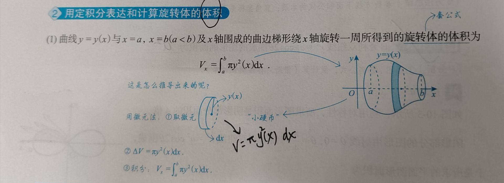
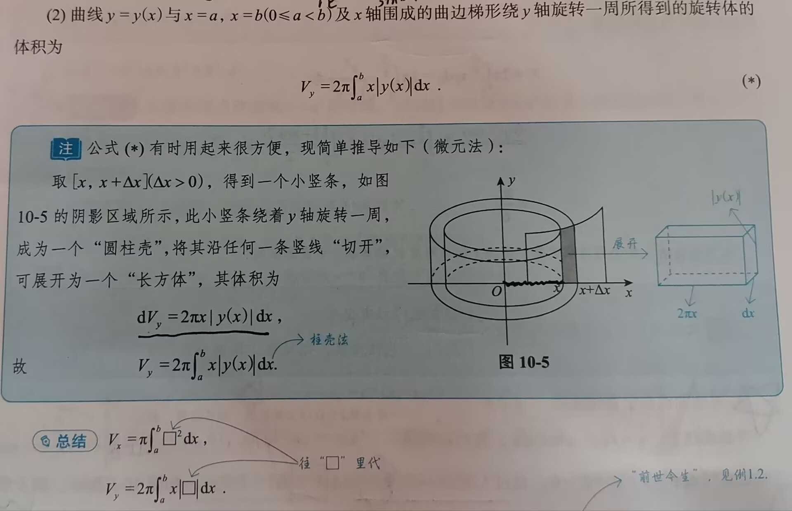
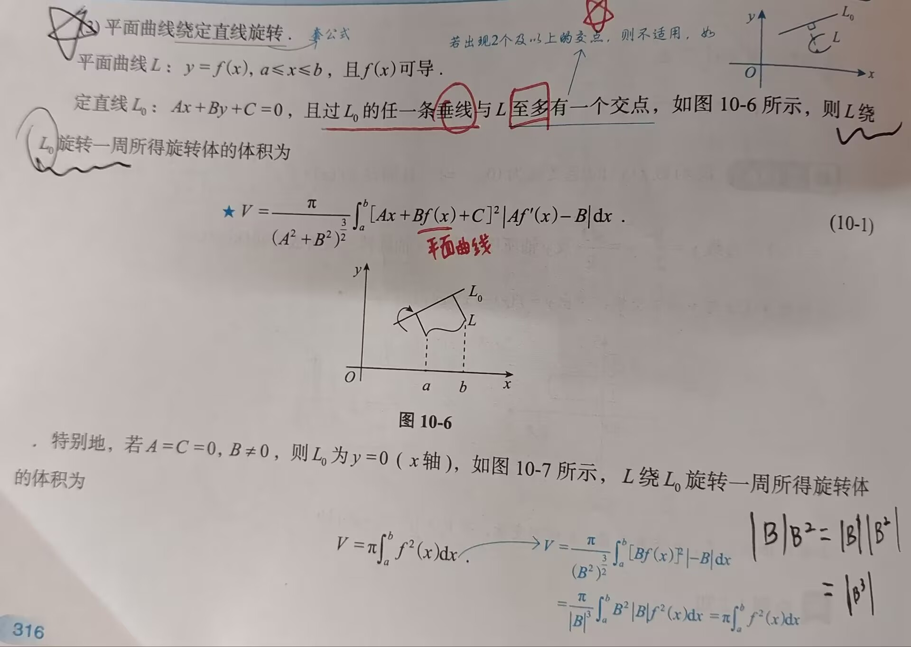
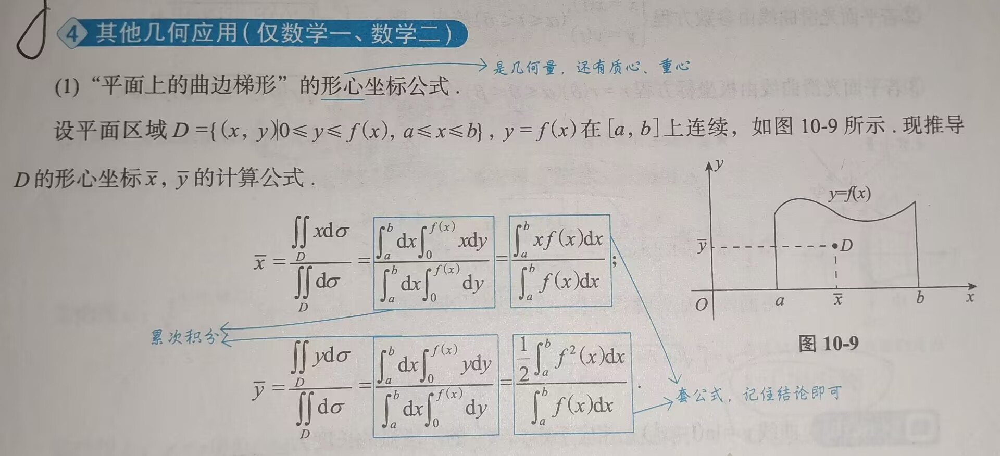
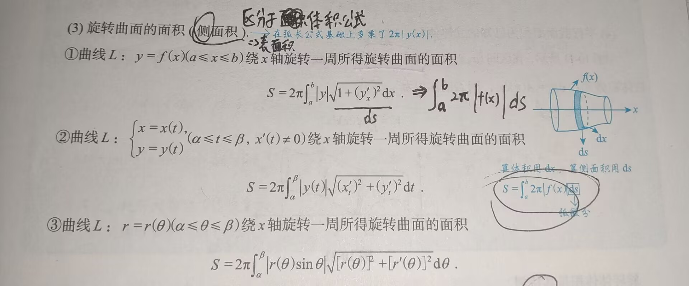
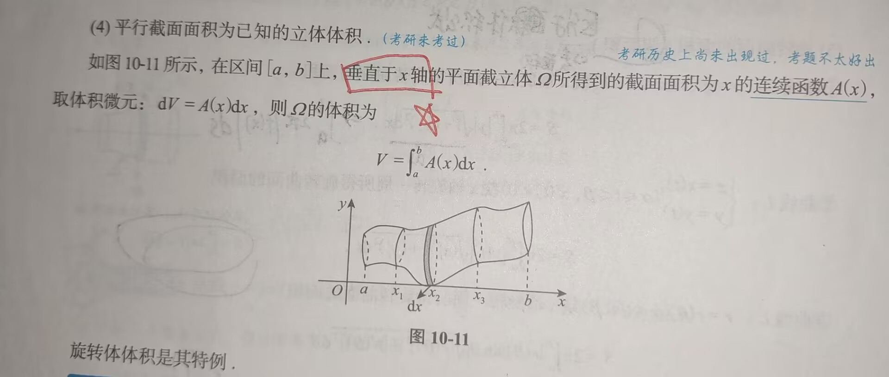

# 一元函数积分的几何应用

---

```
测度：长度、体积、面积
熟悉基础30讲P591~P593的几种常见平面图形，在计算中时常要用到
```

### 一、用定积分表达和计算**平面图形**的面积[^1]

```
定积分：推广 ---> 可能用到收敛情况下的反常积分
平面图形：
	三大体系下的图形：
		1. 直角坐标系下：直接算
		2. 参数方程下：直接算（情况较少）；换元法（大多数情况）
		3. 极坐标下：直接算
面积：可以推广为用收敛的反常积分进行表示
```


>[!tip] 扇形面积计算公式
>1. $S=\frac{n}{360}\pi R^2$， 其中 n 为圆心角，R 为扇形半径
>2. $S=\frac{1}{2}lR$，其中 $l$ 为扇形的弧长
>3. $S=\frac{1}{2}\theta R^2$，其中$\theta$是以弧度表示的圆心角
>弧长 $l = \theta R$

### 二、用定积分表达和计算旋转体的体积
#### 1. 绕 **x 轴**旋转


#### 2. 绕 **y 轴**旋转


	"**柱壳法**"求体积：将截取的一小块（阴影部分）绕 y 轴旋转，可得到一个小的空心圆柱，将其平摊展开，可**近似**得到右侧的长方体，长为 $2\pi x$ ，宽为 $dx$，高为 $|y(x)|$ （因为绕 y 轴旋转，不一定都是正的，可能是从 y+ 到 y - 都有涉及的图形） 
##### 如何判断具体解题是使用绕 x 轴旋转还是绕 y 轴旋转？

- 若所给图形是 y(x) 与 y 轴围成的：
	1. 若要求该图形绕 x 轴旋转的体积，则求出其反函数 $x = \phi(y)$（将x ，y地位互换），再使用绕  y 轴旋转的体积公式（因为相当于将坐标轴旋转了，x 轴变到了原先 y 轴的位置，还要注意要将公式中的 x 换成 y， y(x) 换成 $\phi(y)$） 
	2. 若要求该图形绕 y 轴旋转的体积，则同理，求出 $x=\phi(y)$ 后，再使用绕 x 轴旋转的体积公式即可

>[!tip]
>先来看做法：若函数y(x)与x轴围成图形，则若该图形绕x轴旋转，则使用绕x轴旋转的公式，否则使用绕y轴旋转的公式；若是y(x)与y轴围成图形，则该图形绕y轴旋转，则使用绕x轴旋转公式，否则使用绕y轴旋转的公式，记得变换公式中x和y的位置
>本质上是这样：若函数y(x)与某一坐标轴围成图形，则若要绕该坐标轴旋转，则使用绕x轴旋转的公式；若要绕另一坐标轴进行旋转，则使用绕y轴旋转的公式，必须要注意公式的字母是否正确


#### 3. 平面曲线绕**直线**旋转




### 三、用定积分表达和计算函数的平均值

设 $x\in [a,b]$ ，函数 $y(x)$ 在 $[a,b]$ 上的平均值为 $\overline{y}=\frac{1}{b-a}\int_a^by(x)\;dx\Rightarrow\overline{y}=y(\xi)\; ,\;\xi\in [a,b]$    

### 四、其他几何应用

#### 1. “平面上的曲边梯形”的形心坐标公式

```
什么是形心？形心就是物体中所有点的平均位置，也可以说是面的形心就是截面图形的几何中心
```

计算公式：
直接记住最终的公式即可，目前还没学二重积分，所以不用纠结公式是怎么来的

#### 2. 平面曲线的弧长

1. 若平面光滑曲线由直角坐标系方程 $y=y(x)(a\leq x\leq b)$ 给出，则 $s=\int_a^b\sqrt{1+[y\prime(x)]^2}\;dx$ 
2. 若平面光滑曲线由参数方程 $x=x(t),y=y(t)\;(\alpha\leq t\leq\beta)$ 给出，则 $s=\int_\alpha^\beta\sqrt{[x\prime(t)]^2+[y\prime(t)]^2}\;dt$ 
3. 若平面光滑曲线由极坐标方程 $r=r(\theta)(\alpha\leq\theta\leq\beta)$ 给出，则 $s=\int_\alpha^\beta\sqrt{[r(\theta)]^2+[r\prime(\theta)]^2}\;d\theta$ 
- 基本微元计算公式：$ds=\sqrt{(dx)^2+(dy)^2}$ 
	- 其中，$ds$ 是弧微分，所以 $s=\int_a^b\sqrt{(dx)^2+(dy)^2}$ ，其他公式都是由该微分公式衍生推算出的

#### 3. 旋转曲面的面积（**侧面积**）

>[!tip] 注意事项！！！
>1. 注意与**体积公式**进行区分
>2. 注意该侧面积求的是**绕 x 轴旋转**所得的旋转曲面面积



实际上，所有公式都是由侧面积的基本公式 $S=\int_a^b2\pi |f(x)|\;ds$ 变形而来

#### 4. 平行截面面积为已知的立体体积

如图，在区间 $[a,b]$ 上，`垂直于 x 轴`的平面截立体 $\Omega$ 所得到的截面面积为 x 的**连续函数** $A(x)$，取体积微元：$dV=A(x)\;dx$，则 $\Omega$ 的体积为：$V=\int_a^bA(x)\;dx$ 
	若某平面截立体并未垂直于x轴，则需要求出其截面面积 $\alpha A(x)$ ，然后代入体积公式 

- 为什么说旋转体体积是其特例？因为该已知平行截面面积的立体体积，可看做是某一函数 $g(x)$ 绕某一曲线 $p(x)$ 旋转得到的

[^1]: 及时回看，以免遗忘