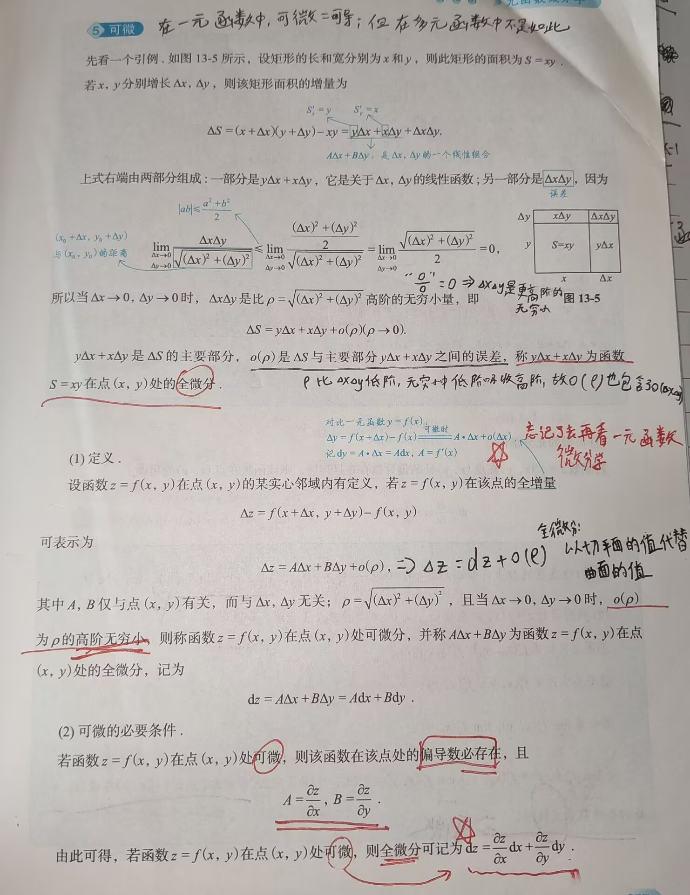
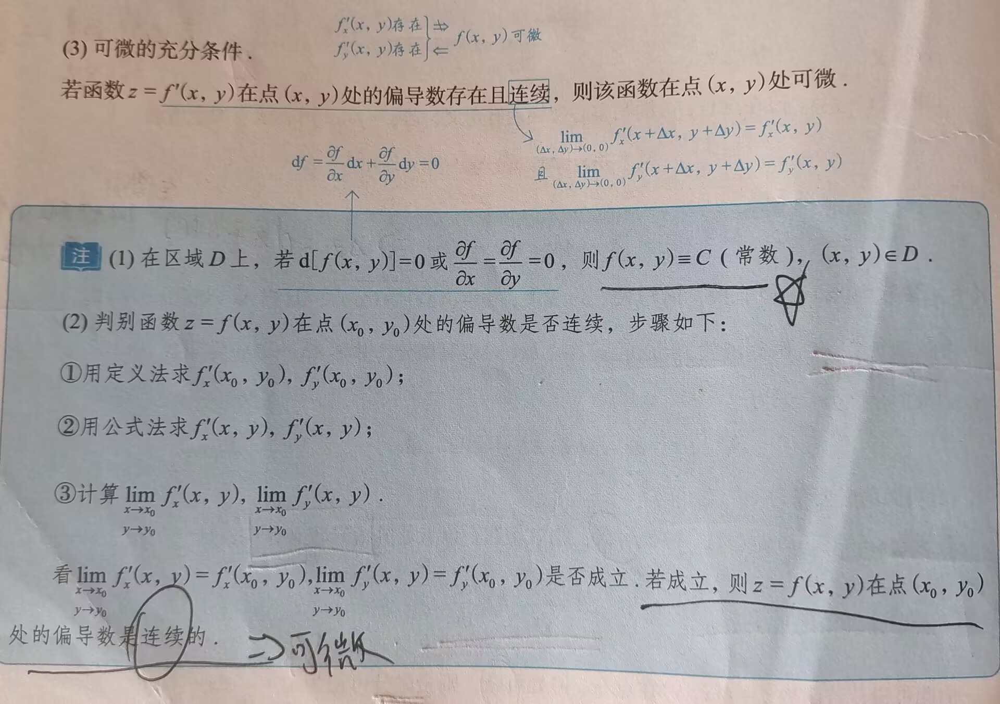
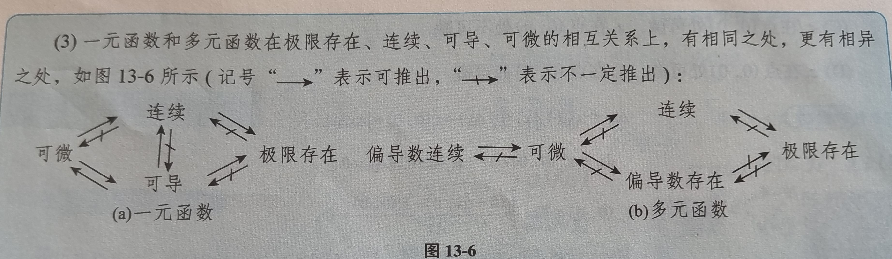
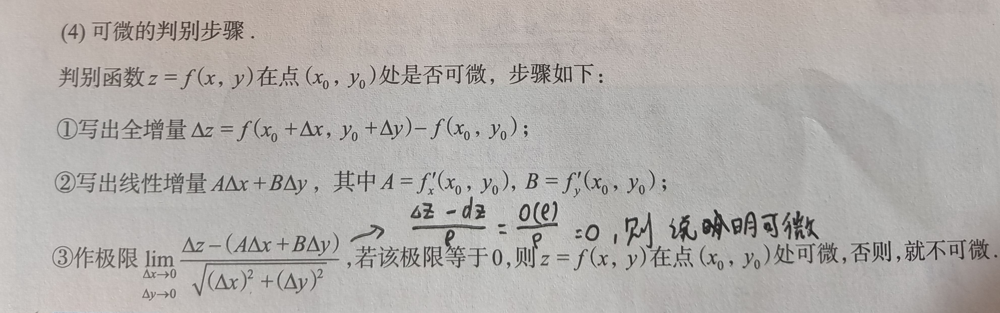
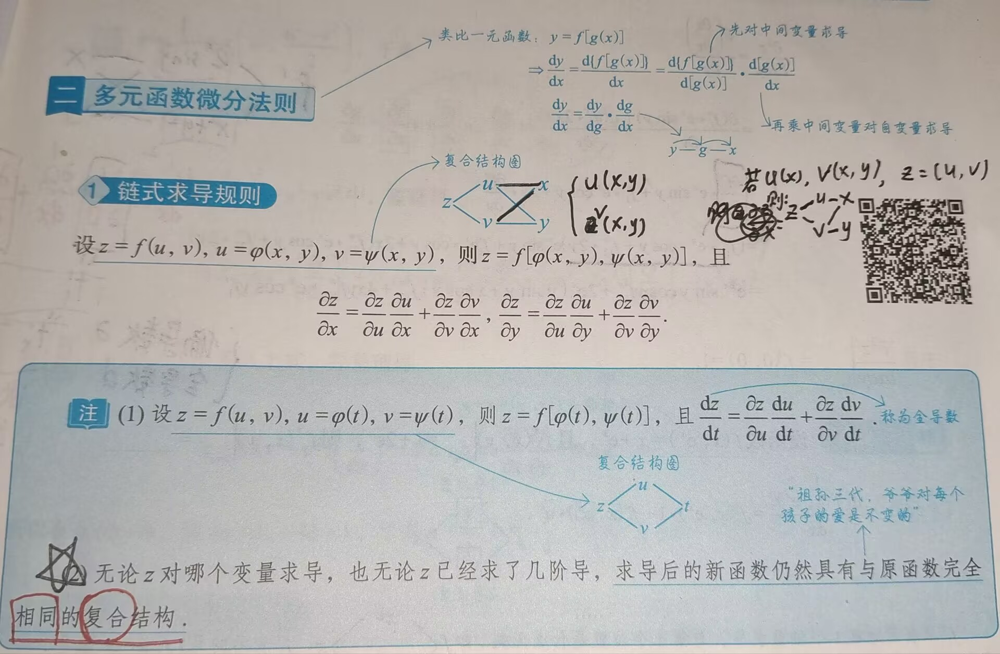
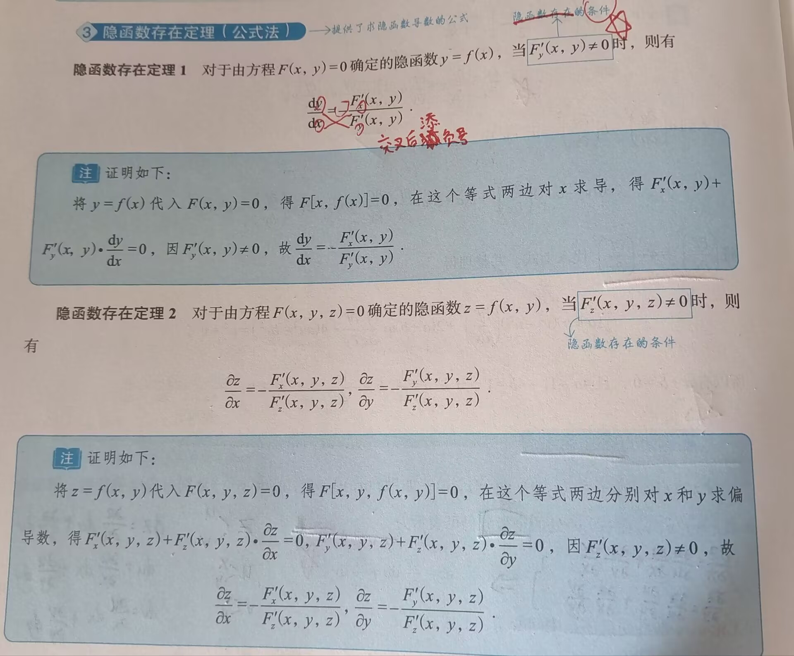

# 多元函数微分学

---

### 一、基础知识结构：

- 基本概念
	- 邻域
	- 极限
	- 连续
	- 偏导数
	- 可微
- 多元函数微分法则
	- 链式求导规则
	- 全微分形式不变性
	- 隐函数存在定理（公式法）
	- 二元函数的拉格朗日定理
- 多元函数的极值与最值
	- 概念
	- 无条件极值
	- 条件最值与拉格朗日乘数法
	- 最远（近）点的垂线原理
	- 有界区域上连续函数的最值问题

### 二、基本概念
#### 1. 邻域


#### 2.  极限

设函数 $f(x,y)$ 在区间D上有定义，$P_0(x_0,y_0)\in D$ 或为区域 $D$ 边界上的一点，若对于任意给定的 $\varepsilon >0$，总存在 $\delta >0$ ，当点 $P(x,y)\in D$，且满足 $0<|PP_0|=\sqrt{(x-x_0)^2+(y-y_0)^2}<\delta$ 时，恒有：$|f(x,y)-A|<\varepsilon$，则称常数**A**为 $(x,y)\rightarrow (x_0,y_0)$ 时 $f(x,y)$ 的极限，记作：$\lim\limits_{(x,y)\rightarrow (x_0,y_0)}f(x,y)=A$ 或 $\lim\limits_{x\rightarrow x_0\atop y\rightarrow y_0}f(x,y)=A$，$\lim\limits_{P\rightarrow P_0}f(P)=A$ 


>[!tip] 注意极限的定义！！！
>极限具有唯一性，若极限存在，则所有路径得到的极限值必定相等，否则极限不存在

- 不仅要记住极限的脱帽法，也要熟练运用不等式的脱帽法，牢记"**脱帽严格不等，戴帽非严格不等**"
#### 3. 连续

如果 $\lim\limits_{x\rightarrow x_0\atop y\rightarrow y_0}f(x,y)=f(x_0,y_0)$，则称函数 $f(x,y)$ 在点 $(x_0,y_0)$ 处连续，如果 $f(x,y)$ 在区域D上每一处都连续，则称 $f(x,y)$ 在区域D上连续

>[!tip] 注
>如果**多元函数**不连续，在考研大纲中不要求讨论间断点类型

##### 一元函数与多元函数的连续与间断的区别


#### 4. 🌟🌟🌟偏导数

```
偏导数是方向导数的特例，理解偏导数时，想象一个人在山顶处往下滑，他可能会从任意方向滑下来，若我们将其放在与XoZ平面平行的一个平面内，想象其下滑路径就是在这个平面内（如下图13-4(a)），那么他沿该平面往山下滑下，则该路径的切平面就是对x的偏导数
```
偏导数的定义也可写作如下形式-----**函数差值式**：$f\prime _x(x_0,y_0)=\frac{\partial z}{\partial x}|_{(x_0,y_0)}=\lim\limits_{x\rightarrow x_0}\frac{f(x,y_0)-f(x_0,y_0)}{x-x_0}$ 
下图所给的偏导数定义是**增量式**表达：


>[!tip] 注
>仅当**二阶混合偏导数连续**时，才与求导次序无关，即$\frac{\partial^2 z}{\partial x\partial y}=\frac{\partial^2 z}{\partial y\partial x}$；否则不成立

- 二阶偏导数与导数的求解规则差不多
	- 在某一**特定点**（分段点）处求偏导，使用偏导数**定义**进行计算
	- 非特定点（非分段点），即：区间中，**直接**对函数进行**偏导**计算
- 遇到 $f(x,y)=\int_a^{x+y}(x-y+t)f(t)\;dt$ 这类被积函数中有x和y时，需要将其进行拆分：$f(x,y)=x\int_a^{x+y}f(t)\;dt-y\int_a^{x+y}f(t)\;dt+\int_a^{x+y}tf(t)\;dt$，在对x求偏导时，将y视作常数，在对y求偏导时，将x视为常数 
- 遇到 $\int_0^{+\infty}e^{-x}\;dt$，$\int_0^{+\infty}e^{-x^2}\;dt$，$\int_0^{+\infty}x^{a-1}e^{-x}dt$ 时，需要联想到 $\Gamma$ 函数，使用该函数结论直接得出答案更快速
- 🌟🌟🌟**二元函数的换元**，例如：$f(x,y)=\int_0^{xy}e^{-xt^2}\;dt$ 时，若要对x求偏导，则被积函数内不能有x，那么为了能求偏导，我们就需要想办法将被积函数中的x取出来，此时就需要换元，先从简单角度来想，若我们设 $u=xt^2$，则 $du=2txdt$，$dt=\frac{1}{2tx}du$，无法用 u 将 t 全部替代，所以不能这样换元，那么我们对该换元进行降次，令 $u=\sqrt{x}t$，则 $du=\sqrt{x}dt$，$dt=\frac{1}{\sqrt{x}}du=x^{-\frac{1}{2}}dt$，成功将所有 t 用 u 来代替，得到换元后的函数：$f(x,y)=x^{-\frac{1}{2}}\int_0^{xy}e^{-u^2}du$，随后即可对x求偏导
- 🌟🌟🌟两种方式求某一点的偏导数：
	1. $f\prime_x(x_0,y_0)=f\prime_x(x,y_0)|_{x=x_0}$ ------先代值再求导（因为是对x求偏导，用不到y，所以可以先将y的值代入）
	2. $f\prime_x(x_0,y_0)=f\prime_x(x,y)|_{x=x_0,\atop y=y_0}$   ------先求导再代值
	哪种方式方便就用哪种去计算
#### 5. 可微

>[!tip] 
>当遇到 $\frac{\partial f}{\partial y}$ 时，若要对其积分求得原函数，则要牢记，$\text{原函数}f(x,y)=\int\frac{\partial f}{\partial y}\;dx=g(x,y)+\phi(x)$

##### 可微的定义及必要条件



牢记可微**必要条件**及全微分形式，若函数可微，则可能会用到该全微分

##### 可微的充分条件及偏导数连续的证明



>[!tip] 注意
>多元函数可微可得偏导存在，但**不能保证偏导数连续**（可见可微的必要条件），而偏导存在不能推出可微，只有偏导存在且连续时，才能证明可微

##### 一元函数及多元函数在极限存在、连续、可导、可微的相互关系


##### 多元函数可微的判别



若函数可微，则 $\Delta z=A\Delta x + B\Delta y+O(\rho)$，$dz=A\Delta x +B\Delta y$，故 $\Delta z-dz=O(\rho)$ ，而 $\rho =\sqrt{(\Delta x)^2+(\Delta y)^2}$        
### 三、多元函数微分法则
#### 1. 链式求导规则


对于注解中的第二点，若复合结构如下（1）所示，则假设z对x求导后得到的函数为 $f\prime_1(u,v)$，则$f\prime_1(u,v)$ 与 u、v、x、y的关系和$z=f(x,y)$ 相同，即：$f\prime_1(u,v)$ 的中间变量也为 u、v，且 u、v始终是与x、y有关的函数

🌟🌟🌟一般对于 $f(u,v),u=\phi(x),v=\Phi(y)$ 来说，使用 $f\prime_1(u,v)$ 来表示对第一个位置进行求导，即：$\frac{\partial z}{\partial x}=\frac{\partial z}{\partial u}\cdot\frac{\partial u}{\partial x}=f\prime_1\cdot\frac{\partial u}{\partial x}$ [^1] 
	帮助理解：参考一元函数的嵌套，即：$f(g(x))$ ，对该函数求导，得到的结果还要再乘上对 $g(x)$ 求导的结果，即：$[f(g(x))]\prime=f\prime(g(x))g\prime(x)$
	有些时候也有可能将 $f\prime_1$ 写成 $f\prime_x$，需要注意识别辨认


求导的时候是对第二个位置进行求导，所以不用管第二个位置的函数到底是什么，只需要用 $f\prime_2$ 表示即可；对其他位置求导同理


#### 2. 全微分不变性

设 $z=f(u,v),u=u(x,y),v=v(x,y)$，如果 $f(u,v),u(x,y),v(x,y)$ 分别有连续偏导数，则复合函数 $z=f(u,v)$ 在 $(x,y)$ 处的全微分仍可表示为：$dz=\frac{\partial z}{\partial u}du+\frac{\partial z}{\partial v}dv$ 
	$\frac{\partial z}{\partial x}=\frac{\partial z}{\partial u}\cdot\frac{\partial u}{\partial x}$ ，两边同时乘以dx可得到dz的表达式，即如上的全微分形式，$\frac{\partial z}{\partial y}$ 也同理

#### 3. 隐函数存在定理（公式法计算）

>[!tip] 🌟🌟🌟公式法求导的注意事项[^3]
>公式法求导时，x,y,z是独立的，不论他们之间有什么关联，在求导时均看做独立无关的变量，对x求导时，将y，z看做常数，对y和z求导时 同理



隐函数存在定理1的公式为：$\frac{dy}{dx}=-\frac{F\prime_x(x,y)}{F\prime_y(x,y)}$

隐函数存在定理2的公式记法与1相同，也是"交叉后添负号"

>[!tip] 做题技巧
>若求出 $F\prime_x(x,y,z)\neq 0$，则可确定存在隐函数 $x=x(y,z)$  ，求偏导过程中要将x,y,z视作三个不同的毫无关联的变量去求导

>[!tip] 隐函数存在定理的完整叙述[^2]
>设$F(x,y)$在点$(x_0,y_0)$的某邻域内有连续的偏导数，且$F(x_0,y_0)=0$，则$F\prime_y(x_0,y_0)\neq 0$是$F(x,y)=0$在点$(x_0,y_0)$的某邻域内能确定一个连续函数$y=y(x)$，且满足$y_0=y(x_0)$的**充分非必要条件**（前者可推出后者，但后者推不出前者）


#### 4. 二元函数的拉格朗日定理
##### 定理

设 $f(x,y)$ 定义在区域D上，且 $\frac{\partial[f(x,y)]}{\partial x}=0$，$\frac{\partial[f(x,y)]}{\partial y}=0$，$(x,y)\in D$，则 $f(x,y)=C$（常数），$(x,y)\in D$ 

##### 区分一元函数的拉格朗日定理

```
注意：一元函数的拉格朗日定理不是中值定理
```
定理：$f\prime(x)=0\Rightarrow f(x)=C$ 


该定理结论不能简单的推广至二元函数，会出现错误，因此要牢记这两种不同的拉格朗日定理

### 四、多元函数的极值与最值
#### 1. 概念
##### (1) 极值定义

若存在点 $(x_0,y_0)$ 的某个**邻域**（局部），使得在该邻域内任意一点$(x,y)$，均有 $f(x,y)\leq f(x_0,y_0)$（或：$f(x,y)\geq f(x_0,y_0)$）成立，则称点 $(x_0,y_0)$ 为 $f(x,y)$ 的**极大值点**（或：**极小值点**） ，$f(x_0,y_0)$ 为$f(x,y)$ 的**极大值**（或：**极小值**）
	极值点不要求在该点连续或可微
###### 二元函数极值重要结论

- 设函数 $f(x,y)$ 具有二阶连续偏导数，且在点 $(x_0,y_0)$ 处取得**极大值**，记 $a=\frac{\partial ^2f}{\partial x^2}|_{(x_0,y_0)}$，$b=\frac{\partial ^2f}{\partial y^2}|_{(x_0,y_0)}$，则 $a\leq 0,b\leq 0$ 
	- 二阶导为0可能是变化速度过慢，难以观测导致的，所以需要考虑为0的情况
	- 似乎可以结合一元函数中求极值的第二充分条件来一同记忆（一元函数中，若$f\prime(x_0)=0,f\prime\prime(x_0)\neq 0$，则当 $f\prime\prime(x_0)<0$ 时，$f(x)$在点$x_0$处取到极大值，当$f\prime\prime(x_0)>0$ 时取到极小值）
##### (2) 最值定义

设点 $(x_0,y_0)$ 为 $f(x,y)$ **定义域**（整体）内一点，若对于 $f(x,y)$ 的定义域内任意一点 $(x,y)$ 均有 $f(x,y)\leq f(x_0,y_0)$（或：$f(x,y)\geq f(x_0,y_0)$） 成立，则称$f(x_0,y_0)$ 为 $f(x,y)$ 的**最大值**（或：**最小值**）
#### 2. 无条件极值


#### 3. 条件极值与拉格朗日乘数法


#### 4. 最远（近）点的垂线原理


#### 5. 有界闭区间上连续函数的最值问题

1. 理论依据-----最大值与最小值定理：在有界闭区域D上的多元连续函数，在区域D上一定有最大值和最小值
2. 求法：
	1. 根据 $f\prime_x(x,y)$，$f\prime_y(x,y)$为0或不存在，求出区域D内部的所有可疑点
	2. 用**拉格朗日乘数法**或**代入法**（式子较简单时可用）求出区域D**边界**（相当于一元函数的区间端点）上的所有可疑点
	3. 比较以上所有可疑点的函数值大小，取其最小者为最小值，最大者为最大值
		- 可与一元函数求最值做联系和对比，以方便记忆


[^1]: 重点理解多元链式求导
[^2]: 隐函数存在定理的完整叙述（重要）
[^3]: 隐函数求导要注意的细节（不同于链式求导）