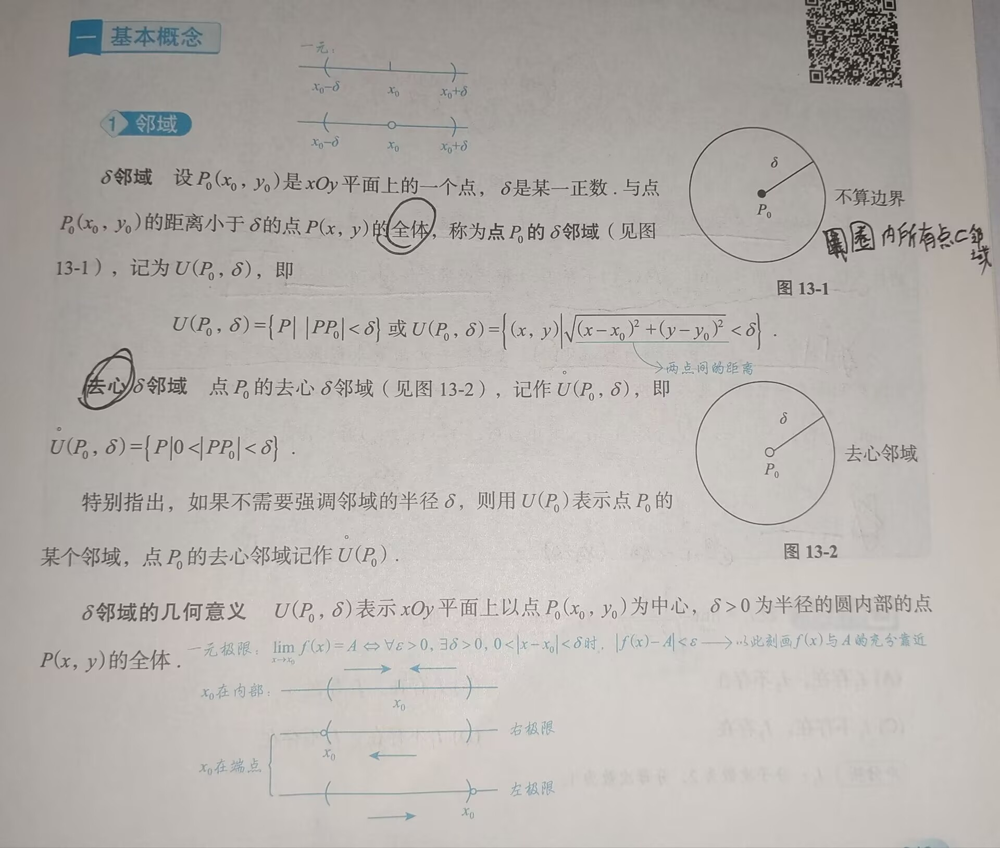
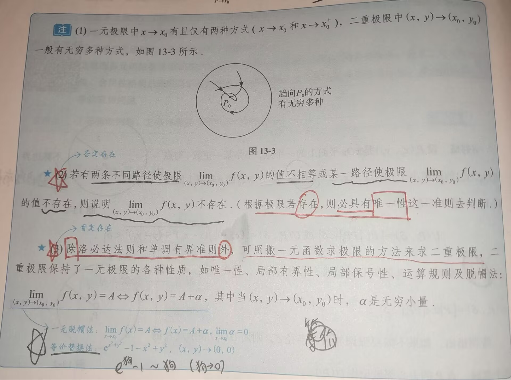
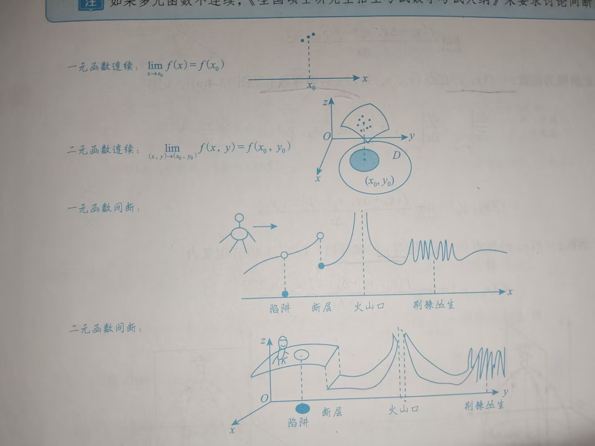
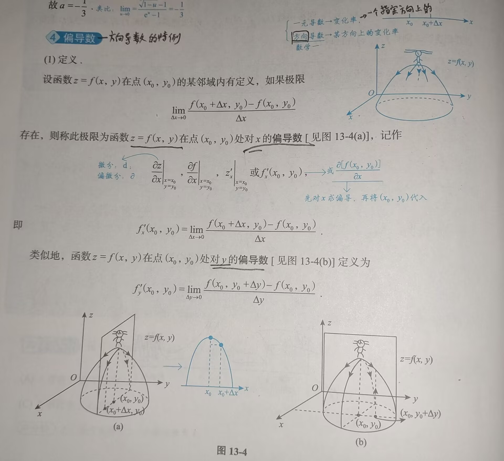
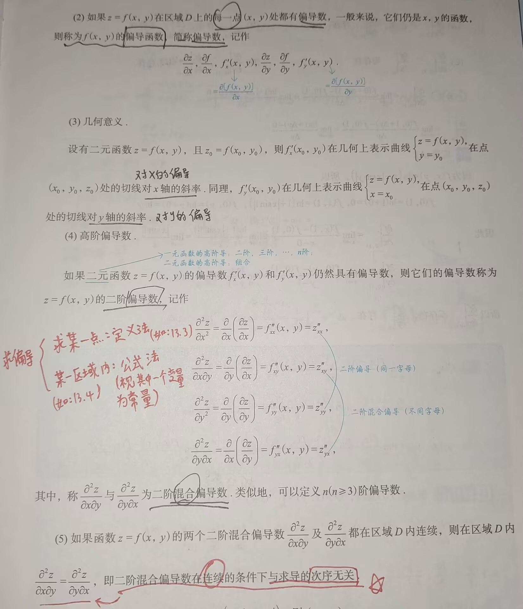

# 多元函数微分学

---

### 一、基础知识结构：

- 基本概念
	- 邻域
	- 极限
	- 连续
	- 偏导数
	- 可微
- 多元函数微分法则
	- 链式求导规则
	- 全微分形式不变性
	- 隐函数存在定理（公式法）
	- 二元函数的拉格朗日定理
- 多元函数的极值与最值
	- 概念
	- 无条件极值
	- 条件最值与拉格朗日乘数法
	- 最远（近）点的垂线原理
	- 有界区域上连续函数的最值问题

### 二、基本概念
#### 1. 邻域


#### 2.  极限

设函数 $f(x,y)$ 在区间D上有定义，$P_0(x_0,y_0)\in D$ 或为区域 $D$ 边界上的一点，若对于任意给定的 $\varepsilon >0$，总存在 $\delta >0$ ，当点 $P(x,y)\in D$，且满足 $0<|PP_0|=\sqrt{(x-x_0)^2+(y-y_0)^2}<\delta$ 时，恒有：$|f(x,y)-A|<\varepsilon$，则称常数**A**为 $(x,y)\rightarrow (x_0,y_0)$ 时 $f(x,y)$ 的极限，记作：$\lim\limits_{(x,y)\rightarrow (x_0,y_0)}f(x,y)=A$ 或 $\lim\limits_{x\rightarrow x_0\atop y\rightarrow y_0}f(x,y)=A$，$\lim\limits_{P\rightarrow P_0}f(P)=A$ 


>[!tip] 注意极限的定义！！！
>极限具有唯一性，若极限存在，则所有路径得到的极限值必定相等，否则极限不存在

- 不仅要记住极限的脱帽法，也要熟练运用不等式的脱帽法，牢记"**脱帽严格不等，戴帽非严格不等**"
#### 3. 连续

如果 $\lim\limits_{x\rightarrow x_0\atop y\rightarrow y_0}f(x,y)=f(x_0,y_0)$，则称函数 $f(x,y)$ 在点 $(x_0,y_0)$ 处连续，如果 $f(x,y)$ 在区域D上每一处都连续，则称 $f(x,y)$ 在区域D上连续

>[!tip] 注
>如果**多元函数**不连续，在考研大纲中不要求讨论间断点类型

##### 一元函数与多元函数的连续与间断的区别


#### 4. 偏导数

```
偏导数是方向导数的特例，理解偏导数时，想象一个人在山顶处往下滑，他可能会从任意方向滑下来，若我们将其放在与XoZ平面平行的一个平面内，想象其下滑路径就是在这个平面内（如下图13-4(a)），那么他沿该平面往山下滑下，则该路径的切平面就是对x的偏导数
```



>[!tip] 注
>仅当**二阶混合偏导数连续**时，才与求导次序无关，即$\frac{\partial^2 z}{\partial x\partial y}=\frac{\partial^2 z}{\partial y\partial x}$；否则不成立

### 三、

