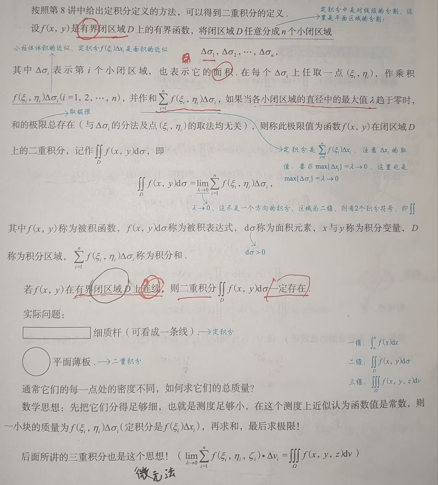

# 二重积分

---

### 一、基础知识结构

1. 概念、性质与对称性
	1. 概念
	2. 性质
	3. 🌟**对称性**（重要考点）
		1. 普通对称性
		2. 轮换对称性（对称问题尽量使用对称方法去解决）
2. 计算：
	1. 直角坐标系
	2. 极坐标系
	3. 极坐标系与直角坐标系的相互转化
	4. 换元法

### 二、概念、性质与对称

```
概念可联系前面所学的定积分，只是将二维变成了三维
```
#### 1. 概念



对于二重积分概念的理解可以想象一个圆顶柱体（$f(x,y)\geq 0$），我们将其在xOy面将其划分为 n 个小柱体，小柱体的圆顶近似为平面，$d\sigma$ 和 $\Delta\sigma$ 均表示的是小柱体的底面积
	重要的是微元法思想，一通百通

#### 2. 性质

```
可参考定积分的性质结合记忆，这两者有诸多相似之处
```
1. 性质1（求区域面积）：$\iint\limits_{D}1\cdot \mathrm{d}\sigma=\iint\limits_{D}\mathrm{d}\sigma=A$，其中A为D的面积
2. 🌟性质2:（可积函数**必有界**）：当$f(x,y)$ 在有界闭区域D上可积时，$f(x,y)$ 在D上必有界
3. 🌟🌟🌟性质3（积分的线性性质）：$\iint\limits_{D}[k_1f(x,y)\pm k_2g(x,y)]\mathrm{d}\sigma=k_1\iint\limits_{D}f(x,y)\mathrm{d}\sigma\pm k_2\iint\limits_{D}g(x,y)\mathrm{d}\sigma$ 
4. 🌟🌟🌟性质4（积分的可加性）：设$f(x,y)$ 在有界闭区域D上可积，且 $D_1\cup D_2=D,D_1\cap D_2=\emptyset$ （$D_1,D_2$ 合并为有界闭区域D，相交为空集），则： $\iint\limits_{D}f(x,y)\mathrm{d}\sigma=\iint\limits_{D_1}f(x,y)\mathrm{d}\sigma+\iint\limits_{D_2}f(x,y)\mathrm{d}\sigma$  
5. 性质5（积分的保号性）：当$f(x,y),g(x,y)$ 在有界闭区域D上可积时，若在D上有 $f(x,y)\leq g(x,y)$，则有 $\iint\limits_{D}f(x,y)\mathrm{d}\sigma\leq\iint\limits_{D}g(x,y)\mathrm{d}\sigma$ （保持原有的不等关系）
	- 特别地，有：$|\iint\limits_{D}f(x,y)\mathrm{d}\sigma|\leq\iint\limits_{D}|f(x,y)|\mathrm{d}\sigma$ 
		- 口诀：亡羊补牢 $\leq$ 未雨绸缪
6. 性质6（二重积分的估值定理）：设 $M,m$ 分别是 $f(x,y)$ 在有界闭区域D上的最大值和最小值，A为D的面积，则有：$mA\leq\iint\limits_{D}f(x,y)\mathrm{d}\sigma\leq MA\;\;\Rightarrow m\leq f(x,y)\leq M$ 
	- $mA=\iint\limits_{D}m\mathrm{d}\sigma,\; MA=\iint\limits_{D}M\mathrm{d}\sigma$
7. 🌟🌟🌟性质7（二重积分的**中值定理**）：设函数 $f(x,y)$ 在有界闭区域D上**连续**，A为D的面积，则在D上至少存在一点 $(\xi,\eta)$ ，使得：$\iint\limits_{D}f(x,y)\mathrm{d}\sigma\;=\;f(\xi,\eta)A$ 