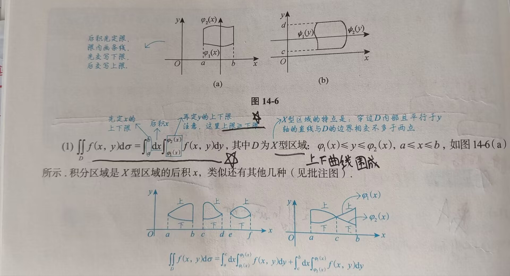
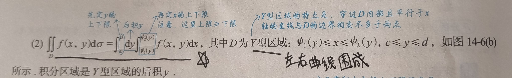
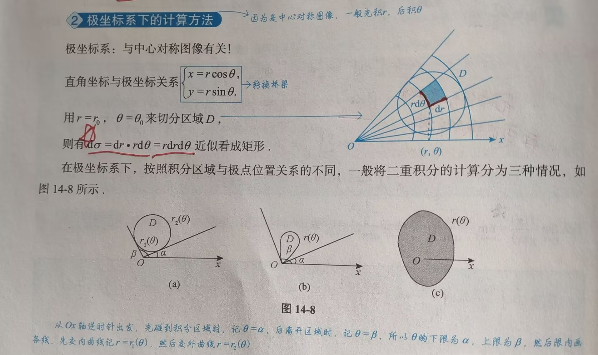
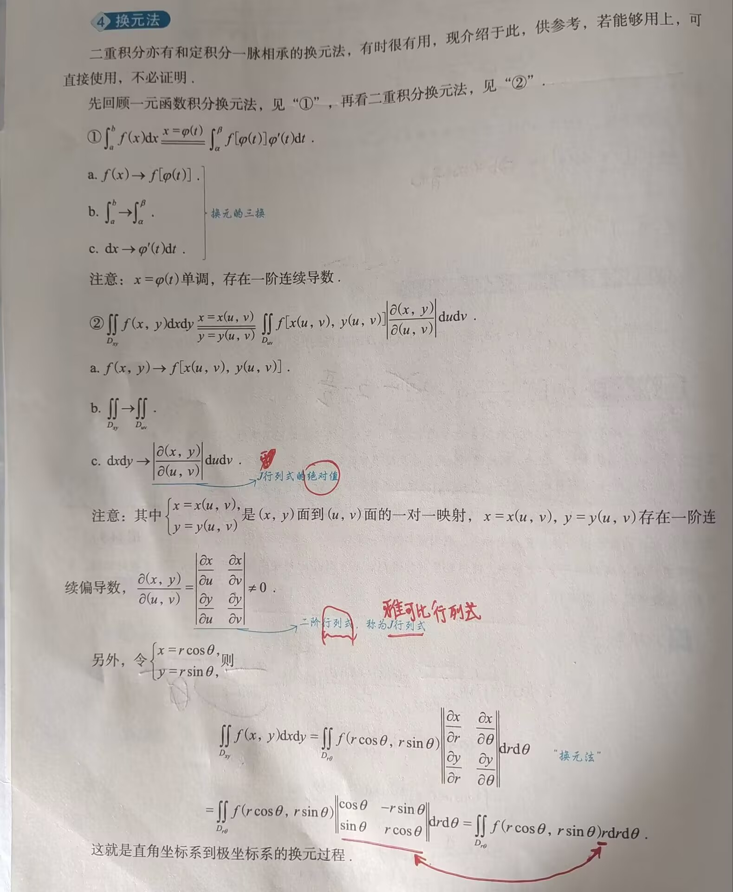

# 二重积分

---

### 一、基础知识结构

1. 概念、性质与对称性
	1. 概念
	2. 性质
	3. 🌟**对称性**（重要考点）
		1. 普通对称性
		2. 轮换对称性（对称问题尽量使用对称方法去解决）
2. 计算：
	1. 直角坐标系
	2. 极坐标系
	3. 极坐标系与直角坐标系的相互转化
	4. 换元法

### 二、概念、性质与对称

```
概念可联系前面所学的定积分，只是将二维变成了三维
```
#### 1. 概念


对于二重积分概念的理解可以想象一个圆顶柱体（$f(x,y)\geq 0$），我们将其在xOy面将其划分为 n 个小柱体，小柱体的圆顶近似为平面，$d\sigma$ 和 $\Delta\sigma$ 均表示的是小柱体的底面积
	重要的是微元法思想，一通百通

#### 2. 性质

```
可参考定积分的性质结合记忆，这两者有诸多相似之处
```
1. 性质1（求区域面积）：$\iint\limits_{D}1\cdot \mathrm{d}\sigma=\iint\limits_{D}\mathrm{d}\sigma=A$，其中A为D的面积
2. 🌟性质2:（可积函数**必有界**）：当$f(x,y)$ 在有界闭区域D上可积时，$f(x,y)$ 在D上必有界
3. 🌟🌟🌟性质3（积分的线性性质）：$\iint\limits_{D}[k_1f(x,y)\pm k_2g(x,y)]\mathrm{d}\sigma=k_1\iint\limits_{D}f(x,y)\mathrm{d}\sigma\pm k_2\iint\limits_{D}g(x,y)\mathrm{d}\sigma$ 
4. 🌟🌟🌟性质4（积分的可加性）：设$f(x,y)$ 在有界闭区域D上可积，且 $D_1\cup D_2=D,D_1\cap D_2=\emptyset$ （$D_1,D_2$ 合并为有界闭区域D，相交为空集），则： $\iint\limits_{D}f(x,y)\mathrm{d}\sigma=\iint\limits_{D_1}f(x,y)\mathrm{d}\sigma+\iint\limits_{D_2}f(x,y)\mathrm{d}\sigma$  
5. 性质5（积分的保号性）：当$f(x,y),g(x,y)$ 在有界闭区域D上可积时，若在D上有 $f(x,y)\leq g(x,y)$，则有 $\iint\limits_{D}f(x,y)\mathrm{d}\sigma\leq\iint\limits_{D}g(x,y)\mathrm{d}\sigma$ （保持原有的不等关系）
	- 特别地，有：$|\iint\limits_{D}f(x,y)\mathrm{d}\sigma|\leq\iint\limits_{D}|f(x,y)|\mathrm{d}\sigma$ 
		- 口诀：亡羊补牢 $\leq$ 未雨绸缪
6. 性质6（二重积分的估值定理）：设 $M,m$ 分别是 $f(x,y)$ 在有界闭区域D上的最大值和最小值，A为D的面积，则有：$mA\leq\iint\limits_{D}f(x,y)\mathrm{d}\sigma\leq MA\;\;\Rightarrow m\leq f(x,y)\leq M$ 
	- $mA=\iint\limits_{D}m\mathrm{d}\sigma,\; MA=\iint\limits_{D}M\mathrm{d}\sigma$
7. 🌟🌟🌟性质7（二重积分的**中值定理**）：设函数 $f(x,y)$ 在有界闭区域D上**连续**，A为D的面积，则在D上至少存在一点 $(\xi,\eta)$ ，使得：$\iint\limits_{D}f(x,y)\mathrm{d}\sigma\;=\;f(\xi,\eta)A$ 
	- 该中值定理的被积函数若是二阶连续偏导数，也可以使用该中值定理进行计算

#### 3. 🌟🌟🌟对称性
##### (1) 普通对称性

```
见书本P387，本内容较简单，不作讲解处理，但该内容较重要，需要多加练习，熟练掌握
```
##### (2) 轮换对称性（一定是直角坐标系下）

在**直角坐标系**下，若把 x 与 y 对调后，区域D不变（或区域D关于 y=x 对称），则 $\iint\limits_{D}f(x,y)\mathrm{d}\sigma=\iint\limits_{D}f(y,x)\mathrm{d}\sigma$ ，这就是轮换对称性
	$\mathrm{d}\sigma=\mathrm{d}x\mathrm{d}y=\mathrm{d}y\mathrm{d}x$

🌟轮换对称性的**应用**：$\iint\limits_{D}f(x,y)\mathrm{d}\sigma$ 与 $\iint\limits_{D}f(y,x)\mathrm{d}\sigma$ 难计算，但$\iint\limits_{D}f(x,y)\mathrm{d}\sigma+\iint\limits_{D}f(y,x)\mathrm{d}\sigma$ 之和的式子简单
	可结合**区间再现**的应用，同样是两式（原式与变换后的式子）之和更简单时才使用

>[!tip] 区分平普通对称性中区域D关于y=x对称 和 轮换对称性
>1. 普通对称性考查的是$f(x,y)$ 与 $f(y,x)$ 是相等还是相反
>2. 轮换对称性考查的是$f(x,y)+f(y,x)$ 是否简单
>3. 事实上，当$f(x,y)=-f(y,x)$ 时，它们是一回事

### 三、计算
#### 1. 求直角坐标系的二重积分
```
直角坐标系用平行于坐标系的线切割。在直角坐标系下，按照积分次序的不同，一般将二重积分的计算分为两种情况：先x后y，和先y后x
```

牢记口诀，帮助记忆：**后积先定限，限内画条线，先交写下限，后交写上限**
##### (1) 先x后y


##### (2) 先y后x



##### (3) 注意事项

>[!tip] 注
>二重积分的下限都必须小于等于上限，这是二重积分的基本定义（$\mathrm{d}x>0,\mathrm{d}y>0,\mathrm{d}\sigma >0$）
>如：$\int_a^b\mathrm{d}x\int_{\phi_1(x)}^{\phi_2(x)}f(x,y)\mathrm{d}y=-\int_a^b\mathrm{d}x\int_{\phi_2(x)}^{\phi_1(x)}f(x,y)\mathrm{d}y$（$a<b,\;\phi_1(x)>\phi_2(x)$）

计算时最好画出积分区域D的边界图形，若不易画出时，可采用分析法，即：写出D的不等式表达式，从而确定上下限

##### (4) 积分结论

1. $\int_0^1\arcsin\sqrt{1-x^2}dx=1$
#### 2. 求极坐标系的二重积分



>[!tip]
>好好用微元法理解极坐标二重积分的计算，理解为什么$d\sigma=dr\cdot rd\theta=rdrd\theta$

- 极点的三种情况对应的公式分别为：
	1. $\iint\limits_{D}f(x,y)d\sigma=\int_\alpha^\beta d\theta\int_{r_1(\theta)}^{r_2(\theta)}f(r\cos\theta ,r\sin\theta)\;rdr$ （极点O在区域D外部，对应图14-8(a) ）
	2. $\iint\limits_{D}f(x,y)d\sigma=\int_\alpha^\beta d\theta\int_0^{r(\theta)}f(r\cos\theta ,r\sin\theta)\;rdr$ （极点O在区域D边界上，对应图14-8(b) ）
	3. $\iint\limits_{D}f(x,y)d\sigma=\int_0^{2\pi} d\theta\int_0^{r(\theta)}f(r\cos\theta ,r\sin\theta)\;rdr$ （极点O在区域D内部，对应图14-8(c) ）

#### 3. 极坐标系还是用直角坐标系选择的一般原则

一般来说，给出一个二重积分，如果满足以下两个条件之一，则优先使用极坐标系；否则就优先考虑直角坐标系
1. 看被积函数是否为 $f(x^2+y^2),f(\frac{y}{x}),f(\frac{x}{y})$ 等形式
	- $r^2=x^2+y^2,\;\frac{y}{x}=\tan\theta,\;\frac{x}{y}=\cot\theta$
2. 看积分区域是否为圆或圆的一部分
#### 4. 极坐标系与直角坐标系之间的相互转换

两个诀窍：
1. 用好 $x=r\cos\theta,\;\;y=r\sin\theta$ 这个公式
2. 画出区域D的边界图形，做好上下限的转化

>[!tip]
>要注意，dr 的上下限是由 dxdy 的边界转化而来的，有关 $r(\theta)$ 的函数

#### 5. 🌟🌟🌟**换元法**（重中之重）[^1]

```
牢记“换元要三换”
```



[^1]: 一定要会灵活应用

