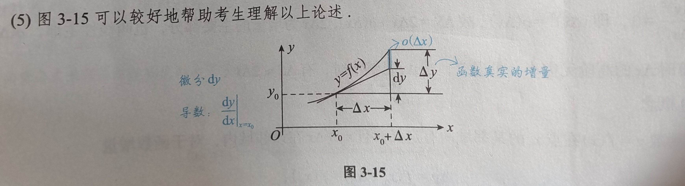

# 知识汇总

---

### 一、导数定义：

- 函数 $f(x)$ 在点 $x=x_0$ 处导数存在 $\Leftrightarrow$  $f(x)$ 在该点的左右导数均**存在且相等**
- 函数在某点导数存在 $\Rightarrow$ 函数在该点**必定连续**
	- `注意！！！`该定义说的是：如果函数在某点的导数存在，则该函数在该点连续，而不是指导函数在该点连续
	- 若函数在某点连续 $\Rightarrow$ **不一定**在该点可导， 例：$y=|x|$ 
- 🌟🌟🌟导数存在的条件：导数在某点的左右导数均存在且相等，则该函数在该点可导
- $f(x)$ 在 $x=x_0$ 处可导 $\nRightarrow$ $f(x)$ 在 $x=x_0$ 附近可导 （可以联系一下连续的这个类似结论，一起记忆，即：函数在某点连续，则在该点附近不一定连续，可结合狄利克雷函数进行分析，对$y = xD(x)$ 进行分析）
	- 狄利克雷函数：$D(x)=1,\; x\text{为有理数}$；$D(x)=0,\;x\text{为无理数}$ 
- 导数的定义要求函数在该点及其邻域内有定义，且该点处函数值必须等于极限值（即连续）
#### 导数的几何意义

- 某点导数存在，则该点一定存在切线；反之，若某点存在切点，不一定有导数（如：铅直切线，导数为无穷大，即：不存在）
#### 导数的函数定义

$f\prime(x)=\lim\limits_{\Delta x\rightarrow 0}\frac{f(x_0+\Delta x)-f(x_0)}{\Delta x}$ 或 $f(x)=\lim\limits_{x\rightarrow x_0}\frac{f(x)-f(x_0)}{x-x_0}$ 
高阶导数写法：$f\prime(x),\;f\prime\prime(x),\;f\prime\prime\prime(x)$ ，当 $n>4$ 时，必须写作 $f^{(n)}(x)$ 

### 二、🌟例题重要结论

1. 🌟🌟🌟🌟🌟设 $f(x)$ 在 $x=a$ 处连续，$F(x)=f(x)|x-a|$，则 $f(a)=0$ 是 $F(x)$ 在 $x=a$ 处可导的`充要条件`
	- 证明见基础30讲P152，例题3.5
	- 强化理解：见例题3.6

### 三、导数重要结论

- $f(x)$ 在 $x_0$ 处连续 $\Rightarrow$ $|f(x)|$ 在 $x_0$ 处连续
- $f(x)$ 在 $x_0$ 处可导 $\nLeftrightarrow$ $|f(x)|$ 在 $x_0$ 处可导
	- 🌟🌟🌟若 $f(x)$ 在 $x_0$ 处可导，$f(x_0)=0$ 且 $f\prime (x_0)\neq 0$ $\Rightarrow$ $|f(x)|$ 在 $x_0$ 处**必定不可导** [^1]
		- 若$f(x)$ 在 $x_0$ 处可导，$f(x_0)=0$ 且 $f\prime(x_0)=0\Rightarrow |f(x)|$ 在 $x_0$ 处可导  
	- 🌟🌟🌟若 $f(x)$ 在 $x_0$ 处可导，且 $f(x_0)\neq 0$ $\Rightarrow$ $|f(x)|$ 在 $x_0$ 处可导
### 四、微分
#### 微分与导数的关系

- 🌟可微一定可导，可导一定可微，两者互为充要条件
- 区分可导与可微
	- 可微：$\Delta y=dy+O(\Delta x)$ ，其中 $dy=A\Delta x$，$A$ 为 $f\prime (x_0)$ 
	- 可导：$\lim\limits_{\Delta x\rightarrow 0}\frac{f(x_0+\Delta x)-f(x_0)}{\Delta x}$ 或 $\lim\limits_{x\rightarrow x_0}\frac{f(x)-f(x_0)}{x-x_0}$  ；注意广义化的使用
		- 广义化：$\lim\limits_{狗\rightarrow 0}\frac{f(x_0+狗)-f(x_0)}{狗}$ 
	所以 $\Delta y - dy = O(\Delta x)$
- 为什么 $dx=\Delta x$ ------- 因为 $\Delta x=dx+o(\Delta x)$，其中 $o(\Delta x) = 0$  
#### 可微的判别

1. 写增量 $\Delta y=f(x_0+\Delta x)-f(x_0)$
2. 写线性增量 $A\Delta x=f\prime(x_0)\Delta x$
3. 作极限 $\lim\limits_{\Delta x\rightarrow 0}\frac{\Delta y - A\Delta x}{\Delta x}\Leftrightarrow \Delta y=A\Delta x+o(\Delta x)$ 
若左式极限为0（可推出右式），则 $y=f(x)$ 在点 $x_0$ 处可微

#### 可微的几何意义

若 $f(x)$ 在点 $x_0$ 处可微，则在点 $(x_0,y_0)$ 附近可以用**切线段**近似**代替曲线段**

### 五、需要记忆的函数

1. 奇函数：$g(x)=\frac{1}{2^x+1}-\frac{1}{2}$ 

[^1]: 重点记忆：原函数可导与绝对值函数可导的关系