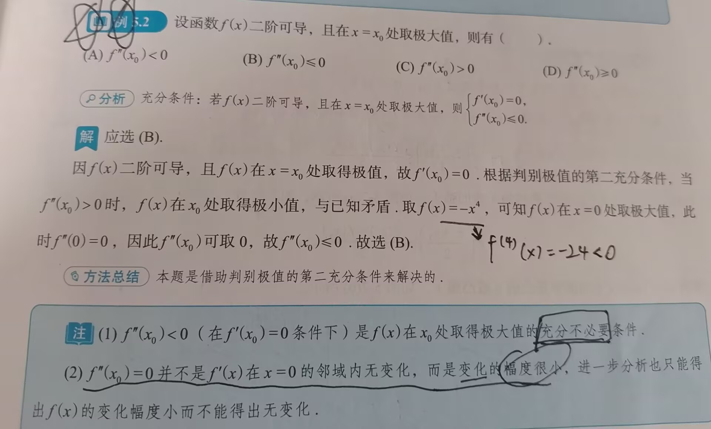

# 知识点

---

### 一、 极值点的定义：

- 极值点是`局部`的概念
- 极值点是**左右邻域**均有定义（端点处不讨论极值、间断点）
- 常数函数**处处都是**极值
- 常考“理想”的极值点，即：**左邻域递增，右邻域递减；或左邻域递减，右邻域递增**
- 间断点也可以是极值点，详情见基础30讲P188

### 二、单调性和极值的判别

- 设函数 $y=f(x)$ 在 $[a, b]$ 上连续，在 $(a,b)$ 可导，则：
	1. 如果在 $(a,b)$ 内 $f\prime(x) \geq 0$ ，且等号仅在**有限个点**成立，那么函数 $y=f(x)$ 在 $[a,b]$ 上**严格**单调增加
	2. 如果在 $(a,b)$ 内 $f\prime(x) \leq 0$ ，且等号仅在**有限个点**成立，那么函数 $y=f(x)$ 在 $[a,b]$ 上**严格**单调减少
		- 当在某一点处，连续点A，B，C（微观上）之间的变化率（导数）可能为0，在水平上的差距极其小，但在该点仍然是左小右大
		- 导数大于0，一定严格单增，但严格单增不一定导数大于0，详情解释见基础30讲P188
		- 
	- $f\prime(x_0)>0$ 只代表了在 $x_0$ 这一点上是可导的，是左小右大，无法证明单调性，且无法证明其他点的单调性
#### 判断**不可导点**是否为极值点

- 只需要看该点左右的单调性即可

#### 1. 一阶可导时，一阶可导点是极值点的**必要**条件

```
证明：第六讲，费马定理
```
- 🌟设$f(x)$ 在 $x=x_0$ 处可导，且在点 $x_0$ 处取得极值，则必有 $f\prime(x_0)=0$ 
- 🌟🌟🌟找极值时的两种情况：1. 驻点；2. 不可导点[^1]
	- 驻点：$f\prime(x_0)=0$
	- 不可导点：$f\prime(x_0)$ 不存在
#### 2. 极值的第一充分条件

- 设 $f(x)$ 在 $x=x_0$ 处连续，且在 $x_0$ 的某去心邻域 $\mathring{U}(x_0, \delta )(\delta >0)$ 内可导
1. 若 $x\in (x_0-\delta ,x_0)$ 时，$f\prime (x)<0$，而 $x\in (x_0,x_0 + \delta )$ 时，$f\prime (x)>0$，则 $f(x)$ 在 $x=x_0$ 处取得**极小值**
2. 若 $x\in (x_0-\delta ,x_0)$ 时，$f\prime (x)>0$，而 $x\in (x_0,x_0 + \delta )$ 时，$f\prime (x)<0$，则 $f(x)$ 在 $x=x_0$ 处取得**极大值**
3. 若 $f\prime (x)$ 在 $(x_0-\delta , x_0)$ 和 $(x_0, x_0 + \delta )$ 内**不变号**，则点 $x_0$ 不是极值点
	- 换言之，只要变号了，则点 $x_0$ 是极值点
>[!tip] 注
> $f(x)$在$x=x_0$处不一定可导，可能出现角点
#### 3. 极值的第二充分条件

- 设 $f(x)$ 在 $x=x_0$ 处二阶可导，且 $f\prime (x_0)=0,f\prime\prime (x_0)\neq 0$
1. 若 $f\prime\prime (x_0)<0$，则 $f(x)$ 在 $x_0$ 处取得**极大值**
2. 若 $f\prime\prime (x_0)>0$，则 $f(x)$ 在 $x_0$ 处取得**极小值**
- 🌟借助保号性推导：
	- 设 $f\prime\prime (x_0)=\lim\limits_{x\rightarrow x_0}\frac{f\prime (x)-f\prime (x_0)}{x-x_0}=\lim\limits_{x\rightarrow x_0}\frac{f\prime (x)}{x-x_0}>0$，由保号性可知：
		1. 当 $x\in (x_0-\delta ,x_0)$ 时，$x-x_0<0$，从而 $f\prime (x)<0$，所以$f(x)$ 在$x_0$ 的左邻域单调递减
		2. 当 $x\in (x_0 ,x_0+\delta )$ 时，$x-x_0>0$，从而 $f\prime (x)>0$，所以$f(x)$ 在$x_0$ 的左邻域单调递增
		所以 $f(x)$ 在 $x=x_0$ 处取得**极小值**
	- 同理：当 $f\prime\prime (x_0)<0$ 时，$f(x)$ 在 $x=x_0$ 处取得**极大值** 
#### 4. 极值的第三充分条件

```
第三充分条件可以说是第二充分条件的推广
```
- 设 $f(x)$ 在 $x=x_0$ 处`n`阶可导，且 $f^{(m)} (x_0)=0(m=1,2,\cdots,n-1),f^{(n)} (x_0)\neq 0(n\geq 2)$ （注意：m是从`1`开始取的）
1. 当`n`为**偶数**且 $f^{(n)}(x_0)<0$ 时，$f(x)$ 在 $x_0$ 处取得**极大值**
2. 当`n`为**偶数**且 $f^{(n)}(x_0)>0$ 时，$f(x)$ 在 $x_0$ 处取得**极小值**
>[!tip] 注
>1.对平方开根号需要注意：$\sqrt{u^2}=|u|$ 而非 u
>2.使用举例方式仅能**排除**选项而不能证明选项

#### 5. 第二充分条件的注意事项

- 
- 如例5.2，若我们已知 $f\prime\prime (x_0)<0$，则可利用第二充分条件判断 $x=x_0$ 为极大值，但需注意，**该结论是充分条件，而不是必要条件，故无法反推**，所以例5.2不能用该结论反推，因为可能存在 $f(x)$ ，使得 $f\prime\prime (x_0)=0$，并且往后导数值均为0，直到某一**偶数阶**导数 $f^{(2n)}(x_0) < 0$，这种情况下，仍能得到该例题的条件，所以应该选择选项 $B. f\prime\prime (x_0)\leq 0$   
### 三、凹凸性和拐点
#### 1. 凹凸性和拐点的定义[^3]


#### 2. 凹凸性与拐点的判别
##### （1）凹凸性判别

设函数 $f(x)$ 在 $I$ 上二阶可导
1. 若在 $I$ 上 $f\prime\prime (x)>0$，则 $f(x)$ 在 $I$ 上的图形是**凹**的
2. 若在 $I$ 上 $f\prime\prime (x)<0$，则 $f(x)$ 在 $I$ 上的图形是**凸**的

##### (2)二阶可导时，二阶可导点是拐点的**必要**条件

🌟设 $f\prime\prime(x_0)$ 存在，且点 $(x_0,f(x_0))$ 为曲线的拐点，则 $f\prime\prime(x_0)=0$ 
🌟🌟🌟同样的，找拐点也是在`二阶导为 0` 和`不可导点` （二阶导不存在）中寻找判断[^2]
##### （3）🌟判断拐点的第一充分条件 ----- 最常用[^4]

- 设 $f(x)$ 在 $x=x_0$ 处连续，且在 $x_0$ 的某去心邻域 $\mathring{U}(x_0, \delta )$ 内二阶导数存在，且在该点的左、右邻域内 $f\prime\prime(x)$ **变号**（无论是否由正变负，还是由负变正），则点 $(x_0,f(x_0))$ 为曲线的**拐点** 
>[!tip] 为什么拐点需要在 $x=x_0$ 的**邻域**内二阶可导
>因为拐点是凹弧和凸弧的分界点，而凹弧和凸弧的定义又需要用到二阶导数，所以需要在拐点的邻域内二阶可导，判断是否在左、右邻域变号，即可判断是否是凹凸性发生了变化
##### （4）判断拐点的第二充分条件

- 设 $f(x)$ 在 $x=x_0$ 的某邻域内三阶可导，且 $f\prime\prime (x_0)=0,f\prime\prime\prime (x_0)\neq 0$ ，则点 $(x_0,f(x_0))$ 为曲线的**拐点**
	- 同样的，可以用保号性进行推导证明，具体过程可参考极值的第二充分条件，或可见基础30讲P194
##### （5）判断拐点的第三充分条件

- 设 $f(x)$ 在 $x=x_0$ 处`n`阶可导，且 $f^{(m)} (x_0)=0(m=2,\cdots,n-1),f^{(n)} (x_0)\neq 0(n\geq 3)$ （注意：m是从`2`开始取的，注意与极值的第三充分条件区分）[^5]
	- 因为拐点不对一阶导数作要求，所以`m`从`2`开始取
- 当`n`为**奇数**时，点 $(x_0,f(x_0))$ 为**拐点**
### 四、🌟🌟🌟极值点和拐点的重要结论[^6]

```
以下结论均可直接使用，不必证明
```
1. 曲线的`可导点`**不可同时**为极值点和拐点(参考例5.5)；曲线的`不可导点`**可以同时**为极值点和拐点
2. 设多项式函数 $f(x)=(x-a)^ng(x)(n>1)$，且 $g(a)\neq 0$，则当 $n$ 为**偶数**时，$x=a$ 是 $f(x)$ 的**极值点**；当 $n$ 为**奇数**时，点 $(a,0)$ 是曲线 $f(x)$ 的**拐点**
3. 设多项式函数 $f(x)=(x-a_1)^{n_1}(x-a_2)^{n_2}\cdots (x-a_k)^{n_k}$，其中 $n_i$ 是正整数， $a_i$ 是实数且 $a_i$ 两两不等，$i=1,2,\cdots,k$ 
	- $k_1$：一次幂的多项式因式个数
	- $k_2$：偶数次幂的因式个数
	- $k_3$：奇数次幂的因式个数(n>1)
	- $f(x)$ 的**极值点**个数：$k_1+2k_2+k_3-1$，**拐点**个数：$k_1+2k_2+3k_3-2$ 
- 常规结论：$\alpha$ 是 $f(x)=0$ 的 $m$ 重根 $(m\geq 1)$ ，则 $\alpha$ 是 $f\prime (x)=0$ 的 $m-1$ 重根

### 五、渐近线
#### 1. 铅直渐近线（铅垂渐近线）

- 若 $\lim\limits_{x\rightarrow x_0^+}f(x)=\infty$ （或$\lim\limits_{x\rightarrow x_0^-}f(x)=\infty$），则 $x=x_0$ 为一条铅直渐进线
>[!tip] 注
>此处的 $x_0$ 是：
>1. 无定义点
>2. 函数定义区间的**端点**
>3. 分段函数的**分段点**
#### 2. 水平渐进线

- 若 $\lim\limits_{x\rightarrow +\infty} = y_1$，则 $y=y_1$ 为一条水平渐近线；若 $\lim\limits_{x\rightarrow -\infty} = y_2$，则 $y=y_2$ 为一条水平渐近线
- 若 $\lim\limits_{x\rightarrow +\infty}f(x)=\lim\limits_{x\rightarrow -\infty}f(x)=y_0$，则 $y=y_0$ 为一条水平渐近线（当函数的左、右无穷远极限均相等时）
#### 3. 斜渐近线


求解渐近线的步骤图解[^7]：


### 六、最值和取值范围
#### 1. 最值的定义

```
最值是整体概念，有别于极值（极值是局部概念）
```
- 定义：设 $x_0$ 为 $f(x)$ 定义域内一点，若对于 $f(x)$ 的定义域内**任意一点** $x$，均有 $f(x)\leq f(x_0)$（或$f(x)\geq f(x_0)$）成立，则称 $f(x_0)$ 为 $f(x)$ 的**最大值**（或**最小值**）
>[!tip] 极值和最小值的关系
>极值点不一定是最值点，最值点也不一定是极值点[^8]

- 🌟🌟如果 $f(x)$ 在区间 $I$ 上有最值点 $x_0$，并且此最值点 $x_0$ 不是区间 $I$ 的端点，而是 $I$ 内部的点，那么此 $x_0$ 必是 $f(x)$ 的一个极值点[^9]
#### 2. 求闭区间上连续函数的最大值和最小值

连续函数 $f(x)$ 在区间 $[a,b]$ 上，求最大值和最小值
1. 求出可疑点的函数值（驻点和不可导点）
2. 求出端点的函数值 $f(a)$ 和 $f(b)$
3. 比较以上得到的所有函数值，即可得出最大值和最小值
#### 3. 求开区间上连续函数的最大值和最小值

连续函数 $f(x)$ 在区间 $(a,b)$ 上，求最大值和最小值
1. 求出可疑点的函数值（驻点和不可导点）
2. 求出区间两端的单侧极限，若 $a,b$ 为有限常数，则求 $\lim\limits_{x\rightarrow a^+}f(x)$ 和 $\lim\limits_{x\rightarrow b^-}f(x)$（根据区间范围，注意左、右极限）
3. 比较以上得到的所有函数值，即可得出最大值和最小值
### 七、作函数图像

一般作图步骤为：
1. 确定定义域，考察函数是否有奇偶性，周期性，并用好**图像变换**（见附录1）
2. 用导数工具（一阶导数确定函数的单调区间、极值点；二阶导数确定曲线的凹凸区间、拐点）
3. 渐近线
4. 作图
>[!tip] 注
>要学会用直角坐标系的观点画极坐标的图（30讲P205），如：r 作为竖轴，θ 作为横轴，画出变化曲线，根据**变化趋势**用**描点法**画出其在极坐标下的图像

### 八、曲率及曲率半径[^10]

- 曲率代表曲线的弯曲程度，曲率越大，弯曲程度越大，能画出的切线圆越小
- 设 $y(x)$ 二阶可导，则曲线 $y=y(x)$ 在点 $(x,y(x))$ 处的**曲率**公式为：$k=\frac{|y\prime\prime|}{[1+(y\prime)^2]^{\frac{3}{2}}}$ 
- 曲率半径：$R=\frac{1}{k}$ 

### 本章使用到的恒等变形

1. $\lim\limits_{x\rightarrow +\infty}\ln (1+e^x)=\lim\limits_{x\rightarrow +\infty}\ln [e^x(1+e^{-x})]=\lim\limits_{x\rightarrow +\infty}[x+\ln (1+x^{-x})]$ 
	- 第二步变为 x 是因为 $\ln e^x=x$ 


[^1]: 极值点存在的可能情况

[^2]: 拐点存在的可能情况，需要注意的是，并不是**只有**二阶可导点为0的情况下才存在拐点
[^3]: 拐点和凹凸性的定义，需要根据定义来理解以下的充分条件和必要条件，极值点也一样需要结合定义来理解
[^4]: 判别拐点最常用的条件
[^5]: 区分拐点的第三充分条件和极值点的第三充分条件
[^6]: 🌟🌟🌟重点记忆背诵
[^7]: 重点：求解渐近线
[^8]: 极值点和最值点的关系
[^9]: 特殊条件下，最值点可以是极值点
[^10]: 重点：曲率公式