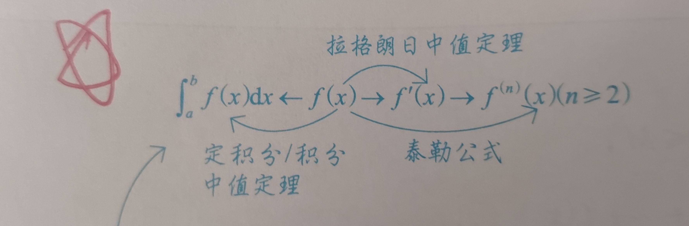
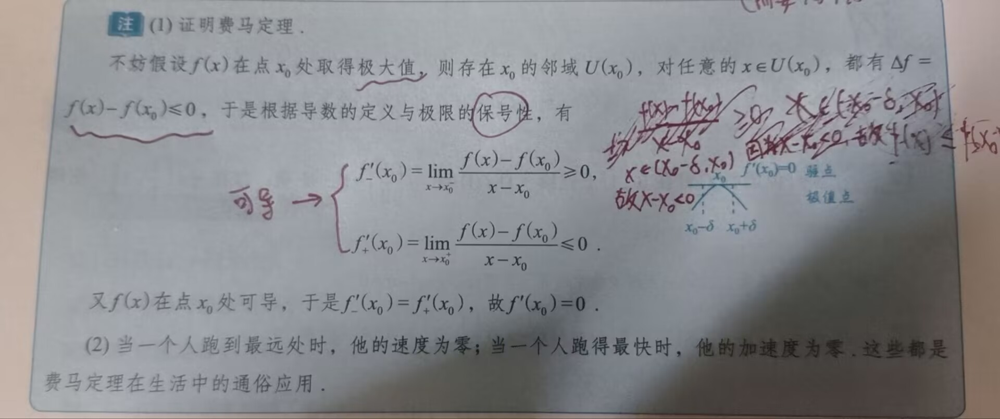
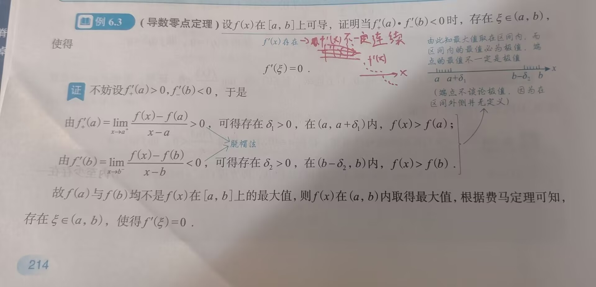
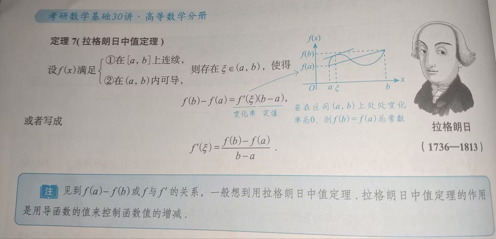
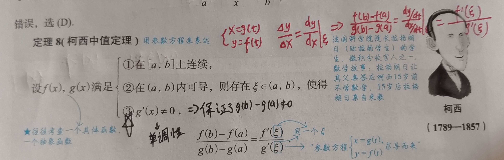
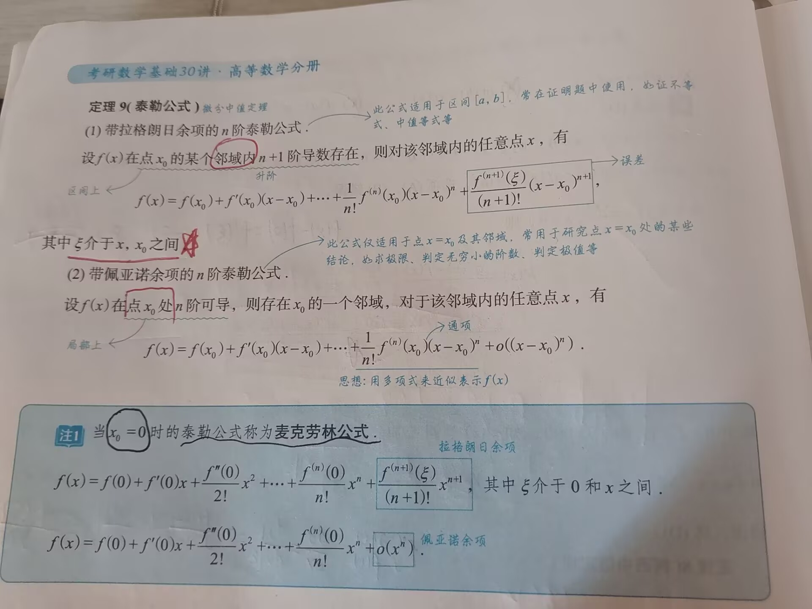
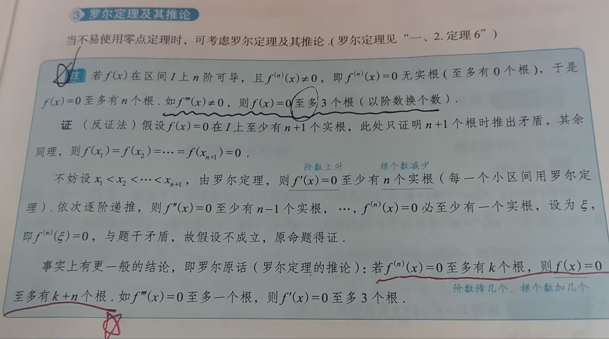
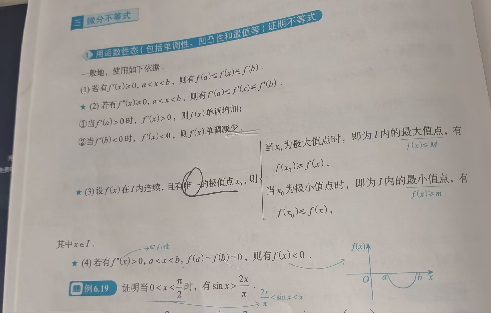

# 知识点

---

### 一、中值定理
#### 1. 涉及函数的中值定理

- 设 $f(x)$ 在 $[a,b]$ 上**连续**（极限存在且等于函数值），则：
	1. 有界与最值定理： $m\leq f(x)\leq M,$ 其中 $m,M$ 分别为 $f(x)$ 在 $[a,b]$ 上的最大值和最小值
	2. 介值定理：当 $m\leq\mu\leq M$ 时，存在 $\xi\in [a,b]$，使得 $f(\xi)=\mu$ 
	3. 平均值定理：当 $a<x_1<x_2<\cdots<x_n<b$ 时，在 $[x_1,x_n]$ 内至少存在一点 $\xi$，使得 $f(\xi)=\frac{f(x_1)+f(x_2)+\cdots+f(x_n)}{n}$ 
		- 证明：
			1. $m\leq f(x_1)\leq M$
			2. $m\leq f(x_2)\leq M$
			3. $\cdots$
			4. $m\leq f(x_n)\leq M$
			5. 上式所有相加得：$n\cdot m\leq f(x_1)+f(x_2)+\cdots +f(x_n)\leq n\cdot M$ ，两边同时除 $n$ 可得： $m\leq\frac{f(x_1)+f(x_2)+\cdots+f(x_n)}{n}\leq M$，则存在 $\xi\in[x_1,x_n]\subset [a,b]$   ，使得该结论成立
	4. 零点定理：当 $f(a)\cdot f(b)<0$ 时，存在 $\xi\in (a,b)$，使得 $f(\xi)=0$ 
		- 推广的零点定理：若 $f(x)$ 在 $(a,b)$ 内连续，$\lim\limits_{x\rightarrow a^+}f(x)=\alpha$，$\lim\limits_{x\rightarrow b^-}f(x)=\beta$，且 $\alpha\cdot\beta < 0$，则 $f(x)=0$ 在 $(a,b)$ 内至少存在一个根。其中，$a,b,\alpha ,\beta$ 可以是有限数，也可以是无穷大
#### 2. 函数形式需要考虑的变化


### 二、 涉及导数（微分）的中值定理
#### 1. 费马定理

1. 费马定理：设 $f(x)$ 在点 $x_0$ 处满足`1. 可导，2. 取极值`，则 $f\prime (x_0)=0$ 
	- 需要注意的是，若函数仅在有限区间内可导，则要注意，此时**函数在端点处取不到极值**，因为极值存在需要在该点有左、右导数，`考虑极值点时需要避开端点`
	- 费马定理的证明：
		- **图中的"可导$\rightarrow$" 有误，删去**，正确说明应该是：得出左右导数的范围后，由于 $f(x)$ 在 $x=x_0$ 处可导，故可得左右导数相等，所以只能得到 $f\prime(x_0)=0$ 
#### 2. 导数零点定理

1. 导数零点定理：
#### 3. 🌟🌟🌟罗尔定理

1. 🌟🌟🌟**罗尔定理**[^1]：设 $f(x)$ 满足如下条件：
	1. 在 $[a,b]$ 上连续，（函数在端点上也**有定义**，在左端点右连续，右端点左连续）
	2. 在 $(a,b)$ 内可导，
	3. $f(a)=f(b)$，
	则存在 $\xi\in (a,b)$，使得 $f\prime(\xi)=0$ `（必须同时满足三个条件才可得出该结论）` 
- 推广的罗尔定理：设 $f(x)$ 在 $(a,b)$ 内可导，$\lim\limits_{x\rightarrow a^+}f(x)=\lim\limits_{x\rightarrow b^-}f(x)=A$，则在 $(a,b)$ 内至少存在一点 $\xi$，使 $f\prime(\xi)=0$，其中区间 $(a,b)$ 可以是有限区间也可以是无穷区间，$A$ 可以是有限数也可以是无穷大（同号）
	- 🌟🌟🌟罗尔定理的使用往往需要构造辅助函数，总结如下：[^2]
		1. 简单情形：题设 $f(x)$ 为辅助函数（研究对象）
		2. 复杂情形：`一般只会考简单情形和乘积求导逆用`
			1. 乘积求导公式 $(uv)\prime=u\prime v+uv\prime$ 的逆用
				1. $[f(x)f(x)]\prime=[f^2(x)]\prime=2f(x)\cdot f\prime(x)$
					- 见到 $f(x)f\prime(x)$，令 $F(x)=f^2(x)$ 
				2. $[f(x)\cdot f\prime(x)]\prime=[f\prime(x)]^2+f(x)f\prime\prime (x)$ 
					- 见到 $[f(x)\cdot f\prime(x)]\prime=[f\prime(x)]^2+f(x)f\prime\prime (x)$，令 $F(x)=f(x)f\prime(x)$ 
				3. $[f(x)e^{\phi(x)}]\prime=f\prime(x)e^{\phi(x)}+f(x)e^{\phi(x)}\cdot\phi\prime(x)=[f\prime(x)+f(x)\phi\prime(x)]e^{\phi(x)}$    
					- 见到 $f\prime(x)+f(x)\phi\prime(x)$，令 $F(x)=f(x)e^{\phi(x)}$ ，常考以下形式：
						1. $\phi(x)=x\Rightarrow$见到 $f\prime(x)+f(x)$，令 $F(x)=f(x)e^x$
						2. $\phi(x)=-x\Rightarrow$见到 $f\prime(x)-f(x)$，令 $F(x)=f(x)e^{-x}$
						3. $\phi(x)=kx\Rightarrow$见到 $f\prime(x)+kf(x)$，令 $F(x)=f(x)e^{kx}$ 
					- $(uv)\prime\prime=u\prime\prime v+2u\prime v\prime+uv\prime\prime$ （莱布尼茨公式展开）也有可能考到
			2. 商的求导公式 $[\frac{u}{v}]\prime=\frac{u\prime v-uv\prime}{v^2}$的逆用
				1. $[\frac{f(x)}{x}]\prime=\frac{f\prime(x)x-f(x)}{x^2}$
					- 见到 $f\prime(x)x-f(x),x\neq 0$，令 $F(x)=\frac{f(x)}{x}$
				2. $[\frac{f\prime(x)}{f(x)}]\prime=\frac{f\prime\prime(x)f(x)-[f\prime(x)]^2}{f^2(x)}$
					- 见到 $f\prime\prime(x)f(x)-[f\prime(x)]^2,f(x)\neq 0$，令 $F(x)=\frac{f\prime(x)}{f(x)}$ 
				3. $[\ln f(x)]\prime=\frac{f\prime(x)}{f(x)}$，故 $[\ln f(x)]\prime\prime=[\frac{f\prime(x)}{f(x)}]\prime=\frac{f\prime\prime(x)-[f\prime(x)]^2}{f^2(x)}$ 
					- 见到 $f\prime\prime(x)f(x)-[f\prime(x)]^2,f(x)> 0$，也可考虑令 $F(x)=\ln f(x)$ 
					- `注意条件`，若均满足，则可选择**第二种或第三种逆用**其一均可
	- 看一下例题6.5（P216），虽然考研中可能不会出现那么难的辅助函数构造，但练习阶段可以做一下加深印象
	- 若遇到 $f^{(n)}(\xi)=0$，用罗尔定理的可能性更大；若遇到 $f^{(n)}(\xi)\neq 0$，用泰勒公式的可能性更大
#### 4. 🌟🌟🌟拉格朗日中值定理

1. 🌟🌟🌟**拉格朗日中值定理**[^3]： 设 $f(x)$ 满足如下条件：
	1. 在 $[a,b]$ 上连续，
	2. 在 $(a,b)$ 内可导
	则**存在** $\xi\in (a,b)$，使得 $f(b)-f(a)=f\prime(\xi)(b-a)$ 或 $f\prime(\xi)=\frac{f(b)-f(a)}{b-a}$ （$a<\xi<b$）

- 注意记忆拉格朗日中值定理的**作用**[^4]

>[!tip] 解题思路！！！
>遇到如 $\frac{f(x)}{x}$（即：$\frac{f(b)}{b}$） 的形式，可以考虑 $\frac{f(b)-f(a)}{b-a}$，证明 $f(a)=0,a=0$， 并应用拉格朗日中值定理
>遇到需要联系 $f$ 和 $f\prime$ 的题目，需要想到拉格朗日中值定理
- 详细的拉格朗日例题可见P218 例6.8

#### 5. 🌟🌟🌟柯西中值定理

```
柯西中值定理与拉格朗日中值定理条件相似，可结合记忆
```


#### 6. 泰勒公式

1. 带**拉格朗日余项**的**n**阶泰勒公式：
	- 设$f(x)$ 在点 $x_0$ 的`某个邻域内`**n+1阶导数**存在（区间内），则对该邻域内的任意点x，有：$f(x)=f(x_0)+f\prime(x_0)(x-x_0)+\cdots+\frac{1}{n!}f^{(n)}(x_0)(x-x_0)^n+\frac{f^{(n+1)(\xi)}}{(n+1)!}(x-x_0)^{(n+1)}$  
	- 其中 $\xi$ 介于 $x,x_0$ 之间，即：$\xi$ 在 $x_0$ 的邻域内
	- 该公式适用于**区间** $[a,b]$，常在证明题中使用，如：证不等式，中值等式等
2. 带**佩亚诺余项**的**n**阶泰勒公式：
	- 设$f(x)$ 在点 $x_0$ 处**n阶可导**（局部，即：仅 $x_0$ 这一点），则存在 $x_0$ 的一个邻域，对于该邻域内的任意点x，有：$f(x)=f(x_0)+f\prime(x_0)(x-x_0)+\cdots+\frac{1}{n!}f^{(n)}(x_0)(x-x_0)^n+O((x-x_0)^n)$ 
	- 该公式仅适用于**点** $x=x_0$ **及其邻域**，常用于研究点 $x=x_0$ 处的某些结论
>[!tip] 注
>当 $x_0=0$ 时的泰勒公式称为麦克劳林公式，也就是说，以前记的泰勒公式其实是特殊的泰勒公式，即：麦克劳林公式
>




### 三、微分等式

```
方程f(x)=0的根就是函数f(x)的零点，也是两条曲线的交点
```
>[!tip] 注
>以下几个结论常结合一起使用，用于证明如：函数在某区间内恰好有几个根，此类的问题
#### 1. 零点定理（证明根的存在性）

- 若 $f(x)$ 在 $[a,b]$ 上连续，且 $f(a)f(b)<0$，则 $f(x)=0$ 在 $(a,b)$ 内**至少**有一个根
#### 2. 单调性（证明根的唯一性）

- 若 $f(x)$ 在 $(a,b)$ 内单调，则 $f(x)=0$ 在 $(a,b)$ 内**至多**有一个根，这里区间 $(a,b)$ 可以是有限区间，也可以是无穷区间
#### 3. 罗尔定理及其推论

- 当不易使用零点定理时，可以使用罗尔定理。
- 罗尔定理推论如下：若 $f(x)$ 在区间 $I$ 上 $n$ 阶可导，且 $f^{(n)}(x)\neq 0$，即：$f^{(n)}(x)=0$ 无实根（至多有0个根），于是 $f(x)=0$ 至多有 $n$ 个根，如：$f\prime\prime\prime(x)\neq 0$，则 $f(x)=0$ **至多**有三个根（以阶数换个数）
	- 推论的证明如下：
#### 4. 实数系奇次方程至少有一个实根（最高次幂为奇数次）

- 设 $f(x)=x^{2n+1}+a_1x^{2n}+\cdots+a_{2n}x+a_{2x+1}$ ，则 $\lim\limits_{x\rightarrow +\infty}f(x)=+\infty$，$\lim\limits_{x\rightarrow -\infty}f(x)=-\infty$，由$f(x)$ 的连续性及推广的零点定理，易知：存在 $\xi\in (-\infty,+\infty)$，使 $f(\xi)=0$，即：$f(x)=0$ **至少**有一个实根
### 三、微分不等式
#### 1. 用函数性态（包括单调性、凹凸性和最值等）证明不等式


#### 2. 用常数变量化证明不等式

- 若要求证的不等式中都是常数，可将其中一个或几个常数变为变量，再利用导数公式求证
#### 3. 用中值定理

- 主要用拉格朗日中值定理或泰勒公式


[^1]: 🌟🌟🌟考研数学频率最高的定理之一
[^2]: 🌟🌟🌟罗尔定理可能需要构造的辅助函数，同时，构造的辅助函数也可用于拉格朗日中值定理
[^3]: 🌟🌟🌟考察频率最高：拉格朗日中值定理
[^4]: 拉格朗日中值定理的作用