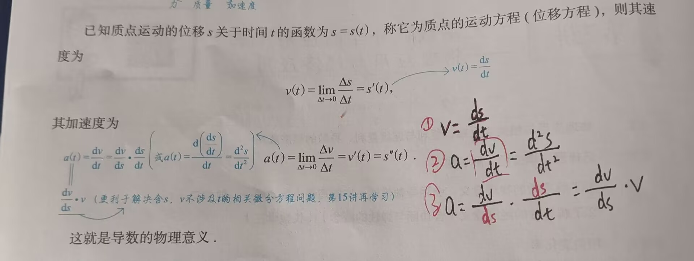

# 知识点

---

### 一、物理应用与相关变化率

-  相关物理概念：
	1. 速度：位移对时间的变化率
	2. 加速度：速度对时间的变化率
	3. 牛顿第三定律：$F=ma$ 
		1. F：力
		2. m：质量
		3. a：加速度

### 二、相关变化率

- 研究 $\frac{dA}{dB}=\frac{dA}{dC}\cdot \frac{dC}{dB}$
- 一般情况下，题目会让求 $\frac{dA}{dB}$ ，但无法直接求得，此时已知 $\frac{dC}{dB}$ 或 $\frac{dA}{dC}$，且另一个可通过求导得出，如：已知：$\frac{dy}{dt}$，$y=f(x)$，求 $\frac{dy}{dt}$，故可用如下做法：$\frac{dy}{dt}=\frac{dy}{dx}\cdot \frac{dx}{dt}$ 求得答案