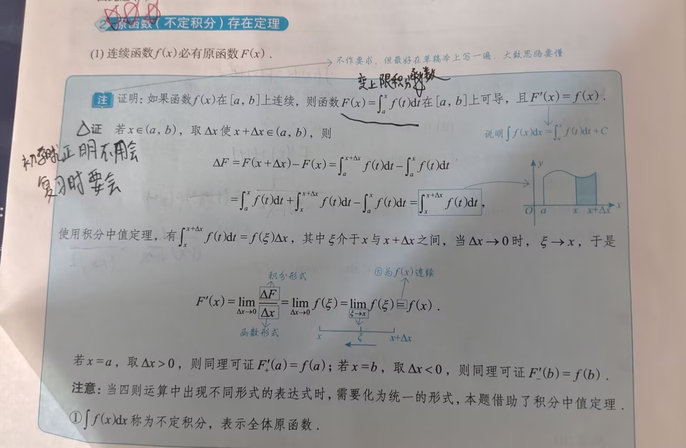
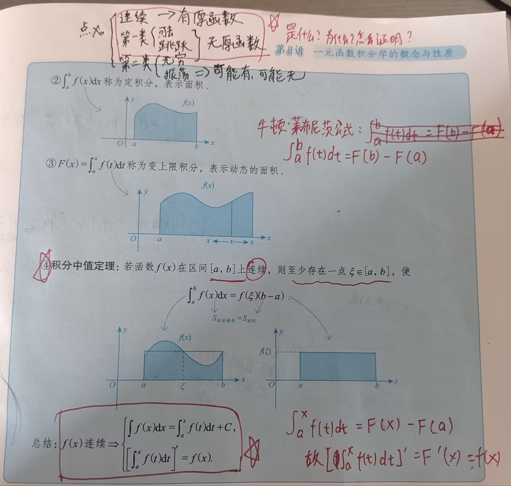
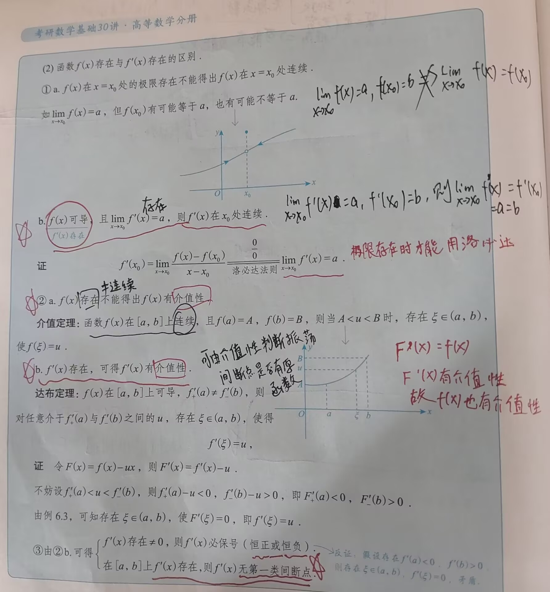

# 知识点

---

### 一、不定积分
#### 1. 原函数与不定积分

- 设函数 $f(x)$ 定义在某区间 $I$ 上，若存在`可导`函数 $F(x)$，对于该区间上**任意点**，均有 $F\prime(x)=f(x)$成立，则称 $F(x)$ 为 $f(x)$ 在区间 $I$ 上的一个原函数。称 $\int f(x)dx=F(x)+C$ 为 $f(x)$ 在区间 $I$ 上的不定积分  
>[!tip] tip
>若 $f(x)$ 存在原函数 $F(x)$，则 $F(x)$ 为可导函数，可知：$F(x)$ 连续（可导必连续）

- 由定义来判断**振荡间断点是否存在原函数**：已知 $f(x)$ 和 $F(x)$ ，判断存在振荡间断点 $x_0$ 时，$F(x)$ 是否为 $f(x)$ 的原函数，则先对 $F(x)$ 求导，分段点处需要用导数定义求导，非分段点则直接求导，算出来后与 $f(x)$ 比较，若相同，则 $f(x)$ 存在原函数 $F(x)$
#### 2. 🌟🌟🌟原函数（不定积分）存在定理

1. 连续函数 $f(x)$ 一定有原函数 $F(x)$
	- 证明：图中的变限积分就是一个原函数
2. 含有第一类间断点（可去间断点和跳跃间断点）和无穷间断点的区间内一定没有原函数
	- 证明第一类间断点无原函数，可在间断点（分段点）处用**导数的定义+洛必达**（结果存在才能用洛必达） 
3. 含有振荡间断点的区间可能有原函数，也可能没有
	- 有界振荡和无界振荡都可能存在原函数，主要看是否函数 $f(x)$ 是否连续，若是因为极限不唯一而导致的振荡，但微观上看，函数图像仍是连续的（间断点不是真的断）（理解：振荡间断点，图像是连续，只是由于连续的定义，所以才说是间断（微观上））
 4. 函数 $f(x)$ 与 $f\prime(x)$ 的区别
	 
	 - 若 $f\prime(x)$ 在区间 $[a,b]$ 存在，则说明 $f\prime(x)$ 的原函数 $f(x)$ 连续，故 $f\prime(x)$ 无第一类间断点
### 二、定积分(也称为莱曼积分)
#### 1. 定义（）

```
待补充，见基础30讲P251
```
##### 定积分的精确定义

>[!tip] 需要记忆
>考试时可能会遇到使用定积分定义更容易解决的题目，需要结合定义进行分析，此时就需要会默写定义

将 $[a,b]$ $n$ 等分且取每个小区间的右端点为 $\xi _1$，则： $\lim\limits_{n\rightarrow\infty}\sum_{i=1}^{n}f(a+\frac{b-a}{n}i)\frac{b-a}{n}=\int_a^bf(x)dx$ 
	若取右端点为 $\xi _1$，则： $\lim\limits_{n\rightarrow\infty}\sum_{i=0}^{n-1}f(a+\frac{b-a}{n}i)\frac{b-a}{n}=\int_a^bf(x)dx$
	当 $a=0,b=1$ 时，得出的形式更简单：$\int_0^1f(x)dx=\lim\limits_{n\rightarrow\infty}\sum_{i=1}^{n}f(\frac{i}{n})\frac{1}{n}$  

#### 2.🌟🌟🌟存在定理

```
定积分的存在定义，也称为一元函数的（常义）可积性；这里的“常义”指的是“区间有限，函数有界”
```
##### （1）定积分存在的**充分条件**

```
即：满足以下条件之一，则定积分存在
```
1. 若 $f(x)$ 在 $[a,b]$ 上连续，则 $\int_a^bf(x)dx$ 存在
	- 🌟闭区间上连续函数一定有界；连续函数一定有定积分和不定积分（连续函数一定有原函数，但原函数$\neq$不定积分）
2. **（考纲里没有）** 若 $f(x)$ 在 $[a,b]$ 上单调，则 $\int_a^bf(x)dx$ 存在
	- 由于函数单调，故 $f(a),f(b)$ 即为函数的界，对于任意 $x\in (a,b)$，$f(x)$ 一定介于 $f(a),f(b)$ 之间
	- **闭区间**上的单调函数一定有界，因为其在两端点处均有定义（可取到端点）
3. 若 $f(x)$ 在 $[a,b]$ 上有界，且只有**有限个**间断点（不包含无穷间断点），则 $\int_a^bf(x)dx$ 存在
##### （2）定积分存在的**必要条件**

```
定积分存在，则必定有如下结论
```
- 可积函数必有界，即：若定积分 $\int_a^bf(x)dx$ 存在，则 $f(x)$ 在 $[a,b]$ 上必有界
#### 3. 🌟🌟性质

两个规定：
	（1）当 $b=a$ 时，$\int_a^af(x)dx=0$
	（2）当 $a>b$ 时，$\int_a^bf(x)dx=-\int_b^af(x)dx$ 
1. 性质1（求区间长度）：假设 $a<b$，则 $\int_a^bdx=b-a=L$，其中 $L$ 为区间 $[a,b]$ 的长度
2. 性质2（积分的**线性**性质）：设 $k_1,k_2$ 为常数，则 $\int_a^b[k_1f(x)\pm k_2g(x)]dx=k_1\int_a^bf(x)dx\pm k_2\int_a^bg(x)dx$ 
3. 🌟性质3（积分的可加（拆）性）：无论 $a,b,c$ 的大小如何，总有 $\int_a^bf(x)dx=\int_a^cf(x)dx+\int_c^bf(x)dx$ 
4. 🌟性质4（积分的保号性）：若在区间 $[a,b]$ 上 $f(x)\leq g(x)$，则有 $\int_a^bf(x)dx\leq\int_a^bg(x)dx$，特殊地，有 $|\int_a^bf(x)dx|\leq\int_a^b|f(x)|dx$ 
	- 等号仅在 $[a,b]$ 上 $f(x)$ 恒等于 $g(x)$ 时成立
	- 记忆口诀：亡羊补牢（积分完之后再取绝对值） $\leq$ 未雨绸缪（取完绝对值之后再积分）
5. 性质5（估值定理）：设 $M,m$ 分别是 $f(x)$ 在 $[a,b]$ 上的最大值和最小值，$L$ 为区间 $[a,b]$ 的长度，则有：$mL\leq\int_a^bf(x)dx\leq ML$ 
6. 🌟🌟🌟性质6（积分中值定理）：设 $f(x)$ 在区间 $[a,b]$ 上连续，则在 $[a,b]$ 上至少存在一点 $\xi$，使得 $\int_a^bf(x)dx=f(\xi)(b-a)$
	- 可同时记忆一下牛顿莱布尼茨公式：$\int_a^bf(x)dx=F(b)-F(a)$

>[!tip] 可积
>可积指的是存在定积分（反常积分不是定积分）（变限积分是特殊的定积分）

### 三、变限积分
#### 1. 概念

- 当 $x$ 在 $[a,b]$ 上变动时，对应于每一个 $x$ 值，积分 $\int_a^xf(t)dt$ 都有一个确定的值，因此 $\int_a^xf(t)dt$ 是一个关于 $x$ 的函数，记作 $F(x)=\int_a^xf(t)dt\;\;(a\leq x\leq b)$ ，称函数 $F(x)$ 为**变上限的定积分**，同理可定义变下限的定积分和上下限都变化的定积分，这些都称为**变限积分**，事实上，`变限积分就是定积分的推广`
#### 2. 性质

>[!tip] 由 $f(x)$ 可得出的性质
>$f(x)$ 可导 $\Rightarrow$连续 $\Rightarrow$ 可积 $\Rightarrow$ 有界

1. 函数 $f(x)$ 在区间 $I$ 上可积，则函数 $F(x)=\int_a^xf(t)dt$ 在 $I$ 上连续
	- 可由定积分的必要条件得：函数 $f(x)$ 在区间 $I$ 必定有界
	- **证明**可见基础30讲P262
2. 🌟🌟🌟函数 $f(x)$ 在 $I$ 上连续，则函数 $F(x)=\int_a^xf(t)dt$ 在 $I$ 上可导且 $F\prime(x)=f(x)$，即：原函数存在
3. 若 $x=x_0\in I$ 是 $f(x)$ 唯一的**跳跃间断点**，则 $F(x)=\int_a^xf(t)dt$ 在 $x_0$ 处**不可导**（不是原函数），且 $F_-\prime(x_0)=\lim\limits_{x\rightarrow x_0^-}f(x)$ ，$F_+\prime(x_0)=\lim\limits_{x\rightarrow x_0^+}f(x)$ （均由导数定义+洛必达法则求得），可知 $F_-\prime(x_0)\neq F_+\prime(x_0)$ ，即：$F(x)$ 在 $x_0$ 处不可导 
	- `可导必定连续，连续不一定可导`
	- 因为 $dx\rightarrow 0$ 时，在跳跃间断点 $x_0$ 处，变化量（积分） $dy$ （$y=F(x)=\int_a^xf(t)dt$）不会突变，只有变化率 $\frac{dy}{dx}$ 会突变，故函数 $F(x)$ **仍然是连续的**
4. 若 $x=x_0\in I$ 是 $f(x)$ 唯一的**可去间断点**，则 $F(x)=\int_a^xf(t)dt$ 在 $x_0$ 处**可导**（不是原函数），且 $F\prime(x_0)=\lim\limits_{x\rightarrow x_0}f(x)\neq f(x_0)$ 


### 四、反常积分