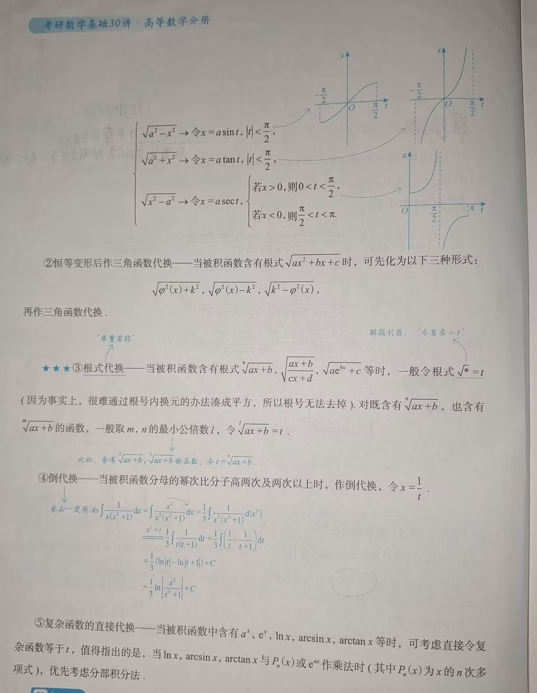
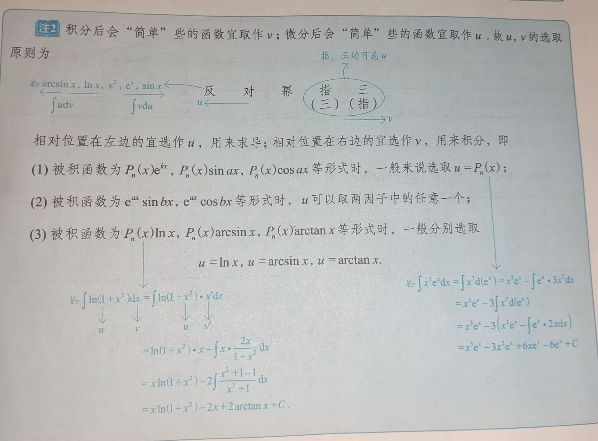

# 知识点

---

### 一、🌟🌟🌟基本积分公式[^1]

```
判断积分结果是否正确，只要对其求导，判断是否等于积分前的函数即可
```
1. $\int x^k\;dx=\frac{1}{k+1}x^{k+1}+C,\;k\neq -1;$
2. $\int\;\frac{1}{x}dx=\ln |x| + C$
3. $\int e^x\;dx=e^x+C$
4. $\int a^x\;dx=\frac{a^x}{\ln a}+C,\;a>0\text{且}a\neq 1$       $(a^x)\prime=a^x\ln a$
5. $\int\sin x\;dx=-\cos x+C$
6. $\int\cos x\;dx=\sin x +C$
7. 🌟$\int\tan x\;dx=-\ln |\cos x|+C$
8. 🌟$\int\cot x\;dx=\ln |\sin x|+C$
9. 🌟$\int\frac{dx}{\cos x}=\int\sec x\;dx=\ln |\sec x+\tan x|+C$
10. 🌟$\int\frac{dx}{\sin x}=\int\csc x\;dx=\ln |\csc x-\cot x|+C$
11. $\int\sec^2x\;dx=\tan x +C$
12. $\int\csc^2x\;dx=-\cot x +C$
13. $\int\sec x\tan x\;dx=\sec x+C$
14. $\int\csc x\cot x\;dx=-\csc x + C$
15. $\int\frac{1}{1+x^2}\;dx=\arctan x+C$
16. 🌟$\int\frac{1}{a^2+x^2}\;dx=\frac{1}{a}\arctan\frac{x}{a}+C\;(a>0)$
17. $\int\frac{1}{\sqrt{1-x^2}}\;dx=\arcsin x +C$
18. 🌟$\int\frac{1}{\sqrt{a^2-x^2}}\;dx=\arcsin\frac{x}{a}+C\;(a>0)$
19. 🌟$\int\frac{1}{\sqrt{x^2+a^2}}\;dx=\ln (x+\sqrt{x^2+a^2})+C\;(\text{常见}a=1)$ （a=1时，$\ln (x+\sqrt{1+x^2})$ 为反双曲正弦函数）
20. $\int\frac{1}{\sqrt{x^2-a^2}}\;dx=\ln |x+\sqrt{x^2-a^2}|+C\;(|x|>|a|)$ （若x 取负值，则 $x+\sqrt{x^2-a^2}$  可能为负，所以要加绝对值）
21. 🌟$\int\frac{1}{x^2-a^2}\;dx=\frac{1}{2a}\ln |\frac{x-a}{x+a}|+C\;(\int\frac{1}{a^2-x^2}\;dx=\frac{1}{2a}\ln |\frac{x+a}{x-a}|+C)$
22. 🌟$\int\sqrt{a^2-x^2}\;dx=\frac{a^2}{2}\arcsin\frac{x}{a}+\frac{x}{2}\sqrt{a^2-x^2}+C\;(a>|x|\geq 0)$ 
23. 🌟$\int\sin^2x\;dx=\frac{x}{2}-\frac{\sin 2x}{4}+C\;(\sin^2x=\frac{1-\cos 2x}{2})$
24. 🌟$\int\cos^2x\;dx=\frac{x}{2}+\frac{\sin 2x}{4}+C\;(\cos^2x=\frac{1+\cos 2x}{2})$
25. 🌟$\int\tan^2x\;dx=\tan x-x+C\;(\tan^2x=\sec^2x-1)$
26. 🌟$\int\cot^2x\;dx=-\cot x-x+C\;(\cot^2x=\csc^2x-1)$

### 二、不定积分的积分法
#### 1. 凑微分法

- $\int f[g(x)]g\prime(x)\;dx=\int f[g(x)]\;d[g(x)]=\int f(u)\;du$
	- 若凑微分结束后可用积分公式，则结束
##### （1）常用凑微分公式（）

1. 由于 $x\;dx=\frac{1}{2}\;d(x^2)$，故 $\int xf(x^2)\;dx=\frac{1}{2}\int f(x^2)\;d(x^2)=\frac{1}{2}\int f(u)\;du$
2. 由于 $\sqrt{x}\;dx=\frac{2}{3}\;d(x^\frac{3}{2})$，故 $\int\sqrt{x}f(x^\frac{3}{2})\;dx=\frac{2}{3}\int f(x^\frac{3}{2})\;d(x^\frac{3}{2})=\frac{2}{3}\int f(u)\;du$
3. 由于 $\frac{dx}{\sqrt{x}}=2d(\sqrt{x})$，故 $\int\frac{f(\sqrt{x})}{\sqrt{x}}\;dx=2\int f(\sqrt{x})\;d(\sqrt{x})=2\int f(u)\;du$  
4. 由于 $\frac{dx}{x^2}=d(-\frac{1}{x})$，故 $\int\frac{f(-\frac{1}{x})}{x^2}\;dx=\int f(-\frac{1}{x})\;d(-\frac{1}{x})=\int f(u)\;du$  
5. 待补充（基础30讲P280）
#### 2. 换元法

1. 基本思想：
2. 常用换元法
	1. 三角函数代换：当被积函数含有如下根式时，可作三角函数代换，这里 $a>0$ 
	 
#### 3. 分部积分法

1. $\int u\;dv=uv-\int v\;du$ 
	- $\int u\;dv$ 难算，而 $\int v\;du$ 容易计算时，可考虑分部积分法
		
2. 分部积分法的推广公式与 $\int P_n(x)e^{kx}\;dx$，$\int P_n(x)\sin ax\;dx$，$\int P_n(x)\cos bx\;dx$
	设函数 $u=u(x)$ 与 $v=v(x)$ **具有直到第 n+1 阶的连续导数**，并根据分部积分公式：$\int u\;dv=uv-\int v\;du$ ，则有：$\int uv^{(n+1)}\;dx=uv^{(n)}-u\prime v^{(n-1)}+u\prime\prime v^{(n-2)}-\cdots +(-1)^nu^{(n)}v+(-1)^{n+1}\int u^{(n+1)}v\;dx$ 
		辅助记忆：等式右边的各项正负交替出现，奇数项为正，偶数项为负（也可使用图中的表格法）
	 证明过程：
	 因为从左到右，u 逐渐变为高阶导，而 v 逐渐变为低阶导，由于导数均连续，故 $v^{(n-1)}$ 也可看做 $v^{(n)}$ 的原函数
#### 4. 🌟🌟🌟有理函数的积分

1. 定义：形如 $\int\frac{P_n(x)}{Q_m(x)}\;dx\;(n<m)$ 的积分称为**有理函数的积分**，其中 $P_n(x),Q_m(x)$ 分别是 $x$ 的 n 次多项式和 m 次多项式
	- $n<m$ 时为真分式，$n\geq m$ 时为假分式 
2. 思想：若 $Q_m(x)$ 在**实数域**内可因式分解，则因式分解后再把 $\frac{P_n(x)}{Q_m(x)}$ 拆成若干项最简有理分式之和
	**有理式=最简有理分式之和**，其中最简有理分式分为如下形式： $\frac{A}{ax+b},\frac{A_k}{(ax+b)^k},\frac{Ax+B}{px^2+qx+r},\frac{A_kx+B_k}{(px^2+qx+r)^k}\;(k>0,k\neq 1)$ 
	
	- 可拆的都是真分式，且不可继续因式分解
	- 拆完后不知道其具体函数，可用待定系数法，先写出拆后应有的形式，再进行求解并代入，以得正解
>[!tip] 助记
>分母 $Q_m(x)^k$ 有几次方，则其拆分后有理分式就有几项，且分母是从 1 次方一直到 k 次方都有


[^1]: 🌟🌟🌟要求必会