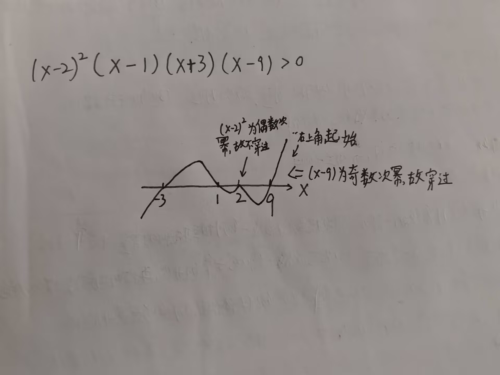

# 做题技巧

--- 

### 一、穿根引线法

- 当遇到 $(x-1)(x+2)(x-9) > 0$ 这种不等式时，可用`穿根引线法`来解决，即：画一根从左往右的正向数轴，将所有根 $x=1,x=-2,x=9$ 按大小标注在数轴上，再从**最右根**的**右上方**往左下划线穿过根到达数轴下方，再继续穿过“次右根”上去，一上一下一次穿过各根，直到穿过最左根
	- 规定：一定要保证不等式左边的 $x$ 的系数为`正数`，若不等式为：$(1-x)(x+3)(x-6)>0$，此时 $x$ 的系数为负数，需要将其变为正数，则等式左右两边均乘`-1`，不等式变为：$(x-1)(x+3)(x-6)<0$ 后，方可使用**穿根引线法**
	- 性质：**奇过偶不过**
		- 如果因式中，$x$ 的幂为偶数次，如：$(x-1)^2,(x+3)^4$等，则穿根时不穿过数轴；如果为奇数次幂，如：$(x+1),(x-8)^3$等，则穿根时要穿过数轴
	- 判断 >0 或是 < 0，则看数轴上下方曲线即可

### 二、极限问题（）

```
🌟🌟🌟遇见(根式-根式)的，能化简就先化简
```
>[!tip]  "抓大头"用法
>在$x\rightarrow\infty$时，找次数最大的系数
>在$x\rightarrow 0$时，找次数最小的系数
>详情请见基础30讲P104最上方处
#### （1）七种未定式解法

>[!tip] 注意区分
>这里的$\frac{0}{0}$ 型中的 0 指的是趋近于0的无穷小量，而不是真正的0，真正的0是最高阶的无穷小，同理，$1^\infty$中的1也不是真正的1，指的是趋近于1的极限值，如：$\lim\limits_{n\rightarrow\infty}(1+\frac{1}{n})^n$，这才是$1^\infty$型未定式，而底数只有1的，则不论其是几次方，结果都是1：$1^\infty = 1$
##### 1. $\frac{\infty}{\infty}$型

- 如：$\lim\limits_{x\rightarrow \infty}\frac{e^x-x}{e^x+x}$ 要注意，趋向无穷分为正无穷和负无穷，而$e^x$ 趋向正无穷和趋向负无穷的值是不同的，需要分类讨论，其他类似函数也同样需要分类讨论，以减少错误
##### 2. $\frac{0}{0}$ 型

##### 3. $0*\infty$ 型
##### 4. $0^0$ 型
##### 5. $1^\infty$ 型

底数不能使用等价无穷小，指数可以使用等价无穷小
##### 6. $\infty ^0$ 型
##### 7. $\infty -\infty$ 型
#### （2）极限四则运算

- 若$\lim\frac{f(x)}{g(x)}=A$，且 $\lim g(x)=0$，则$\lim f(x)=0$；[^1]
- 若$\lim\frac{f(x)}{g(x)}=A\neq 0$，且 $\lim f(x)=0$，则$\lim g(x)=0$；
	- 详细证明见基础30讲P93例题1.20
	- 🌟🌟🌟🌟适用范围：分子(或分母)已知极限趋于0，而分母(或分子)中含有字母，极限也为字母时可用，如：$\lim\limits_{x\rightarrow -2}\frac{2x^3+ax^2-3x+6}{x+2}=b$ 即可使用这个定理，可推出分子也趋于0，立刻可得出`a`的值
### 应用题解题步骤

1. 找定义式、关系式、约束式
2. 🌟🌟🌟**做一至两步的逆运算**
3. 联想“经典形式”
4. 恒等变形，如：
	1. $a = a-0$
	2. $a=(a-b)+b$
	3. $e-1=e^1-e^0$ 
5. **翻译**数学名词，写出对应的数学表达式


### 洛必达法则的使用条件

1. 导数必须在某点的**去心邻域内存在**
2. $\frac{0}{0}$ 型或 $\frac{\infty}{\infty}$ 型
3. 洛必达后得到的极限存在


### $\int_a^bf(x)g(x)dx$ 与 $\int_a^bf(x)dx\int_a^bg(x)dx$ 关系 ----- 可用柯西-施瓦茨公式

公式内容：$(\int_a^bf(x)g(x)dx)^2\leq \int_a^bf^2(x)dx\cdot\int_a^bg^2(x)dx$    


[^1]: 重点：适用于解决极限问题中求未知数a，b的情况