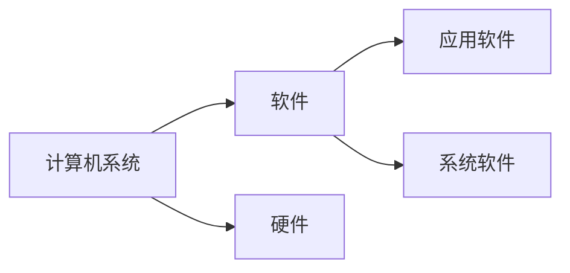
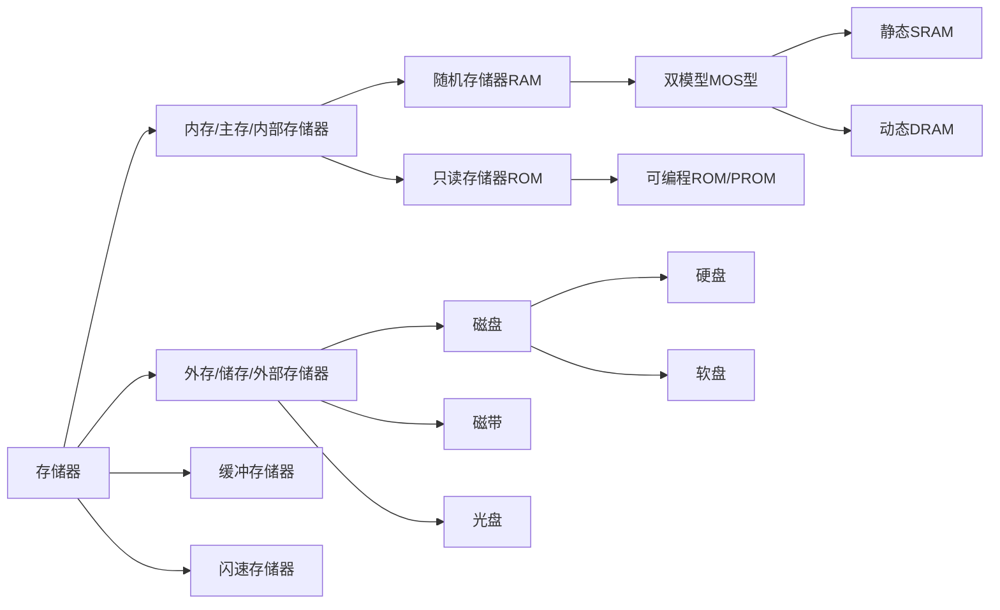

---
tags:
  - 计组
  - 复习
date: 2024-06-11
---
- 复习结束后可看[[试卷真题|往年真题]]
- [[高频考点]]
- [[0和1代表的含义|易混淆0和1含义]]
- [二进制乘法例子](二进制乘法例子.md)
- [阵列乘法器](无符号阵列乘法器.md)
- [判断溢出](溢出.md)
- [由指令格式判断类型](指令类型.md)
- [易错](易错.md)
- [电流波形记录形式](电流波形记录形式.md)
- [CPU指令流水线](CPU指令流水线.md)
# 一、组成

### 网课：
-  计算机操作系统由***硬件系统***和***软件系统***两大部分组成。 ^09b185

- 硬件：由各种看得见摸得着的电子元器件，如：各种光、电、机设备的实物组成，如主机、外部设备等。 ^d04b3b

# 二、指令
## 1、按寻址方式分类
### 大类：
#### (1)***指令寻址***：确定指令存放位置的过程
- 定义：找到下一条将要执行指令的地址，称为指令寻址
- 指令基本上按执行顺序存储在***主存***中，执行过程中，指令总是从内存单元被取到指令寄存器IR中。
##### 分类：
###### 1）顺序寻址
- 方式：用***指令计数器(PC) +‘ 1 ’ ***来得到下一条指令的地址
- 例如： 1 -> 2 -> 3 和 7 -> 8 都是顺序寻址
###### 2） 跳跃寻址
-  方式：通过***转移指令***的寻址方式，计算出目标地址，送到 PC 中即可
- 例如：2 -> 9 和 1 -> 7 等都是跳跃寻址
#### (2)***数据寻址***：确定操作数存放位置的过程
- 定义：找到当前正在执行指令的数据地址，称为数据寻址
- 特征：开始时数据被存放在内存中，但在执行过程中，内存的数据可能被存入到CPU寄存器中，或者内存堆栈中，所以就需要考虑使用相应的寻址方式以方便找到目标数组元素
	- ***！注意***：**绝大多数**情况下，**地址码**字段通常都***不代表***操作数的**真实地址**，而是***形式地址***，寻址方式就是将形式地址转换成真实地址
- 图例：
- 
| 操作码 | 寻址特征 | 形式地址(A) |
| --- | --- | --- |

EA ：操作数的有效地址
EA = (PC) + A中的括号表示取PC指向的那个地址所存的值
##### 数据寻址分类：
###### 1)直接寻址
- 定义：指令中的形式地址A就是EA，即EA=A
- 图例：
###### 2)间接寻址
- 分类：间接寻址分为***一次间接寻址***和***多次间接寻址***
	- **一次间接寻址**：
		- 
	- **多次间接寻址**：
		- 有一位作为标记位，判断是否间接寻址完毕
		- 以两次间接寻址为例：
		- 
	- 分析：一次间接寻址在指令执行期间还需要访问两次存储器，一次是取操作数的有效地址，一次是取操作数，而 **N 次间接寻址**需要访问存储器 **N + 1** 次
###### 3)寄存器寻址
- 定义：与直接寻址类似，直接寻址给出的地址块字段是主存地址，而在寄存器寻址中，地址块字段给出的是寄存器编号Ri，则***操作数的有效地址***为：EA = Ri，即：在寄存器中找到第Ri个位置，存储的即为操作数
- 图例：
- 优点：由于操作数在寄存器中，因此指令在执行阶段不需要访问存储器，减少了执行时间
###### 4)寄存器间接寻址
- 与寄存器寻址的***区别***：寄存器第Ri个存储的内容不是操作数，而是操作数所在主存单元的地址号，即：有效地址EA = （Ri）
- 图例：
- 分析：由指令得到寄存器中的主存地址，再由主存地址进行访存(访问存储器)，将目的地址所存操作数取出，即为所求操作数
###### 5)隐含寻址
- 特征：**不明显给出操作数地址**，其操作数地址***隐含***在操作码或某个寄存器中
- 典型：一地址加法指令
- 
	- 操作码显示ADD，说明有两个数进行运算，但地址只给出了一个操作数地址，另一个操作数隐藏在ACC中，这就是典型的隐含寻址
###### 6)立即寻址
- 图例：
- 
| OP | # | A |
| :---: | :---: | :---: |
- 符号解释：
	- '# : 立即寻址特征
	- A ：立即数
- 通常将 ’ # ‘ 放在立即数前边，例如：#20H
- 优缺点：
	- 优点：只需取出指令即可***立即获得操作数***，只需在取指令时访问存储器，在执行阶段不需要再访问存储器
	- 缺点：由于A表示的是立即数，因此A的位数限制了其表示范围，例如：A为8位时，立即数的取值范围为：- 128 ~ 127  （即： - 2^8 -1 ~ 2 ^ 8 -1)
- 适用：通常用于对某***寄存器或内存单元***赋值
###### 7)偏移寻址--------基址寻址
- 前提：操作数的有效地址需要通过某个基础地址来形成，需要设置一个基址寄存器(BR)
- 定义：其***操作数的有效地址EA***等于指令中的**形式地址A**与**基址寄存器**中的内容***相加***
- 公式：EA = A + (BR)    ---------- BR----数组集合，可变
- 图例1：
- 图例2： 
###### 8)偏移寻址--------变址寻址
- 定义：操作数的有效地址EA 等于指令字中的**形式地址A**与**变址寄存器(IX)**的内容**相加**
- 公式：EA = A + (IX)   ----------- A可变
- 图例：
###### 9)偏移寻址--------相对寻址
- 相对位移量：操作数的位置与当前指令位置的相对距离
- 定义：相对位移量由指令字的形式地址给出，故**A**称为**位移量**
- 图例：
- 公式：EA = (PC) + A
###### 10)堆栈寻址
- 定义：操作数存放在堆栈中，隐含使用堆栈指针（SP）作为操作数地址。
##### 总结
- 一图表示：
	- 注意：取指令阶段均需要进行一次访存

## 2、按地址码数目分类
### (1)零地址指令
-  定义：*指令中只有操作码，而没有操作数,如空操作、停机、关中断等指令*
-  图例： 

	| OP |
	| --- |
### (2)一地址指令
- 定义：*指令中只给出一个地址，该地址即是操作数的地址，也是操作结果的存储地址*
- 图例：

	| OP | A1 |
	| --- | --- |
		A ------- 操作数的存储器地址或寄存器地址
- 步骤：取指 -> 读 A1       共两次访存  
### (3)二地址指令
- 定义：***最常见***的指令格式，两个地址指出两个源操作数地址，其中一个是存放结果的目的地址
- 图例：

	| OP | A1 | A2 |
	| --- | --- | --- |
		 A1 —— 第一个源操作数的存储器地址或寄存器地址
		 A2 —— 第二个源操作数和存放操作结果的存储器地址或寄存器地址
- 步骤：取指 -> 读 A1 -> 读 A2 -> 写 A2（A1和A2哪个作为存储操作结果的地址都行）
### (4)三地址指令
- 定义：对A1和A2指出的两个源操作数进行操作码（OPCODE）所指定的操作，结果存入A3中
- 图例：

	| OP | A1 | A2 | A3 |
	| --- | --- | --- | --- |
		 A1 —— 第一个源操作数的存储器地址或寄存器地址
		 A2 —— 第二个源操作数的存储器地址或寄存器地址
		 A3 —— 存放操作结果的存储器地址或寄存器地址
- 步骤：取指 -> 读 A1 -> 读 A2 -> 写 A3
### (5)四地址指令

- 图例：

| OP  | A1  | A2  | A3  | A4  |
| --- | --- | --- | --- | --- |
- 执行指令后，跳转A4 所指地址执行下一次指令，A4存的是下一次指令执行的地址
- 步骤：取指 -> 读 A1 -> 读 A2 -> 写 A3
## 3、按指令长度分类
### (1) 定长指令字结构
- 定义：指令系统中所有指令的长度都相等
### (2) 变长指令字结构
- 定义：指令系统中各种指令的长度不相等
# 三 、校验码
## (1)奇偶校验码
- 缺点：只能检验出是否发生错误，无法检验出发生了多少次错误，若发生偶数次错误，导致数据中 '1' 的奇偶性未发生变化，则无法检测出错误。
### 1）奇校验码
- 校验方式：保证加上检验元后数据中共有奇数个 ’ 1 ‘，如果接受到的数据有偶数个’ 1 ‘ 则证明传输过程中数据发生了错误
- 图例：

	- 
	| 检验元 | 数据位 | 数据位 |
	| :-----: | :-----: | :-----: |
- 例子：原数据位为：
	- 
	| 1 | 0 | 0 | 1 | 1 | 0 | 1 | 1 |
	| :---: | :---: | :---: | :---: | :---: | :---: | :---: | :---: |
	加上检测元后变成如下（最左侧第一个即为检测元）：
	- 
	| 0 | 1 | 0 | 0 | 1 | 1 | 0 | 1 | 1 |
	| :---: | :---: | :---: | :---: | :---: | :---: | :---: | :---: | :---: |
### 2）偶校验码
- 校验方式：保证加上检验元后数据中共有偶数个 ’ 1 ‘，如果接受到的数据有奇数个’ 1 ‘ 则证明传输过程中数据发生了错误
- 图例：

	- 
	| 检验元 | 数据位 | 数据位 |
	| :-----: | :-----: | :-----: |
- 例子：原数据位为：
	- 
	| 1 | 0 | 0 | 1 | 1 | 0 | 1 | 1 |
	| :---: | :---: | :---: | :---: | :---: | :---: | :---: | :---: |
	加上检测元后变成如下（最左侧第一个即为检测元）：
	- 
	| 1 | 1 | 0 | 0 | 1 | 1 | 0 | 1 | 1 |
	| :---: | :---: | :---: | :---: | :---: | :---: | :---: | :---: | :---: |
# 四、数据表示
## (1)概述
- 定点小数就是纯小数，定点整数就是纯整数
### 1)介绍
- 数按有无符号分为**无符号数**和**有符号数**，按小数点是否固定分为**定点数**和**浮点数**
	1. 有无符号
		1. 无符号数
			- 定义：没有符号位，则数中的每一位均用来表示数值
			- 例子：8 位二进制无符号数所表示的数值范围是 0～255
			- ==特殊情况==:
				- 纯小数：若约定小数点的位置在机器数的最高位之前，则是***纯小数***。
				- 纯整数：约定小数点的位置在机器数的最低位之后，则是***纯整数***；
		 1. 有符号数
			- 定义：带有符号位表示正负，符号位放在有效数字的前面，这样就组成了有符号数。
			- 例子：4位有符号数范围是-7~7.
	2. 小数点是否固定
		1. 定点数
			- 定义：若小数点的位置固定不变，则称为定点数。
				- ==特殊情况==：
					1. 定点小数

					| 符号位 | 小数点位置(隐含) | 小数位 | 小数位 | 小数位 |
					| :---: | :---: | :---: | :---: | :---: |
					| x0 | . | x1 | x2 | x3 | 
					
					2. 定点整数

					| 符号位 | 整数位 | 整数位 | 整数位 | 小数点位置(隐含) | 
					| :---: | :---: | :---: | :---: | :---: |
					| x0 | x1 | x2 | x3 | . | 
		1. 浮点数
			- 定义：小数点位置浮动，不固定
### 2）文心一言参考
- 定点数是一种在计算机中表示数值的方法，其特点是数据中小数点的位置固定不变。以下是定点数的特殊情况，以及相关的详细解释：

	1. **纯整数**：
	   - 定义：当小数点实际上位于数值的最后一位时，定点数可以用来表示纯整数。例如，整数100在计算机中可以用定点数表示，此时小数点实际上是隐含在数值的最后一位之后。
	   - 举例：以1个字节（8 bit）为例，纯整数100（D）在定点数中的表示是01100100（B）。
	
	2. **纯小数**：
	   - 定义：当小数点固定在数值的最高位（即符号位的右边）时，定点数可以用来表示纯小数。
	   - 举例：以1个字节（8 bit）为例，纯小数0.125（D）在定点数中的表示是0.00100000（B）。这里需要注意，在计算机中实际上并不存储小数点，而是根据事先的约定来确定小数点的位置。
	
	3. **整数+小数**：
	   - 定义：当需要同时表示整数部分和小数部分时，需要约定小数点的具体位置。
	   - 举例：以1个字节（8 bit）为例，我们可以约定前5位表示整数部分，后3位表示小数部分。数字1.5（D）的定点数表示就是00001 100（B），其中前5位中的00001表示整数1，后3位中的100表示小数0.5（即二进制中的0.1）。同样，数字25.125（D）的定点数表示也需要按照约定的格式来分配整数部分和小数部分的位数。
	
	4. **定点整数和定点小数**：
	   - 定点整数：小数点固定在数值部分的右边，即所有数值均表示为整数。在二进制表示中，最左边的位通常是符号位，其余位表示数值的绝对值。
	   - 定点小数：小数点固定在数值部分的左边（符号位的右边），即所有数值均表示为小数。这种表示方式在需要高精度的小数运算时尤为有用。

- 总结来说，定点数通过固定小数点的位置来表示数值，可以方便地处理纯整数、纯小数以及同时包含整数和小数的数值。在实际应用中，根据具体需求可以灵活选择定点整数或定点小数的表示方式，并约定小数点的具体位置。
## (2)机器数
### 1)原码(待补)
### 2)反码(待补)
### 3)补码(待补)
### 4)移码
- 定义：
- 图例：
- ==特殊情况==：
	- 0 在移码中只有一种表示：1，0000000 ( n个0 )； 
	- 最小真值的移码为全0，最大真值的移码为全1
- 大小比较：移码保持了真值原有的大小顺序，故可以==***直接比较***==大小
## (3)总结
- 一表化(表格)

| 机器码 | 0   | 1   |
| :-: | --- | --- |
| 原码  | 正   | 负   |
| 反码  | 正   | 负   |
| 补码  | 正   | 负   |
| 移码  | 负   | 正   |
- 注意：原码和反码中存在***正0和负0***，即：1 00000和 0 00000，但补码只有一个正0 (由反码 11111 + 1 得来)，且由于 补码 = 反码 + 1，所以补码的最小负数比原码和反码***多1个***(例如：原码和反码的数据范围为：-127 ~ 127，而补码的范围是 - 128 ~ 127，约定俗成：补码中 10000000B = 128D，这个数不是由反码+1得来的，而是直接规定的)，移码也***只有一个0***
- 原、反、补三者关系
	- 原码为正数：原码 = 反码 = 补码
	- 原码为负数：
		1. 反码：原码的符号位不变，其余位均取反
		2. 补码：反码 + 1
- ==移码与补码的关系：移码：补码的符号位取反==
- 移码：在真值上加一个常数 2^n
	- 图例：
## (3)浮点数
- [加减法运算](浮点数加减法.md)
### 1）非规格化数
- 定义：即不满足规格化表示条件的数
### 2）规格化处理：
- ==***重点！***==
- 规格化数通常指的是真值的***原码***表示
	1. 在浮点数规格化中，存在名为==***基数***==的指标，如下图中所示，N = S × 2^P ，其中，2 就是基数，最常见的基数有 2 (二进制)和 10 (十进制)
	2. 故可知：==基数 r== 就是代表对 ***r 进制***的数进行规格化处理
	3. 对于基数的值为 2^k 的规格化处理，处理要求为：尾数数值部分最高 k 位中(即：小数点后 k 位中) 至少存在一个  ' 1 ' 
- 前言：假设数据 x 的值为 R 进制，并且 x 的R 进制表示为  1.0001 , 则左移一位变成：R^1 × 0.10001
- 图例说明：
- 操作形式：将尾数的数值部分往左移称为***向左规格化***(简称***左规***)，往右移称为***向右规格化***(简称***右规***)
- 例子：用规格化浮点数表示 - 0.125D 
	1. 先将 十进制数 - 0.125D 转换为二进制浮点数：- 0.001B
	2. 转为规格化浮点数表示：- 0.001B = - 0.1B × 2^(-2D)
	3. 转为规格化浮点数： - 0.1B × 2^(-2D) = 1.1B × 2^(110B)
	4. 注意：最终规格化浮点数表示是没有B、D注明进制数的，最终表示应为：1.1 × 2^(110)，应注意***阶码和尾数的符号位***
	5. 其对应阶码和尾数为：

	| 阶码符号 | 阶码位(阶码) | 尾数符号(数符) | 尾数位 |
	| :---: | :---: | :---: | :---: |
	| 1 | 10 | 1 | 1 |
- 再举个例题说明：
	- 看到要求尾数11位，说明除符号外共有10位尾数，则将 x 化为二进制后要添加前置零以保证尾数有10位，在二进制浮点数规格化表示中同样如此，阶码则是对机器数的位数限制，如图可知：x 的二进制浮点数规格化表示中，阶码为 +110（左侧均未将符号位表示出来，而是用符号表示） ，是正数。
- 浮点数规格化表示的***好处***
	1. 使浮点数的***表示形式统一***
	2. 使浮点数的***表示精度最高***
- 浮点数的基数 r （原数值）对规格化后的影响：
	- **基数 r 越大**，可表示的==浮点数范围越大==，但同时==表示精度会下降==
## (4)IEEE754(待具体补明)
- 转换方法：
## (5)海明码
# 五、存储器
- [顺序存储器和交叉存储器相关计算题](顺序和交叉存储器计算.md)
## (1)存储器分类

- 按存取方式可分为：RAM和ROM
==！区别==：随机存储器RAM在断电后数据会消失(掉电)，ROM则不会丢失数据
- 常见的ROM有：固态硬盘
- 常见RAM：内存
- ==重点==：高速缓冲存储器，简称==Cache==，位于主存和CPU之间
- 图例：
## (2)RAM
### 1）SRAM
- 非重点
- 是***静态***随机存取存储器
- 由CMOS技术组成，使用六个晶体管
- 比DRAM等其他RAM类型相对更快
- ==高速缓冲存储器是SRAM的一种应用==
### 2）DRAM
- 非重点
- 是***动态***随机存取存储器
- 是一种使用电容器和少量晶体管构成的RAM
## (3)主存与CPU的链接
- 连接方式：主存储器通过***数据总线、地址总线、控制总线***与CPU连接
- 图例：
- MDR 中存储的数据通过数据总线与主存进行数据交换
- MAR 中存储的地址数据通过地址总线传给主存
- CPU 通过控制总线(读、写)向主存发送读、写等一系列控制信息
## (4)主存容量的扩展
1. 位扩展
2. 字扩展
3. 字扩展和位扩展同时进行
## (5)程序局部性原理
1. 时间局部性
	- 定义：如果程序中的某条指令一旦执行，不久以后该指令可能再次执行；如果该数据已经被访问过，不久后该数据可能再次被访问
	- 产生原因：程序存在大量的循环操作
2. 空间局限性
	- 定义：如果一个存储器的位置被引用，那么将来它附近的位置也会被引用
	- 产生原因：指令通常是顺序存放、顺序执行的，数据也一般是以向量、数组、表等形式族聚存储的
## ==(6)Cache==
- [相应的计算例题](Cache.md)
### 1）定义：
- **高速缓冲技术**是利用程序访问的***局部性原理***，把程序中正在使用的部分存放在一个***高速的、容量较小的Cache***中，使CPU的访存操作大多数针对***Cache***进行，从而大大提高程序的执行速度
- 执行图例：
- CPU会优先到Cache中查找是否存在指令所指信息，如果能找到，就直接拿信息并返回；如果找不到就再到主存中找，找到后复制副本到Cache中，再返回；如果都没有，那就去外存中查找，找到后复制副本到主存和Cache中
### 2）Cache详解
- 定义：Cache位于存储器层次结构的顶层，**通常由SRAM构成**
- Cache和主存都被分成若干大小相等的块(Cache块又称为Cache行)，块的长度称为块长(Cache行长)，所以***Cache的块数要远少于主存中的块数***，它***仅保存主存中最活跃***的若干块的副本
- ==CPU与Cache之间的数据交换以字为单位，而Cache与主存之间的数据交换则以Cache块为单位==
### 3）Cache的性能指标
1. 命中率H
	- 定义：CPU访问的信息在Cache中的比率
	- 计算方式：假设一个程序执行期间，Cache的总命中次数为Nc，访问主存的总次数是Nm，则Cache命中率H = Nc / (Nc + Nm)
2. 缺失率M
	-  定义：CPU访问的信息不在Cache中的比率
	- 计算方式：M = 1 - H
3. 平均访问时间Ta
	-  计算方式：设tc为命中时访问Cache的时间，tm是未命中时的访问时间，则Ta = H × tc + (1 - H) × tm
4. 访问效率
	- 计算方式：效率 = tc / Ta    (Cache访问一次所需时间/平均访问时间)
- 例题：
### 4）Cache主存映射
1. 直接映射
	- 计算行号：Cache行号 = 主存块号 mod Cache总行数
	- 地址结构

		| 主存字块标记 | Cache字块地址 | 字块内地址 |
		| :---: | :---: | :---: |
2. 全相联映射
	- 定义：主存中的每一块都可以装入Cache中的任意位置，每行的标记用于指出该行取主存的哪一块，所以CPU访问时需要与所有的Cache行标记进行比较
	- 地址结构

		| 主存字块标记 | 字块内地址 |
		| :---: | :---: |
3. 组相联映射
	- 定义：把Cache分成Q个大小相等的组，每个主存块可以装入固定组中的任意一行，即组间采用直接映射，组内采用全相联映射的方式
	- 地址结构 

		| 主存字块标记 | 组地址 | 字块内地址 |
		| :---: | :---: | :---: |
- 一图示：
# 六、总线
- 前置：
## 1.总线仲裁
### (1)基本概念
- 同一时刻**只能有一个设备控制**总线传输操作，可以有一个或多个设备从总线接受数据
- 将总线上所连接的各类设备按其对总线进行有无控制功能分为：
	- 主设备：获得总线控制权的设备
	- 从设备：被主设备访问的设备，只能响应主设备发来的各种总线命令
### (2)为什么要仲裁？
- 总线作为一种共享设备，不可避免地会出现同一时刻有多个主设备竞争总线控制权的问题，所以用总线仲裁来决定谁获得总线 控制权
### (3)总线仲裁的定义
- 多个主设备同时竞争总线控制权时，采用某一种方法选择一个主设备优先获得总线控制权，称为总线仲裁
### (4)总线仲裁分类
#### 1）集中仲裁
##### 1.链式查询方式
- 图例：
##### 2.计数器定时查询方式
- 图例：
##### 3.独立请求方式
- 图例：
#### 2）分布式仲裁
- 不需要中央仲裁器，每个潜在的主设备都有自己的仲裁号和仲裁器。当他们有总线请求时，就将自己的唯一的仲裁号发送到共享的仲裁总线上，谁的仲裁号大，谁就获得总线控制权
- 分布式仲裁是以优先级仲裁策略为基础的
## 2.总线定时
- 定义：总线定时是指总线在双方交换数据过程中需要时间上的配合关系的控制，这种控制称为总线定时，其实质是一种协议或规则，主要有==***同步***==和==***异步***==两种基本的定时方式
### (1)阶段：
#### 1）申请分配阶段
- 由需要使用总线的**主设备**提出申请，经过总线仲裁后决定下一期的总线使用权授予某一申请者。可将此阶段分为==**传输请求**==和==**总线仲裁**==两个阶段
#### 2）寻址阶段
- 取得使用权的主设备通过总线发出本次要访问的从设备的地址和有关命令，启动参与本次传输的从设备
#### 3）传输阶段
- 主设备和从设备进行数据交换，可单向或双向进行数据传送
#### 4）结束阶段
- 主设备的有关信息均从总线中撤出，让出总线控制权
### (2)方式
#### 1）同步定时方式
- 原理：系统采用一个**统一的时钟信号来协调发送和接收双方的传送定时关系**
- 适用：总线长度较短及总线总线所接部件的存取时间比较接近的系统
## 3、总线结构
### 1） 什么是总线？
- 总线是连接各个部件的信息传输线，是**各个部件共享的传输介质**
### 2）总线上的信息传递方式
- 总线上的信息传递分为串行传递和并行传递两种
- 图示例：
### 3）总线结构的计算机举例
#### a.面向CPU的双总线结构框图
- 图示例：
#### b.单总线结构框图
- 图示例：
#### c.以存储器为中心的双总线框图
- 图示例：
#### d.以I/O为中心的双总线框图
- 图示例：
### 4）总线分类
- 片内总线：**芯片内部**的总线
- 系统总线：**计算机各部件之间**的信息传输线
	- 数据总线：**双向**  与机器字长、存储字长有关
	- 地址总线：**单向** 与存储地址、I/O地址有关
	- 控制总线：**有出** **有入**
		- 出：存储器读、写，总线允许、中断确认
		- 入：中断请求、总线请求
- 通信总线：用于**计算机系统之间**或**计算机系统与其他系统**(如控制仪表、移动通信等)之间的通信
	- 根据传输方式分为**串行通信总线**和**并行通信总线**
### 5）总线特性
1. 机械特性
2. 电气特性
3. 功能特性
4. 时间特性