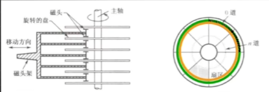
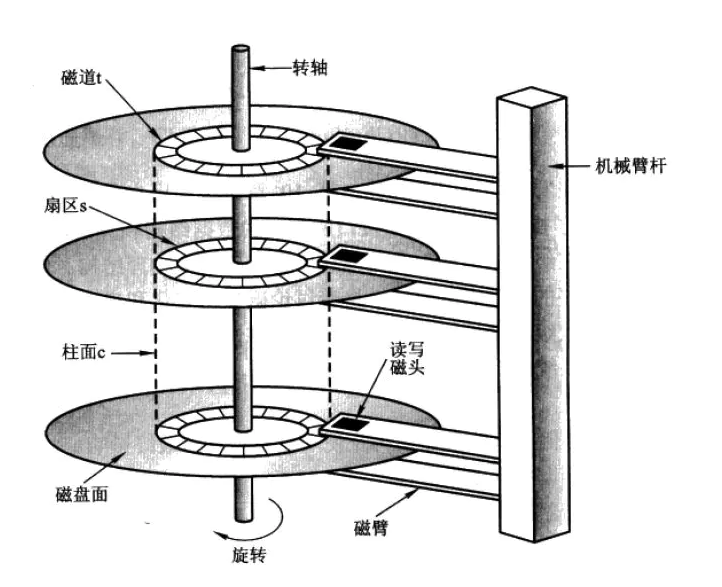
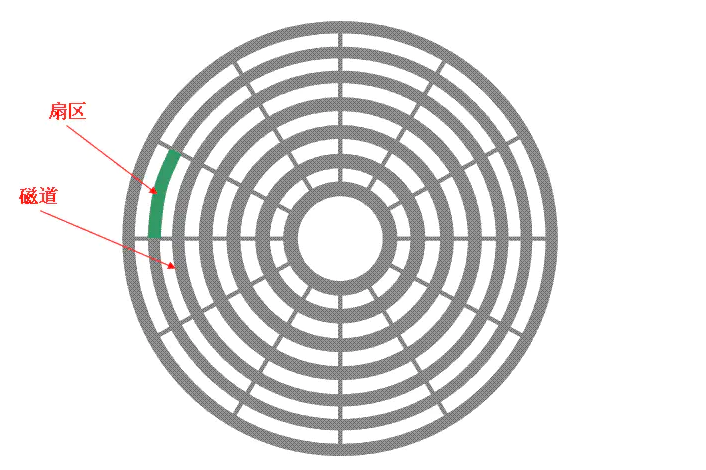
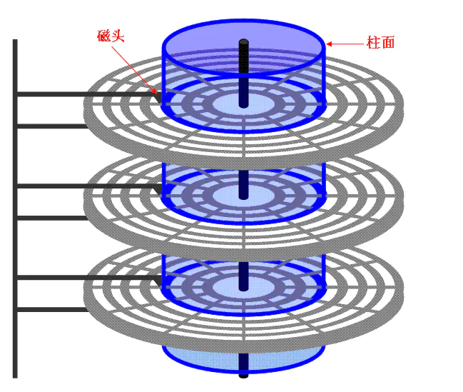
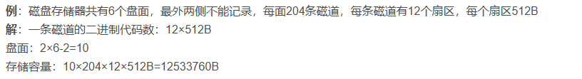
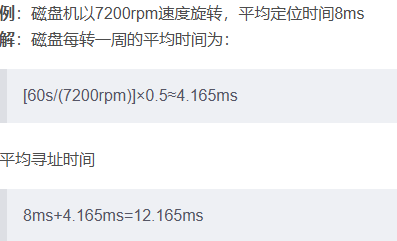
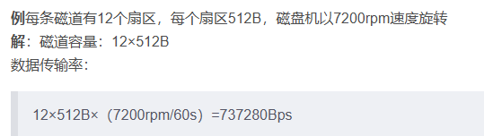

- 前置知识点：
	- 存储容量：一个磁盘存储器所能存储的字节总数
		- 先计算出一个记录面的存储容量，再乘以总记录面数量，即可求得存储容量
	- 平均存取时间：寻道时间 + 等待时间
		- 寻道时间：题目会给
		- 等待时间：磁盘旋转一圈所需时间的一半
	- 内部数据传输率：在磁盘上读写数据的速率
		- 计算方式：磁盘转速(n转/秒) × 一道磁道的容量
		
	- 磁盘图示例：
	- 
	- 其结构为：一根主轴将许多盘片串起来，盘片不动，磁头动。盘片上有许多“同心圆”(右图)，这些同心圆就是一个个==“磁道”==，每个磁道又分成若干个扇区，如右图，就分为了八个扇区。具有相同编号的磁道形成一个圆柱，称之为磁盘的柱面。
	- 图：
- 例题：