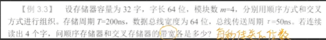

- 目的：为提高CPU与主存间的数据交换速率，可采用空间并行技术和时间并行技术
	- 空间并行技术--------双端口存储器：一个存储器有两组相互独立的读写控制电路
	- 时间并行技术--------多模块交叉存储器
		- 顺序方式
		- 交叉方式
		- 比较：交叉方式的存取效率更高
- 顺序方式：各模块只能一个接一个串行工作，效率低，受带宽限制
	- 存储方式：先将一个模块填满，再填下一个模块
	- 例：某存储器的存储容量为32**字**，并且该存储器有4个模块，每个模块有8个字。
	- 解：2 ^ 5 = 32 ，故共需要5位地址寄存器指示，***高两位选模块，低三位选该模块中的字***，例如 00 010 代表模块M0中的第三个字(从0开始算)
- 交叉方式：连续地址分布在不相邻的模块中，所以传送连续字时，能多模块流水式并行工作
	- 存储方式：先将所有模块的第一个地址存储完成，再继续存储所有模块的第二个地址
	- 例：某存储器的存储容量为32**字**，并且该存储器有4个模块，每个模块有8个字。
	- 解：仍是采用5位地址寄存器指示，不同的是：交叉方式用***低两位选模块，高三位选该模块中的字***

- 定量分析：连续读取m个字所需时间
	- 交叉方式：t1 = T + (m - 1) * t
	- 顺序方式：t2 = mT
		- T：读取一个字所需时间
		- t：开始读取第一个字后经过 t 秒再开始读取第二个字，以此类推；以防止同时提取出多个字而发生冲突( t 秒是总线传送周期，即将第一个字送达后刚好开始送第二个字)

- 例题：
- 先求出信息总量 q = 64 bit  ×  4  =  256 bit
- 信息总量 = 字长 × 模块数
- 再求两种方式的读取时间
	- 顺序方式：t1 = mT = 4 × 200 ns = 8 × 10^(-7) s
	- 交叉方式：t2 = T + (m - 1) t  = 200 ns + 3 × 50 ns = 350 ns = 3.5 ×10^(-7)
- 最后求出其带宽：信息总量/读取时间
	- 顺序方式：W = q / t1
	- 交叉方式：W = q / t2