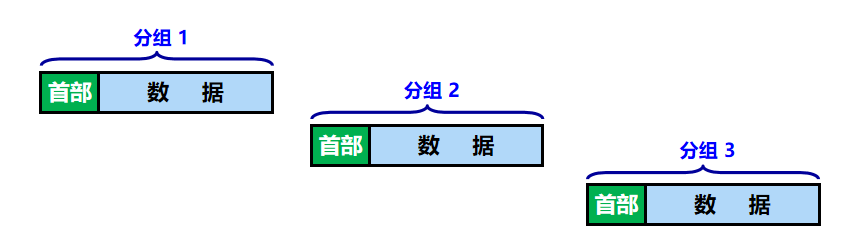

# 一、计网定义
1. 计算机网络最简单的定义是：一些互相连接的、自治的计算机的集合
	- 互连：是指计算机之间可以通过有线或无线的方式进行数据通信
	- 自治：是指独立的计算机，它有自己的软件和硬件，可以单独运行使用
	- 集合：是指至少需要两台计算机
2. 中国的三大ISP(互联网服务提供商):==中国电信、中国移动和中国联通==
	- 一旦某个用户能够***接入因特网***，所需要做的就是**购买**一些如**调制解调器或路由器**这样的设备，让其他用户可以和他相连。
# ==二、网络协议的三要素==
- 语法：数据与控制信息的**结构或格式**
- 语义：需要发出控制信息，以及完成动作与做出的响应
- 同步：即事件实现顺序的详细说明，也可称为“时序”
# ==三、三种交换方式==
- ***路由器***是实现***分组交换***的关键构件，其任务是**转发**收到的分组，这是网络核心部分最重要的功能
- 传统方式的弊端/缺点：传统两两相连的方式，当电话数量很多时，电话线数量也多，很不方便
- 电线对的数量与电话机数量的平方（N2）成正比。
- N 部电话机两两直接相连，需 N(N –1)/2  对电线。
- 图例：
### 1）电路交换
1. 定义：***电话交换机***接通电话线的方式称为电路交换
2. 图例：
3. 电路交换过程分为三个阶段
	1. ***建立连接***：建立一条专用的***物理通路***(占用通信资源)
	2. ***通话***：主叫和被叫双方互相通电话(一直占用通信资源)
	3. ***释放连接***：释放刚才使用的专用的物理通路(归还通信资源)
4. 特点：通话的两个用户***始终占用***端到端的通信资源
5. 缺点：线路的传输效率往往很低
	
### 2） 分组交换
1. 交换方式：通常我们把该消息的整块数据称为“***报文***”。在发送报文之前，先把较长的报文划分成一个个更小的等长数据段，在每一个数据段前面加上一些由必要的***控制信息***组成的首部，首部包含了分组的目的地址
2. 图例：

### 3）报文交换
- 报文交换中的交换节点也采用存储转发方式，但报文交换对报文的大小**没有限制**，这就要求节点交换机需要较大的缓存空间，报文交换主要用于早期的电报通信网，现在较少使用，***通常被较先进的分组交换方式所取代***
### 4）三种交换方式的比较
- 一图示：
# 四、网络分类
### 1）按覆盖范围分
1. 广域网WAN(Wide Area Network)
	1. 定义：作用范围通常为几十到几千公里，因而有时也称为**远程网**
	2. 地位：广域网是互联网的***核心部分***
	3. 任务：通过长距离运送主机所发送的数据
2. 城域网MAN
	1. 定义：作用范围一般是一个城市，可跨越几个街区，甚至是整个城市
3. 局域网LAN
	1. 定义：一般用微型计算机或工作站通过高速通信线路相连(速率通常在10Mbit/s以上)，但地理上范围较小(1km左右)
	2. 例子：如校园网、企业网等
4. 个人区域网PAN
	1. 别称：无线个人区域网WPAN
	2. 定义：在个人工作的地方把属于个人使用的电子设备用无线技术连接起来的网络
- 若中央处理器之间的距离非常近(如：仅1m的数量级或更小些)，则一般称之为**多处理器系统**，而不是计算机网络，如：蓝牙等
### 2）按拓扑结构分
1. 总线型网络
	- 图例：
2. 星型网络
	- 图例：
3. 环形网络
	- 图例：
4. 网状型网络
	- 图例：
### 3）按网络的使用者分
1. 公用网：指电信公司出资建造的大型网络，愿意按电信公司的规定交纳费用的人均可使用这种网络。因此公用网也可称为***公众网***。
2. 专用网：这是某个部门为满足本单位的特殊业务工作的需要而建造的网络，如：军队、铁路、银行等
### 4）按传输介质分
1. 有线网络
2. 无线网络
# 五、计算机网络性能指标
### 1）速率
- 定义：传送比特的速率，也称为比特率或数据率
### 2）带宽
- 定义：网络的通信线路所能传送数据的能力
- 单位：Hz
### 3）吞吐量
- 定义：在单位时间内通过某个信道的数据量
### 4）时延

### 5）时延带宽积

### 6）往返时间RTT

### 7）利用率

# 六、常见计算机网络体系结构
- 一图示：
- 计算机网络的体系结构是***计算机网络的各层及其协议的集合***
- OSI是法律上的国际标准
	- 如今用的最多的是***TCP/IP体系结构***，是现今规模最大的、覆盖全球的，故常被称为事实上的国际标准
- ==一般考察的是五层协议的体系结构== 
- 数据在各层之间的传递：
## (1)物理层
- (了解即可)传输媒体分为两类：
	- 导引型传输媒体：同轴电缆、双绞线(网线)、光线、电力线等；
	- 非导引型传输媒体：无线电波、微波、红外线、可见光等。
### 1）物理层基本概念
- 物理层考虑的是怎样才能在连接各种计算机的传输媒体上***传输数据比特流***(0/1)，而不是指具体的传输媒体。
### 2）特性
1. 机械特性
	- 定义：指明接口所用接线器的形状和尺寸、引脚数目和排列、固定和锁定装置等。平时常见的各种规格的接插件都有严格的标准化的规定
2. 电气特性
	- 定义：指明在接口电缆的各条线上出现的电压的范围
3. 功能特性
	- 定义：指明某条线上出现的某一电平的电压的意义
4. 过程特性
	- 定义：指明对于不同功能的各种可能事件的出现顺序
### 数据通信基本知识
- 组成：一个数据通信系统可划分为三大部分，即***源系统***(或***发送端***、***发送方***)、***传输系统***(或***传输网络***)和***目的系统***(或***接收端***、***接收方***)
	- *源系统* 一般包括 源点和发送器
	- *目的系统* 一般包括接收器和终点
- 通信的目的是传送**消息**。
	- 消息：语音、文字、图像、视频等都是消息
- **数据** 是运送消息的实体
- **信号** 是数据的电气或电磁表现，根据信号中代表消息的参数的取值方式不同，可分为两大类
	- **模拟信号**，或**连续信号** --------- 代表消息的参数的取值是连续的
	- **数字信号**，或**离散信号** --------- 代表消息的参数的取值是离散的
### 3）传输方式
1. 串行传输
	- 定义：数据是一个一个比特一次发送的，只需要一条传输线路
	- 图例：
2. 并行传输
	- 定义：一次发送 n 个比特，需要 n 条传输线路
	- 图例：
3. 同步传输
	- 定义：数据块以稳定的***比特流***形式传输，字节之间没有间隔，接收端在每个比特的中间时刻进行检测，以判别接收比特是0还是1
	- 图例：
	- 缺点：在不采取任何其他措施的情况下，收发双方的时钟频率无法达到严格同步，在数据传输的过程中，必然会产生接收方对信号采样时刻的误差积累。当传输大量数据的时候，误差积累就会越来越严重，最终会导致接收方对比特信号的误判。
4. 异步传输
	- 定义：以字节为独立的传输单位，字节之间的时间间隔不是固定的。在每个字节的前后分别加上起始位和结束位
	- 图例：
- ==以下是重点！！！==
- 单向通信只需要一条信道，而双向交替通信或双向同时通信则都需要两条信道(每个方向各一条)；显然，**双向同时通信(全双工)的传输效率最高**
- 按数据双方信息交互的方式来看，分为以下三种方式：
5. 单向通信
	- 别称：又称为单工通信
	- 定义：通信双方***只有一个传输方向***
	- 图例：
6. 双向交替通信
	- 别称：又称为半双工通信
	- 定义：通信双方都可以发送消息，但***不能同时发送***
	- 图例：
7. 双向同时通信
	- 别称：又称为全双工通信
	- 定义：通信双方同时通信，可以***同时发送和接收消息***
### 4）码元
- 定义：一段调制好的**基本波形**，可以表示**比特信息**
- 图例：
### 5）==编码(重点)==
- 定义：编码就是将基带信号转换为数字信号
- 图例：
- 常见编码方式：
	1. 不归零制：正电平代表1，负电平代表0
	2. 归零制：正脉冲代表1，负脉冲代表0
	3. 曼彻斯特编码：位周期中心的向上跳变代表0，位周期的向下跳变代表1。但也可反过来定义。(只看位周期中心)
	4. 差分曼彻斯特编码：在每一位的中心处***始终都有跳变***。位开始边界有跳变代表0，而位开始没有跳变代表1。(只看位开始边界)
### 6）调制
- 定义：将基带信号转换为模拟信号
- 图例：
### 7）奈氏准则
- 意义：***激励***工程人员不断探索更加先进的编码技术，使每一个码元携带更多比特的信息量。
- 单位：波特(baund)
- 公式：
	- 理想低通信道的最高码元传输效率 = 2W Baund = 2W 码元/秒
	- 理想带通信道的最高码元传输效率 = W Baund = 2W 码元/秒
		- W：信道带宽(单位为Hz)
		- Baund：波特，即码元/秒
- 使用条件：奈氏准则是在理想条件下推导的，**没有考虑传输距离、噪声干扰等因素**
- 注意：
	- 若题目未指明信道是带通信道，则信道属于低通信道
	- 若题目特别指明了信道的频率的上下限，则信道属于理想信道
	- 如果传输速率**超过**了码元传输速率的**上限**，就会出现严重的码间串扰问题，使接收端对码元的**判决(即：识别)**成为**不可能**
- [例题](选择.md#奈氏准则)
### 8）香农公式
- ==比奈氏准则更准确==
- 意义：**告诫**工程人员，在实际有噪声的信道上，不论采用多么复杂的编码技术，都不可能突破信息传输速率的绝对极限。
- ==公式要背！！！==：
	- $信噪比(dB) = 10 \lg(\frac{S}{N})$
	- 香农公式：$C = W \log_2(1 + \frac{S}{N})(bit/s)$
	- W：信道的带宽(单位为Hz)
	- S：信道内所传信号的平均功率
	- N：信道内部的高斯噪声功率
### 9）信道复用技术(待详解)
1. 频分复用 FDM
2. 时分复用 TDM
3. 频分多址接入 FDMA ， 简称频分多址
4. 时分多址接入 TDMA ， 简称时分多址
	- MA 代表 **多址**
5. 统计时分复用 STDM， 是一种改进的时分复用
6. 波分复用 WDM，就是***光的频分复用***
7. 密集波分复用DWDM
8. ==**码分复用CDM**==
	- ***考察重点***
	- 码分多址CDMA：当码分复用信道为多个不同地址的用户所共享时，就称为码分复用
	- 用处：每个用户均可在同样的时间里使用同样的频道进行通信
	- **好处**：由于各用户使用经过特殊挑选的不同码型，因此各用户之间不会造成干扰
	- 最初用途：码分复用最初用于**军事通信**，因为*这种系统发送的信号有很强的抗干扰能力，其频谱类似于白噪声，不易被敌人发现*
	- ==***码片***：指的是在CDMA中，**每一个比特时间再划分成m个短的间隔**，称为**码片**，通常m的取值是64或者128。为了讲解方便我们后续码片的大小假设为8。==
		- 码分多址中，为了实现多用户同时通信而互补干扰，要求每个发送信号的站都使用不同的码片 。也就是说使用CDMA的每一个站都被指派了一个唯一的mbit的码片序列。
		- 关于码片序列还有以下规定：
			1. 一个站如果要发送比特1，则发送它自己的 m bit码片序列。
			2. 一个站如果要发送比特0，则发送它自己的 m bit码片序列的**相反序列**。
	- 例题：
		- 做法：将每个站的码片序列与收到的码片序列进行正交，并相加，最终***比特 = 最终得到的结果/码片个数***
			- 若最终**比特为 1**，则发送***原序列***，发送的是 ***1***
			- 若最终**比特为 -1**，则发送***相反的序列***，发送的是 ***0***
				- 例如：若原序列为 (-1, 1, 3 , -3)，计算得到的***比特为 -1***，则发送序列(1, -1, -1, 3)，相应CDMA的站点发送的是 0 
			- 若最终**比特为 0**，则***不发送任何数据***
## (2)数据链路层
- 是物理层和网络层之间的协议，提供相邻节点的可靠数据传输
### 1）概述
1. 数据链路层使用的信道类型
	1. 点对点信道：这种信道使用点对点通信的方式
	2. 广播信道：这种信道使用一对多的广播通信方式。
		- 广播信道上连接的主机很多，因此**必须**使用**专用的共享信道协议**来协调这些主机的数据发送
	3. 图例：
2. **链路**和**数据链路**的***区别***
	- **链路**：一个节点到**相邻节点**的一段物理线路(有线或无线)，中间没有其他任何其他的交换节点
		- 或称：***物理链路***
		- 一条链路只是一条通路的一个组成部分
	- ***数据链路***：在**链路的基础上**增加了一些**必要的硬件(如网络适配器)和软件(如协议的实现)**
		- 或称：**逻辑链路**
		- 典型实现：适配器（即网卡）
3. 单元：数据链路层的传送的协议数据单元是***帧***
4. 地位
	- 网络中的主机、路由器等都必须实现数据链路层
	- 局域网中的主机、交换机等都必须实现数据链路层
- 图例：

### 2）三个基本问题
- ==！！！！！没有拥塞控制==
#### 1.封装成帧
-  定义：在一段数据的前后分别添加首部和尾部，然后就构成了一个帧
- 图例：
	- 最大传送单元 MTU (Maximum Transfer Unit) ：规定了所能传送的帧的数据部分长度上限。
- 帧首部和尾部的一个重要作用就是进行***帧定界***
	- 以控制字符作为帧定界符举例：
		- 控制字符 SOH (Start Of Header) 放在一帧的最前面，表示帧的首部开始。
		- 控制字符 EOT (End Of Transmission) 放在一帧的末尾，表示帧的结束。
		- 图例：
#### 2.透明传输
- 可能遇到的问题：如果数据中的**某个字节的二进制代码恰好和 SOH 或 EOT 一样**，数据链路层就会**错误**地“找到帧的边界”，导致错误。
	- 图例：
- 解决办法：发送端的数据链路层在数据中出现控制字符"SOH"或"EOT"的前面加入一个转义字符"ESC"，若数据中也存在字符"ESC"，则在该字符前也加上一个"ESC"
	- 图例：
#### 3.差错检测
- 进行差错检测的原因
	- 在传输过程中可能会产生比特差错：1  ->  0， 0  ->  1。
	- 图例：
- **误码率** BER：在一段时间内，传输错误的比特占所传输比特总数的比率称为误码率
- ==检测方法==
	1. 奇偶校验法
		- 自行了解，较简单
		- 缺点：只能检测出出现奇数个比特差错的情况
	2. ==循环冗余检验CRC==
		- **重点！！！**
		- [如何计算(示例)](https://www.bilibili.com/video/BV1X8411a7jS?p=7&vd_source=2ca8fcf72d5de36afbf51b025f036126)
			- 5:35开始讲CRC
			- 6:48开始讲解例题
		- 在数据后面添加上的冗余码称为**帧检验序列 FCS **
		- 循环冗余检验 CRC 和帧检验序列 FCS **并不等同**
			- CRC 是一种常用的检错方法，而 FCS 是添加在数据后面的冗余码
			- FCS 可以用 CRC 这种方法得出，但 CRC 并非用来获得 FCS 的唯一方法
		- 循环冗余检验 CRC 差错检测技术**只能**做到**无差错接受**，实现**无比特差错**的传输
			- 图例说明：
### 3）PPP协议
- 定义：PPP协议(或称：点对点协议)为在点对点连接上传输多协议数据包提供了一个标准方法。为两个对等节点之间的IP流量传输提供了一种**封装协议**
- 组成部分
	- 一个将 IP 数据报封装到串行链路的方法
	- 一个**链路控制协议 LCP** (Link Control Protocol)
	- 一套**网络控制协议 NCP** (Network Control Protocol)
- **封装成帧**
	- 帧格式：
	- 
- **透明传输**
	- **异步**传输：使用**字节填充法**
		- 图例：
	- **同步**传输：使用**零比特填充法**
		- 图例：
#### 广播域和冲突域
- 广播域：指网络中的某一设备**同时向网络中所有其他设备发送数据**，这个数据**能广播到的范围**即为广播域
	- ==**交换机的所有端口都在一个广播域内**==
- 冲突域：多少个站点**能收到这个信息**，**这些站点**就构成一个冲突域
	- ==**交换机每个接口都处于一个独立的碰撞域（或冲突域）中**==
	- 
- 示例1：
	- 分析：**交换机能隔离冲突域**，交换机的每一个端口就是一个冲突域。
- 示例2：
	- 分析；**路由器既能隔离冲突域，又能隔离广播域**。
- 示例3：
	- 分析：只有路由器能隔离广播域，因此三个端口对应三个广播域；路由器能隔离冲突域，因此三个端口对应三个冲突域。交换机能隔离冲突域，因此六个端口对应六个冲突域。冲突域个数 = 6+3 =9
- ==区别==
	1. 广播域可以跨网段
	2. 冲突域是基于物理层的，而广播域是基于数据链路层的
	3. 集线器(HUB)的所有端口都在同一个广播域、冲突域内；交换器(Switch)所有端口都在一个广播域内，而每一个端口就是一个冲突域
	4. 同一冲突域共享带宽

### 4）集线器、交换机
- [参考](https://www.bilibili.com/video/BV1X8411a7jS?p=8&vd_source=2ca8fcf72d5de36afbf51b025f036126)
### 5）CSMA/CD协议
- 背景：**最初的以太网**是将许多计算机都连接到一条总线上，若总线空闲时，两台设备往相向方向分别发送数据，则传输数据会在总线上发生碰撞或冲突，导致发送失败
	- 图例：
- 解决办法：CSMA/CD，即：**冲突检测的载波监听多路访问**的方法
#### 1.三大要点
1. 多点接入：说明这是总线型网络。许多计算机以多点接入的方式连接在一根总线上。
2. 载波监听：即“边发送边监听”。不管在想要发送数据之前，还是在发送数据之中，每个站都必须不停地检测信道。
	- 即：用电子技术检测总线上有没有其他计算机也在发送数据。
3. 碰撞检测/冲突检测：适配器边发送数据，边检测信道上的信号电压的变化情况。电压摆动值超过一定的门限值时，就认为总线上至少有两个站同时在发送数据，表明产生了碰撞（或冲突）。
- 检测到碰撞后：
	- 适配器立即停止发送。
	- 等待一段随机时间后再次发送。
- 工作流程：
#### 2.争用期
- 
- 
- 
- 
### 6）VLAN
- 用处：虚拟局域网VLAN能将不同网段之间的PC限制在同一VLAN中，使得PC发送的数据只能被同一VLAN中的其他PC接受，而不能被同一网段的其他PC接收
	- 图例：
	- 当 B1 向 VLAN2 工作组内成员发送数据时，工作站 B2 和 B3 将会收到其广播的信息。
	- B1 发送数据时，VLAN1 和 VLAN3 中的工作站 A1，A2 和 C1 等都不会收到 B1 发出的广播信息。
- 优点和目的
	1. 划分广播域 ------- 减少垃圾数据
	2. 灵活构建工作组
	3. 增强局域网的安全性
	4. 提高健壮性(可合并至第三点中)  
#### 划分VLAN的方法(补)

#### 1. MAC地址
- 定义：MAC地址是一个**唯一标识符**，有助于在任何网络上识别自己的机器，是**物理地址**，有48位，**工作在数据链路层**
#### 2.ARP地址解析协议
- 用处：将IP地址解析为MAC地址
## (3)网络层
### 1.作用
- 确定在本路由器如何转发分组，确定分组从源地址到目的地址经过的路径，是**点到点服务**
### 2.两种观点
- 对于网络层提供的服务，现在存在两种观点
	1. 让网络负责可靠交付
		1. 计算机网络**模仿电信网络**，使用**面向连接**的通信方式。
		2. 通信之前先**建立虚电路 VC** (Virtual Circuit) (即连接)，以保证双方通信所需的一切网络资源。 
		3. 如果再使用**可靠传输的网络协议**，可使所发送的分组无差错按序到达终点，不丢失、不重复。
			- 图例说明：
				- H1 发送给 H2 的所有分组都沿着同一条虚电路传送
				- 虚电路只是一条**逻辑上的连接**，分组都沿着这条逻辑连接按照存储转发方式传送，**并不是真正建立了一条物理连接**。
	2. 网络提供数据报服务
		1. 网络层要设计得尽量简单，向其上层只提供简单灵活的、无连接的、尽最大努力交付的数据报服务。
		2. 网络在发送分组时不需要先建立连接。
		3. 每一个分组（即 IP 数据报）独立发送，与其前后的分组无关（不进行编号）
		4. 网络层不提供服务质量的承诺。即所传送的分组可能出错、丢失、重复和失序（不按序到达终点），也不保证分组传送的时限
		5. 由主机中的**运输层**负责**可靠的通信**
			- 图例说明：
### 3. IP(网际协议)
- 与网际协议IPv4配套的3个协议
	1. **地址解析协议 ARP**
	2. **网际控制报文协议 ICMP**
	3. **网际组管理协议 IGMP**
#### IP数据报
- 图例说明：
#### IP地址
1. IPv4：32位    二进制(一般用十进制表示)     例：192.168.8.1     ----------  主流
2. IPv6：128位      十六进制    例：ffff：ffff：ffff：ffff：ffff：ffff：ffff：ffff     -------- 在使用但不普及
3. IP地址是**逻辑地址**，**不是唯一的**
4. **IP地址在网络层**工作
#### IP地址组成
- 组成：网络号 + 主机号
	- 网络号：标识一个网段
	- 主机号：标识这个网段的某台主机
#### ==IP地址分类(重点)==
- 单播地址
	- A类
		- 图例： 
	- B类
		- 图例：
	- C类
		- 图例：
- D类
	- 图例：
- E类
	- 图例：
- 所有地址分类占比饼图：
- 特殊地址
	- 网络地址--------主机号为全 0 或全 1 **不可用**
	- ==广播地址--------主机号为全 1 的地址==
	- 回环地址--------127.0.0.0  (用于测试IP协议是否可用)
- **IP地址指派**
	- 图例说明：
- ==一般**不使用**的IP地址==
	- 图例说明：
### 4. CIDR
- 全称：**无分类**域间路由 CIDR
#### ==**要点**==
- 网络前缀
	- CIDR记法/组成：
		- 图例说明： 
			- 网络前缀(或称：前缀)：位数 n **不是固定的**，可以在 0 ~ 32 之间选取任意位数
			- 主机号(或称：后缀)：仍用来指明主机，其位数为 32 - n 位
		- CIDR采用"**斜线记法**"，或称为**CIDR记法**，即：在IP地址后面加上斜线"/"，斜线后面是网络前缀所占的位数
			- 例：128.14.35.7/20 表示的是二进制IP的前20位是网络前缀，剩下12位是主机号
			- 注：位数用二进制查看
- 地址块
	- 网络前缀相同的所有连续的IP地址组成一个 **CIDR 地址块**
- 地址掩码
	- 又称为"子网掩码"，在CIDR记法中，斜线后的数字就是子网掩码中1的个数
#### 子网划分
- 定义：可以利用子网划分来减少地址浪费，即**VLSM(可变长子网掩码)**，将一个大的有类网络(如A类，B类，C类等，非CIDR)，划分成若干个小的子网，使得IP地址的使用更科学
- 怎么做：通过**修改子网掩码**，起到更加精细划分网络号和主机号的作用
- 子网掩码一般配合IP地址使用，掩码中值为1的位置对应网络号，为0的位置对应主机号
##### 可变长子网掩码VLSM
- VLSM是为了有效地使用**CIDR和路由聚合**来控制路由表的大小，它是网络管理员常用的IP寻址技术，VLSM可以对子网进行层次化编址，以便最有效利用现有的地址空间
- ==地址 = 网络号 + 子网号 + 主机号==
	- 例：某公司需要为100台电脑分配IP，目前网络号为：192.168.1.0/24
		- 现在共有 2^8 - 2 = 254 个IP可分配，远大于所需IP数，会造成浪费，所以需要对该IP进行子网划分
		- 划分后：子网号为 1， IP变为：192.168.1.==0==000 0000/25
			- 原先未划分的该网络号可用IP数为254个
			- 现其每个网段的可用IP数被划分为254 = 127 + 127
				- 划分成两个网段，这两个网段的起始IP地址分别为：192.168.1.0/25和192.168.1.128/25
			- ==划分后的主机号为全 0 或全 1 也均不可用==
	- **只能划分成2^n个网络号**，划分**n个子网号**就能**得到2^n个网络号**
### 5. 路由
- 定义：路由是指分组从源到目的地时，决定 **端到端** 路径的网络范围的进程
	- 路由是网络层的主要工作任务
#### 路由器
- 地位：网络层的基本设备
- 作用：数据转发
- ==**一个端口代表一个网段**，路由器中存放者通往各个网段的表格，这个表格就是**路由表**==
#### 路由表
- 别称：路由择域信息库
- 定义：是一个存储在路由器或联网计算机中的电子表格或类数据库。路由表存储着指向特定网络地址的路径
#### 网关
- 别称：网间连接器、协议转换器
- 用于两个高层协议不同的网络互连。网关既可以用于广域网互连，也可用于局域网互连
#### 路由获取方式
1. 直连路由
	- 定义：指与路由器接口直接相连的网段的路由
2. 静态路由
	- 定义：由网络管理员根据网络拓扑，使用命令在路由器上配置的路由(**人工配置**)。
		- **默认路由**是一种特殊的静态路由
3. 动态路由
	- 定义：指路由器能够**自动地建立自己的路由表**，且能根据网络拓扑状态变化进行**动态调整**
- 三者区别：

#### 路由配置方式
##### 静态路由
- 配置方式：由管理员手动配置
- 特点：配置方便，对系统要求低，适用于拓扑结构简单稳定的小型网络结构
- ==特殊情况==：**缺省路由**，当报文没有在路由表中找到匹配的具体表现时才能使用的路由，适合用于末梢网段的优化(仅有一条网段可走的情况)
##### 动态路由
- 配置方式：通过动态路由协议来实现不同网段之间的路由互通
- 特点：动态路由协议有自己的路由算法，能自动适应网络拓扑的变化，适用于具有一定数量的三层设备的网络
###### 动态路由协议
1. ***路由信息协议RIP***
	- 基于矢量的动态路由协议/基于跳数的动态路由协议
		- 会选择经过跳数最小的路径
	- 适用于中小规模的网络拓扑，最大跳数为15
	- 可能会生成环路导致错误
2. ***开放式最短路径优先OSPF***
	- 基于链路状态的协议
		- 会选择最优链路进行传输
	- 无跳数限制
	- 使用**SPF算法，计算最短路径，==树形协议==**
		- 收敛速度更快
	- 适用于中大规模的网络
	- 有**区域**的概念
	- 天生**防环(防止生成环路)**
3. ==RIP和OSPF的**区别**==
	1. RIP是基于矢量的协议，OSPF是基于链路的协议
	2. RIP适用于中小型网络拓扑，OSPF适用于较大规模的网络
	3. OSPF支持可变长子网掩码(VLSM)；RIP只支持A、B、C类的网路通信，但不支持VLSM
	4. OSPF的收敛速度比RIP更快
	5. OSPF防环，RIP不防环
## (4)传输层
- 提供**端到端**的服务
- 向上层应用层提供通信服务
- **端口**：客户端可以通过IP地址找到对应的服务器端，但是服务器端是有很多端口的，每个应用程序对应一个端口号，通过端口号，客户端才能真正地访问到该服务器
	- 端口号：
		- 重点记忆：
			- FTP
			- SMTP
			- DNS
			- HTTP
	- SMTP用端口25发送邮件，POP3用端口110接收邮件
	- 域名：一个IP只能对应一个域名，但一个域名可以对应多个IP
### 两个重要协议
- 传输效率：TCP < UDP
- 可靠性：TCP > UDP
#### TCP
- 名称：传输控制协议
- 地位：传输层最重要的协议
- 特点：
	1. 面向连接的传输层协议
	2. 提供可靠的交付服务
	3. 提供全双工通信
	4. 面向字节流
##### 窗口
- 固定窗口

- 滑动窗口
##### ==TCP的三次握手和四次挥手(重点！！！)==

##### 拥塞处理和流量控制
#### UDP
- 名称：用户数据报协议
- 增加了复用和分用以及差错检测的功能
- 特点
	1. 无连接
	2. 尽最大努力交付
	3. 面向报文且没有拥塞处理
	4. 开销较小，传输效率较高
- UDP首部
## (5)应用层
- 作用：通过位于不同主机中的多个应用进程之间的通信和协同工作来完成。应用层的内容就是具体定义通信规则
	- 简而言之：就是为用户提供服务
- 最贴近用户的一层
- 