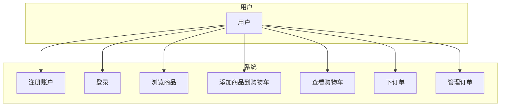
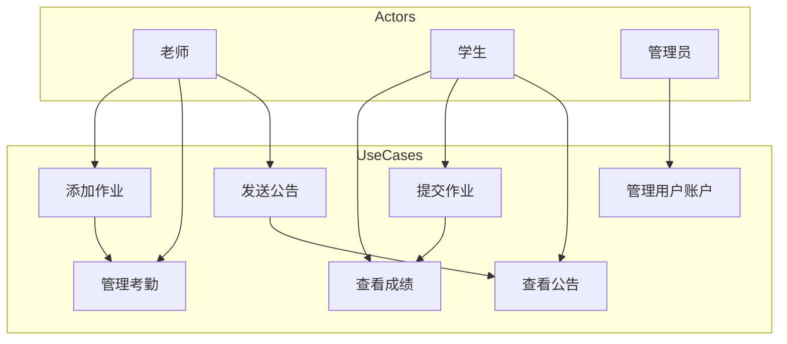

```mermaid
%% 用例图
graph TD
    subgraph 用户
        User[用户]
    end
    subgraph 系统
        Register[注册账户]
        Login[登录]
        Browse[浏览商品]
        AddCart[添加商品到购物车]
        ViewCart[查看购物车]
        PlaceOrder[下订单]
        ManageOrder[管理订单]
    end

    %% 用户与用例之间的交互
    User --> Register
    User --> Login
    User --> Browse
    User --> AddCart
    User --> ViewCart
    User --> PlaceOrder
    User --> ManageOrder
```

```mermaid
%% 班级小管家软件用例图
graph TD
    subgraph Actors
        Teacher[老师]
        Student[学生]
        Admin[管理员]
    end
    
    subgraph UseCases
        AddAssignments[添加作业]
        ManageAttendance[管理考勤]
        SendAnnouncements[发送公告]
        ViewGrades[查看成绩]
        SubmitHomework[提交作业]
        ManageAccounts[管理用户账户]
        CheckAnnouncements[查看公告]
    end

    %% 老师功能
    Teacher --> AddAssignments
    Teacher --> ManageAttendance
    Teacher --> SendAnnouncements

    %% 学生功能
    Student --> ViewGrades
    Student --> SubmitHomework
    Student --> CheckAnnouncements

    %% 管理员功能
    Admin --> ManageAccounts

    %% 交互关系
    AddAssignments --> ManageAttendance
    SendAnnouncements --> CheckAnnouncements
    SubmitHomework --> ViewGrades

```